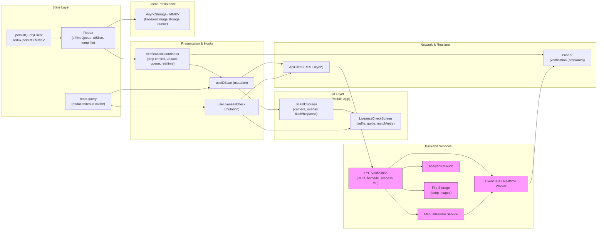

# Identity Verification Flow — Scan ID + Selfie & Liveness Check (react-query, redux, coordinator, Pusher)


Short visual description:
- Two mobile screens side-by-side:
    - Left: "Scan your ID" — camera-based frame for scanning passport/driver's license, guides to align document, detects MRZ (Machine Readable Zone) or PDF417 barcode, shows OCR results (name/DOB/expiry), flash/help/next controls.
    - Right: "Selfie & Liveness Check" — guided live selfie (blink/smile commands), selfie preview, compare captured ID photo vs. selfie, result "Match" badge, Accept & Continue or Retry, with face mismatch help.

---

## 1) Requirements

- Functional
    - Step 1: Scan ID (passport/driver license) — camera view, guides to position document, detect and extract MRZ or PDF417 barcode, OCR fields (name, DOB, expiry).
    - Step 2: Selfie & Liveness — prompt user to blink, move, or smile; capture live selfie; compare with ID photo for face match; show match result.
    - Show extracted OCR data for confirmation; allow retry/help/flash; show security statement on privacy/data handling.
    - Liveness: block static image spoof; follow movement instructions for anti-fraud.
    - Persist results securely and flag failed matches for manual review (support retry).
    - Sync data across device/platform if multi-step (mobile ↔ web).
- Non-functional
    - Secure image processing (encrypt at rest/in transit).
    - Fast, reliable OCR & face matching, tuned for mobile network conditions.
    - UX tuned for accessibility (camera/face instructions, retry flow).
    - High-throughput for KYC flows, support concurrency with API/ML model scaling.

Pros / Cons — On-device vs server-side OCR/face match
- On-device:
    - Pros: fast, instant feedback, privacy (user-side).
    - Cons: device compatibility, model size limits, inconsistent lighting.
- Server-side:
    - Pros: consistent accuracy, easier ML iteration, scalable compute.
    - Cons: latency, network required, privacy (requires upload).

---

## 2) Caching, offline & sync strategy

- Camera & OCR: UI must handle slow network (retry, local cache temp images if interrupted).
- OCR/scan results: store locally in Redux, resend/upload when device regains connectivity (offlineQueue).
- Liveness/face images: short-term local persistence (MMKV/AsyncStorage), erase after upload/processing.
- react-query:
    - useMutation for scan/upload, track API progress, optimistically show results when available.
    - useQuery for scan result status (e.g., ongoing verification), polling or subscribe for result.
- Pusher/WebSocket:
    - Subscribe to verification status events (verification.{sessionId}) for “match”, “mismatch”, manual review needed.
- Coordinator pattern: orchestrates scan step navigation, file upload, subscriptions — see example below.

Pros / Cons — Offline queue + retry
- Pros: supports network interruptions, avoids data loss mid-flow.
- Cons: privacy risk (must erase when done), complexity in failing gracefully if persistently offline.

---

## 3) Data models (shared types)

```ts
// ID scan result
interface IDScanResult {
  sessionId: string;
  userId?: string;
  idType: 'passport'|'license';
  mrzData?: string;
  pdf417Data?: string;
  ocr: { name: string; dob: string; expiry: string; };
  rawImageUrl?: string;
  status: 'pending'|'success'|'failed';
  error?: string;
}

// Face & liveness check
interface LivenessCheckResult {
  sessionId: string;
  selfieUrl: string;
  livenessPassed: boolean;
  faceMatchScore: number; // e.g., between 0 and 1
  match: boolean; // recommended threshold
  instructions: string[]; // blink, smile, etc.
  status: 'pending'|'success'|'failed';
  error?: string;
}

// Offline queue for uploads/scan results
interface OfflineAction {
  id: string;
  type: 'uploadID'|'uploadSelfie'|'submitScanResult'|'submitLiveness';
  payload: any;
  timestamp: string;
  retries?: number;
}
```

---

## 4) REST endpoints (mapping from the UI)

- POST /kyc/id-scan
    - body: { sessionId, userId?, rawImage, cameraParams }
    - returns: { scanId, status, ocr data, MRZ/PDF417 (if found) }
- GET /kyc/id-scan/{scanId}
    - scan result/status; error if failed, ocr data
- POST /kyc/selfie
    - body: { sessionId, selfieImage, instructionsCompleted }
    - returns: { liveness status, match result, faceMatchScore }
- GET /kyc/liveness/{sessionId}
    - current match/liveness status
- POST /kyc/retry
    - for the user to retry either step
- POST /kyc/manual-review
    - trigger manual review on persistent failure
- POST /kyc/help-request
    - log help/support request for funnel analysis
- Realtime (Pusher)
    - channel: verification.{sessionId} -> events: scan.status.updated, liveness.status.updated, manual_review.requested

Pros / Cons — Push vs polling for result status
- Pusher/WebSocket:
    - Pros: instant feedback, saves battery, smooth flow.
    - Cons: requires server push infra & session/channel management.
- Polling:
    - Pros: simpler, universally available.
    - Cons: wasteful, introduces latency; may miss rapid events.

---

## 5) High‑level architecture (narrative & mermaid ordering)

- UI Layer (first)
    - ScanIDScreen: camera frame, guidance overlays, flash/help/next controls, OCR result display.
    - LivenessCheckScreen: facebox + preview, liveness instructions (“blink twice”, etc.), ID photo vs. live selfie, Accept/Retry, face match status/help.
    - Small components: FramingGuide, FlashButton, InstructionPrompt, MatchResultBadge.

- Presentation & Hooks
    - useIDScan (useMutation) — upload image, poll/subscribe for OCR/MRZ result.
    - useLivenessCheck (useMutation) — upload selfie, poll/subscribe for liveness/match result.
    - VerificationCoordinator (code example below): manages step navigation, upload, Pusher subscription, offlineQueue integration, error handling, retry logic.

- Network & Realtime
    - ApiClient (axios/fetch) — REST endpoints for scan/selfie/results/retry/manual review.
    - Pusher/WebSocket: subscribe to verification.{sessionId} channel for result updates.
    - Background worker for offlineQueue replay.

- State Layer
    - react-query: mutation/responses cache for pending/in-progress results.
    - redux:
        - offlineSlice: queued uploads and results for network failures.
        - uiSlice: navigation/progress/step info, error state.
        - securitySlice: erase temp images after process complete.
    - persistQueryClient + redux-persist for resilience.

- Local Persistence
    - MMKV/AsyncStorage: temporarily store images and actions for offlineSync/network issues; wipe securely when done.
    - LocalDB (Realm/SQLite, optional): for more advanced analytics/funnel tracking or large enterprise KYC.

- Backend Services
    - KYC Verification Service: handles scan/upload, OCR/MRZ extraction, liveness check, face match ML.
    - Manual Review Service: triggers for failed/uncertain cases.
    - Event Bus & Realtime Worker: pushes scan/liveness/manual review status to Pusher.
    - Analytics Worker: logs funnel metrics, errors, help requests.
    - File Storage (S3/Blob): for raw images (ephemeral).

---

## 6) Coordinator Example (VerificationCoordinator.ts)

```ts
import { QueryClient } from '@tanstack/react-query';
import Pusher from 'pusher-js/react-native';

export class VerificationCoordinator {
  private qc: QueryClient;
  private pusher?: Pusher;
  private subs: string[] = [];
  private sessionId: string;

  constructor(queryClient: QueryClient, sessionId: string, pusher?: Pusher) {
    this.qc = queryClient;
    this.sessionId = sessionId;
    this.pusher = pusher;
  }

  // Manage step navigation (scan → liveness → manual review)
  nextStep(step: 'scan'|'liveness') {
    // UI: navigate to correct screen
    // e.g., router.navigate(step)
  }

  // Upload image/make mutation; optimistically transition if local result available
  async submitIDScan(imageData: Blob) {
    // fire useMutation for /kyc/id-scan
    await this.qc.fetchMutation({
      mutationKey: ['idScan', this.sessionId],
      mutationFn: async () =>
        fetch('/api/kyc/id-scan', { method: 'POST', body: imageData }),
    });
    // UI: show "Processing" spinner and display OCR preview if available
  }

  // Subscribe to scan/liveness realtime events and update caches
  subscribeToVerification() {
    if (!this.pusher) return;
    const chName = `verification.${this.sessionId}`;
    const ch = this.pusher.subscribe(chName);

    ch.bind('scan.status.updated', (payload: any) => {
      // Find react-query cache for scan and update status
      this.qc.setQueryData(['idScan', this.sessionId], (old: any) => ({ ...(old || {}), ...payload }));
    });

    ch.bind('liveness.status.updated', (payload: any) => {
      this.qc.setQueryData(['liveness', this.sessionId], (old: any) => ({ ...(old || {}), ...payload }));
    });

    ch.bind('manual_review.requested', (payload: any) => {
      // UI: surface manual review dialog and notify user
    });

    this.subs.push(chName);
  }

  teardown() {
    if (!this.pusher) return;
    for (const ch of this.subs) this.pusher.unsubscribe(ch);
    this.subs = [];
  }
}
```

### MERMAID DIAGRAM



---

## 6) Coordinator Example — VerificationCoordinator

```ts
import { QueryClient } from '@tanstack/react-query';
import Pusher from 'pusher-js/react-native';

export class VerificationCoordinator {
  private qc: QueryClient;
  private pusher?: Pusher;
  private sessionId: string;
  private subs: string[] = [];

  constructor(queryClient: QueryClient, sessionId: string, pusher?: Pusher) {
    this.qc = queryClient;
    this.sessionId = sessionId;
    this.pusher = pusher;
  }

  // Control navigation: scan, selfie, manual review
  nextStep(step: 'scan'|'selfie'|'review') {
    // e.g., navigation logic based on scan/liveness results
  }

  // Submit ID scan via mutation
  async submitID(imageData: Blob) {
    await this.qc.fetchMutation({
      mutationKey: ['idScan', this.sessionId],
      mutationFn: async () => fetch('/api/kyc/id-scan', { method: 'POST', body: imageData })
    });
  }

  // Submit selfie/liveness
  async submitSelfie(imageData: Blob, steps: string[]) {
    await this.qc.fetchMutation({
      mutationKey: ['liveness', this.sessionId],
      mutationFn: async () =>
        fetch('/api/kyc/selfie', { method: 'POST', body: imageData, steps })
    });
  }

  // Listen for real-time verification updates
  subscribeToVerification() {
    if (!this.pusher) return;
    const ch = this.pusher.subscribe(`verification.${this.sessionId}`);
    ch.bind('scan.status.updated', payload => {
      this.qc.setQueryData(['idScan', this.sessionId], (old) => ({ ...(old || {}), ...payload }));
    });
    ch.bind('liveness.status.updated', payload => {
      this.qc.setQueryData(['liveness', this.sessionId], (old) => ({ ...(old || {}), ...payload }));
    });
    ch.bind('manual_review.requested', payload => {
      // surface manual review workflow in UI
    });
    this.subs.push(`verification.${this.sessionId}`);
  }

  teardown() {
    if (!this.pusher) return;
    for (const ch of this.subs) this.pusher.unsubscribe(ch);
    this.subs = [];
  }
}
```
```ts
import React, { useRef, useEffect, useState } from 'react';
import { View, Text, Button, TouchableOpacity, StyleSheet } from 'react-native';
import { useMutation, useQueryClient } from '@tanstack/react-query';
import { RNCamera } from 'react-native-camera';
import { VerificationCoordinator } from './VerificationCoordinator';
import { useNavigation } from '@react-navigation/native'; // Assume react-navigation

// Assume coordinator, api, sessionId, and pusher are initialized externally and passed as props
export const ScanIDScreen = ({ coordinator, sessionId }) => {
  const navigation = useNavigation();
  const cameraRef = useRef<RNCamera>(null);
  const [imageUri, setImageUri] = useState<string|null>(null);
  const [ocrResult, setOcrResult] = useState<any>(null);

  // react-query mutation for uploading image
  const uploadMutation = useMutation({
    mutationFn: async (data) => coordinator.submitID(data),
    onSuccess: (result: any) => {
      setOcrResult(result?.ocr);
      if (result?.status === 'success') {
        coordinator.nextStep('selfie');
        navigation.navigate('LivenessCheckScreen', { coordinator, sessionId });
      }
    },
    onError: () => alert('Scan failed, try again or get help')
  });

  useEffect(() => {
    coordinator.subscribeToVerification();
    return () => coordinator.teardown();
  }, []);

  const takePicture = async () => {
    if (cameraRef.current) {
      const data = await cameraRef.current.takePictureAsync({ quality: 0.7, base64: false });
      setImageUri(data.uri);

      // Optimistically show preview and start upload
      uploadMutation.mutate(data.uri);
    }
  };

  return (
    <View style={styles.container}>
      <Text style={styles.header}>Scan your ID</Text>
      <View style={styles.cameraBox}>
        <RNCamera
          ref={cameraRef}
          style={styles.camera}
          captureAudio={false}
          type={RNCamera.Constants.Type.back}
        />
        <View style={styles.overlay}>
          <Text style={styles.instructions}>Align document inside the frame</Text>
          {/* Add MRZ/PDF417 markers */}
        </View>
      </View>
      {/* Tool row */}
      <View style={styles.toolRow}>
        <Button title="Flash" onPress={() => {}} />
        <Button title="Help" onPress={() => alert('Please align your passport/license within the frame, with barcode/MRZ visible.')} />
        <Button title="Next: Selfie" onPress={takePicture} />
      </View>
      {/* OCR result preview */}
      {ocrResult && (
        <View style={styles.ocrResult}>
          <Text>OCR: {ocrResult.name} • {ocrResult.dob} • Expires {ocrResult.expiry}</Text>
        </View>
      )}
      <Text style={styles.footer}>Your document is processed securely for identity verification via OCR and barcode read.</Text>
    </View>
  );
};

const styles = StyleSheet.create({
  container: { flex: 1, paddingTop: 30, backgroundColor: '#f5f5f5' },
  header: { fontSize: 22, fontWeight: 'bold', marginBottom: 10, alignSelf: 'center', color: '#257ddb' },
  cameraBox: { flex: 1, margin: 12, borderRadius: 16, overflow: 'hidden', backgroundColor: '#eee', borderWidth: 2, borderColor: '#257ddb' },
  camera: { flex: 1 },
  overlay: { position: 'absolute', top: 40, left: 0, right: 0, alignItems: 'center', backgroundColor: 'transparent' },
  instructions: { fontSize: 16, color: '#333', backgroundColor: 'rgba(255,255,255,0.75)', padding: 4, borderRadius: 8 },
  toolRow: { flexDirection: 'row', justifyContent: 'space-around', alignItems: 'center', margin: 12 },
  ocrResult: { padding: 12, marginTop: 8, backgroundColor: '#e8f6e8', borderRadius: 8, alignItems: 'center' },
  footer: { padding: 10, fontSize: 13, textAlign: 'center', color: '#555' }
});
```

```ts
import React, { useRef, useEffect, useState } from 'react';
import { View, Text, Button, Image, StyleSheet } from 'react-native';
import { useMutation } from '@tanstack/react-query';
import { VerificationCoordinator } from './VerificationCoordinator';
import { useNavigation } from '@react-navigation/native'; // Assume react-navigation

export const LivenessCheckScreen = ({ coordinator, sessionId, idPhotoUri }) => {
  const navigation = useNavigation();
  const [selfieUri, setSelfieUri] = useState<string|null>(null);
  const [matchResult, setMatchResult] = useState<any>(null);

  // Mutation for uploading selfie and liveness steps
  const livenessMutation = useMutation({
    mutationFn: async (data) => coordinator.submitSelfie(data.selfieUri, data.instructions),
    onSuccess: (result: any) => {
      setMatchResult(result);
      if (result?.match) {
        // Accept & continue is enabled
      }
    },
    onError: () => alert('Face match failed, try again or request manual review')
  });

  useEffect(() => {
    coordinator.subscribeToVerification();
    return () => coordinator.teardown();
  }, []);

  const askForSelfie = async () => {
    // This should open the camera for liveness capture, e.g., with guidance overlays.
    // For stub:
    const uri = 'path-to-liveness-selfie-image.jpg'; // Replace with real path
    setSelfieUri(uri);

    // Submit for matching, with performed instructions
    livenessMutation.mutate({ selfieUri: uri, instructions: ['blink', 'smile'] });
  };

  return (
    <View style={styles.container}>
      <Text style={styles.header}>Selfie & Liveness Check</Text>
      <Text style={styles.instructions}>Look straight - Blink twice<br/>Smile with mouth closed</Text>
      <View style={styles.previewRow}>
        <View style={styles.previewBox}>
          <Text style={{ color: '#aaa', textAlign: 'center' }}>Your selfie preview</Text>
          {selfieUri && (<Image source={{ uri: selfieUri }} style={{ width: 92, height: 100 }} />)}
        </View>
      </View>
      <View style={styles.compareRow}>
        <View style={styles.compareBox}>
          <Text>ID photo</Text>
          {idPhotoUri && (<Image source={{ uri: idPhotoUri }} style={{ width: 56, height: 60 }} />)}
        </View>
        <View style={styles.compareBox}>
          <Text>Your selfie</Text>
          {selfieUri && (<Image source={{ uri: selfieUri }} style={{ width: 56, height: 60 }} />)}
        </View>
      </View>
      {matchResult && (
        <View style={styles.resultRow}>
          {matchResult.match ? (
            <Text style={styles.matchBadge}>✓ Match</Text>
          ) : (
            <Text style={styles.mismatchBadge}>✗ Mismatch</Text>
          )}
        </View>
      )}
      <View style={styles.actionRow}>
        <Button
          title="Accept & continue"
          onPress={() => navigation.navigate('NextStep')}
          disabled={!matchResult?.match}
          color="#257ddb"
        />
        <Button title="Retry" onPress={askForSelfie} color="#f0ad4e" />
      </View>
      <View style={styles.helpRow}>
        {!matchResult?.match && (<Text style={styles.helpText}>Face mismatch? Try again or contact support for manual review.</Text>)}
      </View>
      <Text style={styles.footer}>Face match & liveness checks protect you and comply with KYC requirements.</Text>
    </View>
  );
};

const styles = StyleSheet.create({
  container: { flex: 1, backgroundColor: '#f6f8fa', paddingTop: 35, paddingHorizontal: 16 },
  header: { fontSize: 22, fontWeight: 'bold', color: '#257ddb', marginBottom: 8, alignSelf: 'center' },
  instructions: { fontSize: 16, textAlign: 'center', marginBottom: 16, color:'#333' },
  previewRow: { flexDirection: 'row', justifyContent: 'center', alignItems: 'center', marginBottom: 12 },
  previewBox: { width: 120, height: 128, borderRadius: 14, borderWidth: 2, borderColor:'#257ddb', alignItems:'center', justifyContent:'center', backgroundColor:'#fff' },
  compareRow: { flexDirection: 'row', justifyContent: 'space-around', marginBottom: 14 },
  compareBox: { alignItems:'center', padding:6, backgroundColor:'#eee', borderRadius:9, minWidth:90 },
  resultRow: { alignItems: 'center', marginBottom: 8 },
  matchBadge: { fontSize:22, color:'#249d35', fontWeight:'bold' },
  mismatchBadge: { fontSize:22, color:'#c90808', fontWeight:'bold' },
  actionRow: { flexDirection: 'row', justifyContent:'space-around', marginBottom: 7 },
  helpRow: { alignItems:'center', marginBottom:8 },
  helpText: { fontSize: 15, color: '#f0724d', textAlign:'center' },
  footer: { textAlign: 'center', fontSize: 13, color: '#555', padding:9 }
});
```

---

## 7) Nuanced Concepts — Short Pros & Cons

- On-device OCR vs server OCR
    - Pros (on-device): instant feedback, privacy, no upload if no network.
    - Cons: device compatibility, lower accuracy, no ongoing ML/AI updates.
    - Use: fallback for connectivity loss, or in privacy-sensitive apps.

- Face liveness detection (anti-spoof)
    - Pros: high security against attacks, blocks still image replays; reduces false positives.
    - Cons: can cause UX friction, failure for users with disabilities, increased latency if server-side.
    - Mitigation: clear instructions, retry flow, fallback to manual review.

- Real-time result sync (Pusher) vs polling
    - Pros (realtime): instant status, better UX, reduces battery/network for polling.
    - Cons: costs/infra, requires reliable server/event delivery.
    - Use: for synchronous KYC flows where immediate feedback is critical.

- Offline queue for uploads/scan results
    - Pros: prevents data loss mid-verification, supports flaky networks.
    - Cons: must clean up temp data securely, risk if queue isn’t cleared.

---

## 8) Sequence flows (brief)

- Scan ID flow:
    - User aligns ID in camera frame; MRZ/PDF417 detected; image uploaded via useMutation; OCR fields display as soon as available; user verifies; upon success, coordinator.nextStep('liveness').
- Liveness check:
    - User faces camera; performs movements per instructions; live selfie captured and uploaded; server performs liveness/face match; UI shows match result.
- Real-time:
    - Server emits scan.status.updated and liveness.status.updated events to verification.{sessionId}; UI patches cache and navigates accordingly.
- Error/retry:
    - If match fails, UI offers Retry; persistent failure triggers manual review; offline actions are queued and replayed on reconnect.

