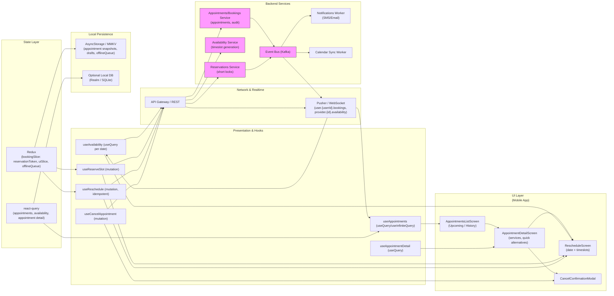

# Appointment Management — History, Reschedule & Cancel


## 1) Requirements

- Functional
    - List user's appointments (Upcoming / History) with summaries and quick actions.
    - View appointment details (provider, service, date/time, price, policies).
    - Reschedule flow: pick new date/time from provider availability, reserve slot briefly, confirm new appointment.
    - Cancel flow: confirm cancellation, show potential fees and refund policy, create audit record.
    - Quick alternatives from details: Tomorrow, Next available, Pick date.
    - Sync changes with provider calendars and send notifications (push, SMS, email).
    - Keep audit history of changes (who changed, when, previous slot).
    - Share appointment details or add to device calendar.

- Non-functional
    - Correctness and safety: avoid double-booking via short reservations and server-side enforcement.
    - Low-latency UI: cached lists + optimistic feedback while server confirms.
    - Security: authenticated endpoints, idempotency for critical mutations (reschedule/confirm/cancel).
    - Observability: track reschedule/cancel rates, reservation expiry, failure modes.
    - Scalability: many reads (lists), moderate writes (bookings/reschedules) with strong consistency in Bookings service.

---

## 2) Caching, offline & sync strategy (react-query + redux + pusher)

- Appointments list & details
    - Use react-query for server data: useQuery for appointment lists and appointment detail queries keyed by userId / appointmentId.
    - StaleTime: short for lists (e.g., 30s); cacheTime longer (e.g., 10min) to rehydrate on app resume.
    - KeepPreviousData to avoid flicker when switching tabs/filter pages.

- Reservations & locking for reschedule
    - On selecting a new slot, call POST /reservations to create a short reservation token (TTL 60–120s) — store token in redux and display countdown.
    - Optimistically update UI to show the slot is reserved, but treat server as authoritative.

- Mutations & idempotency
    - Use idempotency keys for POST /bookings and POST /reschedules and for cancellations to prevent duplicate work on retries.
    - On confirm, call POST /bookings or POST /reschedule with reservationToken + idempotencyKey; server finalizes or returns conflict.

- Offline behavior
    - Persist appointment list snapshot and booking drafts to AsyncStorage / MMKV so users can view history offline.
    - Booking/reschedule/cancel requires server validation; allow storing draft actions locally (redux offline queue) and retry when online, but inform user confirmation happens only when online.

- Realtime updates
    - Subscribe to pusher channel user.{userId}.bookings and provider.{providerId}.availability to receive booking/reservation updates and slot changes in near real-time — patch react-query cache on events.

---

## 3) Data models (shared types)

```ts
interface Appointment {
  id: string;
  userId: string;
  providerId: string;
  providerName: string;
  serviceId: string;
  serviceTitle: string;
  start: string; // ISO
  end: string;   // ISO
  status: 'upcoming'|'confirmed'|'cancelled'|'rescheduled'|'completed'|'no_show';
  priceCents?: number;
  cancellationPolicy?: { refundableUntil?: string; feeCents?: number };
  createdAt: string;
  updatedAt?: string;
  audit?: AuditEntry[];
}

interface AuditEntry {
  id: string;
  appointmentId: string;
  action: 'created'|'rescheduled'|'cancelled'|'confirmed';
  actor: { id: string; type: 'user'|'system'|'provider' };
  timestamp: string;
  metadata?: any;
}

interface Reservation {
  token: string;
  timeslotId: string;
  userId?: string;
  expiresAt: string;
}

interface RescheduleRequest {
  appointmentId: string;
  reservationToken: string;
  idempotencyKey: string;
  reason?: string;
}
```

---

## 4) REST endpoints (mapping from UI)

- GET /users/{userId}/appointments?filter=upcoming|history&limit=&cursor=
    - list appointments for user
- GET /appointments/{appointmentId}
    - appointment details and audit history
- GET /providers/{providerId}/availability?serviceId=&date=YYYY-MM-DD
    - timeslots with status
- POST /reservations
    - body: { providerId, serviceId, timeslotId, userId? }
    - response: { reservationToken, expiresAt }
- DELETE /reservations/{token}
    - release reservation
- POST /appointments/{appointmentId}/reschedule
    - body: { reservationToken, idempotencyKey, reason? }
    - server finalizes reschedule and returns updated appointment
- POST /appointments/{appointmentId}/cancel
    - body: { idempotencyKey, reason? }
    - server cancels (apply policy), returns status and refund/fee info
- GET /appointments/{appointmentId}/audit
    - returns audit trail
- Webhook / Worker endpoints:
    - POST /webhooks/notifications (to SMS/email worker)
    - POST /webhooks/calendar (to calendar sync)

Realtime (Pusher)
- user.{userId}.bookings -> events: booking.confirmed, booking.cancelled, booking.rescheduled
- provider.{providerId}.availability -> events: timeslot.updated

---

## 5) High‑level architecture (narrative)

- UI Layer (Mobile)
    - AppointmentsListScreen — tabs: Upcoming / History, quick actions per item (Reschedule / Cancel).
    - AppointmentDetailScreen — full details, quick alternatives, Reschedule & Cancel actions, confirm modal.
    - RescheduleScreen — date chips, timeslots, reservation countdown, Confirm New Time.
    - CancelConfirmationModal — warns about fees & policy.

- Presentation & Hooks
    - useAppointments (react-query useInfiniteQuery / useQuery)
    - useAppointmentDetail (useQuery with audit)
    - useAvailability (useQuery per provider/service/date)
    - useReserveSlot (mutation to POST /reservations)
    - useReschedule (mutation to POST /appointments/{id}/reschedule with idempotency key)
    - useCancelAppointment (mutation to POST /appointments/{id}/cancel)

- Network & Realtime
    - API Gateway -> Appointments Service / Providers Service / Availability Service / Booking Service
    - Event Bus (Kafka) to fanout booking/reservation events to notification & calendar workers
    - Pusher to broadcast booking / availability updates to clients

- State Layer
    - React Query: list data, availability, appointment details
    - Redux: UI state (selectedAppointmentId, reservationToken, modal visibility), offlineQueue, user metadata
    - Persisted reducers: booking drafts and offlineQueue

- Local Persistence
    - AsyncStorage / MMKV: appointment snapshots, drafts, offlineQueue
    - Optional local DB (Realm / SQLite) for richer history & offline UI

- Backend Services
    - Appointments/Bookings Service: authoritative appointment store and audit log
    - Availability Service: compute & serve timeslots
    - Reservations Service: short-term locks and TTL management
    - Notifications (SMS/Email) Worker
    - Calendar Sync Worker
    - Event Bus (Kafka) and Realtime Worker (Pusher bridge)

---

## 6) React‑Query, Redux & Pusher integration (implementation notes)

- React Query
    - useQuery / useInfiniteQuery keys:
        - ['appointments', userId, filter]
        - ['appointment', appointmentId]
        - ['availability', providerId, serviceId, date]
    - Stale time short for availability (15–30s), slightly longer for lists (30–60s).
    - Keep previous data to reduce UI flicker when switching dates or tabs.

- Redux
    - bookingSlice: reservationToken, selectedAppointmentId, draftReschedule, countdown state.
    - uiSlice: modal visibility (cancel confirm), toast messages.
    - offlineSlice: queued mutations (cancellations/reschedules attempted offline).

- Pusher
    - Subscribe to user.{userId}.bookings to receive booking change events and patch react-query caches.
    - Subscribe to provider.{providerId}.availability for timeslot updates so the reschedule UI disables taken slots in real-time.
    - On event, patch react-query data:
        - For booking.rescheduled/cancelled/confirmed: update ['appointments', userId] and ['appointment', appointmentId] caches.
        - For timeslot.updated: patch ['availability', providerId, serviceId, date] timeslot state.

- Reservation & confirm lifecycle
    - Reserve -> store token in redux -> start countdown UI -> if confirm -> call reschedule endpoint with token & idempotency key -> on success clear reservation and update caches.
    - If reservation expires while user is in confirmation: show conflict modal and fetch alternatives.

---

## 7) Mermaid diagram (UI Layer first, presentation/hooks, Network & realtime, state layer, local persistence, Backend services)



---

## 8) Example code snippets

Below are targeted snippets using React Native + TypeScript, react-query, Redux and Pusher for appointment management.

### src/api/appointmentsApi.ts
```ts
import axios from 'axios';
const api = axios.create({ baseURL: 'https://api.example.com', timeout: 10000 });

export async function fetchAppointments(userId: string, filter = 'upcoming', cursor?: string) {
  const { data } = await api.get(`/users/${userId}/appointments`, { params: { filter, cursor } });
  return data; // { items: Appointment[], nextCursor }
}

export async function fetchAppointment(appointmentId: string) {
  const { data } = await api.get(`/appointments/${appointmentId}`);
  return data;
}

export async function fetchAvailability(providerId: string, serviceId: string, date: string) {
  const { data } = await api.get(`/providers/${providerId}/availability`, { params: { serviceId, date }});
  return data;
}

export async function createReservation(payload: any) {
  const { data } = await api.post('/reservations', payload);
  return data; // { token, expiresAt }
}

export async function confirmReschedule(appointmentId: string, payload: any) {
  const { data } = await api.post(`/appointments/${appointmentId}/reschedule`, payload, { headers: { 'Idempotency-Key': payload.idempotencyKey }});
  return data;
}

export async function cancelAppointment(appointmentId: string, payload: any) {
  const { data } = await api.post(`/appointments/${appointmentId}/cancel`, payload, { headers: { 'Idempotency-Key': payload.idempotencyKey }});
  return data;
}
```

### src/hooks/useAppointments.ts
```ts
import { useInfiniteQuery } from '@tanstack/react-query';
import { fetchAppointments } from '../api/appointmentsApi';

export function useAppointments(userId: string, filter: 'upcoming'|'history' = 'upcoming') {
  return useInfiniteQuery(
    ['appointments', userId, filter],
    ({ pageParam }) => fetchAppointments(userId, filter, pageParam),
    {
      getNextPageParam: last => last.nextCursor || undefined,
      staleTime: 30 * 1000,
      keepPreviousData: true,
    }
  );
}
```

### src/hooks/useReserveAndReschedule.ts
```ts
import { useMutation, useQueryClient } from '@tanstack/react-query';
import { createReservation, confirmReschedule } from '../api/appointmentsApi';
import { v4 as uuidv4 } from 'uuid';
import { store } from '../store';

export function useReserveSlot() {
  const qc = useQueryClient();

  return useMutation(createReservation, {
    onSuccess: (data, variables) => {
      // store reservation token in redux (start countdown)
      store.dispatch({ type: 'booking/setReservation', payload: data });
      // optimistic patch: mark timeslot reserved in local availability cache
      qc.setQueryData(['availability', variables.providerId, variables.serviceId, variables.date], (old: any) => {
        if (!old) return old;
        const timeslots = old.timeslots.map((t: any) => t.id === variables.timeslotId ? { ...t, status: 'reserved' } : t);
        return { ...old, timeslots };
      });
    }
  });
}

export function useReschedule(appointmentId: string) {
  const qc = useQueryClient();
  return useMutation(async ({ reservationToken }: any) => {
    const idempotencyKey = uuidv4();
    return confirmReschedule(appointmentId, { reservationToken, idempotencyKey });
  }, {
    onSuccess: (data) => {
      // update appointment cache and appointments list
      qc.setQueryData(['appointment', appointmentId], data);
      qc.invalidateQueries(['appointments']);
      store.dispatch({ type: 'booking/confirmSuccess', payload: data });
    },
    onError: (err) => {
      // handle conflicts and surface alternatives
    }
  });
}
```

### src/hooks/useCancelAppointment.ts
```ts
import { useMutation, useQueryClient } from '@tanstack/react-query';
import { cancelAppointment } from '../api/appointmentsApi';
import { v4 as uuidv4 } from 'uuid';

export function useCancelAppointment() {
  const qc = useQueryClient();
  return useMutation(async ({ appointmentId }: any) => {
    const idempotencyKey = uuidv4();
    return cancelAppointment(appointmentId, { idempotencyKey });
  }, {
    onMutate: async ({ appointmentId }) => {
      await qc.cancelQueries(['appointments']);
      const previous = qc.getQueryData(['appointments']);
      // optimistic: mark appointment as 'cancelled' locally (UI)
      qc.setQueryData(['appointment', appointmentId], (old: any) => ({ ...old, status: 'cancelled' }));
      return { previous };
    },
    onError: (err, variables, context:any) => {
      qc.setQueryData(['appointments'], context.previous);
    },
    onSettled: () => {
      qc.invalidateQueries(['appointments']);
    }
  });
}
```

### src/services/pusher.ts
```ts
import Pusher from 'pusher-js/react-native';
import { queryClient } from '../reactQueryClient';

let pusher: Pusher | null = null;

export function initPusher(key: string, cluster='mt1') {
  if (pusher) return pusher;
  pusher = new Pusher(key, { cluster, forceTLS: true });
  pusher.connection.bind('connected', () => console.log('Pusher connected'));
  return pusher;
}

export function subscribeUserBookings(userId: string) {
  if (!pusher) throw new Error('initPusher first');
  const channel = pusher.subscribe(`user.${userId}.bookings`);
  channel.bind('booking.updated', (payload: any) => {
    // payload: { appointmentId, updates }
    const { appointmentId, updates } = payload;
    queryClient.setQueryData(['appointment', appointmentId], (old: any) => ({ ...old, ...updates }));
    queryClient.invalidateQueries(['appointments']);
  });
  return () => pusher.unsubscribe(`user.${userId}.bookings`);
}

export function subscribeProviderAvailability(providerId: string) {
  if (!pusher) throw new Error('initPusher first');
  const channel = pusher.subscribe(`provider.${providerId}.availability`);
  channel.bind('timeslot.updated', (payload:any) => {
    const { providerId, serviceId, date } = payload;
    const key = ['availability', providerId, serviceId, date];
    queryClient.setQueryData(key, (old: any) => {
      if (!old) return old;
      const timeslots = old.timeslots.map((t: any) => t.id === payload.timeslotId ? { ...t, status: payload.status } : t);
      return { ...old, timeslots };
    });
  });
  return () => pusher.unsubscribe(`provider.${providerId}.availability`);
}
```

### src/store/bookingSlice.ts (sketch)
```ts
import { createSlice } from '@reduxjs/toolkit';

const initialState = {
  selectedAppointmentId: null,
  reservation: null, // { token, expiresAt, timeslotId }
  draftReschedule: null,
  offlineQueue: [],
};

const slice = createSlice({
  name: 'booking',
  initialState,
  reducers: {
    selectAppointment(state, action) { state.selectedAppointmentId = action.payload; },
    setReservation(state, action) { state.reservation = action.payload; },
    clearReservation(state) { state.reservation = null; },
    setDraftReschedule(state, action) { state.draftReschedule = action.payload; },
    enqueueOffline(state, action) { state.offlineQueue.push(action.payload); },
    dequeueOffline(state) { state.offlineQueue.shift(); },
    confirmSuccess(state, action) { state.draftReschedule = null; state.reservation = null; },
  }
});

export const { selectAppointment, setReservation, clearReservation, setDraftReschedule, enqueueOffline, dequeueOffline, confirmSuccess } = slice.actions;
export default slice.reducer;
```

---

## 9) UX & accessibility notes

- Show reservation countdown visibly (e.g., "Reserved for 01:59") and disable confirm button when reservation expired.
- Confirm destructive actions: cancellation modal must show any fees or policy links; allow "No, keep" and "Yes, cancel".
- Offer quick alternatives (Tomorrow / Next available) in details to reduce friction.
- Provide clear conflict handling: if a slot is taken after user selected it, show nearest alternatives and highlight differences (time, price).
- Add the confirmed appointment to device calendar (with reminders) and include "Add to calendar" CTA on confirmation screen.

---

## 10) Offline replay & conflict handling

- Persist reschedule drafts and cancellation intents to AsyncStorage so users can resume or retry.
- Queue attempts made offline and replay when online; treat final booking/reschedule as requiring online confirmation.
- On replay conflict (slot taken): surface conflict modal and present nearest alternatives ( +/- 30–60 minutes or next day).
- Maintain an audit trail for every attempted change to show history to user and provider.

---

## 11) Performance & ops notes

- Reservation lock TTL short (60–120s) to balance UX and lock contention.
- Use idempotency keys for all mutating booking endpoints to avoid duplicates.
- Aggregate rapid availability updates server-side before pushing to Pusher to avoid client flurries.
- Monitor metrics: reservation expiry rate, reschedule failure rate, cancellation fees applied, and booking latency.
- Retain audit logs for compliance and dispute resolution.

---

## 12) Sequence flows (brief)

- View upcoming appointments:
    - App uses useAppointments -> shows list; on open, subscribe to user.{userId}.bookings for updates.
- Reschedule flow:
    - User taps Reschedule -> load availability (useAvailability) -> user selects timeslot -> POST /reservations -> store reservation token and start countdown -> user confirms -> POST /appointments/{id}/reschedule with reservationToken + idempotencyKey -> on success update caches, send notifications & calendar sync.
- Cancel flow:
    - User taps Cancel -> show confirmation modal with fees -> user confirms -> POST /appointments/{id}/cancel with idempotencyKey -> on success update caches, notify provider/user, write audit entry.
- Realtime:
    - Provider or system emits timeslot.updated or booking.updated -> Pusher -> clients patch react-query cache and update UI immediately (disable slots, update appointment status).

---
