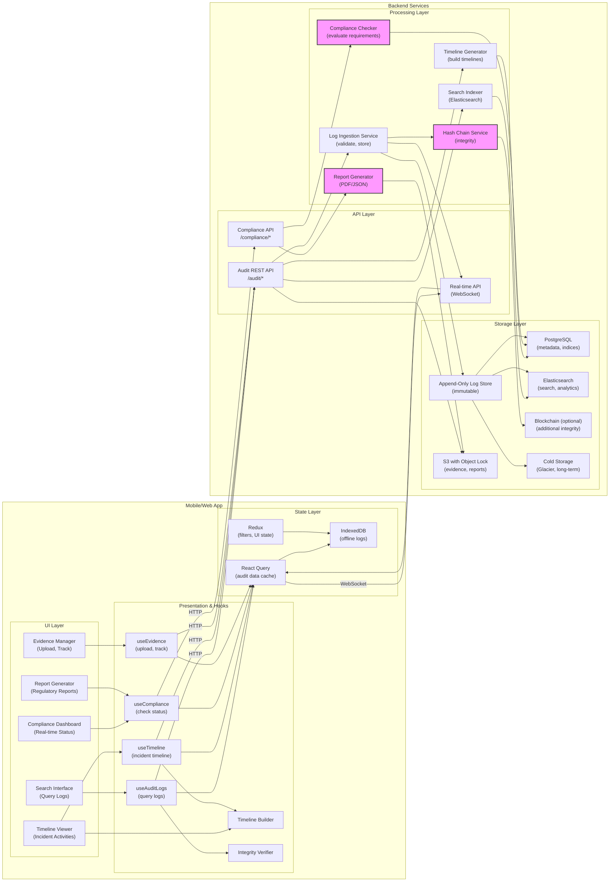

# Mobile System Design — Compliance & Audit Readiness


## 1) Requirements

- Functional requirements
    - Immutable audit trail of all incident response activities
    - Real-time capture of decisions, communications, and actions
    - Automatic timeline generation from incident start to resolution
    - Evidence collection and preservation (screenshots, logs, files)
    - Regulatory compliance reporting (GDPR, HIPAA, SOC 2, PCI DSS)
    - Post-incident report generation
    - Chain of custody tracking for forensic evidence
    - Role-based access to audit data
    - Search and filter audit logs
    - Export capabilities (PDF, JSON, CSV)
    - Integration with War Room, Playbooks, Vault, and Notifications
    - Tamper-proof log storage with cryptographic verification
    - Mobile access to audit trails for field auditors

- Non-functional:
    - Append-only log storage (no modifications or deletions)
    - Sub-second log entry writes
    - Cryptographic proof of integrity (blockchain-style hashing)
    - 99.999% availability for log writes
    - Scalable to millions of log entries
    - Long-term retention (7+ years)
    - Fast query performance (<1s for complex searches)
    - WORM (Write Once Read Many) storage compliance

---

## 2) Caching, offline & sync strategy

- Client caching:
    - Cache recent audit logs for offline review
    - Store log queries and filters locally
    - Pre-load audit templates and compliance checklists
    - Optimistic log entry creation with server reconciliation

- Offline logging:
    - Queue log entries when offline
    - Batch upload when connection restored
    - Maintain client-side timestamps
    - Conflict resolution: server-side ordering prevails

- Real-time sync:
    - WebSocket for live audit trail updates
    - Server-sent events for long-running queries
    - Incremental log streaming for large datasets
    - Delta updates to minimize bandwidth

- Immutability enforcement:
    - Client cannot modify or delete logs
    - Server-side validation of log integrity
    - Cryptographic verification before display
    - Alert on tampering detection

---

## 3) Data models (shared types)

```ts
// Audit log entry
interface AuditLogEntry {
  id: string;
  timestamp: string; // ISO 8601 with milliseconds
  eventType: AuditEventType;
  userId: string;
  userName: string;
  userRole: string;
  incidentId?: string;
  resourceType?: 'warroom' | 'playbook' | 'vault_document' | 'notification' | 'decision';
  resourceId?: string;
  action: string; // e.g., "created", "joined", "uploaded", "acknowledged"
  details: Record<string, any>;
  ipAddress?: string;
  userAgent?: string;
  location?: GeoLocation;
  previousHash: string; // hash of previous log entry (blockchain)
  currentHash: string; // SHA-256 of this entry
  signature?: string; // cryptographic signature
  metadata?: Record<string, any>;
}

// Event types
type AuditEventType =
  | 'user_action'
  | 'system_event'
  | 'decision_made'
  | 'access_granted'
  | 'access_denied'
  | 'data_modified'
  | 'communication_sent'
  | 'evidence_collected'
  | 'compliance_check';

// Geographic location
interface GeoLocation {
  lat: number;
  lng: number;
  city?: string;
  country?: string;
  ipAddress?: string;
}

// Incident timeline
interface IncidentTimeline {
  incidentId: string;
  startTime: string;
  endTime?: string;
  phases: TimelinePhase[];
  keyEvents: KeyEvent[];
  decisions: Decision[];
  participants: TimelineParticipant[];
  totalDuration?: number; // minutes
  complianceMetrics?: ComplianceMetrics;
}

// Timeline phase
interface TimelinePhase {
  name: string; // "Detection", "Containment", "Eradication", "Recovery"
  startTime: string;
  endTime?: string;
  duration?: number; // minutes
  activities: AuditLogEntry[];
  keyMilestones: string[];
}

// Key event
interface KeyEvent {
  id: string;
  timestamp: string;
  title: string;
  description: string;
  category: 'detection' | 'decision' | 'communication' | 'action' | 'milestone';
  severity: 'critical' | 'high' | 'medium' | 'low';
  relatedLogIds: string[];
  evidence?: Evidence[];
}

// Decision (from audit perspective)
interface Decision {
  id: string;
  timestamp: string;
  description: string;
  madeBy: string;
  approvedBy?: string[];
  rationale?: string;
  impact: 'high' | 'medium' | 'low';
  outcome?: string;
  relatedLogIds: string[];
}

// Timeline participant
interface TimelineParticipant {
  userId: string;
  name: string;
  role: string;
  joinedAt: string;
  leftAt?: string;
  actionsPerformed: number;
  decisionsContributed: number;
}

// Evidence
interface Evidence {
  id: string;
  type: 'screenshot' | 'log_file' | 'document' | 'recording' | 'chat_transcript';
  timestamp: string;
  collectedBy: string;
  description: string;
  fileUrl?: string;
  fileSizeBytes?: number;
  cryptographicHash: string;
  chainOfCustody: CustodyRecord[];
}

// Chain of custody
interface CustodyRecord {
  timestamp: string;
  handedOffBy?: string;
  receivedBy: string;
  action: 'collected' | 'transferred' | 'analyzed' | 'archived';
  location?: string;
  notes?: string;
}

// Compliance metrics
interface ComplianceMetrics {
  incidentId: string;
  framework: 'GDPR' | 'HIPAA' | 'PCI_DSS' | 'SOC2' | 'ISO27001' | 'NIST';
  requirements: ComplianceRequirement[];
  overallScore: number; // percentage
  lastAssessedAt: string;
}

// Compliance requirement
interface ComplianceRequirement {
  id: string;
  name: string;
  description: string;
  category: string;
  isMet: boolean;
  evidence?: string[]; // log entry IDs
  notes?: string;
  assessedAt: string;
}

// Compliance report
interface ComplianceReport {
  id: string;
  incidentId: string;
  reportType: 'GDPR_breach_notification' | 'HIPAA_incident_report' | 'SOC2_audit' | 'general';
  generatedAt: string;
  generatedBy: string;
  sections: ReportSection[];
  timeline: IncidentTimeline;
  evidence: Evidence[];
  recommendations?: string[];
  fileUrl?: string; // PDF export
}

// Report section
interface ReportSection {
  title: string;
  content: string;
  logEntries?: AuditLogEntry[];
  evidence?: Evidence[];
  order: number;
}

// Audit query
interface AuditQuery {
  incidentId?: string;
  userId?: string;
  eventType?: AuditEventType[];
  resourceType?: string[];
  action?: string[];
  startTime?: string;
  endTime?: string;
  searchText?: string;
  limit?: number;
  cursor?: string;
}

// Log integrity check
interface IntegrityCheck {
  id: string;
  performedAt: string;
  performedBy: string;
  startLogId: string;
  endLogId: string;
  totalLogsChecked: number;
  integrityValid: boolean;
  failedLogIds?: string[];
  hashChainBroken?: boolean;
  details?: string;
}
```

---

## 4) REST endpoints (mapping from UI)

- POST /audit/log
    - body: AuditLogEntry
    - response: { logEntry: AuditLogEntry }

- GET /audit/logs
    - query params: AuditQuery
    - response: { logs: AuditLogEntry[], nextCursor?: string }

- GET /audit/logs/{logId}
    - response: AuditLogEntry

- GET /audit/timeline/{incidentId}
    - response: IncidentTimeline

- POST /audit/timeline/{incidentId}/export
    - response: downloadable PDF/JSON

- GET /audit/evidence
    - query params: incidentId, type, collectedBy
    - response: { evidence: Evidence[] }

- POST /audit/evidence/upload
    - body: multipart/form-data
    - response: { evidence: Evidence }

- POST /audit/evidence/{evidenceId}/custody
    - body: { receivedBy, action, notes }
    - response: { evidence: Evidence }

- GET /compliance/check/{incidentId}
    - query params: framework
    - response: ComplianceMetrics

- POST /compliance/report/generate
    - body: { incidentId, reportType, framework }
    - response: { report: ComplianceReport }

- GET /compliance/report/{reportId}
    - response: ComplianceReport

- POST /audit/integrity/verify
    - body: { startLogId, endLogId }
    - response: IntegrityCheck

- GET /audit/export
    - query params: incidentId, format (pdf/json/csv), startTime, endTime
    - response: downloadable file

- GET /audit/search
    - query params: q (full-text search), incidentId, filters
    - response: { results: AuditLogEntry[], highlights: any }

Real-time events (WebSocket / Pusher):
- private-audit-{incidentId}:log_created
- private-audit-{incidentId}:decision_logged
- private-audit-{incidentId}:evidence_added
- private-compliance:requirement_met
- private-audit:integrity_alert

---

## 4) High‑level architecture (narrative)

- Mobile/Web Client:
    - Audit Timeline Viewer: chronological display of incident activities
    - Evidence Manager: upload and track forensic evidence
    - Compliance Dashboard: real-time compliance status
    - Report Generator: create regulatory reports
    - Search Interface: query audit logs
    - Chain of Custody Tracker: evidence handling

- Presentation / Hooks / Services:
    - React hooks: useAuditLogs, useTimeline, useCompliance
    - Timeline Builder: constructs visual timeline from logs
    - Integrity Verifier: validates log hash chains
    - Export Service: generates PDF/JSON reports
    - Search Service: full-text and filtered search

- State Management:
    - React Query for audit data
    - Redux for UI state and filters
    - WebSocket for real-time log streaming
    - Local cache for offline review

- Backend Services:
    - Audit API: REST endpoints for log management
    - Log Ingestion Service: validates and stores logs
    - Hash Chain Service: maintains cryptographic integrity
    - Timeline Generator: builds incident timelines
    - Compliance Checker: evaluates regulatory requirements
    - Report Generator: produces formatted reports
    - Search Indexer: Elasticsearch for fast queries
    - Evidence Vault: secure storage for forensic data

- Storage & Persistence:
    - Append-only Log Store: immutable log storage
    - PostgreSQL: metadata, indices, relationships
    - Elasticsearch: full-text search and analytics
    - S3 with Object Lock: evidence files and reports
    - Blockchain (optional): additional integrity layer
    - Cold Storage: long-term archival (Glacier)

- Security & Integrity:
    - Cryptographic hashing (SHA-256)
    - Digital signatures (optional)
    - Tamper detection
    - Role-based access control
    - Audit of the audit (meta-logging)

---

## 5) Mermaid diagram (high level design)



---

## 6) Example code snippets

### src/api/auditApi.ts
```typescript
import axios from 'axios';

const api = axios.create({
  baseURL: 'https://api.shadowhq.com',
  timeout: 15000,
});

export async function createAuditLog(logEntry: {
  eventType: string;
  action: string;
  resourceType?: string;
  resourceId?: string;
  details: any;
  incidentId?: string;
}) {
  const { data } = await api.post('/audit/log', logEntry);
  return data.logEntry;
}

export async function queryAuditLogs(query: {
  incidentId?: string;
  userId?: string;
  eventType?: string[];
  startTime?: string;
  endTime?: string;
  limit?: number;
  cursor?: string;
}) {
  const { data } = await api.get('/audit/logs', { params: query });
  return data;
}

export async function fetchIncidentTimeline(incidentId: string) {
  const { data } = await api.get(`/audit/timeline/${incidentId}`);
  return data;
}

export async function exportTimeline(incidentId: string, format: 'pdf' | 'json') {
  const { data } = await api.post(`/audit/timeline/${incidentId}/export`, {
    format,
  }, {
    responseType: 'blob',
  });
  return data;
}

export async function uploadEvidence(file: File, metadata: {
  type: string;
  incidentId: string;
  description: string;
}) {
  const formData = new FormData();
  formData.append('file', file);
  formData.append('metadata', JSON.stringify(metadata));

  const { data } = await api.post('/audit/evidence/upload', formData, {
    headers: { 'Content-Type': 'multipart/form-data' },
  });
  return data.evidence;
}

export async function updateChainOfCustody(evidenceId: string, record: {
  receivedBy: string;
  action: string;
  notes?: string;
}) {
  const { data } = await api.post(`/audit/evidence/${evidenceId}/custody`, record);
  return data.evidence;
}

export async function checkCompliance(incidentId: string, framework: string) {
  const { data } = await api.get(`/compliance/check/${incidentId}`, {
    params: { framework },
  });
  return data;
}

export async function generateComplianceReport(params: {
  incidentId: string;
  reportType: string;
  framework: string;
}) {
  const { data } = await api.post('/compliance/report/generate', params);
  return data.report;
}

export async function verifyLogIntegrity(startLogId: string, endLogId: string) {
  const { data } = await api.post('/audit/integrity/verify', {
    startLogId,
    endLogId,
  });
  return data;
}

export async function searchAuditLogs(query: string, filters?: any) {
  const { data } = await api.get('/audit/search', {
    params: { q: query, ...filters },
  });
  return data;
}
```

### src/services/hashChain.ts
```typescript
import CryptoJS from 'crypto-js';

export class HashChainService {
  // Calculate hash of log entry
  static calculateHash(logEntry: any, previousHash: string): string {
    const data = {
      timestamp: logEntry.timestamp,
      eventType: logEntry.eventType,
      userId: logEntry.userId,
      action: logEntry.action,
      details: JSON.stringify(logEntry.details),
      previousHash,
    };

    const dataString = JSON.stringify(data);
    return CryptoJS.SHA256(dataString).toString();
  }

  // Verify hash chain integrity
  static verifyChain(logs: any[]): { isValid: boolean; brokenAt?: number } {
    if (logs.length === 0) return { isValid: true };

    for (let i = 1; i < logs.length; i++) {
      const currentLog = logs[i];
      const previousLog = logs[i - 1];

      // Check if previous hash matches
      if (currentLog.previousHash !== previousLog.currentHash) {
        return { isValid: false, brokenAt: i };
      }

      // Recalculate current hash to verify
      const calculatedHash = this.calculateHash(currentLog, currentLog.previousHash);
      if (calculatedHash !== currentLog.currentHash) {
        return { isValid: false, brokenAt: i };
      }
    }

    return { isValid: true };
  }

  // Create genesis log (first log with no previous)
  static createGenesisLog(logEntry: any): any {
    const previousHash = '0'.repeat(64); // Genesis block
    const currentHash = this.calculateHash(logEntry, previousHash);

    return {
      ...logEntry,
      previousHash,
      currentHash,
    };
  }

  // Append new log to chain
  static appendLog(newLog: any, previousLog: any): any {
    const previousHash = previousLog.currentHash;
    const currentHash = this.calculateHash(newLog, previousHash);

    return {
      ...newLog,
      previousHash,
      currentHash,
    };
  }
}
```

### src/hooks/useAuditTimeline.ts
```typescript
import { useQuery, useMutation, useQueryClient } from '@tanstack/react-query';
import { fetchIncidentTimeline, createAuditLog } from '../api/auditApi';
import { useEffect } from 'react';
import { io } from 'socket.io-client';

export function useAuditTimeline(incidentId: string | null) {
  const queryClient = useQueryClient();

  const timelineQuery = useQuery(
    ['audit-timeline', incidentId],
    () => fetchIncidentTimeline(incidentId!),
    {
      enabled: !!incidentId,
      staleTime: 30000,
    }
  );

  // Real-time updates
  useEffect(() => {
    if (!incidentId) return;

    const socket = io(`wss://api.shadowhq.com/audit/${incidentId}`, {
      auth: { token: localStorage.getItem('auth_token') },
    });

    socket.on('log_created', (log) => {
      // Append to timeline
      queryClient.setQueryData(['audit-timeline', incidentId], (old: any) => {
        if (!old) return old;

        // Find appropriate phase and add to activities
        const updatedPhases = old.phases.map((phase: any) => {
          // Logic to determine which phase this log belongs to
          if (shouldAddToPhase(log, phase)) {
            return {
              ...phase,
              activities: [...phase.activities, log],
            };
          }
          return phase;
        });

        return {
          ...old,
          phases: updatedPhases,
        };
      });
    });

    socket.on('decision_logged', (decision) => {
      queryClient.invalidateQueries(['audit-timeline', incidentId]);
    });

    return () => {
      socket.disconnect();
    };
  }, [incidentId, queryClient]);

  return timelineQuery;
}

export function useCreateAuditLog() {
  const queryClient = useQueryClient();

  return useMutation(createAuditLog, {
    onSuccess: (log) => {
      // Invalidate relevant queries
      if (log.incidentId) {
        queryClient.invalidateQueries(['audit-timeline', log.incidentId]);
        queryClient.invalidateQueries(['audit-logs']);
      }
    },
  });
}

function shouldAddToPhase(log: any, phase: any): boolean {
  const logTime = new Date(log.timestamp).getTime();
  const phaseStart = new Date(phase.startTime).getTime();
  const phaseEnd = phase.endTime ? new Date(phase.endTime).getTime() : Date.now();

  return logTime >= phaseStart && logTime <= phaseEnd;
}
```

### src/components/TimelineVisualization.tsx
```tsx
import React from 'react';
import { useAuditTimeline } from '../hooks/useAuditTimeline';

export function TimelineVisualization({ incidentId }: { incidentId: string }) {
  const { data: timeline, isLoading } = useAuditTimeline(incidentId);

  if (isLoading) return <div>Loading timeline...</div>;
  if (!timeline) return <div>No timeline data</div>;

  return (
    <div className="timeline-container">
      <h2>Incident Timeline: {timeline.incidentId}</h2>
      <div className="timeline-stats">
        <span>Duration: {timeline.totalDuration} minutes</span>
        <span>Participants: {timeline.participants.length}</span>
        <span>Key Events: {timeline.keyEvents.length}</span>
        <span>Decisions: {timeline.decisions.length}</span>
      </div>

      {timeline.phases.map((phase, index) => (
        <div key={phase.name} className="timeline-phase">
          <h3>{phase.name}</h3>
          <p>Duration: {phase.duration} minutes</p>
          
          <div className="phase-activities">
            {phase.activities.map((activity) => (
              <div key={activity.id} className="activity-item">
                <span className="timestamp">{new Date(activity.timestamp).toLocaleString()}</span>
                <span className="user">{activity.userName}</span>
                <span className="action">{activity.action}</span>
                {activity.details && (
                  <pre className="details">{JSON.stringify(activity.details, null, 2)}</pre>
                )}
              </div>
            ))}
          </div>
        </div>
      ))}

      <div className="key-events">
        <h3>Key Events</h3>
        {timeline.keyEvents.map((event) => (
          <div key={event.id} className={`key-event ${event.severity}`}>
            <span className="timestamp">{new Date(event.timestamp).toLocaleString()}</span>
            <span className="title">{event.title}</span>
            <p className="description">{event.description}</p>
          </div>
        ))}
      </div>

      <div className="decisions">
        <h3>Critical Decisions</h3>
        {timeline.decisions.map((decision) => (
          <div key={decision.id} className="decision-item">
            <span className="timestamp">{new Date(decision.timestamp).toLocaleString()}</span>
            <p className="description">{decision.description}</p>
            <span className="made-by">By: {decision.madeBy}</span>
            {decision.rationale && <p className="rationale">{decision.rationale}</p>}
          </div>
        ))}
      </div>
    </div>
  );
}
```

---

## 7) Cryptographic integrity & blockchain

- Hash chain mechanism:
    - Each log entry contains hash of previous entry
    - Forms an immutable chain (like blockchain)
    - Any tampering breaks the chain
    - Easy to detect modifications

- Verification process:
    - Recalculate hashes from first to last entry
    - Compare with stored hashes
    - Alert if mismatch found
    - Periodic automated verification

- Optional blockchain layer:
    - Store hashes on public/private blockchain
    - Additional layer of immutability
    - Third-party verification possible
    - Useful for high-stakes incidents

---

## 8) Real-time legal defense building

- Automatic documentation:
    - Every action timestamped and logged
    - Decision context captured
    - Communication preserved
    - Evidence automatically tagged

- Regulatory questions answered:
    - "When did you know?" → First detection log entry
    - "What did you do?" → Timeline of actions
    - "Who authorized shutdown?" → Decision logs with approvers
    - "When did you notify regulators?" → Notification logs

- Timeline generation:
    - Automatic assembly of incident narrative
    - Chronological ordering of events
    - Key milestones highlighted
    - Export to regulatory formats

---

## 9) Compliance framework support

- GDPR breach notification:
    - 72-hour clock tracking
    - Data subject identification
    - Breach scope documentation
    - Regulatory notification proof

- HIPAA incident reporting:
    - PHI access logs
    - Breach risk assessment
    - Mitigation steps documentation
    - HHS reporting timeline

- SOC 2 audit trail:
    - Access controls evidence
    - Change management logs
    - Incident response documentation
    - Continuous monitoring proof

- PCI DSS:
    - Cardholder data access
    - Forensic investigation evidence
    - Incident response plan execution
    - Quarterly review documentation

---

## 10) Evidence collection & chain of custody

- Evidence types:
    - Screenshots (system state)
    - Log files (system logs)
    - Documents (policies, procedures)
    - Recordings (war room sessions)
    - Chat transcripts (communications)

- Chain of custody:
    - Who collected evidence
    - When collected
    - Who accessed it
    - Any transfers of custody
    - Where stored

- Forensic integrity:
    - Cryptographic hash at collection
    - Tamper-proof storage
    - Access logging
    - Verification before use in report

---

## 11) Sequence flows (brief)

- Incident starts:
    - System creates genesis audit log
    - Timeline initialized
    - All subsequent actions logged automatically
    - Hash chain begins

- Decision made:
    - User makes decision in War Room
    - Decision logged with full context
    - Approvals captured
    - Added to timeline
    - Linked to related actions

- Generate compliance report:
    - Select incident and framework
    - System gathers all relevant logs
    - Checks compliance requirements
    - Generates narrative timeline
    - Includes evidence
    - Exports as PDF
    - Stores for audit access

---

## 12) Performance & retention notes

- Write performance:
    - Append-only writes are fast
    - Batching for high volume
    - Async processing for non-critical logs
    - Sub-second write latency

- Query performance:
    - Elasticsearch for fast search
    - Indexed fields for common queries
    - Caching for frequently accessed timelines
    - Pagination for large result sets

- Long-term retention:
    - Hot storage: last 90 days (fast access)
    - Warm storage: 91 days - 2 years (moderate access)
    - Cold storage: 2+ years (archival, Glacier)
    - Legal hold: indefinite retention for litigation

- Data lifecycle:
    - Automated tiering based on age
    - No deletion (only archival)
    - Compliance-driven retention policies
    - Export before archival for critical incidents

---

## 13) Security & access control notes

- Access control:
    - Role-based access to audit logs
    - Separate permissions for PII-containing logs
    - Audit of audit access (meta-logging)
    - Time-limited access for external auditors

- Data protection:
    - Encryption at rest (AES-256)
    - Encryption in transit (TLS 1.3)
    - Field-level encryption for sensitive data
    - Key rotation

- Tamper detection:
    - Continuous integrity monitoring
    - Alerts on hash chain breaks
    - Failed access attempt logging
    - Anomaly detection for unusual queries

- Compliance certifications:
    - SOC 2 Type II
    - ISO 27001
    - FedRAMP (for government)
    - HIPAA compliant storage
