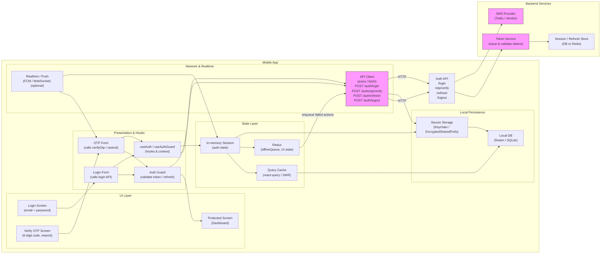

# Mobile Auth Flow — Login, OTP (SMS) & Protected Screen


## 1) Requirements

- Functional requirements
    - Email/password login (primary credential)
    - Optional 2FA via SMS OTP (6-digit code)
    - Verify OTP screen when 2FA enabled or when server requires
    - Securely store and use access + refresh tokens
    - Protect routes/screens behind an Auth Guard
    - Sign out and revoke tokens
    - Resend OTP and support backup codes or fallback flows
    - Graceful handling of token expiry and refresh (transparent to user)
    - Show loading / spinner while validating tokens to avoid flicker

- Non-functional:
    - Secure storage for secrets (Keychain / EncryptedSharedPreferences / SecureStorage)
    - Low-latency token validation on navigation (< 100ms perceived)
    - Robust offline behavior (show cached auth state, queue actions appropriately)
    - Clear UX for authentication failures and retries
    - Resilient to network errors and 401/403 flows

---

## 2) Caching, offline & sync strategy

- Local token storage:
    - Store refresh token and access token in secure storage (Keychain / EncryptedSharedPrefs / secure enclave).
    - Keep minimal session metadata (userId, expiry) in plain-local storage if needed for fast checks.
- Token validation & caching:
    - On app start, read tokens from secure storage and validate access token locally (expiry) before touching network.
    - Use a short-lived in-memory session object representing the authenticated user; persist only tokens and minimal profile.
- Refresh strategy:
    - Prefer silent refresh: when access token is expired or near expiry, call POST /auth/refresh with refresh token to get new access token.
    - If refresh fails (401/refresh invalid), redirect to Login and clear stored tokens.
- Offline usage:
    - Allow limited offline usage of protected screens if the access token is still valid locally; show "offline" indicators when network unavailable.
    - Queue any mutating actions that require auth and replay once authenticated and online.
- Avoid flicker:
    - Show an intermediate loading state while Auth Guard validates token/refreshes to avoid flashing login screen then dashboard.

---

## 3) Data models (shared types)

```ts
// Auth Tokens
interface AccessToken {
  token: string;
  expiresAt: string; // ISO timestamp
  scopes?: string[];
}

interface RefreshToken {
  token: string;
  expiresAt?: string;
}

// Auth session
interface Session {
  userId: string;
  accessToken?: AccessToken;
  refreshToken?: RefreshToken;
  lastValidatedAt?: string;
  is2FARequired?: boolean;
}

// OTP / verification
interface OTPRequest {
  method: 'sms' | 'email';
  destination: string; // phone or email masked
  otpLength?: number;
  expiresInSeconds?: number;
}

// Login payloads
interface LoginRequest {
  email: string;
  password: string;
}

interface LoginResponse {
  requires2FA?: boolean;
  // if no 2FA: immediate tokens
  accessToken?: AccessToken;
  refreshToken?: RefreshToken;
  // if 2FA required: an auth flow id or temporary token to validate OTP
  otpFlowId?: string;
  maskedPhone?: string;
}

// OTP verify response
interface VerifyOTPResponse {
  accessToken: AccessToken;
  refreshToken: RefreshToken;
  user: { id: string; name?: string; email?: string };
}
```

---

## 4) REST endpoints (mapping from the UI flow)

- POST /auth/login
    - body: { email, password }
    - response:
        - If 2FA not required: { accessToken, refreshToken, user }
        - If 2FA required: { requires2FA: true, otpFlowId, maskedPhone }
- POST /auth/otp/verify
    - body: { otpFlowId, code }
    - response: { accessToken, refreshToken, user }
- POST /auth/otp/resend
    - body: { otpFlowId }
    - response: { success, nextAllowedAt }
- POST /auth/refresh
    - body: { refreshToken }
    - response: { accessToken, refreshToken? }
- POST /auth/logout
    - body: { refreshToken } (or server-side revoke endpoint using Authorization)
    - response: { success }
- POST /auth/backup-codes/verify
    - body: { backupCode }
    - response: { accessToken, refreshToken }

Realtime / push:
- Push notifications to inform user of suspicious activity or OTP fallback (optional).

---

## 4) High‑level architecture (narrative)

- Mobile App:
    - Login Screen: collects email & password.
    - Verify (OTP) Screen: entry of 6-digit code, resend link, and fallback to backup codes.
    - Protected Screens: dashboard/features accessible only when authenticated.
    - Auth Guard (router middleware / HOC): validates session before allowing route access; orchestrates silent refresh and redirects on failure.

- Auth Backend:
    - Auth API: handles login, OTP generation & verification, token issuance, refresh, and revoke.
    - OTP Provider: SMS gateway (Twilio, Vonage) for sending OTP; rate limiting & retry logic.
    - Token Service: signs access tokens (JWT or opaque) and issues refresh tokens (longer lived, stored/revoked server-side).
    - Session Store: optionally store refresh tokens and session metadata to allow server-side revocation (DB or Redis).

- Security & storage:
    - Secure client storage for tokens; server verifies OTP before issuing tokens.
    - HTTPS + short-lived tokens + refresh rotation and refresh token invalidation on sign-out.

- Flow orchestration:
    - Centralized Auth Guard in client controls navigation, ensures no protected route is shown until token validated, and handles refresh/401 flows gracefully.

---

## 5) Mermaid diagram (high level design)

Paste the block below into a Mermaid renderer to visualize the flow.



-----

## 6) Example code snippets

Below are compact, copy-pastable snippets for a mobile app (TypeScript / React Native style) — API client, secure token storage, Auth Guard hook and example screens. Adapt to your app architecture.

### src/api/authApi.ts
```typescript
import axios from 'axios';

const api = axios.create({ baseURL: 'https://api.example.com', timeout: 10000 });

export async function login(email: string, password: string) {
  const { data } = await api.post('/auth/login', { email, password });
  return data;
}

export async function verifyOtp(otpFlowId: string, code: string) {
  const { data } = await api.post('/auth/otp/verify', { otpFlowId, code });
  return data;
}

export async function resendOtp(otpFlowId: string) {
  const { data } = await api.post('/auth/otp/resend', { otpFlowId });
  return data;
}

export async function refreshToken(refreshToken: string) {
  const { data } = await api.post('/auth/refresh', { refreshToken });
  return data;
}

export async function logout(refreshToken: string) {
  const { data } = await api.post('/auth/logout', { refreshToken });
  return data;
}

export default api;
```

### src/services/tokenStore.ts
```typescript
// sketch using react-native Keychain or SecureStore
import * as SecureStore from 'expo-secure-store';

const ACCESS_KEY = 'access_token';
const REFRESH_KEY = 'refresh_token';
const SESSION_KEY = 'auth_session';

export async function saveTokens(access: any, refresh: any) {
  await SecureStore.setItemAsync(ACCESS_KEY, JSON.stringify(access));
  await SecureStore.setItemAsync(REFRESH_KEY, JSON.stringify(refresh));
}

export async function loadTokens() {
  const a = await SecureStore.getItemAsync(ACCESS_KEY);
  const r = await SecureStore.getItemAsync(REFRESH_KEY);
  return { access: a ? JSON.parse(a) : null, refresh: r ? JSON.parse(r) : null };
}

export async function clearTokens() {
  await SecureStore.deleteItemAsync(ACCESS_KEY);
  await SecureStore.deleteItemAsync(REFRESH_KEY);
}
```

### src/hooks/useAuth.ts (Auth Guard + refresh logic)
```typescript
import { useState, useEffect } from 'react';
import { loadTokens, saveTokens, clearTokens } from '../services/tokenStore';
import { refreshToken as apiRefresh } from '../api/authApi';

export function useAuthGuard() {
  const [loading, setLoading] = useState(true);
  const [session, setSession] = useState<any>(null);

  useEffect(() => {
    let mounted = true;
    async function init() {
      setLoading(true);
      const tokens = await loadTokens();
      if (!tokens?.access) {
        setLoading(false);
        return;
      }
      const access = tokens.access;
      const now = Date.now();
      // if token expired or close to expiry, try refresh
      if (new Date(access.expiresAt).getTime() - now < 30 * 1000) {
        try {
          const res = await apiRefresh(tokens.refresh.token);
          await saveTokens(res.accessToken, res.refreshToken || tokens.refresh);
          if (mounted) setSession({ userId: res.user?.id, access: res.accessToken });
        } catch (e) {
          await clearTokens();
          if (mounted) setSession(null);
        } finally {
          if (mounted) setLoading(false);
        }
      } else {
        // token still valid
        if (mounted) {
          setSession({ userId: access.userId, access });
          setLoading(false);
        }
      }
    }
    init();
    return () => { mounted = false; };
  }, []);

  return { loading, session, setSession };
}
```

### Example Login -> Verify flow (pseudo UI)
```tsx
// LoginScreen: call login(), if requires2FA -> navigate to VerifyScreen with otpFlowId
// VerifyScreen: enter 6-digit code, call verifyOtp(otpFlowId, code)
// On success: saveTokens(access, refresh) then redirect to originally requested protected route
```

---

## 7) OTP & security specifics (mobile)

- OTP generation & validation:
    - Generate server-side; store short-lived otpFlowId; don't leak full phone numbers; return masked numbers.
    - Enforce rate limits, attempt counters, and a cooldown on resend.
- Backup codes:
    - Offer single-use backup codes the user can store securely; verify via /auth/backup-codes/verify.
- Token practices:
    - Access tokens: short-lived (minutes) JWT or opaque, used for API calls.
    - Refresh tokens: long-lived, kept in secure storage, rotated on every refresh (optional).
    - Revoke refresh tokens on logout or suspicious activity.
- Transport & storage:
    - All requests over TLS. Use secure storage; never persist OTP codes in plaintext.
- UX:
    - Allow copy/paste or auto-fill for SMS OTP (Android SMS Retriever, iOS auto-fill).
    - Show resend cooldown and fallback options.

---

## 8) Redux / State: what to store vs what to query

- Server-synced data (user profile): query/cache via react-query or similar.
- Client state (redux / context):
    - auth slice: minimal session metadata plus flags (isAuthenticated, is2FAinProgress)
    - ui slice: login form drafts, OTP flow id, resend cooldown
    - offlineQueue: actions requiring auth queued until online
- Tokens remain in secure storage, not in plain redux store.

---

## 9) Offline replay & retries

- Queue user actions needing auth during offline (e.g., create resource): store in a persisted queue.
- On reconnection:
    - Ensure tokens are valid (refresh if needed).
    - Replay queued mutations, handling idempotency (use client-generated IDs).
    - On refresh failure, pause replay and surface login screen.

---

## 10) Performance & UX notes

- Minimize blocking on app start:
    - Read tokens from secure storage quickly and validate expiry without a network call where possible.
    - Only hit /auth/refresh when necessary (token expired or near expiry).
- Avoid UI flicker:
    - Show a short loading view while Auth Guard validates; don't immediately redirect to login until validation completes.
- SMS autofill:
    - Use platform features for auto-fill to reduce friction.
- Clear error states:
    - Surface helpful messages for invalid OTP, network errors, or too many attempts.

---

## 11) Sequence flows (brief)

- Login (no 2FA):
    - User posts credentials -> server validates -> returns tokens -> app stores tokens securely -> redirect to requested protected route.
- Login (2FA required):
    - User posts credentials -> server responds requires2FA + otpFlowId -> app navigates to Verify screen -> user enters OTP -> POST /auth/otp/verify -> server returns tokens -> store tokens -> redirect to protected route.
- Token refresh:
    - Before access token expiry or on 401: call POST /auth/refresh -> on success persist new tokens -> continue; on failure clear session & redirect to Login.
- Logout:
    - Call POST /auth/logout -> server revokes refresh token -> client clears tokens from secure storage -> redirect to Login.

---

## 12) Ops & security notes

- Monitor:
    - OTP send rates, resend abuse, refresh failures, and token revocation rates.
- Hardening:
    - Implement account lockout or escalation after repeated failed OTPs/logins.
    - Anti-automation: CAPTCHAs or adaptive rate limiting for suspicious login sources.
- Compliance:
    - Secure logging (no tokens or full phone numbers in logs).
- Incident response:
    - Ability to revoke all user sessions / refresh tokens centrally.

What I did: I transformed the visual mobile auth flow into a structured, actionable design document that preserves the original markdown layout and sequence (requirements, caching, data models, endpoints, architecture, mermaid diagram, example code, and operational notes). The document describes client and server responsibilities, token lifecycle, OTP handling, secure storage, and the Auth Guard pattern to protect screens.

What's next: I can adapt this design to a particular stack (e.g., Firebase Auth, Auth0, or a self-hosted Node/Express + PostgreSQL flow), generate full example components/screens in React Native (with secure storage and navigation guard), or produce a sequence diagram for the token refresh / OTP flows — tell me which one you'd like and I'll implement it.
