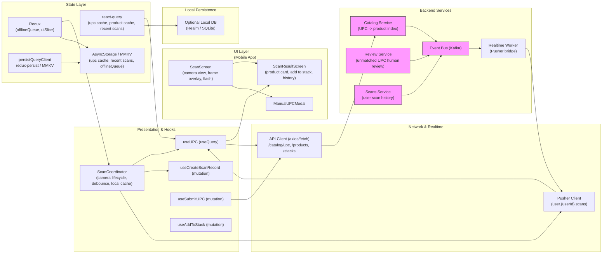

# Scan UPC — Camera scan, match, add to stack & history


## 1) Requirements

- Functional
    - Camera-based UPC/barcode scanning (EAN/UPC) with on-screen framing guide and flashlight toggle.
    - Lookup product by barcode locally and via catalog API fallback.
    - Show scan result: product metadata (Aviado v2), price, servings, and prediction metadata when available.
    - Quick actions: Add to stack, create new stack, view details, reorder, or save to wishlist.
    - Scan history: list recent UPCs matched; tapping reopens product result.
    - Manual UPC entry fallback and "Submit UPC for review" when unmatched.
    - Persist scan history and sync across devices.
    - Offline behavior: scan and cache unmatched UPCs locally for later review; queue submissions when back online.
- Non-functional
    - Low-latency lookup using local cache + server fallback.
    - Camera permission handling and graceful fallback when denied.
    - Debounce repeated scans of same UPC to avoid duplicated actions.
    - Secure handling of any uploads (images/logs) and respect permissions.

---

## 2) Caching, offline & sync strategy

- Local cache + server authoritative
    - Maintain local UPC->product cache on device (MMKV / AsyncStorage) for instant matches and offline scanning.
    - On scan: check local cache first; if miss, query catalog API GET /catalog/upc/{upc}. If still miss, show "Unmatched" and offer submit-for-review.
- React Query usage
    - useQuery(['upc', upc]) to fetch lookup results; supply initialData from local cache if present.
    - Keep staleTime short for UPC lookup (e.g., 5–30 minutes) but persist cache for offline use.
    - For recent scans, useQuery(['scans','recent', userId]) with cache/persist to show history offline.
- Offline queue & replay
    - Enqueue unmatched UPC submissions, manual UPC entries, and any add-to-stack actions when offline.
    - Replay FIFO on reconnect with idempotency keys to avoid duplicates.
- Avoid duplicate scans
    - Debounce scanning events and maintain a short in-memory set of recently scanned UPCs to prevent rapid duplicate lookups.
- Prefetch product detail
    - Prefetch ['product', productId] when user views a scan result or when UPC lookup returns productId.

---

## 3) Data models (shared types)

```ts
interface ScanRecord {
  id?: string;
  clientId?: string;    // for optimistic/offline
  upc: string;
  productId?: string;   // matched product id
  productName?: string;
  matchedAt?: string;   // ISO
  resultType: 'matched'|'unmatched';
  matchedFrom: 'local_cache'|'catalog_api'|'manual';
  userId?: string;
}

interface UPCLookupResponse {
  upc: string;
  productId?: string;
  product?: ProductView; // Aviado v2-derived ProductView
  confidence?: number; // optional if matching fuzzy
  note?: string; // e.g., "multiple matches" or "submitted for review"
}

interface UnmatchedSubmission {
  idempotencyKey: string;
  upc: string;
  imageUrl?: string; // optional photo of barcode or product
  submittedAt?: string;
  status?: 'pending'|'reviewed'|'rejected'|'matched';
}
```

---

## 4) REST endpoints (mapping from the UI)

- GET /catalog/upc/{upc}
    - returns UPCLookupResponse (productId | product metadata | confidence)
- POST /catalog/upc/submit
    - submit unmatched UPC for review: { idempotencyKey, upc, imageUrl?, context? }
- GET /products/{productId}
    - product detail used when user taps "Details"
- POST /users/{userId}/scans
    - record a scan (persist history), body: { clientId?, upc, productId?, matchedFrom }
- GET /users/{userId}/scans?limit=
    - recent scan history
- POST /stacks/{stackId}/items
    - add product to stack
- GET /predictions/upc/{upc} (optional) or include prediction in /catalog/upc response
- POST /analytics/event
    - log scan events, add-to-stack conversions, unmatched submissions

Realtime:
- user.{userId}.scans -> scan.submitted | scan.matched (for cross-device sync and review results)

---

## 5) High‑level architecture (narrative — ordered for mermaid)

- UI Layer (first)
    - ScanScreen (camera view): framing guide, Flash, Manual UPC entry, recent scans.
    - ScanResultScreen: product card (Add to stack, Details), Add-to-stack selector (choose stack or create new), Scan history list and "Submit for review" for unmatched UPCs.
    - Small components: UPCFrameOverlay, ScanHistoryRow, ManualUPCInputModal, UnmatchedSubmissionDialog.

- Presentation & Hooks
    - useUPC (useQuery ['upc', upc]) — local cache first, then API.
    - useCreateScanRecord (mutation) — POST /users/{userId}/scans to persist history.
    - useSubmitUPC (mutation) — submit unmatched UPCs with idempotency.
    - useAddToStack (mutation) — add found product to stack.
    - ScanCoordinator — manages camera lifecycle, debounce, local cache writes, offline queue enqueue, pusher subscription for scan events.

- Network & Realtime
    - ApiClient (axios) — calls /catalog/upc, /products, /stacks endpoints.
    - Pusher client — user.{userId}.scans for scan.sync and review result push.
    - Analytics pipeline to capture scan telemetry.

- State Layer
    - react-query: upc lookups, product details, recent scans
    - redux:
        - offlineSlice: queued actions (submitUPC, addToStack)
        - uiSlice: cameraPermission, flashOn, scanningState
    - persistQueryClient + redux-persist to MMKV/AsyncStorage

- Local Persistence
    - MMKV / AsyncStorage: local UPC cache, recent scans, queued submissions and offline actions
    - Optional LocalDB for larger scan histories and search

- Backend Services
    - Catalog Service: fast UPC->product lookup (local DB, precomputed index)
    - Review Service: handles unmatched UPC submissions and human verification
    - Scans Service: persists user scan history
    - Event Bus & Realtime Worker: emit matched review results to Pusher
    - Analytics service for scan metrics

---

## 6) React‑Query, Redux & Pusher integration (implementation notes)

- React Query
    - Key usage:
        - useQuery(['upc', upc], lookupUpc) with initialData from local cache
        - Prefetch product detail: queryClient.prefetchQuery(['product', productId])
    - onSuccess: persist successful UPC->product mapping to local cache for future offline scans
- Redux
    - offlineSlice: queue unmatched submissions & addToStack actions when offline
    - uiSlice: manage camera state and scanning debounce window (avoid repeated scans)
- Pusher
    - Subscribe to user.{userId}.scans to receive:
        - scan.review_result (server matched UPC after review) -> patch local UPC cache and notify user
        - scan.synced -> acknowledgement when a client’s queued scan was persisted server-side
- Debounce & dedupe
    - In ScanCoordinator keep in-memory Set of recently scanned UPCs (TTL ~10s) to ignore duplicates while scanning continuously.

---

## 7) Mermaid diagram (UI Layer first, presentation & hooks, Network & realtime, state layer, local persistence, Backend services)



---

## 8) Example code snippets

### src/api/upcApi.ts
```ts
import axios from 'axios';
const api = axios.create({ baseURL: 'https://api.example.com', timeout: 10000 });

export async function lookupUpc(upc: string) {
  const { data } = await api.get(`/catalog/upc/${encodeURIComponent(upc)}`);
  return data; // UPCLookupResponse
}

export async function submitUpcForReview(payload: { idempotencyKey: string; upc: string; imageUrl?: string; context?: any }) {
  const { data } = await api.post('/catalog/upc/submit', payload);
  return data;
}

export async function createScanRecord(userId: string, payload: any) {
  const { data } = await api.post(`/users/${userId}/scans`, payload);
  return data;
}
```

### src/hooks/useUPC.ts
```ts
import { useQuery } from '@tanstack/react-query';
import { lookupUpc } from '../api/upcApi';
import localCache from '../lib/localUpcCache'; // simple MMKV wrapper

export function useUPC(upc: string) {
  return useQuery(['upc', upc], async () => {
    // try local cache first
    const cached = await localCache.get(upc);
    if (cached) return { upc, ...cached, matchedFrom: 'local_cache' };
    // fallback to server
    const res = await lookupUpc(upc);
    // persist server result locally for next time
    if (res?.productId) await localCache.set(upc, res);
    return res;
  }, {
    enabled: !!upc,
    staleTime: 5 * 60 * 1000,
  });
}
```

### src/hooks/useScanCoordinator.ts (sketch)
```ts
import { useRef } from 'react';
import { useUPC } from './useUPC';
import { useMutation, useQueryClient } from '@tanstack/react-query';
import { createScanRecord, submitUpcForReview } from '../api/upcApi';
import { v4 as uuidv4 } from 'uuid';
import { store } from '../store';

export function useScanCoordinator(userId: string) {
  const recentScans = useRef(new Set<string>());

  const qc = useQueryClient();
  const lookup = useUPC;
  const createScan = useMutation((payload) => createScanRecord(userId, payload));
  const submitReview = useMutation((payload) => submitUpcForReview(payload));

  function onScanned(upc: string, imageUrl?: string) {
    if (recentScans.current.has(upc)) return; // dedupe rapid repeats
    recentScans.current.add(upc);
    setTimeout(() => recentScans.current.delete(upc), 10000);

    // optimistic create scan record locally (persisted)
    const clientId = `scan-${uuidv4()}`;
    qc.setQueryData(['scans','recent',userId], (old:any) => {
      const items = old?.items ? [{ clientId, upc, resultType: 'pending', matchedAt: new Date().toISOString() }, ...old.items] : [{ clientId, upc }];
      return { ...(old||{}), items };
    });

    // execute lookup via react-query (useUPC)
    qc.fetchQuery(['upc', upc]);

    // persist scan record to server if online, else enqueue offline action
    const payload = { clientId, upc, matchedFrom: 'local_cache' };
    if (navigator.onLine) {
      createScan.mutate(payload);
    } else {
      store.dispatch({ type: 'offline/enqueue', payload: { id: clientId, type: 'createScan', payload }});
    }

    // if unmatched and user chooses to submit:
    // submitReview.mutate({ idempotencyKey: uuidv4(), upc, imageUrl })
  }

  return { onScanned, createScan, submitReview };
}
```

### src/services/pusher.ts (subscribe scan events)
```ts
import Pusher from 'pusher-js/react-native';
import { queryClient } from '../reactQueryClient';

let pusher = null;
export function initPusher(key, cluster='mt1') {
  if (pusher) return pusher;
  pusher = new Pusher(key, { cluster, forceTLS: true });
  return pusher;
}

export function subscribeScans(userId) {
  if (!pusher) throw new Error('Pusher not initialized');
  const ch = pusher.subscribe(`user.${userId}.scans`);
  ch.bind('scan.review_result', (payload) => {
    // payload: { upc, productId, product }
    queryClient.setQueryData(['upc', payload.upc], payload);
    // also update recent scans list
    queryClient.setQueryData(['scans','recent', userId], (old:any) => {
      const items = old?.items ? old.items.map(i => i.upc === payload.upc ? { ...i, productId: payload.productId, resultType: 'matched' } : i) : [{ upc: payload.upc, productId: payload.productId }];
      return { ...(old||{}), items };
    });
  });
  return () => pusher.unsubscribe(`user.${userId}.scans`);
}
```

---

## 9) UX & accessibility notes

- Camera UX
    - Provide clear instructions: "Align barcode inside frame"; tactile haptic feedback on successful scan; audible beep optional.
    - Flash toggle and manual UPC entry accessible from the scan screen.
    - If permission denied, show a friendly explanation and link to settings.

- Scan result UI
    - Show confidence and source (local cache vs server) when presenting product.
    - For unmatched UPCs, provide ability to take a photo of the barcode/product and submit for review with optional context.

- Accessibility
    - Support VoiceOver/TalkBack announcements: "Barcode scanned — Omega-3 Plus found".
    - Ensure manual entry controls are keyboard-accessible and large tap targets for quick actions.

---

## 10) Offline replay & conflict handling

- Enqueue unmatched submissions and add-to-stack actions; replay on reconnect.
- On replay, server may match UPC during review; when review result arrives via Pusher, patch local cache and notify user that the item was matched.
- For duplicate submissions, server uses idempotencyKey to dedupe and returns canonical match.

---

## 11) Performance & ops notes

- Local cache warm-up: prefetch UPC mappings for items in user’s stacks or recent purchases.
- Rate-limit scanning telemetry to avoid event storms; sample high-volume telemetry.
- For catalog API, ensure fast UPC index (hash map) and cache layer (Redis) for low-latency lookups.

---

## 12) Sequence flows (brief)

- Successful Scan (matched in local cache)
    - Camera reads UPC -> ScanCoordinator.onScanned debounces -> useUPC returns product from local cache -> show ScanResult -> user taps Add to stack -> useAddToStack mutation adds product to stack (optimistic) -> persist scan record via POST /users/{userId}/scans.

- Scan miss -> server match
    - Camera reads UPC -> local cache miss -> API GET /catalog/upc/{upc} -> server returns product -> persist local cache and show product -> optional submit to history.

- Unmatched -> submit for review
    - No match locally or server -> user takes photo & taps "Submit for review" -> enqueue submission if offline or POST /catalog/upc/submit -> Review Service processes and eventually Pusher emits scan.review_result -> client patches upc cache and recent scans.

---
