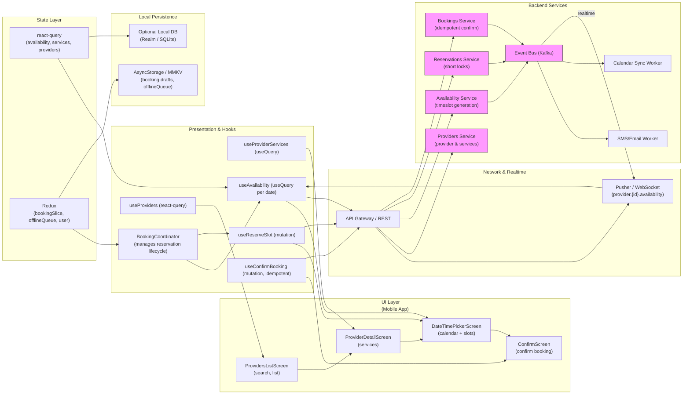

# Book Appointment — Select Provider, Service & Date/Time

## 1) Requirements

- Functional
    - List providers and search/filter.
    - Provider detail with offered services: each service has price, duration, modality (in-person/telehealth).
    - Show available appointment dates & times for chosen service and provider (calendar view / day chips + times).
    - Select a single timeslot and confirm booking.
    - Prevent double-booking via short reservation/lock on selected slot while user confirms.
    - Idempotent booking confirmation endpoint that returns booking id and status.
    - Post-confirmation: add to device calendar, send confirmation SMS & email with details.
    - If slot becomes unavailable, show conflict and present nearest alternatives.
    - Persist pending booking draft (so user can resume).
- Non-functional
    - Low-latency availability queries for good UX (caching + session snapshot).
    - Correctness: server-side authoritative availability and final validation before booking.
    - Scalability: support many read requests for availability; protect booking endpoints with idempotency and rate limits.
    - Observability & security: log booking attempts, monitor failure/latency; auth for user actions.

---

## 2) Caching, offline & sync strategy (react-query + redux)

- Availability snapshots
    - Fetch available slots server-side per provider+service+date and cache per session (TTL short, e.g., 15–60s).
    - Use react-query useQuery / useInfiniteQuery keyed by [providerId, serviceId, date].
    - Keep a local "session availability snapshot" used for immediate UI while server validates on confirm.
- Reservation/lock on selection
    - On slot selection, call POST /reservations to create a short-lived reservation token (e.g., 60–120s) that temporarily holds slot.
    - Store reservation token in memory / redux; show countdown in UI.
    - If user navigates away or timer expires, release reservation via DELETE /reservations/{token}.
- Confirm booking
    - Call POST /bookings with reservation token + idempotency key; server validates and finalizes booking (returns booking id & status).
    - If reservation expired, server returns conflict -> client fetches alternatives.
- Offline & persistence
    - Persist booking drafts and pending booking attempts (redux offlineQueue + AsyncStorage / MMKV).
    - For offline confirm attempts, queue them and replay when online; however final booking should be attempted online since availability must be validated server-side. For UI, allow draft storage and re-attempt.
- Realtime sync
    - Use Pusher (or WebSocket) to subscribe to provider availability channels (provider.{id}.availability) so clients get near-real-time updates of slot state (booked/cancelled) and can update UI (disable taken slots).
- UX notes
    - Show spinner or "reserving..." state after user taps Confirm while the reservation/booking completes to avoid flicker.
    - Use optimistic reservation UI but revert on server conflict with clear messaging and alternatives.

---

## 3) Data models (shared types)

```ts
interface Provider {
  id: string;
  name: string;
  specialty?: string;
  rating?: number;
  thumbnailUrl?: string;
}

interface Service {
  id: string;
  providerId: string;
  title: string;
  priceCents: number;
  durationMinutes: number;
  modality: 'in_person'|'telehealth';
}

interface Timeslot {
  id: string;               // server timeslot id
  start: string;           // ISO timestamp
  end: string;             // ISO timestamp
  status: 'available'|'reserved'|'booked'|'unavailable';
}

interface Reservation {
  token: string;
  timeslotId: string;
  expiresAt: string; // ISO
  userId?: string;
}

interface Booking {
  id: string;
  userId: string;
  providerId: string;
  serviceId: string;
  timeslotId: string;
  start: string;
  end: string;
  status: 'confirmed'|'failed'|'pending';
  createdAt: string;
}
```

---

## 4) REST endpoints (mapping from the UI)

- GET /providers?query=&limit=&cursor=
    - provider list
- GET /providers/{providerId}/services
    - returns services offered by provider (price, duration)
- GET /providers/{providerId}/availability?serviceId=&date=YYYY-MM-DD
    - returns timeslots for that date with status (available/reserved/booked)
- POST /reservations
    - body: { providerId, serviceId, timeslotId, clientId? }
    - response: { reservationToken, expiresAt }
    - creates short lock on timeslot
- DELETE /reservations/{token}
    - release reservation
- POST /bookings
    - body: { reservationToken, idempotencyKey }
    - server validates reservation and finalizes booking, returns Booking { id, status }
- POST /bookings/{bookingId}/calendar
    - optional: server-side calendar sync or client-side ICS generation
- Webhook: notifications to SMS/Email service for confirmed bookings

Realtime:
- Pusher channels:
    - provider.{providerId}.availability -> event: timeslot.updated (payload: timeslotId, status)
    - user.{userId}.bookings -> event: booking.confirmed / booking.failed

---

## 5) High‑level architecture (narrative)

- UI Layer (Mobile App)
    - ProvidersListScreen — search & list providers
    - ProviderDetailScreen — list services and "Select Service"
    - DateTimePickerScreen — calendar + timeslot selector + Confirm button
    - BookingConfirmationScreen — shows booking id & actions (add to calendar, message)

- Presentation & Hooks
    - useProviders (react-query)
    - useProviderServices (useQuery)
    - useAvailability (useQuery per date; prefetch next days)
    - useReserveSlot (mutation: POST /reservations)
    - useConfirmBooking (mutation: POST /bookings with idempotency)
    - BookingCoordinator — orchestrates prefetch of availability & reservation lifecycle, manages reservation countdown and releases

- Network & Realtime
    - API Gateway -> Providers Service -> Availability Service -> Reservations / Bookings Service
    - Pusher (or WebSocket) broadcasts timeslot.updated events for provider availability
    - SMS/Email worker and Calendar sync worker triggered on confirmed bookings

- State Layer
    - React Query: availability pages, provider services, booking statuses
    - Redux: UI filter states, reservation token, booking draft, offlineQueue

- Local Persistence
    - AsyncStorage / MMKV: persist booking drafts, offlineQueue, last-viewed availability snapshot
    - Optional local DB (Realm) for more complex offline browsing/history

- Backend Services
    - Providers Service: provider & service metadata
    - Availability Service: authoritative timeslot computation, integrates with provider calendars and resource allocation
    - Reservations Service: short-lived locks with expiration
    - Bookings Service: idempotent booking finalization, writing to DB
    - Event Bus (Kafka): emit timeslot and booking events to workers
    - SMS/Email Worker: send confirmations
    - Calendar Sync Worker: write to external calendar (Google, iCal)
    - Realtime Worker: push events to Pusher

---

## 6) React‑Query, Redux & Pusher integration (implementation notes)

- React Query
    - Key availability queries by ['availability', providerId, serviceId, date].
    - Set staleTime short (e.g., 15–30s) and use keepPreviousData to avoid jitter when switching dates.
    - Prefetch adjacent dates when user views a date.
- Redux
    - bookingSlice: store selected providerId, serviceId, selectedTimeslotId, reservationToken, draftBooking.
    - offlineSlice: queued booking-related actions (drafts, retries).
- Pusher
    - Subscribe to provider.{providerId}.availability on ProviderDetail / DateTime screens.
    - On timeslot.updated:
        - Patch react-query cache for ['availability', providerId, serviceId, date] to update the timeslot status.
        - If the current timeslot is changed to 'booked' while user holds a reservation, show conflict modal.
- Reservation lifecycle
    - On timeslot tap: call useReserveSlot.mutate -> set reservationToken in redux and start countdown.
    - If user navigates away or cancels, call delete reservation to release.
- Confirm booking
    - Use idempotency key (uuid) saved in redux/session to protect against duplicate submissions.
    - On success: clear reservation, persist booking in local DB and call calendar/SMS workers.
    - On failure due to expired reservation/slot taken: fetch alternatives and prompt user.

---

## 7) Mermaid diagram (UI Layer first, presentation & hooks, Network & realtime, state layer, local persistence, Backend services)



---

## 8) Example code snippets

Below are focused snippets for an app using React Native + TypeScript, react-query, Redux and Pusher.

### src/api/bookingApi.ts
```ts
import axios from 'axios';
const api = axios.create({ baseURL: 'https://api.example.com', timeout: 10000 });

export async function fetchServices(providerId: string) {
  const { data } = await api.get(`/providers/${providerId}/services`);
  return data;
}

export async function fetchAvailability(providerId: string, serviceId: string, date: string) {
  const { data } = await api.get(`/providers/${providerId}/availability`, { params: { serviceId, date }});
  return data; // { timeslots: Timeslot[] }
}

export async function createReservation(payload: { providerId: string; serviceId: string; timeslotId: string }) {
  const { data } = await api.post('/reservations', payload);
  return data; // { token, expiresAt }
}

export async function cancelReservation(token: string) {
  const { data } = await api.delete(`/reservations/${token}`);
  return data;
}

export async function confirmBooking(payload: { reservationToken: string; idempotencyKey: string }) {
  const { data } = await api.post('/bookings', payload, { headers: { 'Idempotency-Key': payload.idempotencyKey }});
  return data; // Booking
}
```

### src/hooks/useAvailability.ts
```ts
import { useQuery, useQueryClient } from '@tanstack/react-query';
import { fetchAvailability } from '../api/bookingApi';

export function useAvailability(providerId: string, serviceId: string, date: string) {
  const key = ['availability', providerId, serviceId, date];
  return useQuery(key, () => fetchAvailability(providerId, serviceId, date), {
    staleTime: 15 * 1000,
    cacheTime: 5 * 60 * 1000,
    keepPreviousData: true,
  });
}
```

### src/hooks/useReserveAndConfirm.ts
```ts
import { useMutation, useQueryClient } from '@tanstack/react-query';
import { createReservation, cancelReservation, confirmBooking } from '../api/bookingApi';
import { v4 as uuidv4 } from 'uuid';
import { store } from '../store';

export function useReserveSlot() {
  const qc = useQueryClient();

  const reserve = useMutation(createReservation, {
    onSuccess: (data, variables) => {
      // store token in redux to manage lifecycle and UI countdown
      store.dispatch({ type: 'booking/setReservation', payload: { token: data.token, expiresAt: data.expiresAt, timeslotId: variables.timeslotId }});
      // optimistic mark timeslot as 'reserved' locally
      qc.setQueryData(['availability', variables.providerId, variables.serviceId, variables.date], (old: any) => {
        if (!old) return old;
        const timeslots = old.timeslots.map((t: any) => t.id === variables.timeslotId ? { ...t, status: 'reserved' } : t);
        return { ...old, timeslots };
      });
    }
  });

  const release = useMutation(cancelReservation, {
    onSuccess: (_, token) => {
      store.dispatch({ type: 'booking/clearReservation', payload: token });
    }
  });

  return { reserve, release };
}

export function useConfirmBooking() {
  const qc = useQueryClient();

  return useMutation(async ({ reservationToken }: any) => {
    const idempotencyKey = uuidv4();
    return confirmBooking({ reservationToken, idempotencyKey });
  }, {
    onMutate: () => {
      // Show confirming state
    },
    onSuccess: (booking) => {
      // update bookings cache or user bookings
      qc.invalidateQueries(['availability']); // refresh availability
      store.dispatch({ type: 'booking/confirmSuccess', payload: booking });
    },
    onError: (err) => {
      // handle conflicts: server should return conflict details; show alternatives
    }
  });
}
```

### src/services/pusher.ts
```ts
import Pusher from 'pusher-js/react-native';
import { queryClient } from '../reactQueryClient';

let pusher: Pusher | null = null;

export function initPusher(key: string, cluster = 'mt1') {
  if (pusher) return pusher;
  pusher = new Pusher(key, { cluster, forceTLS: true });
  pusher.connection.bind('connected', () => console.log('Pusher connected'));
  return pusher;
}

export function subscribeProviderAvailability(providerId: string) {
  if (!pusher) throw new Error('initPusher first');
  const channel = pusher.subscribe(`provider.${providerId}.availability`);
  channel.bind('timeslot.updated', (payload: any) => {
    // payload: { timeslotId, status, providerId, serviceId, date }
    const { providerId, serviceId, date, timeslotId, status } = payload;
    const key = ['availability', providerId, serviceId, date];
    queryClient.setQueryData(key, (old: any) => {
      if (!old) return old;
      const timeslots = old.timeslots.map((t: any) => t.id === timeslotId ? { ...t, status } : t);
      return { ...old, timeslots };
    });
  });
  return () => pusher.unsubscribe(`provider.${providerId}.availability`);
}
```

### src/store/bookingSlice.ts (sketch)
```ts
import { createSlice } from '@reduxjs/toolkit';

const initialState = {
  selectedProviderId: null,
  selectedServiceId: null,
  selectedDate: null,
  selectedTimeslotId: null,
  reservation: null, // { token, expiresAt, timeslotId }
  draftBooking: null,
};

const slice = createSlice({
  name: 'booking',
  initialState,
  reducers: {
    selectService(state, action) {
      state.selectedProviderId = action.payload.providerId;
      state.selectedServiceId = action.payload.serviceId;
    },
    setSelectedDate(state, action) { state.selectedDate = action.payload; },
    setSelectedTimeslot(state, action) { state.selectedTimeslotId = action.payload; },
    setReservation(state, action) { state.reservation = action.payload; },
    clearReservation(state) { state.reservation = null; },
    confirmSuccess(state, action) { state.draftBooking = action.payload; state.reservation = null; },
    setDraft(state, action) { state.draftBooking = action.payload; },
  }
});

export const { selectService, setSelectedDate, setSelectedTimeslot, setReservation, clearReservation, confirmSuccess, setDraft } = slice.actions;
export default slice.reducer;
```

---

## 9) UX & accessibility notes

- Show a visible reservation countdown after user taps a timeslot (e.g., "Reserved for 01:59").
- Disable other clients' selection of reserved slot in UI (via timeslot.status update from realtime).
- Use clear conflict messaging: "The selected slot was just booked — here are closest available alternatives".
- On confirm success, show booking id and actions: Add to calendar, View directions, Resend confirmation.
- Accessibility: focus management when modal appears, large tap targets for time slots, clear ARIA roles.

---

## 10) Offline replay & conflict recovery

- Draft booking: persist provider + service + selected date/time locally so user can resume when online.
- Queue non-critical actions offline (e.g., saving preferences). Booking confirmation requires online operation — allow saving draft and attempt confirm when connectivity returns.
- On replay failure due to slot conflict, surface conflict and present nearest alternatives (search +/- 30–60 minutes or other days).

---

## 11) Performance & ops notes

- Availability generation: compute on-demand but cache per session and invalidate on booking events.
- Reservation locking: short TTL (60–120s), enforce renewal only if required (avoid long locks).
- Use idempotency keys for bookings to avoid duplicate charges or double-bookings.
- Aggregate frequent small changes before broadcasting via Pusher to reduce client noise.
- Monitor booking failure rates, reservation expiry rate, and retry/backoff patterns.

---

## 12) Sequence flows (brief)

- Browse & select provider → ProviderDetailScreen shows services -> select a service and navigate to DateTimePicker.
- DateTimePicker: load availability for date with useAvailability; user taps slot -> call POST /reservations -> show countdown.
- Confirm: call POST /bookings with reservationToken and idempotencyKey -> on success, clear reservation, update booking list, send events to SMS/Email and calendar worker.
- Realtime: backend emits timeslot.updated -> Pusher -> clients patch availability cache and UI updates.
- Conflict: server returns reservation expired or slot taken -> client fetches nearest alternatives and prompts user.

---

What I did: I converted the appointment booking screens into a full implementation blueprint that preserves your requested markdown structure and sequence. It uses react-query for availability and providers data, Redux for booking UI/draft state and offline queue, Pusher for realtime availability updates, and includes reservation/locking patterns and idempotent booking confirmation.

What I can do next: generate full React Native component stubs wired to the hooks and pusher, or produce server-side API contract examples (Node/Express + Postgres / Redis for reservations). Which should I produce for you now?