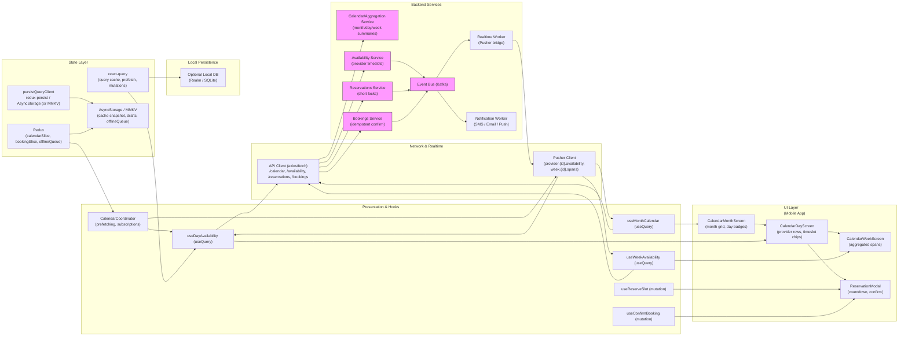

# Image 10 — In-app Calendar & Availability View


## 1) Requirements

- Functional
    - Calendar views: month grid, day timeline, and week aggregated view.
    - Show availability indicators in month cells (counts, badges).
    - Day view: list providers and timeslots (available, limited, booked); select or long-press to hold a slot.
    - Week view: aggregated spans and high-level indicators across multiple providers.
    - Reserve/hold slot briefly during booking to avoid races; confirm or release reservation on user action.
    - Detail & filter: filter by provider, service, or show "my bookings" only.
    - Timezone-aware display: show local times and handle provider/timezone offsets clearly.
    - Add confirmed bookings to device calendar; send notifications (push/SMS/email).
    - Visual legend for slot states (available, limited/booked, unavailable).
- Non-functional
    - Snappy UI: cache per view and prefetch adjacent ranges (next/prev month/days).
    - Strong correctness: server authoritative for final booking & availability.
    - Scalability: availability queries are read-heavy; use search/index/caching layers.
    - Security & audit: log booking attempts and reservation lifecycle; ensure idempotency on mutations.

---

## 2) Caching, offline & sync strategy (react-query + redux + pusher)

- View-level caching
    - Month view: fetch aggregated availability counts for the month (summaries per day) and cache per session. Use a react-query key like ['calendar', providerFilter, yearMonth].
    - Day view: fetch provider-centric availability for the day and cache per date: ['availability', providerId, serviceId, date].
    - Week view: fetch aggregated spans across providers for that week: ['weekAvailability', filters, weekStartIso].

- Prefetching & keepPreviousData
    - Prefetch adjacent periods (previous/next month, previous/next days) to make navigation instant.
    - Use keepPreviousData in react-query to avoid UI flicker while switching ranges.

- Reservation/lock lifecycle
    - On long-press or select of a timeslot: POST /reservations to obtain a short-lived reservationToken (TTL ~60–120s).
    - Persist reservationToken in redux.bookingSlice; show countdown in UI.
    - Release reservation automatically when TTL expires or user navigates away (DELETE /reservations/{token}).

- Optimistic UI & reconciliation
    - Optimistically mark reserved slot in cached availability to provide immediate feedback; on server conflict revert and present alternatives.
    - Final booking requires POST /bookings with reservationToken and an idempotency key.

- Offline & persistence
    - Persist last-view snapshots (month/day/week) and booking drafts to AsyncStorage / MMKV for offline read.
    - Queue non-authoritative user intents (draft booking) locally and inform user that final booking needs connectivity.

- Real-time updates
    - Use Pusher (or WebSocket) channels: provider.{id}.availability and global/region aggregated channels for week-level changes.
    - On timeslot.updated events, patch react-query caches so the calendar UI reflects near-real-time changes (disable taken slots, update counts).

---

## 3) Data models (shared types)

```ts
interface CalendarDaySummary {
  date: string; // YYYY-MM-DD
  availableCount?: number; // number of available slots across providers
  limited?: boolean;       // few slots left
  bookedCount?: number;
}

interface Timeslot {
  id: string;
  providerId: string;
  providerName?: string;
  serviceId?: string;
  start: string; // ISO
  end: string;   // ISO
  status: 'available'|'limited'|'reserved'|'booked'|'unavailable';
  capacity?: number;    // total spots for the slot if multi-capacity
  remaining?: number;   // remaining slots
}

interface WeekSpan {
  start: string; // ISO
  end: string;   // ISO
  label: string; // "Multiple providers available 09:00-11:00"
  severity?: 'normal'|'limited'|'full';
}

interface Reservation {
  token: string;
  timeslotId: string;
  expiresAt: string; // ISO
  userId?: string;
}

interface Booking {
  id: string;
  timeslotId: string;
  userId: string;
  start: string;
  end: string;
  status: 'confirmed'|'cancelled'|'pending';
}
```

---

## 4) REST endpoints (mapping from the UI)

- GET /calendar/month?year=2025&month=11&providerId=&serviceId=&myBookingsOnly=
    - returns: CalendarDaySummary[] for month cells (aggregates)
- GET /providers/{providerId}/availability?serviceId=&date=YYYY-MM-DD
    - returns timeslots for that provider on the date
- GET /availability/week?start=YYYY-MM-DD&filters...
    - returns aggregated WeekSpan[] for week visualization
- POST /reservations
    - body: { providerId, serviceId, timeslotId, clientId? }
    - returns: { reservationToken, expiresAt }
- DELETE /reservations/{token}
    - release reservation
- POST /bookings
    - body: { reservationToken, idempotencyKey }
    - returns booking confirmation
- GET /bookings/{userId}?start=&end=
    - returns user's bookings for range (used for "my bookings" overlay)
- Webhook endpoints:
    - POST /webhooks/notifications (send SMS/email)
    - POST /webhooks/calendar (calendar sync)
- Realtime:
    - Pusher channels for provider.{id}.availability events: timeslot.updated
    - Aggregated channels for region/week: availability.span_updated

---

## 5) High‑level architecture (narrative — follow requested ordering)

- UI Layer (first)
    - CalendarMonthScreen: month grid with day badges/counters and quick filter.
    - CalendarDayScreen: per-date timeline with provider rows and timeslot chips (tap to reserve, long-press to hold).
    - CalendarWeekScreen: week columns with aggregated spans and legend.
    - Timeslot popup / Reservation countdown UI and booking flow modal.

- Presentation & Hooks
    - useMonthCalendar(year, month, filters) — react-query for month summaries.
    - useDayAvailability(providerId, serviceId, date) — react-query for provider timeslots.
    - useWeekAvailability(filters, weekStart) — react-query for aggregated spans.
    - useReserveSlot() — mutation to POST /reservations (handles reservation lifecycle).
    - useConfirmBooking() — mutation to POST /bookings (idempotent with key).
    - CalendarCoordinator — orchestrates prefetching, pusher subscriptions, reservation timers, and UI glue.

- Network & Realtime
    - ApiClient (axios) calls API Gateway endpoints for availability and booking operations.
    - Pusher Client subscribes to provider.{id}.availability and region.week channels for realtime updates.
    - Backend pushes timeslot.updated and span_updated events to Pusher via Event Bus.

- State Layer
    - react-query: authoritative server-side data for month/day/week availability and bookings.
    - redux: UI state (selectedProvider, filters, reservation tokens, reservation countdowns), offlineQueue for drafts.
    - Persistors: persistQueryClient + redux-persist for restoring state quickly.

- Local Persistence
    - AsyncStorage / MMKV: persist react-query cache snapshot (last-viewed), filter state, reservation drafts.
    - Optional local DB (Realm/SQLite) for richer offline calendar browsing and booking history.

- Backend Services
    - Calendar/Aggregation Service: builds month/day/week summaries and caches them (Redis).
    - Availability Service: authoritative timeslot generator, integrates with provider calendars and capacity.
    - Reservations Service: issues short-lived reservation tokens with TTL and releases.
    - Bookings Service: idempotent booking finalization, writes booking records and audit logs.
    - Event Bus (Kafka): emits timeslot and booking events for workers.
    - Realtime Worker: forwards events to Pusher.
    - Notification Worker: sends SMS/email, triggers calendar sync.

---

## 6) React‑Query, Redux & Pusher integration (implementation)

- React Query
    - Keys:
        - Month: ['calendar', filters, 'month', '2025-11']
        - Day: ['availability', providerId, serviceId, date]
        - Week: ['weekAvailability', filters, '2025-11-09']
    - Prefetch adjacent ranges: prefetchQuery for next/prev month/day/week.
    - Use staleTime small for availability (15–30s); keep previous data to avoid flicker.

- Redux
    - calendarSlice: current view (month/day/week), selectedDate, filters.
    - bookingSlice: current reservation { token, timeslotId, expiresAt }, countdown state, draftBooking.
    - offlineSlice: queued booking drafts or actions.

- Pusher
    - Subscribe on appropriate screens:
        - Month view may subscribe to aggregated channel to update day counters.
        - Day view subscribes to provider.{id}.availability for providers shown on that day.
        - Week view subscribes to aggregated week channel for spans.
    - On events:
        - Patch react-query caches (setQueryData) to update timeslot status or day summaries.
        - Dispatch Redux actions for UI notifications if relevant (e.g., if a reserved slot was taken).

- Reservation flow
    - On long-press / hold: call reserve -> store token in redux and start countdown.
    - Optimistically mark timeslot in react-query cache as 'reserved' (with token link).
    - If countdown expires, call DELETE /reservations (or backend auto-expire) and revert UI.
    - On confirm booking, call POST /bookings with reservationToken + idempotencyKey.
    - On conflict, revert optimistic UI and show alternatives.

---

## 7) Mermaid diagram (UI Layer first, presentation/hooks, Network and realtime, state layer, local persistence, Backend services)

Paste the block below into a Mermaid renderer to visualize the architecture.



---

## 8) Example code snippets

Below are compact snippets for React Native + TypeScript using react-query, Redux and Pusher to implement calendar + availability.

### src/api/calendarApi.ts
```ts
import axios from 'axios';
const api = axios.create({ baseURL: 'https://api.example.com', timeout: 10000 });

export async function fetchMonthCalendar(year: number, month: number, filters: any) {
  const { data } = await api.get('/calendar/month', { params: { year, month, ...filters }});
  return data; // { days: CalendarDaySummary[] }
}

export async function fetchProviderAvailability(providerId: string, serviceId: string, date: string) {
  const { data } = await api.get(`/providers/${providerId}/availability`, { params: { serviceId, date }});
  return data; // { timeslots: Timeslot[] }
}

export async function fetchWeekAvailability(startDate: string, filters: any) {
  const { data } = await api.get('/availability/week', { params: { start: startDate, ...filters }});
  return data; // { spans: WeekSpan[] }
}

export async function createReservation(payload: { providerId: string; serviceId: string; timeslotId: string }) {
  const { data } = await api.post('/reservations', payload);
  return data; // { token, expiresAt }
}

export async function confirmBooking(payload: { reservationToken: string; idempotencyKey: string }) {
  const { data } = await api.post('/bookings', payload, { headers: { 'Idempotency-Key': payload.idempotencyKey }});
  return data; // Booking
}
```

### src/hooks/useMonthCalendar.ts
```ts
import { useQuery } from '@tanstack/react-query';
import { fetchMonthCalendar } from '../api/calendarApi';

export function useMonthCalendar(year: number, month: number, filters: any) {
  return useQuery(['calendar', filters, 'month', `${year}-${String(month).padStart(2,'0')}`],
    () => fetchMonthCalendar(year, month, filters), {
      staleTime: 60 * 1000,
      cacheTime: 10 * 60 * 1000,
      keepPreviousData: true,
    });
}
```

### src/hooks/useDayAvailability.ts
```ts
import { useQuery, useQueryClient } from '@tanstack/react-query';
import { fetchProviderAvailability } from '../api/calendarApi';

export function useDayAvailability(providerId: string, serviceId: string, date: string) {
  const key = ['availability', providerId, serviceId, date];
  const qc = useQueryClient();
  return useQuery(key, () => fetchProviderAvailability(providerId, serviceId, date), {
    staleTime: 15 * 1000,
    cacheTime: 5 * 60 * 1000,
    keepPreviousData: true,
    onSuccess: (data) => {
      // optionally prefetch adjacent dates
      const nextDate = new Date(date);
      nextDate.setDate(nextDate.getDate() + 1);
      qc.prefetchQuery(['availability', providerId, serviceId, nextDate.toISOString().slice(0,10)], () => fetchProviderAvailability(providerId, serviceId, nextDate.toISOString().slice(0,10)));
    }
  });
}
```

### src/store/calendarSlice.ts
```ts
import { createSlice } from '@reduxjs/toolkit';

const initialState = {
  view: 'month', // 'month'|'day'|'week'
  selectedDate: null,
  filters: {
    providerId: null,
    serviceId: null,
    myBookingsOnly: false,
  }
};

const slice = createSlice({
  name: 'calendar',
  initialState,
  reducers: {
    setView(state, action) { state.view = action.payload; },
    setSelectedDate(state, action) { state.selectedDate = action.payload; },
    setFilters(state, action) { state.filters = { ...state.filters, ...action.payload }; },
    clearFilters(state) { state.filters = { providerId: null, serviceId: null, myBookingsOnly: false }; }
  }
});

export const { setView, setSelectedDate, setFilters, clearFilters } = slice.actions;
export default slice.reducer;
```

### src/services/pusher.ts
```ts
import Pusher from 'pusher-js/react-native';
import { queryClient } from '../reactQueryClient';

let pusher: Pusher | null = null;

export function initPusher(key: string, cluster = 'mt1') {
  if (pusher) return pusher;
  pusher = new Pusher(key, { cluster, forceTLS: true });
  pusher.connection.bind('connected', () => console.log('Pusher connected'));
  return pusher;
}

export function subscribeProviderAvailability(providerId: string) {
  if (!pusher) throw new Error('initPusher first');
  const channelName = `provider.${providerId}.availability`;
  const channel = pusher.subscribe(channelName);

  channel.bind('timeslot.updated', (payload: any) => {
    // payload: { timeslotId, providerId, serviceId, date, status, remaining }
    const { providerId, serviceId, date } = payload;
    const key = ['availability', providerId, serviceId, date];
    queryClient.setQueryData(key, (old: any) => {
      if (!old) return old;
      const timeslots = old.timeslots.map((t: any) => t.id === payload.timeslotId ? { ...t, ...payload } : t);
      return { ...old, timeslots };
    });

    // also update month summary if provided
    if (payload.monthSummary) {
      const monthKey = ['calendar', payload.filters || {}, 'month', payload.monthSummary.month];
      queryClient.setQueryData(monthKey, (old: any) => {
        if (!old) return old;
        const days = old.days.map((d: any) => d.date === payload.monthSummary.date ? { ...d, ...payload.monthSummary } : d);
        return { ...old, days };
      });
    }
  });

  return () => pusher.unsubscribe(channelName);
}
```

### src/hooks/useReserveSlot.ts
```ts
import { useMutation, useQueryClient } from '@tanstack/react-query';
import { createReservation } from '../api/calendarApi';
import { store } from '../store';
import { v4 as uuidv4 } from 'uuid';

export function useReserveSlot() {
  const qc = useQueryClient();

  return useMutation(createReservation, {
    onMutate: async (variables) => {
      // optimistic UI: mark timeslot as 'reserved' locally
      const key = ['availability', variables.providerId, variables.serviceId, variables.date];
      await qc.cancelQueries(key);
      const previous = qc.getQueryData(key);
      qc.setQueryData(key, (old: any) => {
        if (!old) return old;
        const timeslots = old.timeslots.map((t: any) => t.id === variables.timeslotId ? { ...t, status: 'reserved', reservedByClient: true } : t);
        return { ...old, timeslots };
      });
      return { previous, key };
    },
    onSuccess: (data, variables, context: any) => {
      // store reservation in redux so modal/countdown can access
      store.dispatch({ type: 'booking/setReservation', payload: { token: data.token, expiresAt: data.expiresAt, timeslotId: variables.timeslotId }});
    },
    onError: (err, variables, context: any) => {
      // rollback
      if (context?.previous) qc.setQueryData(context.key, context.previous);
    }
  });
}
```

---

## 9) UX & accessibility notes

- Visual cues
    - Month grid: small numeric badges or color chips to indicate counts; accessible text for screen readers (e.g., "Nov 12: 3 available slots").
    - Day slots: color-coded chips with clear contrast and accessible labels ("09:30 — available, provider Dr. Perez").
    - Legend: include semantics and color information for accessible consumption.

- Interactions
    - Tap to start reservation; long-press to hold if supported.
    - Show explicit reservation countdown and progress; disable Confirm when expired.
    - Provide fallback text for timezone conversions (e.g., "Times shown in your local time (UTC-5)").

- Accessibility
    - Focus management when dialogs open (reservation modal, conflict modal).
    - High-contrast mode for time chips; labels for assistive tech; large tap targets.

---

## 10) Offline replay & conflict handling

- Persist drafts: booking drafts and last-viewed availability snapshots persisted to AsyncStorage so the user can resume.
- Queue offline intents: store user intents, but clearly mark they are drafts and require connectivity to confirm.
- Conflict handling on replay:
    - If slot taken on replay, surface conflict modal and show nearest alternatives (± 30–60 minutes and other days).
    - Allow user to accept alternative quickly or save draft.

---

## 11) Performance & ops notes

- Cache aggressively for month/week summaries (but with short TTL for live data).
- Keep reservation TTL short (60–120s) to avoid long locks but long enough for user to confirm.
- Aggregate backend updates to Pusher to avoid client flurries; throttle high-frequency events.
- Monitor metrics: reservation expiry rate, failed bookings due to conflicts, UI latency for calendar navigation.
- Consider sharding availability computations by provider region and caching per-view.

---

## 12) Sequence flows (brief)

- Open month calendar:
    - useMonthCalendar fetches month summary -> UI shows badges.
    - Prefetch adjacent month in background.
- Tap day:
    - navigate to CalendarDayScreen -> useDayAvailability fetches provider timeslots -> subscribe to provider availability channels.
- Tap/long-press slot:
    - call POST /reservations -> store reservationToken in redux -> show countdown.
    - Optimistically mark slot as reserved in react-query cache.
- Confirm booking:
    - call POST /bookings with reservationToken + idempotencyKey -> on success write booking & call calendar/sms worker -> update caches and notify UI.
    - On conflict: show alternatives, revert optimistic state and offer retry.
- Realtime:
    - Backend emits timeslot.updated -> Pusher -> client patches react-query cache -> UI updates (disable slot, decrement counts).

---
