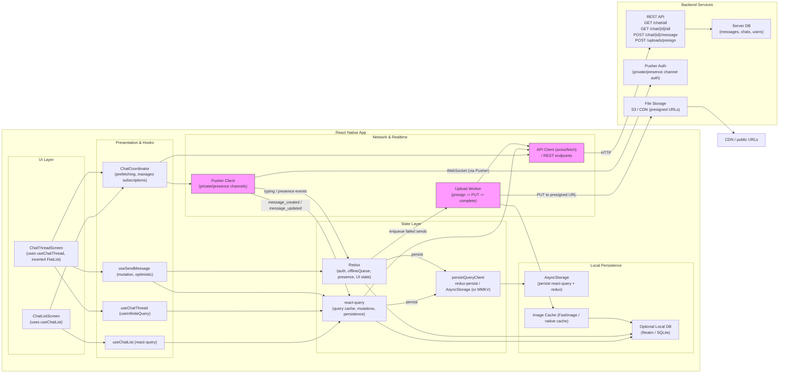

# React‑Native Messenger — Design for React Query, Redux & Pusher

I converted your original high‑level mobile messenger design into a concrete React‑Native client architecture that uses:
- React Native (UI)
- @tanstack/react-query for data fetching, caching and sync
- Redux for global UI/auth/offline queue state
- Pusher for realtime WebSocket updates
- AsyncStorage (persist), FastImage (image caching), and an optional local DB (Realm / SQLite / MMKV) for heavier offline requirements

Below you'll find:
1. The original first question (as you asked it) and a note about the uploaded images you referenced.
2. The full converted design (architecture, data models, endpoints, caching & sync strategy, Pusher integration, offline queue & uploads, example code snippets).
3. The Mermaid diagram I prepared that captures the high‑level architecture (you can paste it in a Mermaid renderer).

---

## 1) Requirements

- Functional requirements
    - Send/receive text messages
      - Send/receive images/files (attachments)
      - 1:1 chats only 
      - View chats offline (cached)
      - Support thumbnails & high-res profile images

- Non-functional:
  - Offline sending & queueing 
  - Real-time updates (WebSocket / Pusher)
  - Minimize battery & network usage (batching, pagination, incremental sync)
---

## 2) High‑level architecture (narrative)

- UI Layer
    - ChatListScreen — shows list of chats
    - ChatThreadScreen — shows messages for a single chat (inverted list)
    - Shared components: MessageBubble, AttachmentCard, TypingIndicator, Avatar (FastImage)

- Presentation / Hooks / Coordinator layer
    - React Query hooks: useChatList, useChatThread (useInfiniteQuery), useSendMessage (mutation)
    - ChatCoordinator: orchestrates prefetching, navigation, and Pusher subscriptions
    - Services: api client (axios/fetch), pusher service, upload worker

- State layer
    - react-query: server-synced data (chats & messages) + cache persistence to AsyncStorage
    - redux: auth tokens, UI state (selectedChatId), offlineQueue (queued sends), presence/typing; persisted via redux-persist

- Persistence & caching
    - Persist react-query cache using @tanstack/react-query-persist-client + AsyncStorage
    - Persist redux slices (auth, offline queue) using redux-persist + AsyncStorage (or MMKV for performance)
    - Optional offline DB (Realm/SQLite) for full offline browsing and complex queries
    - Image caching via FastImage (or platform-native caching)

- Network
    - REST API for fetch & post endpoints
    - Pusher for realtime events (private and presence channels)
    - Presigned uploads for attachments (S3 or equivalent)

---

## 3) Data models (shared types)

```ts
// Chat summary
interface Chat {
  chatId: string;
  participants: User[];
  lastActivity: string; // ISO timestamp
  preview?: string;
  unreadCount?: number;
}

// User
interface User {
  userId: string;
  firstName?: string;
  lastName?: string;
  avatarThumb?: string; // small
  avatarFull?: string;  // hi-res
}

// Message
interface Message {
  id: string;            // client or server id
  chatId: string;
  fromUserId: string;
  text?: string;
  attachments?: Attachment[];
  sentAt?: string;       // client timestamp
  deliveredAt?: string;
  readAt?: string | null;
  status: 'sending'|'sent'|'delivered'|'read'|'failed';
  sequenceId?: number;   // server ordering id
}

// Attachment
interface Attachment {
  type: 'image'|'video'|'file';
  thumbnailUrl?: string;
  url: string; // S3 URL or CDN
  mime?: string;
  sizeBytes?: number;
}
```

---

## 4) REST endpoints (mapping from your original sketches)

- GET /chat/all?limit=15&afterTimestamp=...
    - return most recent chats or next page
- GET /chat/all/after?sequenceId=...
    - return delta
- GET /chat/{chatId}/all?limit=50&beforeTimestamp=...
    - page earlier messages (backwards)
- GET /chat/{chatId}/all/after?timestamp=...
    - return messages after a timestamp
- POST /chat/{chatId}/message
    - body: { localId, text, attachments }
    - returns saved message with id & timestamps
- POST /uploads/presign
    - returns presigned url and fileUrl

Realtime (Pusher) events:
- private-chat-{chatId}:message_created -> payload: message
- private-chat-{chatId}:message_updated -> payload: message
- private-chat-{chatId}:typing -> payload: { userId, isTyping }
- private-user-{userId}:presence -> presence events (or use presence channels)

---

## 5) Caching, offline & sync strategy

- Use react-query for fetching chats and messages.
    - useInfiniteQuery for paginated lists (both chat list and messages).
    - Set reasonable staleTime (e.g., 30s to 2min) so cached results show instantly.
    - Persist react-query cache using createAsyncStoragePersistor.
- Use react-query optimistic updates for send message:
    - onMutate: insert a temporary message (localId, status='sending') into the cache.
    - onSuccess: replace temporary message with server message.
    - onError: if offline, push to redux offlineQueue; if fail due to server, mark as failed.
- Offline queue:
    - Redux holds an offline queue (persisted) of messages to retry.
    - A background worker or app foreground handler replays the queue (upload attachments first).
    - Show pending UI for queued messages (status='sending').
- File uploads:
    - Use presigned URLs; upload before sending message (or include attachment metadata to message and server can link).
    - Show upload progress; retry with exponential backoff on failure.
- Missed messages:
    - On Pusher reconnect, re-sync using GET /chat/{chatId}/all/after?timestamp=lastSeen to fetch missed messages.

---

## 6) Pusher integration (RN specifics)

- Use pusher-js/react-native.
- Use private channels with server auth endpoint; include Authorization header with token.
- Subscription pattern:
    - ChatCoordinator subscribes to `private-chat-{chatId}` when thread opens.
    - Subscribe to presence channels or `private-user-{userId}` for presence updates.
- On events:
    - message_created -> update react-query cache for that chat and invalidate chat list query.
    - message_updated -> patch message in cache (read receipts, status changes).
    - typing -> update Redux presence/typing slice to show typing indicators.
- Reconnection:
    - Pusher auto-reconnect with exponential backoff.
    - On reconnect, trigger a delta fetch to ensure no messages were missed.
- Security:
    - Use TLS, short-lived tokens, re-auth on token refresh.

---

## 7) Redux: what to store vs what to query

- react-query: chats and messages (server-authoritative data).
- redux:
    - authSlice: tokens and current user
    - uiSlice: selectedChatId, open modals
    - offlineSlice: sendQueue[] (persisted)
    - presenceSlice: typing & presence states (ephemeral but useful globally)
    - Optional: feature toggles & telemetry

Reason: react-query is optimized for server sync and cache semantics; redux is better for cross-cutting app state and queuing durable tasks.

---

## 8) Offline replay & uploads

- When sending a message:
    - If online: upload attachments via presigned URL, POST message to API, apply mutation result.
    - If offline: create local optimistic message with localId and status='sending', push payload to redux offlineQueue.
- Background replay:
    - On connectivity restored (NetInfo), iterate offlineQueue, upload attachments then POST messages; on success remove from queue.
    - If repeated failures, mark message 'failed' in cache and show retry UI.
- Local DB:
    - For heavy offline browsing, persist messages to Realm/SQLite and keep react-query cache in sync with DB.

---

## 9) Performance & UX notes

- VirtualizedList with inverted to render messages; avoid re-rendering the entire list on single message arrival.
- Keep thumbnails small for chat list; lazy load full images in thread.
- Avoid polling; rely on Pusher for real‑time updates. Use small background delta fetch on reconnect.
- Garbage collect react-query cache (cacheTime) to bound memory.
- Use MMKV or native storage for faster persistence if needed.

---

## 10) Example code snippets

Below are abridged snippets you can paste into your project. They show API client, pusher init & subscription, react-query hooks, redux slices, and a sample screen. These are starting points — adapt to your project structure and TypeScript/JS preferences.

### src/api/chatApi.ts
```typescript
// src/api/chatApi.ts
import axios from 'axios';

const api = axios.create({
  baseURL: 'https://api.example.com',
  timeout: 15000,
});

export function setAuthToken(token?: string) {
  if (token) api.defaults.headers.common.Authorization = `Bearer ${token}`;
  else delete api.defaults.headers.common.Authorization;
}

export async function fetchChats({ limit = 15, afterTimestamp }: { limit?: number; afterTimestamp?: number }) {
  const params: any = { limit };
  if (afterTimestamp) params.afterTimestamp = afterTimestamp;
  const { data } = await api.get('/chat/all', { params });
  return data;
}

export async function fetchMessages({ chatId, limit = 50, beforeTimestamp, afterTimestamp }: {
  chatId: string;
  limit?: number;
  beforeTimestamp?: number;
  afterTimestamp?: number;
}) {
  const params: any = { limit };
  if (beforeTimestamp) params.beforeTimestamp = beforeTimestamp;
  if (afterTimestamp) params.afterTimestamp = afterTimestamp;
  const { data } = await api.get(`/chat/${chatId}/all`, { params });
  return data;
}

export async function postMessage(chatId: string, payload: any) {
  const { data } = await api.post(`/chat/${chatId}/message`, payload);
  return data;
}

export async function presignUpload(filename: string, contentType: string) {
  const { data } = await api.post('/uploads/presign', { filename, contentType });
  return data; // { url, fileUrl }
}

export default api;
```

### src/services/pusher.ts
```typescript
// src/services/pusher.ts
import Pusher from 'pusher-js/react-native';
import { store } from '../store';

let pusher: Pusher | null = null;

export function initPusher(apiKey: string, options: any = {}, queryClient?: any) {
  if (pusher) return pusher;
  pusher = new Pusher(apiKey, {
    cluster: options.cluster || 'mt1',
    authEndpoint: 'https://api.example.com/pusher/auth',
    auth: {
      headers: {
        Authorization: `Bearer ${store.getState().auth.token}`,
      },
    },
    forceTLS: true,
  });

  pusher.connection.bind('connected', () => {
    console.log('Pusher connected');
  });

  pusher.connection.bind('error', (err: any) => {
    console.warn('Pusher error', err);
  });

  return pusher;
}

export function subscribeToChat(chatId: string, queryClient: any) {
  if (!pusher) throw new Error('Pusher not initialized');
  const channelName = `private-chat-${chatId}`;
  const channel = pusher.subscribe(channelName);

  channel.bind('message_created', (payload: any) => {
    queryClient.setQueryData(['chat', chatId], (old: any) => {
      if (!old) return old;
      const pages = old.pages?.map((p: any) => p) || [];
      pages[0] = {
        ...(pages[0] || {}),
        messages: [payload.message, ...(pages[0]?.messages || [])],
      };
      return { ...old, pages };
    });

    queryClient.invalidateQueries(['chats']);
  });

  channel.bind('message_updated', (payload: any) => {
    const msg = payload.message;
    queryClient.setQueryData(['chat', chatId], (old: any) => {
      if (!old) return old;
      const pages = old.pages.map((page: any) => {
        const messages = page.messages.map((m: any) => (m.id === msg.id ? { ...m, ...msg } : m));
        return { ...page, messages };
      });
      return { ...old, pages };
    });
  });

  channel.bind('typing', (payload: any) => {
    store.dispatch({ type: 'presence/setTyping', payload: { chatId, userId: payload.userId, isTyping: payload.isTyping } });
  });

  return () => {
    pusher.unsubscribe(channelName);
  };
}
```

### src/store (redux slices example)
```typescript
// src/store/index.ts (abridged)
import { configureStore, createSlice } from '@reduxjs/toolkit';
import AsyncStorage from '@react-native-async-storage/async-storage';
import { persistStore, persistReducer } from 'redux-persist';

const authSlice = createSlice({
  name: 'auth',
  initialState: { token: null, userId: null },
  reducers: {
    setAuth: (state, action) => ({ ...state, ...action.payload }),
    clearAuth: () => ({ token: null, userId: null }),
  },
});

const offlineSlice = createSlice({
  name: 'offline',
  initialState: { sendQueue: [] as any[] },
  reducers: {
    enqueue: (state, action) => { state.sendQueue.push(action.payload); },
    dequeue: (state, action) => { state.sendQueue = state.sendQueue.filter(m => m.localId !== action.payload); },
    clearQueue: (state) => { state.sendQueue = []; },
  },
});

const presenceSlice = createSlice({
  name: 'presence',
  initialState: {},
  reducers: {
    setTyping: (state, action) => {
      const { chatId, userId, isTyping } = action.payload;
      state[chatId] = { ...(state[chatId] || {}), [userId]: isTyping };
    },
  },
});

export const reducers = {
  auth: authSlice.reducer,
  offline: offlineSlice.reducer,
  presence: presenceSlice.reducer,
};

const persistConfig = {
  key: 'root',
  storage: AsyncStorage,
  whitelist: ['auth', 'offline'],
};

// In practice combineReducers then persistReducer(reducers...), below is a sketch
// Use configureStore with persisted reducer in your real project
export const store = configureStore({ reducer: reducers });
export const persistor = persistStore(store);
```

### src/hooks/useChatThread.ts
```typescript
// src/hooks/useChatThread.ts
import { useInfiniteQuery, useQueryClient } from '@tanstack/react-query';
import { fetchMessages } from '../api/chatApi';
import { subscribeToChat } from '../services/pusher';
import { useEffect } from 'react';

export function useChatThread(chatId: string) {
  const queryClient = useQueryClient();
  const pageSize = 50;
  const q = useInfiniteQuery(
    ['chat', chatId],
    ({ pageParam }) => fetchMessages({ chatId, limit: pageSize, beforeTimestamp: pageParam }),
    {
      getNextPageParam: (lastPage) => lastPage.nextBeforeTimestamp || undefined,
      staleTime: 30 * 1000,
    }
  );

  useEffect(() => {
    const unsubscribe = subscribeToChat(chatId, queryClient);
    return () => unsubscribe && unsubscribe();
  }, [chatId]);

  return q;
}
```

### src/hooks/useSendMessage.ts (sketch)
```typescript
// src/hooks/useSendMessage.ts
import { useMutation, useQueryClient } from '@tanstack/react-query';
import { postMessage, presignUpload } from '../api/chatApi';
import { store } from '../store';
import { v4 as uuidv4 } from 'uuid';
import NetInfo from '@react-native-community/netinfo';

export function useSendMessage() {
  const qc = useQueryClient();

  const mutation = useMutation(async ({ chatId, text, attachments }: any) => {
    const uploaded = [];
    for (const att of attachments || []) {
      const pres = await presignUpload(att.name, att.type);
      await fetch(pres.url, { method: 'PUT', body: att.file, headers: { 'Content-Type': att.type } });
      uploaded.push({ url: pres.fileUrl, type: att.type });
    }
    const res = await postMessage(chatId, { text, attachments: uploaded });
    return res;
  }, {
    onMutate: async ({ chatId, text, attachments }) => {
      const localId = uuidv4();
      const tempMsg = {
        id: undefined,
        localId,
        chatId,
        senderId: store.getState().auth.userId,
        text,
        attachments,
        sentTime: Date.now(),
        status: 'sending',
      };

      qc.setQueryData(['chat', chatId], (old: any) => {
        if (!old) return { pages: [{ messages: [tempMsg] }], pageParams: [undefined] };
        const pages = old.pages.slice();
        pages[0] = { ...(pages[0] || {}), messages: [tempMsg, ...(pages[0]?.messages || [])] };
        return { ...old, pages };
      });

      return { localId };
    },
    onError: async (err, variables, context: any) => {
      const state = await NetInfo.fetch();
      const localId = context?.localId;
      if (!state.isConnected) {
        store.dispatch({ type: 'offline/enqueue', payload: { ...variables, localId } });
      } else {
        qc.setQueryData(['chat', variables.chatId], (old: any) => {
          const pages = old.pages.map((page: any) => {
            return { ...page, messages: page.messages.map((m: any) => (m.localId === localId ? { ...m, status: 'failed' } : m)) };
          });
          return { ...old, pages };
        });
      }
    },
    onSuccess: (data, variables, context: any) => {
      const serverMsg = data.message;
      const localId = context?.localId;
      qc.setQueryData(['chat', variables.chatId], (old: any) => {
        const pages = old.pages.map((page: any) => {
          return {
            ...page,
            messages: page.messages.map((m: any) => (m.localId === localId ? serverMsg : m)),
          };
        });
        return { ...old, pages };
      });
      qc.invalidateQueries(['chats']);
    },
  });

  return mutation;
}
```

---

## 11) Sequence flows (brief)

- Open chat:
    - ChatListScreen uses useQuery('chats') (react-query).
    - Navigate to ChatThreadScreen that uses useInfiniteQuery('chat', chatId).
    - ChatCoordinator subscribes to `private-chat-{chatId}` using Pusher.
    - Realtime messages are set into react-query cache.

- Send message:
    - useSendMessage does optimistic update (localId + status='sending').
    - Upload attachments via presigned URL (if any) then POST to server.
    - On success: replace optimistic message with server message (id, timestamps).
    - If offline: push to redux offlineQueue and replay when online.

- Receive message while not in thread:
    - Pusher event arrives -> update react-query chat list and optionally show push notification via OS push if app backgrounded.

---

## 12) Ops & security notes

- Authenticate pusher subscriptions via server endpoint (with token).
- Short-lived tokens and refresh flow: reinitialize or update Pusher auth headers after refresh.
- Monitor offline queue size and failure rates.
- Use rate limiting and server-side validation for uploads.
- Use CDN for attachment delivery and caching.

---

## 13) Mermaid diagram (high level design)

Paste the block below into a Mermaid renderer (e.g., Mermaid Live Editor, VS Code Mermaid plugin, or GitHub Markdown with Mermaid support) to visualize the architecture.


-----