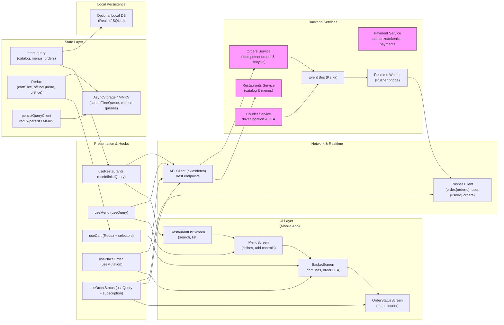

# Image 18 — Mini Food Delivery (Restaurant List, Menu, Basket & Order Status)


## 1) Requirements

- Functional
    - Search & list restaurants (name, image, rating, brief meta).
    - Restaurant detail / menu with dish list: name, description, price, thumbnail, add-to-basket (+) and quantity preview.
    - Basket management: increment/decrement quantity, remove item, show line totals and order total, apply promo code (optional), view estimated delivery fee & ETA.
    - Place order: submit cart, select payment method, confirm delivery address and tip.
    - Order status: real-time courier location, order status updates (accepted, preparing, out-for-delivery, delivered), simple delivery ETA, and ability to cancel before a cutoff.
    - Offline behavior: show cached restaurant list/menu, allow cart modifications offline (persist locally until checkout).
    - Security: authenticated user flows, safe handling of payment tokens (never persist card PAN).
- Non-functional
    - Low-latency UI: cached lists, prefetch menus, optimistic updates for basket actions.
    - Real-time updates: courier location & order status via a realtime pub/sub (Pusher/WebSocket).
    - Scale read-heavy restaurant/menu data with CDNs and caching; handle spikes in order placements.
    - Audit & observability: track order lifecycle events and failures.

---

## 2) Caching, offline & sync strategy (react-query + redux + pusher)

- Client caching strategy
    - Restaurant list: use react-query useQuery with a moderate staleTime (1–5min) and persistent cache (persistQueryClient) for offline browsing.
    - Menus: prefetch menu when user focuses or taps a restaurant; cache per restaurant id: ['menu', restaurantId].
    - Basket: store in Redux cartSlice and persist locally (MMKV/AsyncStorage) to survive app restarts and offline edits.
- Optimistic & offline edits
    - Add/remove item: optimistic update of cart UI (Redux), and persist offline if network unavailable.
    - Checkout: require online connectivity to place order; if user attempts while offline, keep the cart and prompt to retry when online (do not auto-charge offline).
- Sync & reconciliation
    - On connectivity regained: replay any queued non-checkout actions (e.g., server-side cart sync if you mirror cart server-side), then refetch orders and menus.
    - For checkout: client calls server with idempotencyKey so retries are safe.
- Real-time updates
    - Subscribe to user.{userId}.orders and order.{orderId}.status channels to receive order and courier updates via Pusher.
    - Patch react-query caches (order and courier data) on events to avoid refetching.
- Prefetching
    - Prefetch menu and restaurant detail for top results for faster tap-to-view.
    - Prefetch payment tokens (if using tokenized gateways) after checkout intent begins to reduce latency.

---

## 3) Data models (shared types)

```ts
// Restaurant listing
interface Restaurant {
  id: string;
  name: string;
  imageUrl?: string;
  rating?: number;
  deliveryTimeMin?: number;
  deliveryFeeCents?: number;
  categories?: string[];
  location?: { lat: number; lng: number; address?: string };
}

// Dish / Menu item
interface Dish {
  id: string;
  restaurantId: string;
  name: string;
  description?: string;
  priceCents: number;
  imageUrl?: string;
  available?: boolean;
  options?: Array<{ id: string; name: string; choices?: string[]; extraPriceCents?: number }>;
}

// Cart item
interface CartItem {
  clientLineId?: string; // client-side id for optimistic/ offline
  dishId: string;
  restaurantId: string;
  name: string;
  qty: number;
  unitPriceCents: number;
  options?: any;
  lineTotalCents?: number;
}

// Order & status
interface Order {
  id: string;
  userId: string;
  restaurantId: string;
  items: CartItem[];
  subtotalCents: number;
  deliveryFeeCents: number;
  tipCents?: number;
  totalCents: number;
  status: 'created'|'accepted'|'preparing'|'out_for_delivery'|'delivered'|'cancelled';
  courier?: { id: string; name?: string; location?: { lat:number; lng:number } };
  etaMinutes?: number;
  createdAt: string;
}
```

---

## 4) REST endpoints (mapping from the UI)

- GET /restaurants?query=&lat=&lng=&limit=&cursor=
    - list restaurants, optionally pre-filtered by location & categories; returns summary data
- GET /restaurants/{id}
    - restaurant detail (menus metadata)
- GET /restaurants/{id}/menu
    - returns Dish[] for restaurant (availability, prices)
- POST /cart (server-side cart optional)
    - body: { clientId?, items: CartItem[], restaurantId }
    - response: cart id or canonical server-side cart
- POST /orders
    - body: { idempotencyKey, cartId or items, paymentToken, addressId, tipCents }
    - returns: Order { id, status }
- GET /orders/{orderId}
    - order detail and current courier status
- GET /users/{userId}/orders?limit=&cursor=
    - order history
- POST /analytics/event
    - track events: add-to-cart, checkout-start, order-placed
- WebSocket / Realtime
    - Pusher channels:
        - order.{orderId} -> events: status.updated, courier.location.updated
        - user.{userId}.orders -> events: order.created, order.updated
- Optional: POST /cart/validate
    - checks item availability & price before checkout; returns adjusted cart and warnings

---

## 5) High‑level architecture (narrative)

- UI Layer (first)
    - RestaurantListScreen: search/address header, virtualized list with restaurant rows.
    - MenuScreen: restaurant header, virtualized menu list, dish rows with add [+] control and "Basket" CTA.
    - BasketScreen: cart lines, qty controls, subtotal & total, payment summary, "Order" CTA.
    - OrderStatusScreen: order status header, map view with courier/user pins, status timeline/messages.
- Presentation & Hooks
    - useRestaurants (useInfiniteQuery) — search & pagination
    - useMenu (useQuery per restaurantId) — fetch menu
    - useCart (Redux) — local cart management (persisted)
    - usePlaceOrder (useMutation) — POST /orders with idempotency
    - useOrderStatus (useQuery + pusher subscription) — fetch order and subscribe to updates
    - OrderCoordinator — orchestrates order placement flow, retry, idempotency, and realtime subscription lifecycle
- Network & Realtime
    - ApiClient (axios/fetch) for REST operations
    - Pusher/WebSocket client for live order & courier updates
- State Layer
    - react-query: restaurants, menu, order caches
    - redux: cartSlice (persisted), uiSlice (modals, lastSearch), offlineSlice (queued actions)
- Local Persistence
    - MMKV / AsyncStorage for cart and offlineQueue; optionally local DB for richer history caching
- Backend Services
    - Restaurants Service (catalog & menu)
    - Orders Service (creates orders, idempotency, lifecycle)
    - Courier Service (tracks drivers, sends location updates)
    - Payments Service (tokenized payments)
    - Realtime Worker (Pusher bridge)
    - Event Bus (Kafka) for order events and analytics

---

## 6) React‑Query, Redux & Pusher integration (implementation notes)

- React Query
    - useInfiniteQuery for restaurants: key ['restaurants', query, location, filters]
    - useQuery for menu: key ['menu', restaurantId]; prefetch on list tap
    - useQuery for order detail: key ['order', orderId] and keepPreviousData while subscribing to pusher
    - Mutations: usePlaceOrder with onMutate optimistic UI pattern limited to non-financial steps (e.g., show "placing order" spinner). Final confirmation happens after server response.
- Redux
    - cartSlice: addItem, removeItem, increment, decrement; persisted. Cart local-first, then optionally mirror to server-side cart endpoint.
    - offlineSlice: actions queued when user tries to checkout while offline (don't auto-create orders offline), or queued cart sync actions if you mirror cart server-side.
    - uiSlice: lastViewedRestaurantId, paymentModalOpen, and ephemeral UI state.
- Pusher
    - Subscribe to order.{orderId} channel after order is placed or when viewing order status.
    - Bind to events:
        - status.updated -> update react-query order cache (queryClient.setQueryData)
        - courier.location.updated -> update courier location shown on map
    - Ensure idempotency / dedupe: server events include sequence number or timestamp to guard out-of-order updates.

---

## 7) Mermaid diagram (UI Layer first, presentation & hooks, Network & realtime, state layer, local persistence, Backend services)

Paste into a Mermaid renderer:



---

## 8) Example code snippets

Below are compact, practical snippets for React Native + TypeScript using react-query, Redux and Pusher. These are skeletal and must be adapted to your authentication and app wiring.

### src/api/restaurantsApi.ts
```ts
import axios from 'axios';
const api = axios.create({ baseURL: 'https://api.example.com', timeout: 10000 });

export async function fetchRestaurants({ query, lat, lng, cursor, limit = 20 }: any) {
  const { data } = await api.get('/restaurants', { params: { query, lat, lng, cursor, limit }});
  return data; // { items: Restaurant[], nextCursor }
}

export async function fetchMenu(restaurantId: string) {
  const { data } = await api.get(`/restaurants/${restaurantId}/menu`);
  return data; // Dish[]
}

export async function placeOrder(payload: any) {
  const { data } = await api.post('/orders', payload);
  return data; // Order
}

export default api;
```

### src/hooks/useRestaurants.ts
```ts
import { useInfiniteQuery } from '@tanstack/react-query';
import { fetchRestaurants } from '../api/restaurantsApi';

export function useRestaurants(params = {}) {
  return useInfiniteQuery(
    ['restaurants', params],
    ({ pageParam }) => fetchRestaurants({ ...params, cursor: pageParam }),
    { getNextPageParam: last => last.nextCursor, staleTime: 60 * 1000 }
  );
}
```

### src/store/cartSlice.ts (sketch)
```ts
import { createSlice } from '@reduxjs/toolkit';

const initialState = {
  items: [], // CartItem[]
  restaurantId: null,
};

const slice = createSlice({
  name: 'cart',
  initialState,
  reducers: {
    addItem(state, action) {
      const { dish, qty = 1 } = action.payload;
      if (!state.restaurantId) state.restaurantId = dish.restaurantId;
      // ensure same restaurant
      if (state.restaurantId !== dish.restaurantId) {
        // replace or alert; for simplicity replace cart
        state.items = [];
        state.restaurantId = dish.restaurantId;
      }
      const existing = state.items.find(i => i.dishId === dish.id);
      if (existing) existing.qty += qty;
      else state.items.push({ dishId: dish.id, name: dish.name, qty, unitPriceCents: dish.priceCents, restaurantId: dish.restaurantId });
    },
    increment(state, action) { /* ... */ },
    decrement(state, action) { /* ... */ },
    removeItem(state, action) { /* ... */ },
    clearCart(state) { state.items = []; state.restaurantId = null; }
  }
});

export const { addItem, increment, decrement, removeItem, clearCart } = slice.actions;
export default slice.reducer;
```

### src/hooks/usePlaceOrder.ts
```ts
import { useMutation, useQueryClient } from '@tanstack/react-query';
import { placeOrder } from '../api/restaurantsApi';
import { v4 as uuidv4 } from 'uuid';

export function usePlaceOrder() {
  const qc = useQueryClient();
  return useMutation((orderPayload: any) => placeOrder({ idempotencyKey: uuidv4(), ...orderPayload }), {
    onMutate: async () => {
      // show placing spinner, maybe disable UI
    },
    onSuccess: (order) => {
      qc.invalidateQueries(['orders']);
      // navigate to OrderStatusScreen(order.id)
    },
    onError: (err) => {
      // surface error and retry options
    }
  });
}
```

### src/services/pusher.ts
```ts
import Pusher from 'pusher-js/react-native';
import { queryClient } from '../reactQueryClient';

let pusher = null;
export function initPusher(key) {
  if (pusher) return pusher;
  pusher = new Pusher(key, { cluster: 'mt1', forceTLS: true });
  return pusher;
}

export function subscribeOrder(orderId, userId) {
  if (!pusher) throw new Error('Pusher not initialized');
  const ch = pusher.subscribe(`order.${orderId}`);
  ch.bind('status.updated', (payload) => {
    queryClient.setQueryData(['order', orderId], (old) => ({ ...(old||{}), ...payload }));
  });
  ch.bind('courier.location.updated', (payload) => {
    queryClient.setQueryData(['order', orderId], (old) => ({ ...(old||{}), courier: payload }));
  });
  return () => pusher.unsubscribe(`order.${orderId}`);
}
```

---

## 9) UX & accessibility notes

- Address and location
    - Prompt for address permissions clearly; allow quick edit of address if geolocation mismatches.
- Cart rules
    - Disallow mixing restaurants in the same cart or surface explicit replace modal.
- Map & status
    - Show accessible textual updates in addition to the map (e.g., "Courier is 6 min away").
    - Provide an audible/haptic alert on major status changes (out-for-delivery, arrived).
- Accessibility
    - Large tap targets for add/remove, proper labels for dish names/prices and screen reader-friendly order status announcements.

---

## 10) Offline replay & conflict handling

- Offline cart edits
    - Persist cart locally; on reconnect optionally sync to server cart endpoint (with idempotency).
- Checkout while offline
    - Do not place server-side orders while offline; instead keep order in pending state and prompt for connectivity to finalize payment.
- Conflict scenarios
    - Price change or item sold out: validate cart with POST /cart/validate before finalization and present adjustment UI with accept/replace/cancel options.

---

## 11) Performance & ops notes

- Caching & CDNs
    - Serve restaurant images & dish thumbnails through CDN; cache menu JSON where possible.
- Rate limiting & safety
    - Rate-limit order placement endpoints; use idempotency keys and transaction logs to prevent double charges.
- Monitoring & analytics
    - Track conversion funnel: view menu → add to cart → start checkout → order placed → delivered. Monitor failure rates at each step.

---

## 12) Sequence flows (brief)

- Browse & add:
    - useRestaurants loads results; user taps a restaurant → prefetch menu → user taps [+] on dish → cartSlice.addItem updates local cart (persisted).
- Place order:
    - User opens BasketScreen → checkout → usePlaceOrder sends POST /orders with idempotencyKey → server returns orderId → app subscribes to order.{orderId} and navigates to OrderStatusScreen.
- Real-time tracking:
    - Courier updates published to order.{orderId} channel → Pusher delivers events → client updates courier pin and ETA on map and status timeline.

