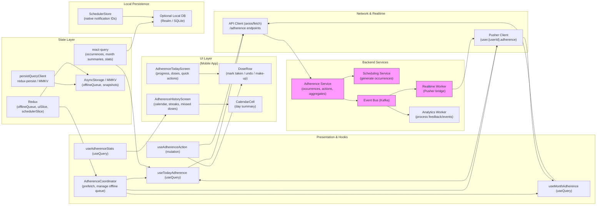

# Adherence — Today & History (Design + Implementation Blueprint)


## 1) Requirements

- Functional
    - Show today's scheduled doses with times, product name, dose details, and quick actions (mark taken / undo / make up).
    - "Mark all" action to mark all scheduled doses for today as taken (with confirmation / undo).
    - Display today's progress (count/total) and a 30-day adherence chart.
    - Provide a calendar view (monthly) showing taken vs missed days; allow tapping a day to see occurrences.
    - Show streaks & stats (current streak, best streak, 30-day average).
    - Allow adding notes to missed doses and marking missed doses as made-up (backfilled).
    - Persist adherence history server-side and locally; support offline recording and replay.
    - Allow user to filter history and export or view adherence trends.
- Non-functional
    - Immediate UI responsiveness with optimistic updates.
    - Strong offline support: local persistence & replay; conflict resolution on sync.
    - Secure data handling (PHI-like adherence data) — encrypt sensitive data in transit and at rest.
    - Observability: metrics on marking rates, sync successes/failures, conflict rates.
    - Scalable read patterns for historical views (month aggregation) and event logging for analytics.

---

## 2) Caching, offline & sync strategy (react-query + redux + pusher)

- Local-first, server-authoritative sync
    - Persist local actions (markTaken, markMissed, addNote) immediately to a durable offline queue (redux offlineQueue persisted with MMKV / AsyncStorage).
    - Use react-query for fetching authoritative lists and history:
        - useQuery(['adherence', 'today', userId]) for today's schedule & status.
        - useQuery(['adherence', 'month', userId, yearMonth]) for monthly calendar aggregates.
    - Optimistic updates:
        - onMutate: update react-query cache to reflect immediate change (e.g., mark dose as taken).
        - write to offlineQueue if network unavailable or mutation fails; replay on reconnect.
    - Sync & reconciliation:
        - On reconnect, replay offlineQueue operations (FIFO). Use idempotency keys (client-generated) to avoid duplicate records.
        - After replay, invalidate react-query keys to fetch canonical server state.
    - Cache TTL and prefetch:
        - Cache month and day queries with short staleTime (30–60s) for freshness but persist cache to allow instant resume and offline views.
        - Prefetch adjacent month/day when user navigates calendar to make view snappy.
- Real-time updates:
    - Use Pusher (or WebSocket) to subscribe to user.{userId}.adherence for cross-device updates or provider-driven updates (if server-side edits occur).
    - On events, patch react-query cache to keep UI consistent across devices.

---

## 3) Data models (shared types)

```ts
// A scheduled dose occurrence (UI & server)
interface DoseOccurrence {
  id: string;               // server or client id
  userId: string;
  scheduleId?: string;      // optional schedule rule reference
  productId?: string;
  productName?: string;
  timeLocal: string;        // ISO timestamp for scheduled time in user's local tz
  windowStart?: string;     // ISO (optional)
  windowEnd?: string;       // ISO (optional)
  status: 'scheduled'|'taken'|'missed'|'made_up'|'skipped';
  takenAt?: string;         // ISO when the user marked taken
  note?: string;
  createdAt?: string;
  updatedAt?: string;
}

// Aggregated adherence by day (for calendar)
interface DayAdherenceSummary {
  date: string; // YYYY-MM-DD
  scheduledCount: number;
  takenCount: number;
  missedCount: number;
  adherencePct?: number; // e.g., 0..100
}

// Streak & stats
interface AdherenceStats {
  currentStreakDays: number;
  bestStreakDays: number;
  avg30DaysPct: number;
  lastSyncAt?: string;
}

// Offline queue entry for resumable actions
interface OfflineAction {
  id: string; // client-generated idempotency key
  type: 'markTaken'|'markMissed'|'addNote'|'makeUp'|'bulkMarkAll';
  payload: any;
  timestamp: string;
  retries?: number;
}
```

---

## 4) REST endpoints (mapping from the UI)

- GET /users/{userId}/adherence/today
    - returns today's DoseOccurrence[] and DayAdherenceSummary for today
- GET /users/{userId}/adherence/month?year=2025&month=11
    - returns DayAdherenceSummary[] for month (aggregated counts)
- GET /users/{userId}/adherence/occurrence/{occurrenceId}
    - get single occurrence details and notes
- POST /users/{userId}/adherence/actions
    - body: { idempotencyKey, actionType, payload } e.g., {actionType: 'markTaken', payload:{occurrenceId, takenAt}}
    - server applies action idempotently and returns updated occurrence
- POST /users/{userId}/adherence/bulk
    - for bulk operations like Mark All (accepts list of occurrenceIds or criteria)
- GET /users/{userId}/adherence/stats?start=&end=
    - returns AdherenceStats and histogram data
- POST /feedback/adherence-event
    - logs analytics events (tap, mark, undo, make-up)
- Realtime
    - Pusher channel: user.{userId}.adherence with events:
        - occurrence.updated -> payload: { occurrenceId, updates }
        - adherence.summary_updated -> payload: { date, summary }

---

## 5) High‑level architecture (narrative)

- UI Layer (Mobile App)
    - AdherenceTodayScreen — shows today's progress, dose list with quick take/make-up/undo, quick actions and small adherence chart.
    - AdherenceHistoryScreen — month calendar heatmap, day drill-down, streak & stats, missed doses list.
    - Small UI widgets: DoseRow, ProgressBar, CalendarCell, MissedDoseRow, QuickActionBar.

- Presentation & Hooks
    - useTodayAdherence (useQuery) — fetch today's doses and summary.
    - useMonthAdherence (useQuery) — fetch monthly aggregates.
    - useAdherenceAction (useMutation) — mark taken/missed/makeUp with optimistic updates.
    - useAdherenceStats (useQuery) — fetch streak & stats.
    - AdherenceCoordinator: orchestrates local persistence, offlineQueue replay, pusher subscriptions, prefetching and conflict UI.

- Network & Realtime
    - ApiClient (axios/fetch) calling adherence endpoints.
    - Pusher/WebSocket client for user.{userId}.adherence updates.
    - Analytics collector for events.

- State Layer
    - react-query: primary server-synced data (occurrences, month summaries, stats).
    - redux: offlineQueue, UI transient state (selectedDay, confirmation modals), sync metadata, permission flags.
    - Persistors: persistQueryClient + redux-persist to MMKV / AsyncStorage for fast resume.

- Local Persistence
    - AsyncStorage / MMKV: offlineQueue, last sync snapshot, UI preferences.
    - Optional local DB (Realm/SQLite) for advanced offline queries and large datasets.
    - Native notification scheduler mapping (if app triggers reminders or local alarms).

- Backend Services
    - Adherence Service: stores occurrences, applies actions idempotently, computes aggregates & stats.
    - Scheduling Service: computes future occurrences from user's regimen.
    - Event Bus (Kafka): emit occurrence.updated and summary events for realtime and analytics.
    - Realtime Worker: pushes events to Pusher.
    - Analytics Worker: processes adherence events for product improvements.

---

## 6) React‑Query, Redux & Pusher integration (implementation)

- React Query responsibilities
    - Queries:
        - useQuery(['adherence', 'today', userId]) -> today's list and summary
        - useQuery(['adherence', 'month', userId, '2025-11']) -> month aggregates
        - useQuery(['adherence', 'occurrence', occurrenceId]) -> single occurrence details
    - Mutations:
        - useMutation for actions -> onMutate optimistic update, onError rollback, onSettled invalidate queries.
    - Prefetch adjacent months/days with queryClient.prefetchQuery for smooth nav.

- Redux responsibilities
    - offlineSlice: queue of OfflineAction objects persisted to MMKV/AsyncStorage.
    - uiSlice: selectedDay, confirmation modals, lastUndo (to allow immediate undo).
    - schedulerSlice (optional): mapping of scheduled local notifications if the app triggers reminders.

- Pusher responsibilities
    - Subscribe to user.{userId}.adherence channel upon login or when Adherence screens active.
    - On occurrence.updated:
        - Use queryClient.setQueryData to patch occurrence in cache and update day summary.
    - On adherence.summary_updated:
        - Patch month cache or re-fetch affected day(s).
    - Use these events to show in-app banners for cross-device updates (e.g., provider or another app marked a dose).

- Offline queue recycling
    - Background task (on connectivity regained) processes offlineQueue items:
        - Call POST /adherence/actions with idempotencyKey.
        - On success remove action; on permanent failure, surface conflict UI to user.

---

## 7) Mermaid diagram (UI Layer first, presentation & hooks, Network & realtime, state layer, local persistence, Backend services)

Paste the block below into a Mermaid renderer to visualize the architecture.



---

## 8) Example code snippets

Below are focused snippets for React Native + TypeScript using react-query, redux, and Pusher. Adapt to your app structure.

### src/api/adherenceApi.ts
```ts
import axios from 'axios';
const api = axios.create({ baseURL: 'https://api.example.com', timeout: 10000 });

// Get today's scheduled occurrences and summary
export async function fetchTodayAdherence(userId: string) {
  const { data } = await api.get(`/users/${userId}/adherence/today`);
  return data; // { occurrences: DoseOccurrence[], summary: DayAdherenceSummary }
}

export async function fetchMonthAdherence(userId: string, year: number, month: number) {
  const { data } = await api.get(`/users/${userId}/adherence/month`, { params: { year, month }});
  return data; // DayAdherenceSummary[]
}

// Post an idempotent action
export async function postAdherenceAction(userId: string, body: any) {
  const { data } = await api.post(`/users/${userId}/adherence/actions`, body);
  return data; // updated occurrence
}
```

### src/hooks/useTodayAdherence.ts
```ts
import { useQuery } from '@tanstack/react-query';
import { fetchTodayAdherence } from '../api/adherenceApi';

export function useTodayAdherence(userId: string) {
  return useQuery(['adherence', 'today', userId], () => fetchTodayAdherence(userId), {
    staleTime: 30 * 1000,
    cacheTime: 5 * 60 * 1000,
    refetchOnReconnect: true,
  });
}
```

### src/hooks/useAdherenceAction.ts
```ts
import { useMutation, useQueryClient } from '@tanstack/react-query';
import { postAdherenceAction } from '../api/adherenceApi';
import { v4 as uuidv4 } from 'uuid';
import { store } from '../store';

export function useAdherenceAction(userId: string) {
  const qc = useQueryClient();

  return useMutation((payload: any) => {
    // payload: { actionType, occurrenceId, takenAt?, note?, idempotencyKey? }
    const body = { idempotencyKey: payload.idempotencyKey || uuidv4(), actionType: payload.actionType, payload: payload.payload };
    return postAdherenceAction(userId, body);
  }, {
    onMutate: async (payload) => {
      await qc.cancelQueries(['adherence', 'today', userId]);
      const previous = qc.getQueryData(['adherence', 'today', userId]);

      // optimistic update: mark the occurrence in cache
      qc.setQueryData(['adherence', 'today', userId], (old: any) => {
        if (!old) return old;
        const occurrences = old.occurrences.map((o: any) => o.id === payload.payload.occurrenceId
          ? { ...o, status: payload.actionType === 'markTaken' ? 'taken' : (payload.actionType === 'markMissed' ? 'missed' : o.status), takenAt: payload.payload.takenAt || o.takenAt }
          : o);
        return { ...old, occurrences };
      });

      // persist to offline queue if offline
      if (typeof navigator !== 'undefined' && !navigator.onLine) {
        store.dispatch({ type: 'offline/enqueue', payload: { id: body.idempotencyKey, type: payload.actionType, payload: payload.payload, timestamp: Date.now() }});
      }

      return { previous };
    },
    onError: (err, variables, context: any) => {
      // rollback
      qc.setQueryData(['adherence', 'today', userId], context.previous);
    },
    onSettled: () => {
      qc.invalidateQueries(['adherence', 'today', userId]);
      qc.invalidateQueries(['adherence', 'month', userId]);
      qc.invalidateQueries(['adherence', 'stats', userId]);
    }
  });
}
```

### src/store/offlineSlice.ts (sketch)
```ts
import { createSlice } from '@reduxjs/toolkit';

const initialState = {
  queue: [], // OfflineAction[]
  lastSyncAt: null,
};

const slice = createSlice({
  name: 'offline',
  initialState,
  reducers: {
    enqueue(state, action) {
      state.queue.push(action.payload);
    },
    dequeue(state) {
      state.queue.shift();
    },
    setLastSyncAt(state, action) {
      state.lastSyncAt = action.payload;
    },
    clearQueue(state) {
      state.queue = [];
    }
  }
});

export const { enqueue, dequeue, setLastSyncAt, clearQueue } = slice.actions;
export default slice.reducer;
```

### src/services/pusher.ts
```ts
import Pusher from 'pusher-js/react-native';
import { queryClient } from '../reactQueryClient';

let pusher: Pusher | null = null;

export function initPusher(key: string, cluster = 'mt1') {
  if (pusher) return pusher;
  pusher = new Pusher(key, { cluster, forceTLS: true });
  pusher.connection.bind('connected', () => console.log('Pusher connected'));
  pusher.connection.bind('error', (err: any) => console.warn('Pusher error', err));
  return pusher;
}

export function subscribeAdherence(userId: string) {
  if (!pusher) throw new Error('Pusher not initialized');
  const channel = pusher.subscribe(`user.${userId}.adherence`);

  channel.bind('occurrence.updated', (payload: any) => {
    // payload: { occurrenceId, updates }
    // Patch today's cache if present
    queryClient.setQueryData(['adherence', 'today', payload.userId], (old: any) => {
      if (!old) return old;
      const occurrences = old.occurrences.map((o: any) => o.id === payload.occurrenceId ? { ...o, ...payload.updates } : o);
      return { ...old, occurrences };
    });

    // Patch month summary if provided
    if (payload.daySummary) {
      const key = ['adherence', 'month', payload.userId, payload.daySummary.month];
      queryClient.setQueryData(key, (old: any) => {
        if (!old) return old;
        const days = old.map((d: any) => d.date === payload.daySummary.date ? { ...d, ...payload.daySummary } : d);
        return days;
      });
    }
  });

  channel.bind('adherence.summary_updated', (payload: any) => {
    // invalidates or patch month/day summaries
    queryClient.invalidateQueries(['adherence', 'month', payload.userId]);
  });

  return () => pusher.unsubscribe(`user.${userId}.adherence`);
}
```

---

## 9) UX & accessibility notes

- Immediate feedback & undo
    - After marking a dose as taken show a transient "Undo" action (snackbar) allowing quick reversal.
    - For "Mark all", show confirmation and short undo window.

- Visual clarity
    - Use color + text for calendar states: ✓ taken (blue), missed (gray or outlined), partial (striped).
    - Provide accessible labels for calendar cells and dose rows, announcing counts and states to screen readers.

- Accessibility
    - Dose rows should be large enough for touch targets and have explicit aria/label attributes.
    - Provide keyboard navigation and VoiceOver/ TalkBack semantics for marking and undo.

- Edge cases
    - Timezones: clearly display scheduled time in user's local timezone and record takenAt with timezone-aware ISO.
    - Made-up doses: prompt user to enter a reason when backfilling and record as metadata.

---

## 10) Offline replay & conflict handling

- Replay strategy
    - On reconnect, background worker reads offlineQueue and POSTs /adherence/actions with idempotency keys.
    - For server rejections due to conflicts (e.g., occurrence was already changed), receive conflict payload and surface UI:
        - Show conflict modal with server state vs local intent; let user choose "Accept server", "Overwrite", or "Merge with note".
    - If retries consistently fail, surface error and stop replaying until manual resolve.

- Deduplication & idempotency
    - Include client-generated idempotencyKey for each queued action so server can recognize duplicates.
    - Backoff on transient errors and persist retry state.

---

## 11) Performance & ops notes

- Backend optimizations
    - Precompute monthly aggregates for popular users or cache month pages in Redis for quick calendar renders.
    - Use append-only event logs for adherence actions; derive aggregates asynchronously.
    - Rate-limit client replay attempts to protect API during mass reconnect.

- Metrics & monitoring
    - Track sync success rate, offlineQueue length, average replay time, user undo rates, and missed-dose corrections.
    - Monitor Pusher event volumes and client-side patch rates to tune throttling.

- Data retention & compliance
    - Adherence history may be sensitive — apply retention policies and allow user export/deletion.
    - Ensure encryption at rest and in transit; audit logging for writes.

---

## 12) Sequence flows (brief)

- Mark taken (single occurrence)
    - UI: user taps check -> useAdherenceAction.onMutate optimistic update -> store offline action if offline -> API POST /adherence/actions with idempotencyKey -> on success update cache with canonical occurrence -> analytics event logged; on error rollback or enqueue for retry.

- Mark all (bulk)
    - UI: user taps "Mark all" -> show confirm -> create bulk offline action with list of occurrenceIds -> optimistic set all local statuses to taken -> call POST /adherence/bulk -> on success reconcile; on partial failure show conflict resolution for affected items.

- Backfill / make-up dose
    - User selects missed occurrence -> choose "Mark as made up" -> create action with timestamp and optional note -> schedule replay if offline -> server updates occurrence.status='made_up' and logs note.

- Cross-device update
    - Device A marks occurrence -> server persists and emits occurrence.updated on user.{userId}.adherence -> Device B receives event -> pusher handler patches react-query cache to show updated state.

---

