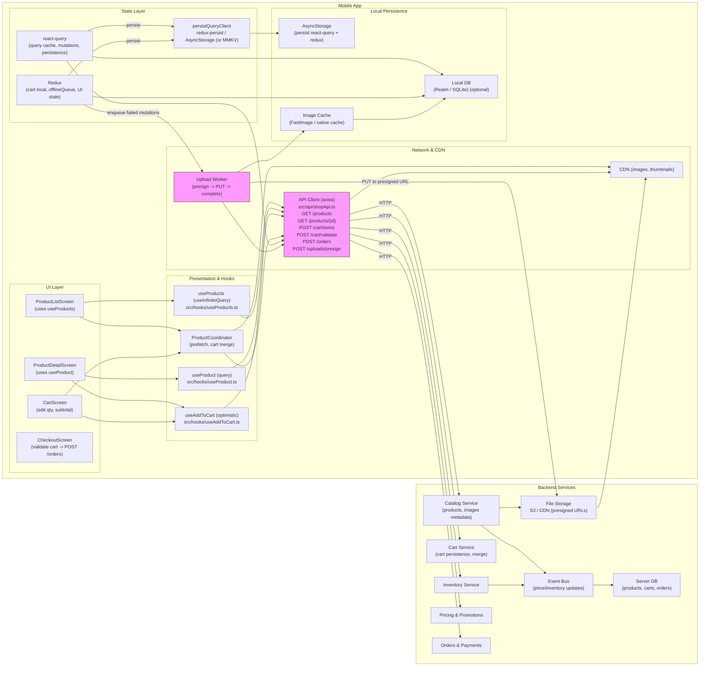

# Image 4 — Product Catalog -> Cart (Mobile Shopping Flow)


---

## 1) Requirements

- Functional
  - Browse product catalog: list, basic filtering/sorting, thumbnails and price.
  - View product details (tap item from catalog).
  - Add item to cart; change quantity or remove from cart.
  - Persist cart across sessions and devices (optional).
  - Show cart subtotal and simple checkout entry point.
  - Wishlist/star items for later.
  - Minimal offline support: keep local cart available when offline.
- Non-functional
  - Low-latency catalog browsing with paginated/infinite scrolling.
  - Efficient image delivery via CDN, thumbnails in list view.
  - Resilient to network errors; queue cart changes when offline.
  - Secure checkout path (PCI-compliant handling of payment).
  - Scales read-heavy (catalog) loads and moderate write loads (cart/checkout).

---

## 2) Caching, offline & sync strategy

- Catalog:
  - Cache product pages and thumbnails aggressively with short TTL for metadata (price/availability may change).
  - Prefetch next page(s) as user scrolls.
  - Use HTTP cache headers + CDN for images.
- Cart (client-side):
  - Persist cart locally (AsyncStorage / MMKV / local DB) for immediate access and offline continuity.
  - Use optimistic UI for add/remove/quantity changes: update local cart immediately, then call server.
  - Maintain an offlineQueue for cart mutations when offline; replay when back online.
  - Reconcile conflicts on replay: prefer server-side availability/price checks, surface warnings to user if price changed or item out-of-stock.
- Sync:
  - On app start or on login, merge server cart (if any) with local cart using deterministic merge rules (e.g., sum quantities for same product; prefer server prices).
  - Validate cart before checkout with a final server-side check (price & inventory) to avoid surprise failures.

---

## 3) Data models (shared types)

```ts
// Product in catalog
interface Product {
  id: string;
  sku?: string;
  title: string;
  description?: string;
  price: number;          // cents or decimal
  currency: string;
  thumbnailUrl?: string;
  imageUrls?: string[];
  availableQuantity?: number; // inventory snapshot
  attributes?: Record<string, any>; // size, color, etc.
}

// Cart item
interface CartItem {
  lineId: string;      // client or server id for the line
  productId: string;
  sku?: string;
  title?: string;      // snapshot for quick display
  unitPrice: number;
  quantity: number;
  imageUrl?: string;
  metadata?: any;      // options selected (size, color)
  status?: 'ok'|'reserved'|'out_of_stock'|'price_changed';
}

// Cart
interface Cart {
  id?: string;              // server cart id (if logged-in)
  items: CartItem[];
  subtotal: number;
  currency: string;
  updatedAt?: string;
  pendingMutations?: any[]; // persisted offline queue
}

// Order (simplified)
interface Order {
  id: string;
  cartId: string;
  total: number;
  currency: string;
  status: 'created'|'paid'|'failed';
  createdAt: string;
}
```

---

## 4) REST endpoints (mapping from the UI)

- GET /products?limit=20&cursor=...
  - returns paginated product list (id, title, price, thumbnailUrl, availability hint)
- GET /products/{productId}
  - returns full product detail (images, description, attributes, inventory hint)
- POST /cart (or PATCH)
  - creates or updates a server cart for the user/session
- GET /cart/{cartId} or GET /cart (for logged-in user)
  - fetch current cart
- POST /cart/{cartId}/items
  - body: { productId, sku?, quantity, metadata? } — adds item (or increases quantity)
- PATCH /cart/{cartId}/items/{lineId}
  - update quantity or metadata
- DELETE /cart/{cartId}/items/{lineId}
  - remove item
- POST /cart/{cartId}/validate
  - validate prices & inventory before checkout
- POST /orders
  - create order from validated cart (initiates payment flow)
- Webhook or push:
  - inventory or price change notifications (optional) to update cache

---

## 4) High‑level architecture (narrative)

- Client:
  - ProductList screen (virtualized list with thumbnail + add/wishlist actions).
  - ProductDetail screen (full images, attributes, add to cart).
  - Cart screen (list of cart lines, quantity controls, subtotal, Checkout).
  - Local persistence for cart and offline mutations.
- Backend:
  - Catalog Service: serves product metadata & thumbnails; integrates with CDN.
  - Cart Service: session/cart persistence, reserved quantities (optional), merging logic for logged-in users.
  - Inventory Service: authoritative inventory; responds to validation calls.
  - Pricing Service: authoritative prices, promotions, discounts.
  - Order & Payments: checkout orchestration and payment gateway integration.
  - CDN for media and image resizing for thumbnails.
- Data & integration:
  - Event bus (Kafka or pub/sub) to keep caches updated (e.g., price/inventory changes).
  - Cache tier (Redis / edge cache) for hot product lists and promotions.

---

## 5) Mermaid diagram (high level design)

Paste into a mermaid renderer to visualize the architecture.



---

## 6) Example code snippets

Abridged examples showing API client, a product hook, and optimistic add-to-cart mutation.

### src/api/shopApi.ts
```ts
import axios from 'axios';
const api = axios.create({ baseURL: 'https://api.example.com', timeout: 10000 });

export function fetchProducts({ limit = 20, cursor }: { limit?: number; cursor?: string }) {
  return api.get('/products', { params: { limit, cursor } }).then(r => r.data);
}

export function fetchProduct(productId: string) {
  return api.get(`/products/${productId}`).then(r => r.data);
}

export function addCartItem(cartId: string | null, payload: any) {
  // if cartId null, server creates a cart for session
  return api.post('/cart/items', { cartId, ...payload }).then(r => r.data);
}

export function updateCartItem(lineId: string, payload: any) {
  return api.patch(`/cart/items/${lineId}`, payload).then(r => r.data);
}

export function getCart(cartId?: string) {
  return api.get('/cart', { params: { cartId } }).then(r => r.data);
}
```

### src/hooks/useProducts.ts (react-query)
```ts
import { useInfiniteQuery } from '@tanstack/react-query';
import { fetchProducts } from '../api/shopApi';

export function useProducts() {
  return useInfiniteQuery(
    ['products'],
    ({ pageParam }) => fetchProducts({ limit: 20, cursor: pageParam }),
    { getNextPageParam: last => last.nextCursor, staleTime: 60 * 1000 }
  );
}
```

### src/hooks/useAddToCart.ts (optimistic)
```ts
import { useMutation, useQueryClient } from '@tanstack/react-query';
import { addCartItem } from '../api/shopApi';
import { v4 as uuidv4 } from 'uuid';

export function useAddToCart() {
  const qc = useQueryClient();

  return useMutation(({ product, qty = 1 }: any) => addCartItem(null, { productId: product.id, quantity: qty }), {
    onMutate: async ({ product, qty }) => {
      await qc.cancelQueries(['cart']);
      const previous = qc.getQueryData(['cart']);
      const optimisticLine = {
        lineId: `local-${uuidv4()}`,
        productId: product.id,
        title: product.title,
        unitPrice: product.price,
        quantity: qty,
        imageUrl: product.thumbnailUrl,
      };
      qc.setQueryData(['cart'], (old: any) => {
        const items = old?.items ? [...old.items, optimisticLine] : [optimisticLine];
        return { ...(old || {}), items, subtotal: (old?.subtotal || 0) + product.price * qty };
      });
      // persist to local store or offline queue here
      return { previous, optimisticLine };
    },
    onError: (err, variables, context: any) => {
      qc.setQueryData(['cart'], context.previous);
      // optionally enqueue offline mutation if offline
    },
    onSuccess: (data, variables, context) => {
      // replace optimistic line with server-provided line and cart id
      qc.setQueryData(['cart'], (old: any) => {
        const items = (old.items || []).map((it: any) => it.lineId === context.optimisticLine.lineId ? data.line : it);
        return { ...old, id: data.cartId || old.id, items, subtotal: data.subtotal };
      });
    },
    onSettled: () => qc.invalidateQueries(['cart']),
  });
}
```

---

## 7) UX considerations & mobile specifics

- Thumbnails in list should be low-res and fast; open high-res images in the product detail view.
- "Add" button should be large & accessible; show immediate feedback (toast / mini-cart).
- Provide quick access to cart count in header and support swipe-to-add or long-press for quick quantity.
- For inventory or price changes, surface clear messages in cart lines (e.g., "Price changed from $X to $Y", "Only 1 left").
- For anonymous users, persist cart locally and offer merge-to-account upon sign-in.

---

## 8) What to store client-side vs server-side

- Client:
  - Local cart lines (for quick display & offline).
  - Offline mutation queue, transient UI state (filters, sort).
- Server:
  - Authoritative cart (for logged-in users), pricing, promotions, inventory.
  - Orders, payment records, audit logs.
- Rationale: server-driven pricing and inventory ensure correctness for checkout; client persistence improves UX and offline resilience.

---

## 9) Offline replay & conflict handling

- Queue cart mutations (add/remove/update) when offline.
- On reconnect:
  - Attempt to apply queued mutations in order.
  - Run a final /cart/validate to detect price/inventory changes.
  - If conflicts occur, surface modal to user to confirm changes (reduce quantity, accept new price, or remove).
- Use idempotency keys or client lineIds to avoid duplicate adds.

---

## 10) Performance & ops notes

- CDN for images; resize on demand (serve thumbnail sizes).
- Use read replicas and caching for product listing traffic.
- Precompute popular category pages and top-sellers for extreme read efficiency.
- Monitor cache hit ratios and cart merge failure rates.
- Secure payment path and instrument payment gateway metrics.

---

## 11) Sequence flows (brief)

- Add to cart (logged-out):
  - User taps "Add" -> optimistic UI update & persist locally -> POST /cart/items when online -> replace optimistic line with server response (or keep local if offline).
- Add to cart (logged-in):
  - same as above but server cart id is used/returned and stored.
- Checkout:
  - Validate cart -> create order -> payment -> on success clear cart and show order summary.
- Continue shopping:
  - Navigate back to product catalog; app prefetches next page of products and updates local cart badge.

---

## 12) Security & compliance

- Payments: follow PCI-DSS (use tokenized payment flows, do not store card numbers).
- Validate all client-submitted prices/quantities server-side.
- Avoid exposing sensitive inventory or internal sizing logic to client.
- Rate-limit cart mutating endpoints to prevent abuse.
