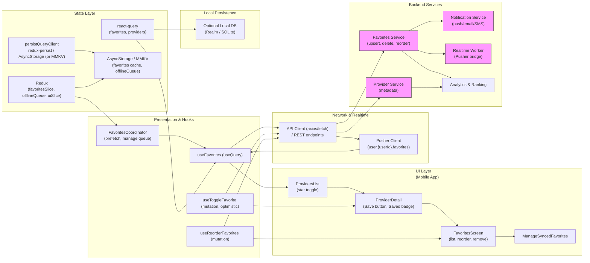

# Bookmarks / Favorites — Save Preferred Providers


## 1) Requirements

- Functional
    - Save/un-save providers from list or detail (toggle favorite).
    - Favorites list (view & remove) that is accessible across devices (sync).
    - Prioritize favorited providers in search/results (server-driven ranking).
    - Notify user about important events for favorites (availability, cancellations, promotions).
    - Persist favorites locally for offline access and quick UX.
    - Allow reordering favorites (priority) and expose API for server order.
    - Manage synced favorites (reconcile server/local differences).

- Non-functional
    - Instant perceived UX: optimistic updates for save/un-save actions.
    - Sync correctness: reconcile local changes with server after reconnect.
    - Low-latency reads (favorites list) and lightweight writes (toggle favorite).
    - Scales: many users with favorites; operations should be cached and rate-limited appropriately.
    - Security & privacy: favorites are user-scoped; protect endpoints with auth; don't leak favorites in public APIs.

---

## 2) Caching, offline & sync strategy (react-query, redux & Pusher)

- Client caching
    - Use react-query for favorites list and provider pages: useQuery(['favorites', userId]) and useQuery(['provider', providerId]).
    - Keep favorites' staleTime reasonably long (e.g., 1–5 minutes) for immediate reads; invalidate on mutations.
    - Persist react-query cache snapshot (persistQueryClient) for quicker cold-start and offline access.

- Optimistic updates & offline queue
    - On toggle favorite:
        - Optimistically update react-query cached provider & favorites list to reflect new state.
        - Attempt POST/DELETE to server immediately.
        - If offline or request fails, push the mutation to a redux offlineQueue (persisted) to retry later.
    - Maintain idempotency: server endpoints should be idempotent for toggles (e.g., POST is safe to call repeatedly).

- Sync & reconciliation
    - On reconnect or login:
        - Replay offlineQueue in FIFO order.
        - Fetch server favorites and merge with local changes using deterministic rules (local wins or server wins configurable).
    - Use a sync timestamp to detect conflicts and fetch resolved state.

- Realtime & cross-device sync
    - Use Pusher (or a WebSocket) to subscribe to user.{userId}.favorites channel or provider.{id}.favorite_events to receive favorite changes from other devices or server-driven notifications.
    - On favorite event, patch react-query caches to keep UI consistent across devices.

- UX considerations
    - Show immediate visual feedback (star toggles, toast).
    - Show syncing state (small indicator) if offline queue exists.
    - Provide a "Manage Synced Favorites" screen for conflict resolution and reorder.

---

## 3) Data models (shared types)

```ts
interface Provider {
  id: string;
  name: string;
  thumbnailUrl?: string;
  rating?: number;
  specialties?: string[];
  shortNote?: string;
}

interface Favorite {
  id: string; // server record id (optional); client may use composite key userId:providerId
  providerId: string;
  userId: string;
  position?: number; // priority order
  createdAt?: string;
}

interface FavoriteList {
  userId: string;
  items: Favorite[];
  updatedAt?: string;
}
```

---

## 4) REST endpoints (mapping from the UI)

- GET /users/{userId}/favorites
    - returns FavoriteList for user
- POST /users/{userId}/favorites
    - body: { providerId, position? } — create or idempotently upsert favorite
    - response: favorite object
- DELETE /users/{userId}/favorites/{providerId}
    - remove favorite (idempotent)
- PATCH /users/{userId}/favorites/order
    - body: { providerIds: string[] } — reorder favorites (save positions)
- GET /favorites/suggestions?userId=
    - server-provided suggestions based on history & favorites
- Optional: POST /favorites/sync
    - body: { localFavorites: Favorite[], lastSyncAt } — reconcile server & client in one call

Realtime / Push events:
- user.{userId}.favorites -> favorite.added | favorite.removed | favorites.reordered
    - payload with affected providerId(s) and new positions

Analytics:
- POST /analytics/event (favorite.toggle) to track usage and improve ranking.

---

## 5) High‑level architecture (narrative)

- UI Layer (Mobile)
    - ProvidersList: shows star for quick toggle.
    - ProviderDetail: shows saved badge and Save button.
    - FavoritesScreen: lists favorites with reorder/remove actions and manage sync CTA.
    - Sync & status indicators: show pending changes or last-synced timestamp.

- Presentation & Hooks
    - useFavorites (react-query useQuery to fetch favorites)
    - useToggleFavorite (mutation with optimistic update + offline enqueue)
    - useReorderFavorites (mutation to patch order)
    - FavoritesCoordinator: orchestrates optimistic UI, queued mutations, and pusher subscriptions

- Network & Realtime
    - API client (axios/fetch) for REST endpoints
    - Pusher client for user-specific favorite events and provider notifications
    - Analytics endpoint to record favorite events

- State Layer
    - react-query: server-synced data (favorites list, providers)
    - redux: UI state (isManaging, reorder mode), offlineQueue, sync metadata, user profile
    - Persistors: persist react-query cache and redux slices to AsyncStorage or MMKV

- Local Persistence
    - AsyncStorage/MMKV: favorites cache, offlineQueue, UI flags
    - Optional LocalDB for richer cross-device features or faster lookups

- Backend Services
    - FavoritesService: stores favorites, supports upsert/delete/order, generates events
    - ProviderService: provider metadata for display
    - NotificationService: push notifications for favorite events or availability alerts
    - Realtime Bridge: pushes events to Pusher (or other WebSocket)
    - Analytics & Ranking service to use favorite data to boost ranking

---

## 6) React‑Query, Redux & Pusher integration (implementation notes)

- React Query responsibilities
    - Query favorites list: useQuery(['favorites', userId], fetchFavorites)
    - Query provider detail: useQuery(['provider', providerId])
    - Keep queries stable by invalidating favorites and provider queries after mutations.

- Redux responsibilities
    - favoritesSlice: local UI state, reordering buffer, lastSyncAt
    - offlineSlice: queued mutations [{ type: 'toggleFavorite', providerId, optimisticId, timestamp }]
    - uiSlice: modals, toasts, manage mode flags

- Pusher responsibilities
    - Subscribe to user.{userId}.favorites and provider.{providerId}.availability for notifications.
    - On favorite events:
        - Patch react-query cache for ['favorites', userId] and for provider pages to update star state.
    - On provider availability events for favorited providers:
        - Dispatch a local notification or show in-app toast to the user.

- Optimistic flow for toggle
    - onMutate:
        - Cancel queries ['favorites', userId].
        - Snapshot previous favorites.
        - Update favorites cache (add/remove provider) and provider cache (set isFavorited).
        - Persist the optimistic mutation in offlineQueue if offline.
    - onError:
        - Restore snapshot and surface error.
    - onSettled:
        - Invalidate queries to reconcile with server.

---

## 7) Mermaid diagram (UI Layer first, presentation/hooks, Network and realtime, state layer, local persistence, Backend services)

Paste the block below into a Mermaid renderer to visualize the architecture.



---

## 8) Example code snippets

Below are focused snippets (TypeScript / React Native style) showing API client, react-query hooks, redux slice and Pusher wiring.

### src/api/favoritesApi.ts
```ts
import axios from 'axios';
const api = axios.create({ baseURL: 'https://api.example.com', timeout: 10000 });

export async function fetchFavorites(userId: string) {
  const { data } = await api.get(`/users/${userId}/favorites`);
  return data;
}

export async function upsertFavorite(userId: string, providerId: string, position?: number) {
  const { data } = await api.post(`/users/${userId}/favorites`, { providerId, position });
  return data;
}

export async function removeFavorite(userId: string, providerId: string) {
  const { data } = await api.delete(`/users/${userId}/favorites/${providerId}`);
  return data;
}

export async function reorderFavorites(userId: string, providerIds: string[]) {
  const { data } = await api.patch(`/users/${userId}/favorites/order`, { providerIds });
  return data;
}

export default api;
```

### src/hooks/useFavorites.ts
```ts
import { useQuery } from '@tanstack/react-query';
import { fetchFavorites } from '../api/favoritesApi';

export function useFavorites(userId: string) {
  return useQuery(['favorites', userId], () => fetchFavorites(userId), {
    staleTime: 60 * 1000,
    cacheTime: 10 * 60 * 1000,
    refetchOnWindowFocus: false,
  });
}
```

### src/hooks/useToggleFavorite.ts
```ts
import { useMutation, useQueryClient } from '@tanstack/react-query';
import { upsertFavorite, removeFavorite } from '../api/favoritesApi';
import { v4 as uuidv4 } from 'uuid';
import { store } from '../store';

export function useToggleFavorite(userId: string) {
  const qc = useQueryClient();

  return useMutation(async ({ providerId, shouldFavorite }: any) => {
    if (shouldFavorite) return upsertFavorite(userId, providerId);
    return removeFavorite(userId, providerId);
  }, {
    onMutate: async ({ providerId, shouldFavorite }) => {
      await qc.cancelQueries(['favorites', userId]);
      const previous = qc.getQueryData(['favorites', userId]);

      // optimistic update: add or remove in cache
      qc.setQueryData(['favorites', userId], (old: any) => {
        const items = old?.items ? [...old.items] : [];
        if (shouldFavorite) {
          // avoid duplicates
          if (!items.some((f: any) => f.providerId === providerId)) {
            items.unshift({ providerId, userId, tempId: uuidv4(), createdAt: new Date().toISOString() });
          }
        } else {
          return { ...old, items: items.filter((f: any) => f.providerId !== providerId) };
        }
        return { ...old, items };
      });

      // optimistic patch provider cache
      qc.setQueryData(['provider', providerId], (old: any) => ({ ...(old || {}), isFavorited: shouldFavorite }));

      // If offline, enqueue for later replay
      const isOnline = navigator.onLine;
      if (!isOnline) {
        store.dispatch({ type: 'offline/enqueue', payload: { type: 'favorite', providerId, shouldFavorite, timestamp: Date.now() }});
      }

      return { previous };
    },
    onError: (err, vars, context: any) => {
      qc.setQueryData(['favorites', userId], context.previous);
    },
    onSettled: () => {
      qc.invalidateQueries(['favorites', userId]);
      qc.invalidateQueries(['provider']);
    }
  });
}
```

### src/store/favoritesSlice.ts
```ts
import { createSlice } from '@reduxjs/toolkit';

const initialState = {
  lastSyncAt: null,
  isManaging: false,
  reorderBuffer: [],
  offlineQueue: [], // persisted
};

const slice = createSlice({
  name: 'favorites',
  initialState,
  reducers: {
    setLastSyncAt(state, action) { state.lastSyncAt = action.payload; },
    setManaging(state, action) { state.isManaging = action.payload; },
    setReorderBuffer(state, action) { state.reorderBuffer = action.payload; },
    enqueueOffline(state, action) { state.offlineQueue.push(action.payload); },
    dequeueOffline(state) { state.offlineQueue.shift(); },
    clearOffline(state) { state.offlineQueue = []; },
  }
});

export const { setLastSyncAt, setManaging, setReorderBuffer, enqueueOffline, dequeueOffline, clearOffline } = slice.actions;
export default slice.reducer;
```

### src/services/pusher.ts
```ts
import Pusher from 'pusher-js/react-native';
import { queryClient } from '../reactQueryClient';

let pusher: Pusher | null = null;

export function initPusher(key: string, cluster = 'mt1') {
  if (pusher) return pusher;
  pusher = new Pusher(key, { cluster, forceTLS: true });
  pusher.connection.bind('connected', () => console.log('Pusher connected'));
  return pusher;
}

export function subscribeUserFavorites(userId: string) {
  if (!pusher) throw new Error('initPusher first');
  const channel = pusher.subscribe(`user.${userId}.favorites`);

  channel.bind('favorite.added', (payload: any) => {
    // Patch favorites cache: prepend new favorite if missing
    queryClient.setQueryData(['favorites', userId], (old: any) => {
      const items = old?.items ? [...old.items] : [];
      if (!items.some((f: any) => f.providerId === payload.providerId)) {
        items.unshift({ providerId: payload.providerId, userId, createdAt: payload.createdAt });
      }
      return { ...(old || {}), items };
    });

    // Patch provider cache
    queryClient.setQueryData(['provider', payload.providerId], (old: any) => ({ ...(old || {}), isFavorited: true }));
  });

  channel.bind('favorite.removed', (payload: any) => {
    queryClient.setQueryData(['favorites', userId], (old: any) => {
      if (!old) return old;
      return { ...old, items: old.items.filter((f: any) => f.providerId !== payload.providerId) };
    });
    queryClient.setQueryData(['provider', payload.providerId], (old: any) => ({ ...(old || {}), isFavorited: false }));
  });

  channel.bind('favorites.reordered', (payload: any) => {
    queryClient.setQueryData(['favorites', userId], (old: any) => ({ ...(old || {}), items: payload.items }));
  });

  return () => pusher.unsubscribe(`user.${userId}.favorites`);
}
```

---

## 9) UX & accessibility notes

- Immediate feedback
    - Toggle star visually instantly and use a small toast "Saved" or "Removed" on success/failure.
    - Show a subtle syncing indicator (small spinner) on Favorites header when offlineQueue not empty or during sync.

- Reorder & manage
    - Use drag-to-reorder with an explicit "Save order" CTA to persist positions (or auto-save with debounce).
    - Provide a clear empty state ("No more favorites — Tap a provider and hit Save to add").

- Accessibility
    - Provide accessible labels for star toggles (e.g., "Save provider", "Remove provider from favorites").
    - Announce changes via accessibilityLiveRegion.

---

## 10) Offline replay & conflict handling

- Offline queue replays on connectivity:
    - On reconnect, dispatch replay routine: replay offlineQueue actions in order and mark each as success/failure.
    - If conflict occurs (e.g., provider removed from platform), remove from local favorites and surface a friendly error.

- Merge strategy
    - Merge local queued changes with server state:
        - If local created a favorite that server already has: treat as no-op.
        - If server has a favorite the client doesn't: depending on policy, either add to local or prompt user to merge.

---

## 11) Performance & ops notes

- Cache favorites aggressively at the edge for fast reads; favorites are small per-user lists.
- Protect favorite endpoints with rate limiting and idempotency (prevent abusive toggles).
- Monitor metrics: favorite toggle rate, replay failure rate, sync conflicts, favorites per user distribution.
- Backend should emit events on favorite changes for cross-device sync and notifications.

---

## 12) Sequence flows (brief)

- Save from list/detail:
    - User taps star -> optimistic update in react-query -> POST /users/{userId}/favorites -> on success server emits user.{userId}.favorites.favorite.added -> clients patch caches; on failure enqueue offline mutation and show error/toast.
- Remove favorite:
    - User removes via Favorites screen -> optimistic remove from cache -> DELETE request -> reconcile on success or enqueue on failure.
- Cross-device sync:
    - User adds favorite on device A -> server persists and emits Pusher event -> device B subscribed to user.{userId}.favorites receives event and updates caches.
- Reorder:
    - User reorders favorites -> PATCH /favorites/order -> server returns updated ordered list -> client updates cache and persists order.

---
