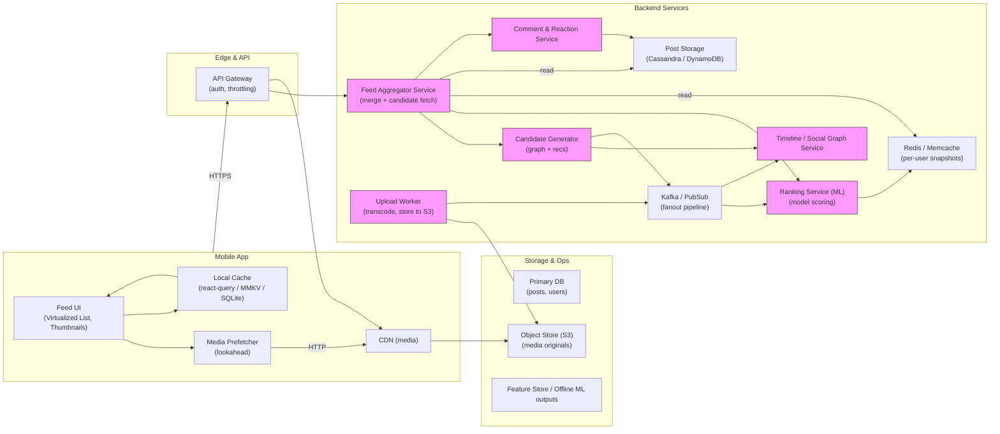

# Mobile System Design — Facebook News Feed (mobile)

## 1) Requirements

- Functional requirements
    - Show personalized home feed of posts (text, images, video, shared links)
    - Infinite scroll with chronological + ranked items
    - Open a single post to view full text, media and comments
    - Like/react, comment, share posts
    - Create new posts with text + media (images, video)
    - View top-level comments and reply (nested comments optional)
    - View feed when offline (recently viewed cached)
    - Pull-to-refresh for newest items and background refresh
    - Lightweight thumbnails in feed; high-res media in post view
    - Basic privacy controls (friends / public / groups)

- Non-functional:
    - Low tail-latency for initial feed load (<300–500ms perceived)
    - High throughput for reads (many more reads than writes)
    - Personalization/ranking with ML models (A/B capable)
    - Scalable horizontal read caches and read-optimized storage
    - Efficient bandwidth usage (adaptive image sizes, prefetching)
    - Graceful degraded UX when offline or on poor networks
    - Protect privacy & enforce ACLs per-post

---

## 2) Caching, offline & sync strategy

- Client caching:
    - Use a data-fetching cache (e.g., react-query / Apollo cache) for feed and post details.
    - useInfiniteQuery for feed pages; set page size tuned to viewport (e.g., 10-12 items).
    - Reasonable staleTime (e.g., 15–60s) so users see cached feed immediately while background refresh checks for new content.
    - Persist client cache with AsyncStorage / MMKV / SQLite for offline viewing of recent feed.

- Prefetching & viewport aware loading:
    - Prefetch top N posts and media for the viewport + a small lookahead window.
    - Use low-resolution thumbnails in feed; lazy-load high-res on post open.
    - Use HTTP cache-control + ETags for media & author avatars; serve via CDN.

- Optimistic UI & local queue:
    - Optimistically show like/reaction changes and comment drafts in UI.
    - For post creation or offline comment creation: save a local draft with a clientId, persist to local queue and retry when online.
    - Replay offline queue on connectivity restoration; show 'sending' state for queued posts/comments.

- Delta updates:
    - On background reconnect (or via websocket/pubsub), fetch deltas: GET /feed/home/after?timestamp=lastSeen to fetch newly ranked items or changes (or pull top N if large model changes).
    - Invalidate feed cache when user performs actions that materially affect ranking (new post, follow/unfollow).

- Server-side caching:
    - Edge CDN for media and for static pieces of post payload (thumbnails).
    - Redis/edge caches for personalized feed snapshots (short lived) and for hot user feeds.

---

## 3) Data models (shared types)

```ts
// Minimal user profile
interface User {
  id: string;
  name: string;
  avatarThumb?: string;
  avatarFull?: string;
  followState?: 'following'|'not_following'|'muted';
}

// Media attached to posts
interface Media {
  id: string;
  type: 'image'|'video'|'link';
  url: string;           // CDN URL
  thumbnailUrl?: string; // for video/image
  mime?: string;
  width?: number;
  height?: number;
  sizeBytes?: number;
}

// Reaction summary
interface Reactions {
  like: number;
  love?: number;
  wow?: number;
  sad?: number;
  angry?: number;
  viewerReaction?: string | null; // reaction by the current viewer
}

// Comment
interface Comment {
  id: string;
  postId: string;
  author: User;
  text: string;
  createdAt: string; // ISO timestamp
  replyCount?: number;
  reactions?: Reactions;
}

// Post/feed item
interface Post {
  id: string;
  author: User;
  text?: string;
  media?: Media[];
  createdAt: string;
  visibility: 'public'|'friends'|'private'|'group';
  reactionSummary?: Reactions;
  commentCount?: number;
  shareCount?: number;
  privacyMetadata?: any;
  // Ranking metadata (server-provided)
  score?: number;
  pinned?: boolean;
}

// Feed response (paged)
interface FeedPage {
  items: Post[];
  nextCursor?: string;
  nextTimestamp?: string;
}
```

---

## 4) REST endpoints (mapping from your original sketches)

- GET /feed/home?limit=12&cursor=...
    - returns a ranked, paginated list of feed items personalized for the current user
- GET /feed/home/after?timestamp=...
    - returns new items since last timestamp (delta)
- GET /post/{postId}
    - returns full post object (full text, all media, top-level comments preview)
- GET /post/{postId}/comments?limit=20&cursor=...
    - paginated comments for the post
- POST /post
    - create a new post; body: { text, attachments: [{ fileUrl, type }], visibility }
    - returns created post
- POST /post/{postId}/comment
    - { text, replyToCommentId? } — returns created comment
- POST /post/{postId}/reaction
    - { reactionType } — toggles or sets reaction; returns updated reaction summary
- POST /uploads/presign
    - returns presigned urls for uploads (PUT) and final fileUrl(s)
- GET /user/{userId}/timeline?limit=...
    - get a user's posts in reverse chronological order
- GET /graph/recommendations?userId=... (optional)
    - returns candidate post ids for ranking service (server-server)
- WebSocket / Realtime:
    - Subscribe to notifications like new comments on a followed post or friend activity (optional; SSE or WebSocket)

Realtime events (examples):
- user-{userId}:post_created -> payload: postId (for follower push notifications)
- post-{postId}:comment_created -> payload: comment
- post-{postId}:reaction_updated -> payload: reactionSummary

---

## 4) High‑level architecture (narrative)

- Client:
    - Mobile app (iOS/Android) with an efficient feed UI (virtualized list/infinite scroll), thumbnail-first rendering, and media prefetcher.
    - Local persistence (react-query cache persisted, optional local DB for heavier offline support).

- Edge & CDN:
    - CDN for hosting thumbnails, video segments and other media assets.
    - Edge caching layer for static profile images and thumbnails.

- API & Gateway:
    - API Gateway / HTTP load balancers handle authentication, request routing, throttling, and regional edge endpoints.

- Feed Service (Online path):
    - Feed aggregator that merges candidate posts (from Push layer, timeline service, and real-time user actions).
    - Ranking service (ML model) consumes candidate posts and user-context signals and returns a ranked list.
    - Personalization pipeline provides features and model inference (online or hybrid: online scoring + offline precompute).
    - Use Redis/memcache for short-lived per-user ranking snapshots (to serve low-latency reads).

- Candidate generation:
    - Social Graph / Timeline service returns user's friends' posts, group posts, ads, suggested posts.
    - Recommendation service (graph-based + content-based) supplies additional candidate posts.

- Data storage:
    - Write heavy storage for posts/comments (Cassandra / DynamoDB / write-optimized DB) for append-heavy workloads.
    - Serving DB or materialized views for post retrieval (ElasticSearch / Scylla / read-optimized store).
    - Event log / message broker (Kafka) for fanout, notifications, and async processing.

- Caching & read paths:
    - Per-user cached feed snapshots in Redis (short TTL); if miss, do real-time ranking fallback.
    - CDN for media.

- Background & offline:
    - Offline worker to persist user actions, process media uploads (transcoding), compute features for ranking.

- Real-time:
    - Pub/sub push pipeline for critical real-time events (comments on your posts, reactions, friend activity) delivered via push notifications or WebSocket to active clients.

- Observability & ops:
    - Metrics for latency, cache hit ratios, ranking A/B experiments, and fraud/abuse detection.

---

## 5) Mermaid diagram (high level design)

Paste the block below into a Mermaid renderer to visualize the architecture.



-----

## 6) Example code snippets

Below are abridged snippets you can adapt. They show an API client, a feed hook using react-query, optimistic reaction mutation, and an upload flow.

### src/api/feedApi.ts
```typescript
import axios from 'axios';

const api = axios.create({
  baseURL: 'https://api.example.com',
  timeout: 10000,
});

export function setAuthToken(token?: string) {
  if (token) api.defaults.headers.common.Authorization = `Bearer ${token}`;
  else delete api.defaults.headers.common.Authorization;
}

export async function fetchFeed({ limit = 12, cursor }: { limit?: number; cursor?: string }) {
  const params: any = { limit };
  if (cursor) params.cursor = cursor;
  const { data } = await api.get('/feed/home', { params });
  return data as { items: any[]; nextCursor?: string };
}

export async function postReaction(postId: string, reaction: string) {
  const { data } = await api.post(`/post/${postId}/reaction`, { reaction });
  return data;
}

export async function presignUpload(filename: string, contentType: string) {
  const { data } = await api.post('/uploads/presign', { filename, contentType });
  return data; // { uploadUrl, fileUrl }
}

export default api;
```

### src/hooks/useFeed.ts
```typescript
import { useInfiniteQuery, useQueryClient } from '@tanstack/react-query';
import { fetchFeed } from '../api/feedApi';
import { useEffect } from 'react';

export function useFeed() {
  const qc = useQueryClient();
  const pageSize = 12;
  const q = useInfiniteQuery(
    ['feed', 'home'],
    ({ pageParam }) => fetchFeed({ limit: pageSize, cursor: pageParam }),
    {
      getNextPageParam: (last) => last.nextCursor,
      staleTime: 30 * 1000,
      cacheTime: 5 * 60 * 1000,
    }
  );

  // background refresh every N seconds (optional)
  useEffect(() => {
    const id = setInterval(() => qc.invalidateQueries(['feed', 'home']), 45 * 1000);
    return () => clearInterval(id);
  }, []);

  return q;
}
```

### src/hooks/useReactToPost.ts (optimistic reaction)
```typescript
import { useMutation, useQueryClient } from '@tanstack/react-query';
import { postReaction } from '../api/feedApi';

export function useReactToPost() {
  const qc = useQueryClient();

  return useMutation(({ postId, reaction }: any) => postReaction(postId, reaction), {
    onMutate: async ({ postId, reaction }) => {
      await qc.cancelQueries(['feed', 'home']);
      const previous = qc.getQueryData(['feed', 'home']);

      // optimistic update: modify the post inside cached pages
      qc.setQueryData(['feed', 'home'], (old: any) => {
        if (!old) return old;
        const pages = old.pages.map((p: any) => ({
          ...p,
          items: p.items.map((it: any) => it.id === postId ? {
            ...it,
            reactionSummary: {
              ...it.reactionSummary,
              // naive: increment like count, set viewerReaction
              like: (it.reactionSummary?.like || 0) + 1,
              viewerReaction: reaction,
            }
          } : it),
        }));
        return { ...old, pages };
      });

      return { previous };
    },
    onError: (err, variables, context: any) => {
      qc.setQueryData(['feed', 'home'], context.previous);
    },
    onSettled: () => qc.invalidateQueries(['feed', 'home']),
  });
}
```

### src/hooks/useCreatePost.ts (upload + create)
```typescript
import { useMutation } from '@tanstack/react-query';
import { presignUpload } from '../api/feedApi';
import { v4 as uuidv4 } from 'uuid';

export const useCreatePost = () => {
  return useMutation(async ({ text, files }: any) => {
    const uploaded: any[] = [];
    for (const file of files || []) {
      const pres = await presignUpload(file.name, file.type);
      await fetch(pres.uploadUrl, { method: 'PUT', body: file.blob, headers: { 'Content-Type': file.type } });
      uploaded.push({ url: pres.fileUrl, type: file.type });
    }
    // POST /post with text + uploaded media urls
    const res = await fetch('/post', { method: 'POST', body: JSON.stringify({ text, attachments: uploaded }) });
    return res.json();
  });
};
```

---

## 7) Real‑time & live updates (mobile specifics)

- Use WebSockets or SSE for live updates only for critical channels (comments on your post, mentions, direct replies). Full feed real‑time streaming is unnecessary and heavy.
- For active UI (open post), subscribe to post-{postId} channel to receive new comments or realtime reactions.
- On re-connection, run a delta fetch for that post: GET /post/{postId}/comments/after?timestamp=lastSeen.
- Use push notifications for out-of-app critical updates (someone commented on your post).
- Ensure rate limiting: coalesce frequent reaction events into periodic deltas or server-side aggregation to avoid client flurries.

---

## 8) Redux: what to store vs what to query

- react-query / Apollo: feed items, post details, comments (server-authoritative, cacheable).
- redux:
    - auth tokens and session state
    - UI state (openPostId, modal visibility, composer drafts)
    - offline queue for created posts or media uploads
    - ephemeral presence/typing states for comment composer
- Reason: Keep server-synced, cache-friendly data in react-query; keep cross-cutting UI and durable local queues in redux.

---

## 9) Offline replay & uploads

- When composing a post offline:
    - Persist the draft locally with a clientId; show the draft in feed as 'pending' if user posts while offline.
    - Store required media blobs in local storage (or delay until connection).
    - On connectivity restore: upload media via presigned URLs, then POST the post; update optimistic item in the feed with the server response.
- For comment creation offline: similar queue strategy; show local comment with status='sending'.
- Background replay:
    - Use a foreground/background task to replay the queue with exponential backoff.
    - On repeated failure mark item as 'failed' so user can retry manually.

---

## 10) Performance & UX notes

- Feed rendering:
    - Use virtualization (RecyclerListView / FlatList) with pure item components and shouldComponentUpdate optimizations.
    - Render thumbnails and a condensed text preview; expand full content in post view.
- Media:
    - Serve adaptive image sizes based on device & DPR.
    - For video, load low-res poster + progressive HLS segments.
- Ranking & caching:
    - Precompute candidate lists offline and use small online model for final scoring to reduce latency.
    - Cache per-user snapshot for short TTL and refresh in background.
- Network:
    - Avoid polling; use delta fetch or targeted real-time channels for changes.
    - Compress JSON payloads and trim fields in feed item to what is shown in list.
- Battery:
    - Limit background sync frequency and batch network requests when possible.

---

## 11) Sequence flows (brief)

- Open app / feed load:
    - App reads persisted feed from local cache for instant display.
    - Background: call GET /feed/home (cursor or lastTimestamp) to refresh and merge diffs.
    - Prefetch thumbnails and next page items.

- Open a post:
    - Fetch GET /post/{postId} if not present in cache (full text, media and comment preview).
    - Subscribe to post channel for realtime comments if the post is actively viewed.

- React / comment:
    - Optimistic UI update for reaction/comment.
    - POST to /post/{id}/reaction or /post/{id}/comment.
    - On success replace optimistic state with server state; on error push to offline queue or mark failed.

- Create post with media:
    - presign -> upload media to CDN (PUT) -> POST /post with media urls.
    - Show upload/progress UI; if offline, queue and persist draft.

- Receive external updates:
    - PubSub event (new comment / mention) arrives -> push notification or in-app update -> invalidate or update feed/post caches.

---

## 12) Ops & security notes

- Authentication & ACL:
    - Enforce ACLs at the API layer and ranking layer (remove items not visible to user).
    - Short-lived access tokens; refresh flow updates edge auth for websockets.
- Abuse & moderation:
    - Integrate moderation pipeline (automated & human) and label or remove content accordingly.
    - Throttle suspicious write activity and scan uploads for malware.
- Privacy & compliance:
    - Respect user privacy settings and export/delete requests.
- Observability:
    - Track feed latency, cache hit/miss metrics, model performance, error rates, and offline queue sizes.
- Cost & scaling:
    - Cache aggressively for reads; use fanout via message broker and avoid expensive synchronous fanout on writes.
    - Use cheaper bulk storage for historical posts; use read-optimized stores for serving hot posts.

---
