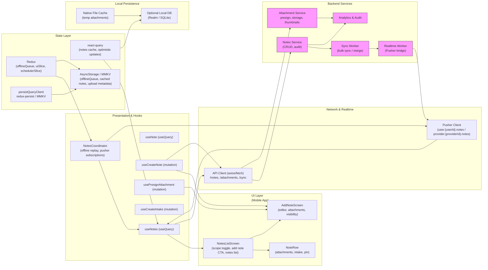

# Notes & Instructions — Per-item / Stack Persistent Notes, Attachments & Intake Data


## 1) Requirements

- Functional
    - Create persistent textual notes/instructions for a product or the entire stack.
    - Attach files (images, PDFs) to notes; show attachment thumbnails and allow view/download.
    - Log intake entries from notes (dose, time, tags like "with food", "allergy").
    - Visibility controls:
        - Provider-only (visible to providers and hidden from patients until unpinned)
        - User-visible (patient and provider)
    - Pin/unpin provider instructions to make them visible to the patient.
    - Show recent notes and history with timestamps, author, attachments, and intake logs.
    - Edit and delete notes and attachments; support annotating attachments (optional).
    - Offline operation: allow creating notes, attachments (queued), and intake logs offline; replay when online.
    - Sync across devices and provider accounts; support real-time updates so a provider's note appears on patient device and vice-versa.
    - Access control and audit:
        - Audit trail for note creations, edits, deletes, pin/unpin actions with actor and timestamp.
    - File size & type constraints: JPG/PNG/PDF with a reasonable max (e.g., 10MB per file).
- Non-functional
    - Secure file uploads (presigned URLs to S3/CND), encrypt sensitive notes at rest if they may be PHI.
    - Fast perceived UI: optimistic local persistence of note creation and quick attachment placeholders.
    - Observability: log upload failures, replay failures, and permission denials.
    - Scalability: store notes in a document store (DynamoDB / Postgres JSONB) and attachments in object storage.

---

## 2) Caching, offline & sync strategy (react-query, redux & pusher)

- Local-first UX with server-authoritative sync
    - Immediate local save:
        - When user taps "Save note", create a local note with a clientId and persist to local store (MMKV / AsyncStorage). Show note immediately in UI.
        - If attachments are added, create placeholder attachments and upload in the background (or enqueue upload tasks).
    - Offline queue
        - Redux offlineQueue holds actions: { id, op: createNote|updateNote|deleteNote|uploadAttachment|logIntake, payload, timestamp, retries }.
        - Persist offlineQueue via redux-persist to survive restarts.
        - Background worker watches connectivity and replays queue FIFO, using idempotency keys for safe retries.
    - react-query
        - Fetch and cache notes per scope:
            - useQuery(['notes','product', productId]) for product-level notes
            - useQuery(['notes','stack', stackId]) for stack-level notes
        - Set staleTime to short (e.g., 15–60s) and cacheTime to allow offline read (persist query cache).
        - useMutation for note create/update/delete with onMutate optimistic updates that patch cached queries.
        - On mutation error, rollback using the snapshot and enqueue to offlineQueue if offline.
    - Attachments
        - Use presigned upload flow: client requests presign URL from API, uploads file to S3, then notifies server of completed attachment with file metadata (url, type, size).
        - Persist placeholder attachments in local note until upload completes; patch note after upload completes with server-provided attachment id.
    - Real-time sync (Pusher)
        - Subscribe to channels user.{userId}.notes (for patient) and provider.{providerId}.notes (for providers) so updates are pushed:
            - Events: note.created, note.updated, note.deleted, attachment.uploaded, intake.logged, note.pinned.
        - On events, patch react-query caches or invalidate queries to fetch latest.
    - Conflict handling
        - Edits to the same note from multiple clients: server returns version/timestamp; client detects conflict and prompts user with merge options or shows "server changed" modal.
        - For attachments, deduplicate by content hash (optional) on server.

---

## 3) Data models (shared types)

```ts
// Note visibility
type Visibility = 'user' | 'provider';

// Attachment metadata
interface Attachment {
  id?: string;                // server id
  clientId?: string;          // client temp id for optimistic
  noteId?: string;
  url?: string;               // final CDN URL
  type: 'image'|'pdf'|'other';
  filename?: string;
  mime?: string;
  size?: number;
  uploadedAt?: string;
  status?: 'pending'|'uploading'|'uploaded'|'failed';
}

// Note / Instruction
interface Note {
  id?: string;                // server id
  clientId?: string;          // for optimistic local entries
  authorId: string;
  authorType: 'user'|'provider'|'system';
  createdAt?: string;
  updatedAt?: string;
  scope: 'item'|'stack';
  scopeId: string;            // productId or stackId
  visibility: Visibility;
  pinned?: boolean;           // provider-only pinned instruction visible to user
  title?: string;
  body: string;
  attachments?: Attachment[];
  intakeData?: IntakeLog[];   // optional aggregated intake logs attached to note
  audit?: AuditEntry[];       // actions (create/edit/delete, pin/unpin)
  version?: number;           // optimistic concurrency
}

// Intake log (from note or ad-hoc)
interface IntakeLog {
  id?: string;
  clientId?: string;
  noteId?: string;
  userId: string;
  productId?: string;
  dose?: string;              // "2 softgels"
  timeslot?: string;          // e.g., AM_WITH_FOOD
  takenAt?: string;           // ISO timestamp
  tags?: string[];            // ["Take with food","Allergy: shellfish"]
  note?: string;              // optional comment
  createdAt?: string;
}

// Offline queue entry
interface OfflineAction {
  id: string;                 // idempotency key
  type: 'createNote'|'updateNote'|'deleteNote'|'uploadAttachment'|'createIntake';
  payload: any;
  createdAt: string;
  retries?: number;
}
```

---

## 4) REST endpoints (mapping from the UI)

- GET /notes?scope=item&scopeId={productId}&limit=&cursor=
    - returns paginated notes for product
- GET /notes?scope=stack&scopeId={stackId}&limit=&cursor=
    - returns stack-level notes
- GET /notes/{noteId}
    - returns single note detail (with attachments, intake logs, audit)
- POST /notes
    - create note
    - body: { clientId?, scope, scopeId, visibility, pinned?, title?, body?, attachments?: [ { filename, mime, clientId } ] }
    - response: saved note with id, attachments metadata
- PATCH /notes/{noteId}
    - update note: { body?, visibility?, pinned?, attachmentsToAdd?, attachmentsToRemove? }
- DELETE /notes/{noteId}
- POST /attachments/presign
    - body: { filename, mime, size, noteClientId?, noteId? } -> return presign url + uploadId + attachment clientId mapping
- POST /attachments/complete
    - notify server upload complete and attach to note: { uploadId, clientId, noteId? }
- POST /notes/{noteId}/intake
    - log intake from a note: { clientId?, productId, dose, timeslot, takenAt, tags?: [], note?: string }
- GET /notes/{noteId}/audit
    - return audit trail for note
- POST /sync/notes
    - bulk sync endpoint: accept array of offline actions and return canonical results (useful on reconnect)
- POST /analytics/event
    - track note creation, attachment upload, intake logging, pin/unpin events
- Realtime events (Pusher)
    - channels:
        - user.{userId}.notes -> note.created | note.updated | note.deleted | attachment.uploaded | intake.logged
        - provider.{providerId}.notes -> provider-only notes & events (pin/unpin)

---

## 5) High‑level architecture (narrative — follow mermaid ordering)

- UI Layer (first)
    - NotesListScreen (Notes & Instructions)
        - scope toggle (This item only / Whole stack)
        - primary CTA "Add note / instruction"
        - provider instructions (pinned), user notes, attachments, intake logs, older notes
        - quick "Intake" button to log consumption directly from a note
    - AddNoteScreen (Add Note / Instruction)
        - product header, note body editor, intake data controls (dose/time/tags), attachments uploader, visibility control (Provider / User), Save & Pin CTA, recent notes preview
    - Small components:
        - NoteRow, AttachmentTile, IntakeChip, VisibilityToggle, PinBadge, AuditRow

- Presentation & Hooks
    - useNotes (useQuery) — fetch notes for scope and scopeId
    - useNote (useQuery) — fetch a single note (for edit)
    - useCreateNote (useMutation) — create with optimistic onMutate
    - useUpdateNote (useMutation) — patch with optimistic update and version conflict handling
    - useDeleteNote (useMutation)
    - usePresignAttachment (mutation) — get presign URL and start upload
    - useCreateIntake (useMutation) — log intake tied to note
    - NotesCoordinator — orchestrates local persistence, attachment uploads, offlineQueue replay, and pusher subscriptions (user & provider channels)

- Network & Realtime
    - ApiClient (axios/fetch) — calls notes endpoints and presign/upload flows
    - PusherClient — subscribes to user and provider channels to receive cross-device changes
    - Background upload worker for attachments (uses presigned PUT/POST to S3 CDN)

- State Layer
    - React Query: caches notes, single note details, and intake logs
    - Redux:
        - offlineSlice: queued offline actions (create/update/delete/upload/intake)
        - uiSlice: modal state, current scope, upload progress
        - schedulerSlice (optional): retry timers, background job statuses
    - Query persistence: persistQueryClient + redux-persist using MMKV/AsyncStorage

- Local Persistence
    - MMKV / AsyncStorage: persist offline queue, last-viewed notes snapshot, in-progress uploads metadata
    - LocalDB (optional): Realm / SQLite for richer searching/indexing of notes & attachments on-device
    - Native file cache: temporary store for attachments before upload and for downloaded attachment viewing

- Backend Services
    - Notes Service: CRUD for notes, attachments metadata, intake logging, audit trail
    - Attachment Service: presign endpoint, S3 storage, virus scan worker, thumbnails generation
    - Sync Worker: handles /sync/notes jobs, conflict resolution, and replay acknowledgements
    - Realtime Worker: bridges events to Pusher/channel subscriptions
    - Analytics & Audit Worker: consumes analytics events and audit logs
    - Auth & Permissions Service: enforces visibility, provider vs user access rules

---

## 6) React‑Query, Redux & Pusher integration (implementation notes)

- React Query
    - Query keys:
        - ['notes', 'item', productId]
        - ['notes', 'stack', stackId]
        - ['note', noteId]
    - Mutations:
        - useCreateNote: onMutate insert optimistic note into cache; return rollback snapshot
        - useUpdateNote: optimistic patch; include version in request for optimistic concurrency; on conflict show merge dialog
        - onSettled: invalidate queries for the scope to fetch canonical server state
    - Keep previous data to avoid flicker when switching scope or reloading

- Redux
    - offlineSlice stores offline actions with idempotency keys; worker replays with exponential backoff and marks success/removal
    - uiSlice holds upload states and currently editing note
    - Provide actions: enqueueOfflineAction, dequeueOfflineAction, markUploadStarted, markUploadComplete, setConnectivityState

- Pusher
    - Subscribe when a user authenticates and Notes screens are active:
        - user.{userId}.notes: all visible note events for the user
        - provider.{providerId}.notes: provider-only instructions & events
    - Event handlers:
        - note.created/updated/deleted: queryClient.setQueryData or invalidate queries appropriately
        - attachment.uploaded: patch note attachments with final urls and statuses
        - intake.logged: append intake to note or occurrence list
    - Ensure idempotency: events should carry server-side ids and version numbers so client can safely patch or ignore duplicates

- Attachments flow
    - Client calls POST /attachments/presign with file metadata -> server returns presign url and uploadId
    - Client uploads file to presigned URL (PUT); on success, client calls POST /attachments/complete with uploadId and noteId/clientId
    - Server validates and attaches CDN url to note; emits attachment.uploaded via Pusher

- Conflict resolution strategy
    - For concurrent edits:
        - Server uses version numbers or lastUpdated timestamp
        - If update fails due to conflict, server returns conflict payload (server copy + attempted changes)
        - Client shows merge UI (manual or accept server) and provides undo; also logs to audit
    - For attachments:
        - Ensure server returns canonical attachment id and URL; client replaces placeholder accordingly

---

## 7) Mermaid diagram (UI Layer first, presentation & hooks, Network & realtime, state layer, local persistence, Backend services)



---

## 8) Example code snippets

Below are practical snippets for a React Native + TypeScript app using react-query, Redux, and Pusher. Adapt to your auth and file handling utilities.

### src/api/notesApi.ts
```ts
import axios from 'axios';
const api = axios.create({ baseURL: 'https://api.example.com', timeout: 15000 });

export async function fetchNotes(scope: 'item'|'stack', scopeId: string, { cursor, limit = 50 } = {}) {
  const { data } = await api.get('/notes', { params: { scope, scopeId, cursor, limit }});
  return data; // { items: Note[], nextCursor }
}

export async function createNote(payload: any) {
  const { data } = await api.post('/notes', payload);
  return data;
}

export async function presignAttachment({ filename, mime, size, clientId }: any) {
  const { data } = await api.post('/attachments/presign', { filename, mime, size, clientId });
  return data; // { uploadUrl, uploadId, attachmentClientId }
}

export async function completeAttachment({ uploadId, clientId, noteId }: any) {
  const { data } = await api.post('/attachments/complete', { uploadId, clientId, noteId });
  return data;
}

export async function logIntake(noteId: string, payload: any) {
  const { data } = await api.post(`/notes/${noteId}/intake`, payload);
  return data;
}
```

### src/hooks/useNotes.ts
```ts
import { useInfiniteQuery } from '@tanstack/react-query';
import { fetchNotes } from '../api/notesApi';

export function useNotes(scope: 'item'|'stack', scopeId: string) {
  return useInfiniteQuery(
    ['notes', scope, scopeId],
    ({ pageParam }) => fetchNotes(scope, scopeId, { cursor: pageParam }),
    {
      getNextPageParam: (last) => last.nextCursor || undefined,
      staleTime: 30 * 1000,
      cacheTime: 5 * 60 * 1000,
      keepPreviousData: true,
    }
  );
}
```

### src/hooks/useCreateNote.ts (optimistic + offline)
```ts
import { useMutation, useQueryClient } from '@tanstack/react-query';
import { createNote } from '../api/notesApi';
import { v4 as uuidv4 } from 'uuid';
import { store } from '../store';

export function useCreateNote(scope: 'item'|'stack', scopeId: string, userId: string) {
  const qc = useQueryClient();
  return useMutation((payload: any) => createNote(payload), {
    onMutate: async (payload) => {
      await qc.cancelQueries(['notes', scope, scopeId]);
      const previous = qc.getQueryData(['notes', scope, scopeId]);

      const clientId = payload.clientId || `tmp-${uuidv4()}`;
      const optimisticNote = {
        id: undefined,
        clientId,
        authorId: userId,
        authorType: payload.authorType || 'user',
        createdAt: new Date().toISOString(),
        scope,
        scopeId,
        visibility: payload.visibility || 'user',
        pinned: payload.pinned || false,
        body: payload.body,
        attachments: (payload.attachments || []).map((a: any) => ({ clientId: a.clientId, filename: a.filename, status: 'pending' })),
      };

      qc.setQueryData(['notes', scope, scopeId], (old: any) => {
        const items = old?.items ? [optimisticNote, ...old.items] : [optimisticNote];
        return { ...(old||{}), items };
      });

      // enqueue offline action if offline
      if (typeof navigator !== 'undefined' && !navigator.onLine) {
        store.dispatch({ type: 'offline/enqueue', payload: { id: clientId, type: 'createNote', payload }});
      }

      return { previous, clientId };
    },
    onError: (err, payload, context) => {
      qc.setQueryData(['notes', scope, scopeId], context.previous);
    },
    onSettled: () => qc.invalidateQueries(['notes', scope, scopeId]),
  });
}
```

### src/services/pusher.ts
```ts
import Pusher from 'pusher-js/react-native';
import { queryClient } from '../reactQueryClient';

let pusher: Pusher | null = null;

export function initPusher(key: string, cluster = 'mt1') {
  if (pusher) return pusher;
  pusher = new Pusher(key, { cluster, forceTLS: true });
  pusher.connection.bind('connected', () => console.log('Pusher connected'));
  return pusher;
}

export function subscribeNotes(userId: string, providerIds: string[] = []) {
  if (!pusher) throw new Error('Pusher not initialized');
  const userChannel = `user.${userId}.notes`;
  pusher.subscribe(userChannel).bind('note.created', (payload: any) => {
    // patch or invalidate relevant caches
    const { scope, scopeId } = payload;
    queryClient.setQueryData(['notes', scope, scopeId], (old: any) => {
      if (!old) return { items: [payload] };
      return { ...old, items: [payload, ...old.items] };
    });
  });

  // subscribe to provider channels to receive provider-only instructions
  providerIds.forEach(pid => {
    const ch = `provider.${pid}.notes`;
    pusher.subscribe(ch).bind('note.pinned', (payload: any) => {
      // pinned provider instruction -> ensure it appears in item/stack notes (may need to fetch)
      queryClient.invalidateQueries(['notes', 'item']); // scope-specific invalidation may be needed
    });
  });

  return () => {
    pusher.unsubscribe(userChannel);
    providerIds.forEach(pid => pusher.unsubscribe(`provider.${pid}.notes`));
  };
}
```

---

## 9) UX & accessibility notes

- Editor & attachments
    - Inline upload placeholders: show thumbnail and upload progress for images and a PDF icon for PDFs; allow cancel upload.
    - Large editable text with formatting support (basic) and "Add intake" quick buttons for common doses/times.
- Visibility & pinning
    - Provider-only notes should be annotated and hidden from patient view until pinned; show "Provider-only" badge to providers.
    - Pin action requires an explicit confirmation and is logged in audit.
- Intake logging
    - One-tap intake logging from a note; show snackbar with "Undo" that reverts the intake log (and queued action).
- Accessibility
    - Ensure form controls have labels; attachments have alt text and file names announced.
    - Provide loudspeaker/ARIA announcements when notes sync or conflict occurs.
- Privacy
    - Show explanation about where notes are stored and who can see them; provide quick settings to control sharing.

---

## 10) Offline replay & conflict handling

- Replay on reconnect
    - Background worker reads offlineQueue and posts /sync/notes or individual endpoints with idempotencyKey.
    - For attachment uploads: if upload failed offline, retry presign + upload flow; if file changed locally, re-calc clientId.
- Conflict resolution
    - If server rejects an update due to version mismatch, client fetches server copy and displays a merge UI:
        - Options: Accept server, Overwrite server (resend with force flag), or Merge manually.
    - For attachments removed on server, show warning and let user re-attach or accept removal.

---

## 11) Performance & ops notes

- Attachments
    - Offload file scanning and thumbnail generation to asynchronous workers; store CDN URLs and small thumbnails in notes for quick listing.
- Audit & compliance
    - Record full audit trail for create/edit/delete/pin/unpin and access events; allow export for providers when required.
- Costs & retention
    - Apply retention and size quotas for attachments per user; expire temporary uploads if not attached.
- Monitoring
    - Track offlineQueue length, upload failure rates, conflict frequency, and Pusher delivery latencies.

---

## 12) Sequence flows (brief)

- Create note with attachments (online)
    - User taps Save -> onMutate optimistic insert into react-query cache -> request presign for attachments -> upload files to presign URLs -> POST /attachments/complete for each upload -> POST /notes (with attachment ids) -> server persists note and returns canonical note -> Pusher emits note.created -> clients patch caches -> UI replaces placeholders with server IDs.
- Create note (offline)
    - User taps Save -> optimistic local note saved with clientId and attachments saved to native cache -> enqueue offline actions: presign/upload/complete/createNote -> background worker when online replays: presign -> upload -> complete -> createNote -> on success replace client note with server note and remove offline actions.
- Provider pins instruction
    - Provider marks note pinned -> PATCH /notes/{noteId} with pinned=true -> server records audit and emits provider.{providerId}.notes.note.pinned -> patient subscribed channel receives event and shows pinned instruction (if policy allows).
- Intake logging from note
    - User taps "Intake" -> useCreateIntake mutation logs intake locally (optimistic), posts POST /notes/{noteId}/intake -> on success server returns intake record and Pusher emits intake.logged -> clients update note intake list.

---
