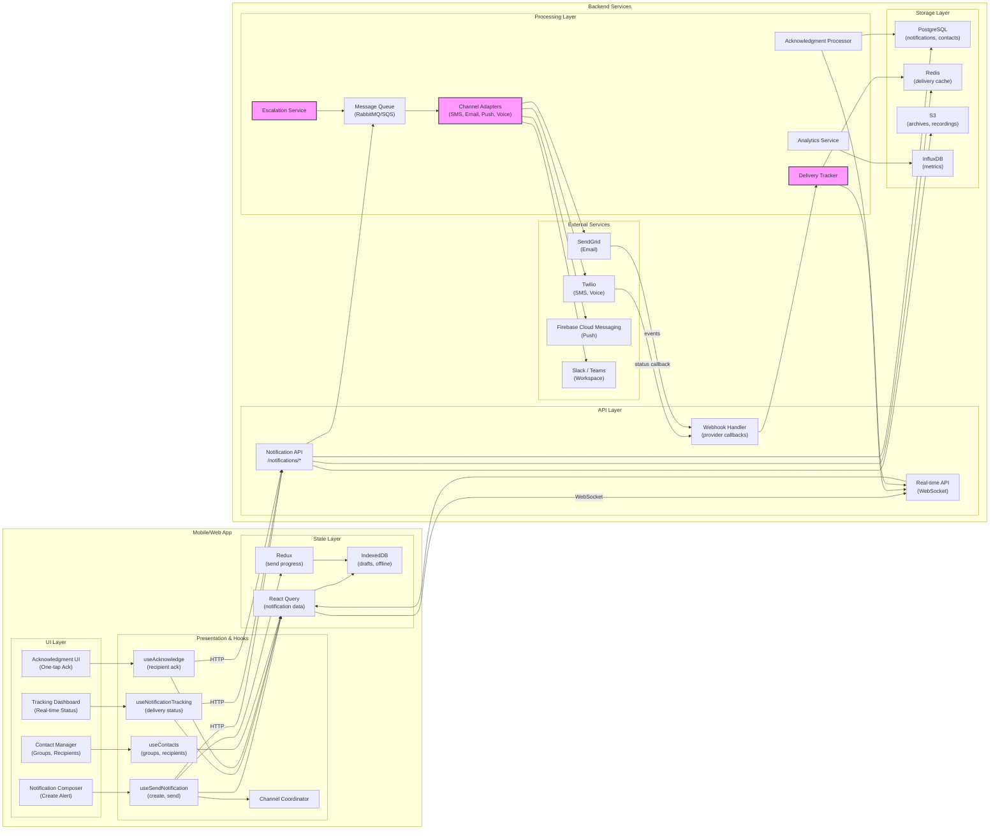

# Mobile System Design — Mass Notification System


## 1) Requirements

- Functional requirements
    - Multi-channel alerting: SMS, Voice Call, Email, Push Notification, Slack/Teams
    - Blast radius control: send to specific groups, roles, or entire organization
    - Two-way acknowledgment tracking (who received, who opened, who acknowledged)
    - Priority levels: Critical, High, Medium, Low
    - Template library for common scenarios
    - Scheduled and immediate sending
    - Contact list management with role-based groups
    - Escalation rules (if no response within X minutes, escalate)
    - Geographic targeting (send to users in specific regions)
    - Compliance mode recording (for regulated industries)
    - Mobile app for both sending and receiving notifications
    - Offline queuing for recipients without connectivity

- Non-functional:
    - Low latency delivery (<30 seconds for critical alerts)
    - High throughput (10,000+ messages per minute)
    - 99.99% delivery success rate
    - Resilient to individual channel failures (fallback mechanisms)
    - Scalable to 100,000+ recipients
    - GDPR and TCPA compliant
    - Real-time delivery status tracking

---

## 2) Caching, offline & sync strategy

- Client caching:
    - Cache notification templates locally for offline creation
    - Store contact lists and groups in IndexedDB / AsyncStorage
    - Persist notification history for review
    - Cache acknowledgment status for offline tracking

- Offline sending:
    - Queue notifications when sender is offline
    - Auto-send when connection restored
    - Show pending status in UI
    - Warn user if offline for critical alerts

- Offline receiving:
    - Native push notifications work offline (queued by OS)
    - SMS and voice calls work independently of app
    - App syncs missed notifications on reconnect
    - Acknowledgments queued offline and synced

- Real-time sync:
    - WebSocket for live acknowledgment updates
    - Pusher events for delivery status changes
    - Server-sent events for large-scale broadcasts
    - Optimistic UI updates with server reconciliation

---

## 3) Data models (shared types)

```ts
// Notification
interface Notification {
  id: string;
  title: string;
  message: string;
  priority: 'critical' | 'high' | 'medium' | 'low';
  channels: NotificationChannel[];
  recipients: Recipient[];
  groups?: string[]; // group IDs
  roles?: string[];
  status: 'draft' | 'scheduled' | 'sending' | 'sent' | 'failed' | 'cancelled';
  createdAt: string;
  createdBy: string;
  scheduledFor?: string;
  sentAt?: string;
  templateId?: string;
  requiresAck: boolean;
  escalationRules?: EscalationRule[];
  expiresAt?: string;
  metadata?: Record<string, any>;
}

// Notification channel
type NotificationChannel = 'sms' | 'voice' | 'email' | 'push' | 'slack' | 'teams';

// Recipient
interface Recipient {
  id: string;
  userId?: string;
  name: string;
  email?: string;
  phone?: string;
  deviceTokens?: string[];
  role?: string;
  group?: string;
  timezone?: string;
  preferredChannels?: NotificationChannel[];
}

// Delivery status
interface DeliveryStatus {
  id: string;
  notificationId: string;
  recipientId: string;
  channel: NotificationChannel;
  status: 'queued' | 'sent' | 'delivered' | 'failed' | 'bounced';
  sentAt?: string;
  deliveredAt?: string;
  failureReason?: string;
  retryCount: number;
  metadata?: Record<string, any>;
}

// Acknowledgment
interface Acknowledgment {
  id: string;
  notificationId: string;
  recipientId: string;
  acknowledgedAt: string;
  method: 'button_click' | 'reply_sms' | 'email_open' | 'voice_keypress';
  response?: string; // optional text response
  location?: { lat: number; lng: number };
}

// Escalation rule
interface EscalationRule {
  id: string;
  notificationId: string;
  condition: 'no_ack_within' | 'delivery_failed' | 'open_rate_below';
  threshold: number; // minutes for time-based, percentage for rate-based
  action: 'resend' | 'escalate_to_manager' | 'add_channel' | 'call_emergency_contact';
  actionChannels?: NotificationChannel[];
  escalateToRoles?: string[];
}

// Template
interface NotificationTemplate {
  id: string;
  name: string;
  description: string;
  scenario: 'ransomware' | 'data_breach' | 'system_outage' | 'building_evacuation' | 'custom';
  defaultChannels: NotificationChannel[];
  titleTemplate: string; // supports variables like {{incident_type}}
  messageTemplate: string;
  defaultPriority: 'critical' | 'high' | 'medium' | 'low';
  requiresAck: boolean;
  variables?: TemplateVariable[];
  createdAt: string;
  createdBy: string;
}

// Template variable
interface TemplateVariable {
  name: string;
  type: 'string' | 'number' | 'date';
  required: boolean;
  defaultValue?: any;
}

// Contact group
interface ContactGroup {
  id: string;
  name: string;
  description: string;
  members: string[]; // recipient IDs
  roles?: string[];
  createdAt: string;
  updatedAt: string;
}

// Notification stats
interface NotificationStats {
  notificationId: string;
  totalRecipients: number;
  sentCount: number;
  deliveredCount: number;
  failedCount: number;
  acknowledgedCount: number;
  openRate: number; // percentage
  ackRate: number; // percentage
  avgDeliveryTime: number; // seconds
  byChannel: ChannelStats[];
}

// Channel stats
interface ChannelStats {
  channel: NotificationChannel;
  sent: number;
  delivered: number;
  failed: number;
  avgDeliveryTime: number;
}
```

---

## 4) REST endpoints (mapping from UI)

- POST /notifications/send
    - body: Notification
    - response: { notification: Notification, jobId: string }

- POST /notifications/draft
    - body: Partial<Notification>
    - response: { notification: Notification }

- GET /notifications/{notificationId}
    - response: Notification

- GET /notifications
    - query params: status, priority, startDate, endDate, limit, cursor
    - response: { notifications: Notification[], nextCursor?: string }

- POST /notifications/{notificationId}/cancel
    - response: { success: boolean }

- GET /notifications/{notificationId}/status
    - response: NotificationStats

- GET /notifications/{notificationId}/deliveries
    - response: { deliveries: DeliveryStatus[] }

- GET /notifications/{notificationId}/acknowledgments
    - response: { acknowledgments: Acknowledgment[] }

- POST /notifications/{notificationId}/acknowledge
    - body: { recipientId, response? }
    - response: { acknowledgment: Acknowledgment }

- GET /templates
    - response: { templates: NotificationTemplate[] }

- POST /templates
    - body: NotificationTemplate
    - response: { template: NotificationTemplate }

- GET /contacts/groups
    - response: { groups: ContactGroup[] }

- POST /contacts/groups
    - body: ContactGroup
    - response: { group: ContactGroup }

- GET /contacts/recipients
    - query params: search, group, role
    - response: { recipients: Recipient[] }

- POST /contacts/recipients
    - body: Recipient
    - response: { recipient: Recipient }

- POST /contacts/import
    - body: CSV file or array of recipients
    - response: { imported: number, failed: number, errors: any[] }

Webhook callbacks:
- POST /webhooks/twilio/sms-status
- POST /webhooks/twilio/voice-status
- POST /webhooks/sendgrid/email-events

Real-time events (WebSocket / Pusher):
- private-notification-{id}:delivery_updated
- private-notification-{id}:acknowledgment_received
- private-notification-{id}:status_changed
- private-user-{userId}:notification_received

---

## 5) High‑level architecture (narrative)

- Mobile/Web Client:
    - Notification Composer: create and send alerts
    - Template Library: pre-configured scenarios
    - Contact Manager: manage groups and recipients
    - Dashboard: real-time tracking of sent notifications
    - Acknowledgment UI: one-tap acknowledge for recipients
    - History: review past notifications

- Presentation / Hooks / Services:
    - React hooks: useNotifications, useSendNotification, useAcknowledge
    - Delivery Tracker: monitors real-time status
    - Channel Coordinator: manages multi-channel sending
    - Escalation Engine: triggers escalations based on rules

- State Management:
    - React Query for notification data
    - Redux for send progress and UI state
    - WebSocket for real-time delivery updates
    - Local persistence for offline drafts

- Backend Services:
    - Notification API: REST endpoints for CRUD
    - Message Queue: RabbitMQ / SQS for scalable sending
    - Channel Adapters: Twilio (SMS/Voice), SendGrid (Email), FCM (Push), Slack/Teams APIs
    - Delivery Tracker: monitors delivery status from providers
    - Acknowledgment Processor: handles incoming acks
    - Escalation Service: executes escalation rules
    - Analytics Service: calculates delivery and ack rates

- Storage & Persistence:
    - PostgreSQL: notifications, recipients, groups, templates
    - Redis: delivery status cache, real-time stats
    - S3: notification archives, compliance recordings
    - Time-series DB (InfluxDB): delivery metrics

- External Integrations:
    - Twilio: SMS and Voice
    - SendGrid / SES: Email
    - Firebase Cloud Messaging: Push notifications
    - Slack / Microsoft Teams APIs: Workspace notifications

---

## 6) Mermaid diagram (high level design)



---

## 7) Example code snippets

### src/api/notificationsApi.ts
```typescript
import axios from 'axios';

const api = axios.create({
  baseURL: 'https://api.shadowhq.com',
  timeout: 15000,
});

export async function sendNotification(notification: {
  title: string;
  message: string;
  priority: string;
  channels: string[];
  recipients?: string[];
  groups?: string[];
  roles?: string[];
  requiresAck?: boolean;
  scheduledFor?: string;
}) {
  const { data } = await api.post('/notifications/send', notification);
  return data;
}

export async function fetchNotifications(params: {
  status?: string;
  priority?: string;
  limit?: number;
  cursor?: string;
}) {
  const { data } = await api.get('/notifications', { params });
  return data;
}

export async function fetchNotificationStatus(notificationId: string) {
  const { data } = await api.get(`/notifications/${notificationId}/status`);
  return data;
}

export async function acknowledgeNotification(
  notificationId: string,
  recipientId: string,
  response?: string
) {
  const { data } = await api.post(`/notifications/${notificationId}/acknowledge`, {
    recipientId,
    response,
  });
  return data;
}

export async function fetchTemplates() {
  const { data } = await api.get('/templates');
  return data.templates;
}

export async function createTemplate(template: any) {
  const { data } = await api.post('/templates', template);
  return data.template;
}

export async function fetchContactGroups() {
  const { data } = await api.get('/contacts/groups');
  return data.groups;
}

export async function fetchRecipients(params: {
  search?: string;
  group?: string;
  role?: string;
}) {
  const { data } = await api.get('/contacts/recipients', { params });
  return data.recipients;
}

export async function importContacts(contacts: any[]) {
  const { data } = await api.post('/contacts/import', { contacts });
  return data;
}
```

### src/hooks/useSendNotification.ts
```typescript
import { useMutation, useQueryClient } from '@tanstack/react-query';
import { sendNotification } from '../api/notificationsApi';
import NetInfo from '@react-native-community/netinfo';
import { store } from '../store';

export function useSendNotification() {
  const queryClient = useQueryClient();

  return useMutation(
    async (notification: any) => {
      const state = await NetInfo.fetch();
      
      if (!state.isConnected) {
        // Queue for later
        store.dispatch({
          type: 'notifications/queueOffline',
          payload: notification,
        });
        throw new Error('Offline - notification queued');
      }

      return await sendNotification(notification);
    },
    {
      onSuccess: (data) => {
        queryClient.invalidateQueries(['notifications']);
        // Show success toast
        console.log('Notification sent:', data.notification.id);
      },
      onError: (error: any) => {
        if (error.message !== 'Offline - notification queued') {
          // Show error toast for real failures
          console.error('Failed to send notification:', error);
        }
      },
    }
  );
}

export function useNotificationTracking(notificationId: string | null) {
  const queryClient = useQueryClient();

  const statusQuery = useQuery(
    ['notification-status', notificationId],
    () => fetchNotificationStatus(notificationId!),
    {
      enabled: !!notificationId,
      refetchInterval: 5000, // poll every 5 seconds
    }
  );

  // Real-time updates via WebSocket
  useEffect(() => {
    if (!notificationId) return;

    const socket = io(`wss://api.shadowhq.com/notifications/${notificationId}`, {
      auth: { token: localStorage.getItem('auth_token') },
    });

    socket.on('delivery_updated', (delivery) => {
      queryClient.invalidateQueries(['notification-status', notificationId]);
    });

    socket.on('acknowledgment_received', (ack) => {
      queryClient.invalidateQueries(['notification-status', notificationId]);
    });

    return () => {
      socket.disconnect();
    };
  }, [notificationId, queryClient]);

  return statusQuery;
}
```

### src/services/channelAdapters.ts
```typescript
// Server-side channel adapters (simplified)
import twilio from 'twilio';
import sgMail from '@sendgrid/mail';
import admin from 'firebase-admin';

export class SMSAdapter {
  private client: twilio.Twilio;

  constructor(accountSid: string, authToken: string) {
    this.client = twilio(accountSid, authToken);
  }

  async send(to: string, message: string, from: string): Promise<any> {
    try {
      const result = await this.client.messages.create({
        to,
        from,
        body: message,
        statusCallback: `${process.env.API_BASE_URL}/webhooks/twilio/sms-status`,
      });
      return { success: true, messageId: result.sid };
    } catch (error) {
      console.error('SMS send failed:', error);
      return { success: false, error: error.message };
    }
  }
}

export class VoiceAdapter {
  private client: twilio.Twilio;

  constructor(accountSid: string, authToken: string) {
    this.client = twilio(accountSid, authToken);
  }

  async call(to: string, message: string, from: string): Promise<any> {
    try {
      const twiml = `
        <Response>
          <Say voice="alice">${message}</Say>
          <Gather numDigits="1" timeout="10">
            <Say>Press 1 to acknowledge this message.</Say>
          </Gather>
        </Response>
      `;

      const result = await this.client.calls.create({
        to,
        from,
        twiml,
        statusCallback: `${process.env.API_BASE_URL}/webhooks/twilio/voice-status`,
      });

      return { success: true, callId: result.sid };
    } catch (error) {
      console.error('Voice call failed:', error);
      return { success: false, error: error.message };
    }
  }
}

export class EmailAdapter {
  constructor(apiKey: string) {
    sgMail.setApiKey(apiKey);
  }

  async send(to: string, subject: string, body: string, from: string): Promise<any> {
    try {
      const msg = {
        to,
        from,
        subject,
        html: body,
        trackingSettings: {
          clickTracking: { enable: true },
          openTracking: { enable: true },
        },
      };

      await sgMail.send(msg);
      return { success: true };
    } catch (error) {
      console.error('Email send failed:', error);
      return { success: false, error: error.message };
    }
  }
}

export class PushAdapter {
  async send(deviceTokens: string[], title: string, body: string, data?: any): Promise<any> {
    try {
      const message = {
        notification: { title, body },
        data: data || {},
        tokens: deviceTokens,
      };

      const response = await admin.messaging().sendMulticast(message);
      return {
        success: true,
        successCount: response.successCount,
        failureCount: response.failureCount,
      };
    } catch (error) {
      console.error('Push notification failed:', error);
      return { success: false, error: error.message };
    }
  }
}
```

---

## 8) Multi-channel strategy & fallback

- Channel selection:
    - Critical alerts: SMS + Voice + Push simultaneously
    - High priority: SMS + Email + Push
    - Medium: Email + Push
    - Low: Push only

- Fallback mechanism:
    - If primary channel fails, try secondary
    - Example: SMS fails → try voice call
    - If all channels fail, escalate to manager

- Channel-specific optimizations:
    - SMS: 160 character limit, use URL shorteners
    - Voice: Text-to-speech with clear pronunciation
    - Email: HTML formatting, images, tracking pixels
    - Push: Rich notifications with actions

---

## 9) Acknowledgment & two-way communication

- Acknowledgment methods:
    - Push: tap "Acknowledge" button in notification
    - SMS: reply "ACK" or "OK"
    - Email: click link or open tracking
    - Voice: press 1 on keypad

- Tracking:
    - Real-time dashboard shows who acknowledged
    - Visual indicators: green (ack'd), yellow (delivered), red (failed)
    - Percentage completion
    - Time-to-acknowledge metrics

- Follow-up:
    - If no ack within threshold, send reminder
    - Escalate to manager or emergency contact
    - Use different channel for escalation

---

## 10) Escalation rules

- Time-based escalation:
    - No acknowledgment within 15 minutes → resend
    - No acknowledgment within 30 minutes → escalate to manager
    - No acknowledgment within 60 minutes → call emergency contact

- Delivery-based escalation:
    - If delivery fails on SMS → try voice call
    - If all channels fail → notify sender

- Rate-based escalation:
    - If open rate < 50% after 10 minutes → add voice channel
    - If ack rate < 25% after 30 minutes → escalate to executives

---

## 11) Performance & UX notes

- Low latency:
    - Message queue for async processing
    - Parallel sending across channels
    - Provider rate limit management
    - Automatic retries with exponential backoff

- High throughput:
    - Batch API calls where possible
    - Connection pooling for providers
    - Horizontal scaling of channel adapters
    - Rate limiting per provider limits

- Mobile UX:
    - One-tap acknowledge
    - Rich push notifications with action buttons
    - Notification sound levels based on priority
    - Do Not Disturb override for critical alerts

---

## 12) Sequence flows (brief)

- Send critical alert:
    - Incident detected → Open notification composer
    - Select "Ransomware" template → Customize message
    - Select recipients: "All IT Staff" group
    - Set channels: SMS + Voice + Push
    - Set priority: Critical, requires ack
    - Click Send → Messages queued
    - Real-time status: 95/100 delivered, 82/100 ack'd

- Receive and acknowledge:
    - User receives SMS: "CRITICAL: Do not turn on laptops"
    - User opens mobile app notification
    - Taps "Acknowledge" button
    - System records ack with timestamp
    - Dashboard updates: 83/100 ack'd

- Escalation flow:
    - 15 minutes pass, only 50% acknowledged
    - Escalation rule triggers
    - System sends voice calls to non-responders
    - 90% now acknowledged
    - No further escalation needed

---

## 13) Compliance & security notes

- TCPA compliance:
    - Obtain consent before sending SMS/voice
    - Provide opt-out mechanism
    - Respect Do Not Call lists
    - Document consent in database

- GDPR compliance:
    - Data minimization (only store necessary info)
    - Right to be forgotten (delete recipient data)
    - Data portability (export recipient data)
    - Consent management

- Security:
    - TLS for all communications
    - API authentication with rate limiting
    - Webhook signature verification
    - PII encryption at rest

- Audit trail:
    - Log all sends with timestamp
    - Track delivery and acknowledgment
    - Record escalations and failures
    - Retention policy (e.g., 7 years)

- Recording compliance:
    - Voice call recordings for compliance
    - Announce recording at start of call
    - Secure storage of recordings
    - Access controls for playback
