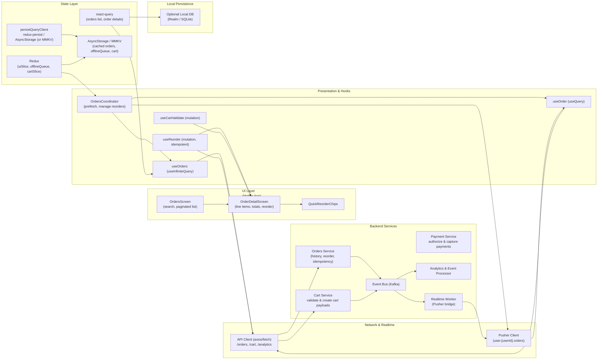

# Orders & Reorder — Past Purchases, One‑tap Reorder & Order Details


## 1) Requirements

- Functional
    - List user's past orders with date, status, total, and short contents.
    - Search & filter orders by date, status (Delivered, Cancelled), or text.
    - Order detail view showing line items, prices, quantities, shipping, payment summary, and status timeline.
    - One‑tap reorder: repopulate cart with items from a past order (exact quantities) and redirect to cart/checkout.
    - Quick reorders: save common reorders as shortcuts.
    - Handle unavailable items: notify user, suggest alternatives, show price changes.
    - Idempotent reorder action to avoid duplicate orders on retry.
    - Persist order history and sync across devices.
    - Allow cancellation where permitted and show tracking/fulfillment updates if applicable.
- Non-functional
    - Fast listing and detail reads (many more reads than writes).
    - Idempotency and safe retry semantics for reorder and order placement endpoints.
    - Strong observability for reorder conversion and failures.
    - Secure payments & order data (PCI, encryption).
    - Offline UX: allow viewing cached history when offline; queue reorder attempts when offline and offer re-run when connectivity restored.

---

## 2) Caching, offline & sync strategy (react-query + redux + pusher)

- Read-heavy caching
    - Use react-query for lists and details:
        - useInfiniteQuery(['orders', userId, filters]) for paginated order history.
        - useQuery(['order', orderId]) for details.
    - Set staleTime to balance freshness and UX (e.g., orders: 5–15 min; order detail: 1–5 min).
    - Persist query cache to AsyncStorage/MMKV for instant resume and offline viewing.

- Optimistic & idempotent reorders
    - Reorder triggers a client-side "repopulate cart" that can be optimistic in UI (showing items queued in cart).
    - Use idempotency key for the server-side reorder order creation/replication call so retries are safe.
    - If offline, enqueue a reorder intent in redux offlineQueue (persisted) and replay on reconnect. For safety, don't auto-create payment/order while offline — repopulate cart locally and require online confirmation.

- Offline viewing & replay
    - Persist last N pages of order history locally to show past purchases while offline; add a banner indicating offline status.
    - Queue reorder requests and cart checkout attempts in offlineQueue; replay with idempotency keys.

- Realtime & sync
    - Use Pusher to receive server-side updates about order status (shipped, delivered, cancelled). Subscribe to user.{userId}.orders.
    - On events, patch react-query caches and surface in-app notifications.

- Conflict & availability
    - Before final checkout of a repopulated cart, validate item availability and prices via POST /cart/validate; surface adjustments and alternatives.

---

## 3) Data models (shared types)

```ts
interface OrderLine {
  productId: string;
  name: string;
  brand?: string;
  imageUrl?: string;
  unitPriceCents: number;
  quantity: number;
  lineTotalCents: number;
  sku?: string;
  status?: 'available'|'unavailable'|'backordered';
}

interface Order {
  id: string; // Order #3491
  userId: string;
  createdAt: string;
  status: 'created'|'processing'|'shipped'|'delivered'|'cancelled'|'refunded';
  items: OrderLine[];
  subtotalCents: number;
  shippingCents?: number;
  taxCents?: number;
  totalCents: number;
  paymentMethod?: { type: string; last4?: string };
  shippingAddress?: any;
  notes?: string;
  fulfillment?: { carrier?: string; tracking?: string; status?: string };
}

interface ReorderRequest {
  idempotencyKey: string; // client-generated
  sourceOrderId: string;
  repopulateCartOnly?: boolean; // if true, server returns items but doesn't place order
  adjustOutOfStock?: 'skip'|'suggest'|'fail';
}

interface CartItem {
  productId: string;
  qty: number;
  clientLineId?: string;
}
```

---

## 4) REST endpoints (mapping from the UI)

- GET /users/{userId}/orders?limit=&cursor=&status=&query=
    - Paginated order history.
- GET /orders/{orderId}
    - Full order details, lines, payment and fulfillment info.
- POST /orders/{orderId}/reorder
    - body: ReorderRequest { idempotencyKey, repopulateCartOnly?, adjustOutOfStock? }
    - If repopulateCartOnly: server returns a cart payload (items with current price & availability) but does not place an order.
    - If not: server attempts to create a new order (requires payment confirmation) — must be idempotent.
- POST /cart/validate
    - body: { items: CartItem[] } — validates price & availability; returns adjusted cart and warnings.
- POST /cart/items
    - add items to cart (used when server returns repopulated cart; client may also add lines locally)
- GET /users/{userId}/orders/quick-reorders
    - returns precomputed quick reorder items/chips derived from past orders
- POST /analytics/event
    - track reorder clicks, repopulate success/failure, adjustments shown
- Realtime:
    - Pusher channels user.{userId}.orders -> events: order.updated, fulfillment.updated

---

## 5) High‑level architecture (narrative — ordered for mermaid)

- UI Layer (first)
    - OrdersScreen — search/filter and paginated order list; each order card shows date, status, total, items summary and primary CTA "Reorder" or "View".
    - OrderDetailScreen — full items list, totals, shipping & payment summary, one-tap "Repopulate Cart / Reorder" callout, Quick Reorders chips and notes about price/availability changes.
    - Small components: OrderCard, OrderLineRow, QuickReorderChip, AdjustmentModal.

- Presentation & Hooks
    - useOrders (useInfiniteQuery) — fetch paginated list with filters
    - useOrder (useQuery) — fetch single order detail
    - useReorder (useMutation) — POST /orders/{orderId}/reorder (idempotent)
    - useCartValidate (useMutation) — validate cart items before checkout
    - OrdersCoordinator — orchestrates prefetching (prefetch order detail from list), offline queue replay, Pusher subscriptions, and UX flows for adjustments

- Network & Realtime
    - ApiClient (axios) to call orders, cart and analytics endpoints.
    - Pusher/WebSocket to receive order and fulfillment updates and to notify client to refresh cache or push in-app updates.

- State Layer
    - react-query: server-synced order lists & order detail caches
    - redux:
        - uiSlice: active filters, modal visibility, lastViewedOrder
        - offlineSlice: queued reorder intents and pending checkout actions
        - cartSlice: current cart state (client authoritative until checkout)
    - persistQueryClient + redux-persist to AsyncStorage/MMKV for offline resume

- Local Persistence
    - AsyncStorage/MMKV: persist last N orders, offlineQueue, last search/filter.
    - Optional local DB (Realm/SQLite) for detailed analytics or long histories.

- Backend Services
    - Orders Service: order history reads, reorder operations, idempotent order creation
    - Cart Service: cart validation & creation
    - Payment Service: handle payment authorization (deferred for reorder flows if repopulateCartOnly)
    - Analytics Worker: logs reorder events and adjustment reasons
    - Event Bus & Realtime Worker: emits order.updated/fulfillment.updated to Pusher

---

## 6) React‑Query, Redux & Pusher integration (implementation notes)

- React Query responsibilities
    - useInfiniteQuery(['orders', userId, filters]) to list orders; keepPreviousData to avoid flicker.
    - useQuery(['order', orderId]) for details; prefetch on hover/tap using queryClient.prefetchQuery(['order', id]).
    - Mutations: useMutation for reorder — on success, invalidate cart & orders queries as needed.

- Redux responsibilities
    - offlineSlice: store reorder intents (with idempotencyKey) and cart changes when offline.
    - uiSlice: store filters/search state and lastViewedOrderId (for deep linking).
    - cartSlice: local cart management and optimistic UI (persisted).

- Pusher responsibilities
    - Subscribe to user.{userId}.orders when Orders screens are active.
    - Bind order.updated and fulfillment.updated events:
        - Patch react-query caches with setQueryData for affected orders.
        - Notify OrdersCoordinator to prefetch or refresh the list/detail if needed.

- Reorder safety & flow
    - Client calls POST /orders/{orderId}/reorder with idempotencyKey.
    - Server returns one of:
        - cart payload (if repopulateCartOnly=true) — client populates cart and prompts user.
        - created order (if reorder placed) — return order id & status.
        - adjustments: list of items unavailable or price-changed — client should present AdjustmentModal and allow user to continue, accept adjustments, or cancel.
    - If offline: client repopulates cart locally and enqueues the reorder intent to be reattempted when online (or prompts user to continue to checkout when online).

---

## 7) Mermaid diagram (UI Layer first, presentation & hooks, Network & realtime, state layer, local persistence, Backend services)



---

## 8) Example code snippets

Below are compact examples mapping the UI to client hooks and API calls. Adapt to your stack and auth.

### src/api/ordersApi.ts
```ts
import axios from 'axios';
const api = axios.create({ baseURL: 'https://api.example.com', timeout: 15000 });

export async function fetchOrders(userId: string, { limit = 20, cursor, status, q } = {}) {
  const params: any = { limit };
  if (cursor) params.cursor = cursor;
  if (status) params.status = status;
  if (q) params.query = q;
  const { data } = await api.get(`/users/${userId}/orders`, { params });
  return data; // { items: Order[], nextCursor }
}

export async function fetchOrder(orderId: string) {
  const { data } = await api.get(`/orders/${orderId}`);
  return data;
}

export async function reorderOrder(orderId: string, payload: { idempotencyKey: string; repopulateCartOnly?: boolean; adjustOutOfStock?: string }) {
  const { data } = await api.post(`/orders/${orderId}/reorder`, payload);
  return data;
}

export default api;
```

### src/hooks/useOrders.ts
```ts
import { useInfiniteQuery } from '@tanstack/react-query';
import { fetchOrders } from '../api/ordersApi';

export function useOrders(userId: string, filters = {}) {
  return useInfiniteQuery(
    ['orders', userId, filters],
    ({ pageParam }) => fetchOrders(userId, { ...filters, cursor: pageParam }),
    {
      getNextPageParam: (last) => last.nextCursor,
      staleTime: 5 * 60 * 1000,
      keepPreviousData: true,
    }
  );
}
```

### src/hooks/useReorder.ts
```ts
import { useMutation, useQueryClient } from '@tanstack/react-query';
import { reorderOrder } from '../api/ordersApi';
import { v4 as uuidv4 } from 'uuid';
import { store } from '../store';

export function useReorder(userId: string) {
  const qc = useQueryClient();

  return useMutation(
    async ({ orderId, repopulateCartOnly = true, adjustOutOfStock = 'suggest' }: any) => {
      const idempotencyKey = uuidv4();
      return reorderOrder(orderId, { idempotencyKey, repopulateCartOnly, adjustOutOfStock });
    },
    {
      onMutate: async (vars) => {
        // optimistic: optionally show "Repopulating cart..." and keep UI responsive
        qc.setQueryData(['cart', userId], (old: any) => {
          // If server returns items immediately, replace; for optimistic we can show a spinner
          return old;
        });

        // if offline, enqueue reorder intent
        if (typeof navigator !== 'undefined' && !navigator.onLine) {
          store.dispatch({ type: 'offline/enqueue', payload: { id: vars.idempotencyKey, type: 'reorder', payload: vars }});
        }
      },
      onError: (err, vars, context) => {
        // Show error modal or toast; rollback UI if necessary
      },
      onSuccess: (data, vars) => {
        // If repopulateCartOnly, server returns cart payload: set cart cache and navigate to cart screen
        if (data.cart) {
          qc.setQueryData(['cart', userId], data.cart);
        }
        // If server created order, refresh orders cache
        qc.invalidateQueries(['orders', userId]);
      },
      onSettled: () => {
        qc.invalidateQueries(['cart', userId]);
      }
    }
  );
}
```

### src/services/pusher.ts
```ts
import Pusher from 'pusher-js/react-native';
import { queryClient } from '../reactQueryClient';

let pusher: Pusher | null = null;

export function initPusher(apiKey: string, options: any = {}) {
  if (pusher) return pusher;
  pusher = new Pusher(apiKey, { cluster: options.cluster || 'mt1', forceTLS: true });
  pusher.connection.bind('connected', () => console.log('Pusher connected'));
  return pusher;
}

export function subscribeUserOrders(userId: string) {
  if (!pusher) throw new Error('Pusher not initialized');
  const channel = pusher.subscribe(`user.${userId}.orders`);

  channel.bind('order.updated', (payload: any) => {
    // Update order detail cache if present
    const { orderId, updates } = payload;
    queryClient.setQueryData(['order', orderId], (old: any) => ({ ...(old || {}), ...updates }));
    queryClient.invalidateQueries(['orders', userId]); // refresh list
  });

  channel.bind('fulfillment.updated', (payload: any) => {
    queryClient.invalidateQueries(['order', payload.orderId]);
  });

  return () => pusher.unsubscribe(`user.${userId}.orders`);
}
```

---

## 9) UX & accessibility notes

- Reorder affordances
    - One-tap Repopulate Cart should show a clear confirmation flow and a summary of adjustments before redirect to checkout.
    - Show a clear badge/notice for items that changed price or are out-of-stock; present alternatives inline.
- Accessibility
    - Provide descriptive labels for order cards: "Order 3491, delivered on Nov 05, 2025, total $85.98. Tap to view details."
    - Ensure CTAs are reachable via keyboard and screen reader; announce when a cart is repopulated.
- Error & conflict handling
    - If reorder fails due to stock, show immediate modal with options: remove unavailable items, choose alternatives, or delay order.
- Payment & security
    - Never store full card data on client; use tokenized payment and reauthorize when necessary for reorder payments.

---

## 10) Offline replay & conflict handling

- Offline reorder attempts
    - Allow client to repopulate cart locally when offline; enqueue any server-side reorder/create-order actions.
    - On reconnect, attempt to replay reorder with idempotencyKey and surface conflicts if items unavailable or prices changed.
- Conflict UX
    - Offer a single "Resolve order adjustments" screen listing changes with suggested fixes (swap item, accept new price, remove item).
    - Do not auto-charge or auto-create payment without final user confirmation if significant changes occur.

---

## 11) Performance & ops notes

- Read scaling
    - Serve order lists from read-optimized stores or caches (Redis/ElasticCache) to keep list latency low.
- Idempotency & retries
    - Use idempotency keys persisted client-side to ensure safe retries and avoid duplicate orders.
- Observability
    - Capture metrics: reorder click rate, repopulate success rate, adjustment frequency, offlineQueue length, and replay success.
- Security & compliance
    - Ensure payment flows are PCI compliant and use secure tokens for reorder placements.

---

## 12) Sequence flows (brief)

- View history:
    - useOrders loads cached pages -> show list -> when user taps an order, prefetch useOrder and open OrderDetailScreen.
- One-tap repopulate:
    - User taps "Reorder - Repopulate Cart" -> useReorder mutation with idempotencyKey and repopulateCartOnly=true -> server returns cart payload (current prices/availability) -> client populates cart and navigates to Cart/Checkout -> client runs POST /cart/validate before checkout -> user confirms payment -> POST /orders creates new order.
- Full server-side reorder (optional):
    - If user opts to reorder immediately (fast checkout), useReorder may create order server-side (requires payment token); server returns new order id and emits order.updated -> Pusher -> clients update caches.
- Offline replay:
    - User taps reorder while offline -> client repopulates local cart and enqueues reorder intent -> on reconnect background worker replays reorder (idempotent) and notifies user of outcomes.

---
