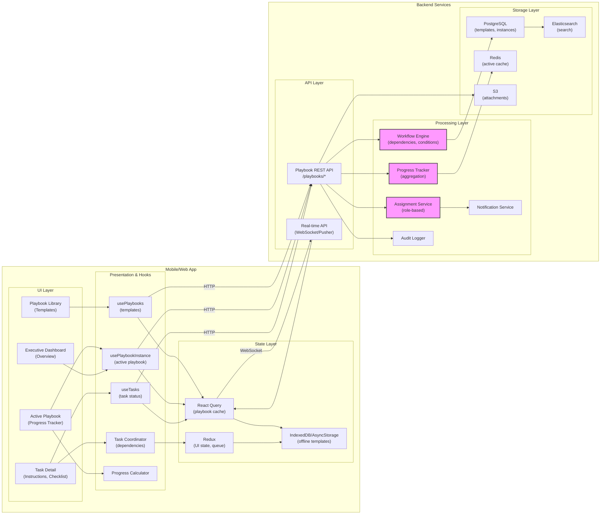

# Mobile System Design — Resilient Response Playbooks


## 1) Requirements

- Functional requirements
    - Dynamic incident response playbooks (not static PDFs)
    - Pre-configured workflows for common incidents (Ransomware, Data Breach, DDoS, etc.)
    - Auto-assignment of tasks to specific roles based on incident type
    - Real-time status tracking for all tasks across all team members
    - Three-phase structure: Prepare, Practice, Respond
    - Task dependencies and conditional logic
    - Progress visualization for executives (dashboard view)
    - Mobile and desktop access for on-the-go response
    - Playbook versioning and approval workflows
    - Template customization per organization
    - Integration with War Room and notification systems
    - Offline mode for critical playbook steps

- Non-functional:
    - Sub-second task status updates
    - High availability during crisis (99.99% uptime)
    - Audit trail for all playbook executions
    - Scalable to 500+ tasks per incident
    - Role-based access control
    - Compliance with incident response frameworks (NIST, ISO)

---

## 2) Caching, offline & sync strategy

- Client caching:
    - Cache all playbook templates locally using IndexedDB / AsyncStorage
    - Persist active playbook state for offline access
    - Store task completion status locally with optimistic updates
    - Pre-download critical playbooks for offline use

- Optimistic updates:
    - Task status changes reflect immediately in UI
    - Queue updates when offline and sync when reconnected
    - Conflict resolution: server timestamp wins
    - Show "syncing" indicator for pending changes

- Real-time sync:
    - WebSocket connections for live task updates
    - Pusher events for status changes, assignments, and completions
    - Delta updates to minimize bandwidth
    - Operational transformation for collaborative editing

- Server-side caching:
    - Redis cache for active playbook instances
    - CDN for playbook templates and static assets
    - Edge caching for frequently accessed playbooks

---

## 3) Data models (shared types)

```ts
// Playbook template
interface PlaybookTemplate {
  id: string;
  name: string;
  incidentType: 'ransomware' | 'data_breach' | 'ddos' | 'insider_threat' | 'phishing' | 'custom';
  version: string;
  description: string;
  phases: Phase[];
  createdAt: string;
  updatedAt: string;
  createdBy: string;
  isApproved: boolean;
  approvedBy?: string;
  approvedAt?: string;
}

// Phase (Prepare, Practice, Respond)
interface Phase {
  id: string;
  name: 'prepare' | 'practice' | 'respond';
  displayName: string;
  description: string;
  tasks: Task[];
  order: number;
}

// Task
interface Task {
  id: string;
  phaseId: string;
  title: string;
  description: string;
  assignedRole: 'incident_commander' | 'legal' | 'it_ops' | 'ciso' | 'pr' | 'exec' | 'all';
  priority: 'critical' | 'high' | 'medium' | 'low';
  estimatedDuration?: number; // minutes
  dependsOn?: string[]; // task IDs that must complete first
  conditionalLogic?: ConditionalRule;
  resources?: Resource[];
  checklistItems?: ChecklistItem[];
  order: number;
}

// Conditional rule
interface ConditionalRule {
  condition: string; // e.g., "if ransomware_type == 'crypto'"
  action: 'show' | 'hide' | 'require' | 'skip';
}

// Resource attached to task
interface Resource {
  id: string;
  type: 'document' | 'link' | 'contact' | 'tool';
  title: string;
  url?: string;
  description?: string;
}

// Checklist item within task
interface ChecklistItem {
  id: string;
  text: string;
  isRequired: boolean;
  order: number;
}

// Active playbook instance
interface PlaybookInstance {
  id: string;
  templateId: string;
  templateVersion: string;
  incidentId: string;
  status: 'active' | 'paused' | 'completed' | 'cancelled';
  startedAt: string;
  completedAt?: string;
  startedBy: string;
  currentPhase: 'prepare' | 'practice' | 'respond';
  tasks: TaskExecution[];
  participants: PlaybookParticipant[];
  metadata: Record<string, any>; // custom fields per incident
}

// Task execution instance
interface TaskExecution {
  id: string;
  taskId: string; // reference to template task
  instanceId: string;
  assignedTo?: string[]; // specific user IDs
  status: 'pending' | 'in_progress' | 'blocked' | 'completed' | 'skipped';
  startedAt?: string;
  completedAt?: string;
  completedBy?: string;
  notes?: string;
  checklistProgress?: ChecklistProgress[];
  blockedReason?: string;
  actualDuration?: number; // minutes
}

// Checklist progress
interface ChecklistProgress {
  itemId: string;
  isCompleted: boolean;
  completedAt?: string;
  completedBy?: string;
}

// Playbook participant
interface PlaybookParticipant {
  userId: string;
  name: string;
  email: string;
  role: string;
  assignedTaskCount: number;
  completedTaskCount: number;
  joinedAt: string;
}

// Task activity log
interface TaskActivity {
  id: string;
  taskExecutionId: string;
  userId: string;
  action: 'assigned' | 'started' | 'completed' | 'blocked' | 'note_added' | 'checklist_updated';
  timestamp: string;
  details: Record<string, any>;
}
```

---

## 4) REST endpoints (mapping from UI)

- GET /playbooks/templates
    - response: { templates: PlaybookTemplate[] }

- GET /playbooks/templates/{templateId}
    - response: PlaybookTemplate

- POST /playbooks/templates
    - body: PlaybookTemplate
    - response: { template: PlaybookTemplate }

- PUT /playbooks/templates/{templateId}
    - body: Partial<PlaybookTemplate>
    - response: { template: PlaybookTemplate }

- POST /playbooks/templates/{templateId}/approve
    - response: { template: PlaybookTemplate }

- POST /playbooks/instances/start
    - body: { templateId, incidentId, metadata }
    - response: { instance: PlaybookInstance }

- GET /playbooks/instances/{instanceId}
    - response: PlaybookInstance

- PATCH /playbooks/instances/{instanceId}/tasks/{taskId}/status
    - body: { status, notes, completedBy }
    - response: { task: TaskExecution }

- POST /playbooks/instances/{instanceId}/tasks/{taskId}/assign
    - body: { userIds }
    - response: { task: TaskExecution }

- PATCH /playbooks/instances/{instanceId}/tasks/{taskId}/checklist/{itemId}
    - body: { isCompleted }
    - response: { task: TaskExecution }

- GET /playbooks/instances/{instanceId}/dashboard
    - response: { summary: DashboardSummary }

- POST /playbooks/instances/{instanceId}/complete
    - response: { instance: PlaybookInstance }

- GET /playbooks/instances/{instanceId}/export
    - response: audit report (PDF/JSON)

Real-time events (WebSocket / Pusher):
- private-playbook-{instanceId}:task_updated
- private-playbook-{instanceId}:task_assigned
- private-playbook-{instanceId}:task_completed
- private-playbook-{instanceId}:phase_changed
- private-playbook-{instanceId}:participant_joined

---

## 5) High‑level architecture (narrative)

- Mobile/Web Client:
    - Playbook Library: browse and search available templates
    - Playbook Editor: create/edit playbook templates
    - Active Playbook View: track real-time progress
    - Task Detail Screen: view instructions, resources, checklist
    - Dashboard: executive view of overall progress
    - Mobile optimizations for field responders

- Presentation / Hooks / Services:
    - React hooks: usePlaybooks, usePlaybookInstance, useTasks
    - Task Coordinator: manages dependencies and conditional logic
    - Progress Calculator: computes completion percentages
    - Real-time Sync Service: WebSocket for status updates

- State Management:
    - React Query for playbook data and task state
    - Redux for UI state and offline queue
    - Optimistic updates for task status changes
    - Local persistence for offline access

- Backend Services:
    - Playbook API: CRUD for templates and instances
    - Workflow Engine: evaluates dependencies and conditions
    - Assignment Service: auto-assigns based on roles
    - Progress Tracker: aggregates status across tasks
    - Notification Service: alerts on task assignments
    - Audit Logger: records all playbook activities

- Storage & Persistence:
    - PostgreSQL: playbook templates, instances, task executions
    - Redis: active instance cache, real-time progress
    - S3: playbook attachments and exports
    - Elasticsearch: playbook search and analytics

---

## 6) Mermaid diagram (high level design)



---

## 7) Example code snippets

### src/api/playbooksApi.ts
```typescript
import axios from 'axios';

const api = axios.create({
  baseURL: 'https://api.shadowhq.com',
  timeout: 15000,
});

export async function fetchPlaybookTemplates() {
  const { data } = await api.get('/playbooks/templates');
  return data.templates;
}

export async function fetchPlaybookTemplate(templateId: string) {
  const { data } = await api.get(`/playbooks/templates/${templateId}`);
  return data;
}

export async function createPlaybookTemplate(template: any) {
  const { data } = await api.post('/playbooks/templates', template);
  return data.template;
}

export async function startPlaybookInstance(payload: {
  templateId: string;
  incidentId: string;
  metadata?: Record<string, any>;
}) {
  const { data } = await api.post('/playbooks/instances/start', payload);
  return data.instance;
}

export async function fetchPlaybookInstance(instanceId: string) {
  const { data } = await api.get(`/playbooks/instances/${instanceId}`);
  return data;
}

export async function updateTaskStatus(
  instanceId: string,
  taskId: string,
  payload: { status: string; notes?: string; completedBy?: string }
) {
  const { data } = await api.patch(
    `/playbooks/instances/${instanceId}/tasks/${taskId}/status`,
    payload
  );
  return data.task;
}

export async function assignTask(
  instanceId: string,
  taskId: string,
  userIds: string[]
) {
  const { data } = await api.post(
    `/playbooks/instances/${instanceId}/tasks/${taskId}/assign`,
    { userIds }
  );
  return data.task;
}

export async function updateChecklistItem(
  instanceId: string,
  taskId: string,
  itemId: string,
  isCompleted: boolean
) {
  const { data } = await api.patch(
    `/playbooks/instances/${instanceId}/tasks/${taskId}/checklist/${itemId}`,
    { isCompleted }
  );
  return data.task;
}

export async function fetchDashboard(instanceId: string) {
  const { data } = await api.get(`/playbooks/instances/${instanceId}/dashboard`);
  return data.summary;
}

export async function exportPlaybook(instanceId: string) {
  const { data } = await api.get(`/playbooks/instances/${instanceId}/export`, {
    responseType: 'blob',
  });
  return data;
}
```

### src/hooks/usePlaybookInstance.ts
```typescript
import { useQuery, useMutation, useQueryClient } from '@tanstack/react-query';
import {
  fetchPlaybookInstance,
  updateTaskStatus,
  assignTask,
  updateChecklistItem,
} from '../api/playbooksApi';
import { useEffect } from 'react';
import { io } from 'socket.io-client';

export function usePlaybookInstance(instanceId: string | null) {
  const queryClient = useQueryClient();

  const instanceQuery = useQuery(
    ['playbook-instance', instanceId],
    () => fetchPlaybookInstance(instanceId!),
    {
      enabled: !!instanceId,
      staleTime: 10000,
      refetchInterval: 30000, // fallback polling
    }
  );

  // Real-time updates
  useEffect(() => {
    if (!instanceId) return;

    const socket = io(`wss://api.shadowhq.com/playbook/${instanceId}`, {
      auth: { token: localStorage.getItem('auth_token') },
    });

    socket.on('task_updated', (task) => {
      queryClient.setQueryData(['playbook-instance', instanceId], (old: any) => {
        if (!old) return old;
        const updatedTasks = old.tasks.map((t: any) =>
          t.id === task.id ? { ...t, ...task } : t
        );
        return { ...old, tasks: updatedTasks };
      });
    });

    socket.on('task_assigned', (data) => {
      queryClient.invalidateQueries(['playbook-instance', instanceId]);
    });

    socket.on('phase_changed', (data) => {
      queryClient.setQueryData(['playbook-instance', instanceId], (old: any) => {
        if (!old) return old;
        return { ...old, currentPhase: data.newPhase };
      });
    });

    return () => {
      socket.disconnect();
    };
  }, [instanceId, queryClient]);

  return instanceQuery;
}

export function useUpdateTaskStatus() {
  const queryClient = useQueryClient();

  return useMutation(
    ({ instanceId, taskId, status, notes }: any) =>
      updateTaskStatus(instanceId, taskId, { status, notes }),
    {
      onMutate: async ({ instanceId, taskId, status }) => {
        // Optimistic update
        await queryClient.cancelQueries(['playbook-instance', instanceId]);
        const previous = queryClient.getQueryData(['playbook-instance', instanceId]);

        queryClient.setQueryData(['playbook-instance', instanceId], (old: any) => {
          if (!old) return old;
          const updatedTasks = old.tasks.map((t: any) =>
            t.taskId === taskId ? { ...t, status } : t
          );
          return { ...old, tasks: updatedTasks };
        });

        return { previous, instanceId };
      },
      onError: (err, variables, context: any) => {
        // Revert on error
        if (context?.previous) {
          queryClient.setQueryData(
            ['playbook-instance', context.instanceId],
            context.previous
          );
        }
      },
      onSettled: (data, error, variables) => {
        queryClient.invalidateQueries(['playbook-instance', variables.instanceId]);
      },
    }
  );
}
```

### src/services/workflowEngine.ts
```typescript
// Client-side workflow evaluation (for UI logic)
export class WorkflowEngine {
  static canStartTask(task: any, allTasks: any[]): boolean {
    if (!task.dependsOn || task.dependsOn.length === 0) {
      return true;
    }

    // Check if all dependencies are completed
    return task.dependsOn.every((depId: string) => {
      const depTask = allTasks.find((t) => t.taskId === depId);
      return depTask && depTask.status === 'completed';
    });
  }

  static evaluateConditional(rule: any, context: any): boolean {
    if (!rule) return true;

    // Simple condition parser (extend as needed)
    // Example: "if ransomware_type == 'crypto'"
    const { condition } = rule;
    try {
      // Use a safe evaluation method (or a proper expression parser)
      const func = new Function(...Object.keys(context), `return ${condition}`);
      return func(...Object.values(context));
    } catch (e) {
      console.error('Error evaluating conditional:', e);
      return true; // fail open
    }
  }

  static getAvailableTasks(phase: any, allTasks: any[], context: any): any[] {
    return phase.tasks.filter((task: any) => {
      const taskExecution = allTasks.find((t: any) => t.taskId === task.id);
      if (!taskExecution || taskExecution.status === 'completed') {
        return false;
      }

      // Check dependencies
      if (!this.canStartTask(taskExecution, allTasks)) {
        return false;
      }

      // Check conditional logic
      if (task.conditionalLogic) {
        return this.evaluateConditional(task.conditionalLogic, context);
      }

      return true;
    });
  }

  static calculateProgress(tasks: any[]): number {
    if (tasks.length === 0) return 0;
    const completed = tasks.filter((t) => t.status === 'completed').length;
    return Math.round((completed / tasks.length) * 100);
  }
}
```

---

## 8) Auto-assignment logic

- Role-based assignment:
    - When playbook starts, system identifies participants by role
    - Tasks automatically assigned to matching roles
    - Example: "General Counsel: Notify Insurance" → auto-assign to legal role

- Assignment rules:
    - Primary: exact role match
    - Fallback: role group (e.g., any exec)
    - Manual override: incident commander can reassign

- Load balancing:
    - Track task count per user
    - Distribute evenly when multiple users have same role
    - Escalate if assignee unavailable

---

## 9) Task dependencies & conditional logic

- Dependencies:
    - Tasks can depend on completion of other tasks
    - UI shows blocked tasks with dependency reason
    - Auto-unlock when dependencies satisfied

- Conditional logic:
    - Tasks can be shown/hidden based on incident metadata
    - Example: if ransomware_type == 'crypto', show crypto-specific tasks
    - Evaluated on client and server

- Dynamic workflows:
    - Playbook adapts based on real-time inputs
    - Branch logic for different scenarios
    - Skip irrelevant tasks automatically

---

## 10) Dashboard & progress tracking

- Executive dashboard shows:
    - Overall completion percentage
    - Current phase
    - Critical tasks pending
    - Bottlenecks and blocked tasks
    - Per-role progress breakdown
    - Estimated time to completion

- Real-time updates:
    - WebSocket for instant status changes
    - Color-coded task states
    - Animated progress bars

- Fog of war solution:
    - No more "Is this done yet?" questions
    - Live visibility into every task
    - Clear accountability per task

---

## 11) Performance & UX notes

- Instant feedback:
    - Optimistic UI updates for task status
    - Sub-second synchronization
    - Smooth animations for state transitions

- Offline support:
    - Critical playbooks cached locally
    - Queue status updates when offline
    - Conflict resolution on reconnect

- Mobile UX:
    - Swipe actions for task completion
    - Quick checklist toggles
    - Voice input for notes
    - Push notifications for assignments

---

## 12) Sequence flows (brief)

- Start playbook:
    - Incident detected → Select playbook template
    - System creates instance and auto-assigns tasks
    - Notifications sent to all participants
    - Playbook status: "Active"

- Execute task:
    - User views assigned tasks
    - Opens task detail → reviews instructions
    - Completes checklist items
    - Marks task complete with notes
    - Next dependent tasks unlock automatically

- Track progress:
    - Executive opens dashboard
    - Views real-time completion status
    - Identifies bottlenecks
    - Reassigns tasks if needed

---

## 13) Compliance & audit notes

- Audit trail:
    - Every task status change logged
    - Timestamps for start, complete, assignments
    - Who did what, when
    - Immutable log for post-incident review

- Compliance frameworks:
    - NIST Cybersecurity Framework mapping
    - ISO 27001 incident response alignment
    - GDPR breach notification timelines

- Playbook versioning:
    - Track template changes over time
    - Approval workflow for major updates
    - Active instances use snapshot of template version
    - Prevent mid-incident playbook changes

- Export capabilities:
    - Generate compliance reports
    - Include all task completion evidence
    - Timestamped audit trail
    - Support insurance claims and regulatory filings
