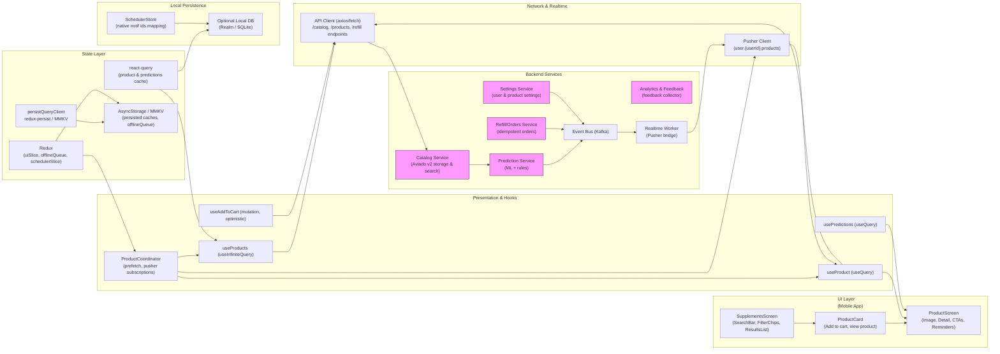

# Supplements Catalog & Product Detail — Search, View, Reminders & Refill


## 1) Requirements

- Functional
    - Global search by product name, brand, ingredient, and category with filters (dosage form, price, in-stock).
    - Product listing with summary metadata from the Aviado v2 schema (brand, name, form, price, servings_per_container, image).
    - Product detail page:
        - Full metadata: ingredients, directions, servings, label image, category → mapped goal.
        - Show predicted remaining servings and estimated days left (prediction service).
        - CTAs: Add to cart (optimistic), Wishlist toggle, Add reminder, Enable low-stock alert, Enable Auto-refill.
        - Ratings & Reviews area with brief summary and link to full reviews.
    - Per-product settings:
        - Set reorder thresholds, enable/disable auto-refill, set notification preferences.
        - Local scheduling of reminders (device) and optional push/email reminders.
    - Offline behavior:
        - Persist recent results and product details for offline browsing.
        - Queue cart, wishlist, settings, and reminder actions while offline and replay on reconnect.
    - Observability:
        - Track search latency, conversion (add-to-cart), refill opt-ins, prediction accuracy feedback.
- Non-functional
    - Fast perceived search (client-side caching + server filtering).
    - Scalable search & recommendation (ES/Opensearch + ML ranking).
    - Secure handling of user preferences and orders (auth, encryption).
    - Explainability: display matched keywords and match method for recommendations or "why this product".

---

## 2) Caching, offline & sync strategy

- Hybrid search & filter approach
    - Client-side quick filters on cached pages for instant UX (e.g., filter by form or category).
    - Server-side authoritative queries for pagination, availability, and ranking: GET /catalog/search or POST /recommendations.
- React Query usage
    - useQuery / useInfiniteQuery patterns:
        - useInfiniteQuery(['products', q, filters]) for search results.
        - useQuery(['product', productId]) for detail.
        - staleTime tuned to favor immediate UX (30s–2min) and cacheTime for offline persistence (5–60min).
    - Persist react-query cache using persistQueryClient (MMKV / AsyncStorage).
- Optimistic UI & offline queue
    - Cart & wishlist actions use optimistic updates in react-query cache and enqueue network mutation in Redux offlineQueue if offline.
    - Settings (auto-refill, thresholds) update locally then PATCH server; enqueue if offline and reconcile on success.
- Prefetching & adjacent navigation
    - Prefetch product detail when user taps a result (or on hover in web) using queryClient.prefetchQuery(['product', id]).
    - Prefetch next pages for smoother infinite scroll.
- Reconciliation
    - On reconnect, replay offlineQueue FIFO with idempotency keys; invalidate and re-fetch queries after replay to show canonical server state.
- Prediction & refill caching
    - Prediction results cached separately (['predictions','product', productId]); allow manual "Predict now" to refresh.

---

## 3) Data models (shared types)

Included below are the V2 schema structure and derived client models used in the UI.

- Raw Scraped Data (example)
```json
{
  "brand": "Pure Encapsulations",
  "product_name": "Omega-3 Plus",
  "description": "Advanced triglyceride-form omega-3 formula",
  "ingredients": "Fish Oil (Anchovy & Sardine) (1000mg), Vitamin D3 (2000 IU)",
  "serving_size": "2 softgels",
  "servings_per_container": 30,
  "price": 42.99,
  "image_url": "https://cdn.fullscript.com/...",
  "product_url": "https://fullscript.com/products/omega-3-plus",
  "category": "Fish Oil & Omegas",
  "dosage_form": "Softgel"
}
```

- Aviado Stack Schema v2 (example item)
```ts
interface AviadoItemV2 {
  source_row_index: number;
  name: string;
  brand: string;
  form: string; // e.g., "Softgel"
  ingredients_raw: string;
  dosage: {
    amount_per_serving: number;
    unit_per_serving: string;
    recommended_units: number;
    recommended_frequency: string;
    total_daily_amount: number;
    total_daily_unit: string;
    raw: string;
  };
  schedule: { timeslots: string[]; raw: string };
  purpose: string[]; // e.g., ["Cardiovascular"]
  impacted_biomarkers: string[];
  status: 'OK'|'WARN'|'ERROR';
  issues: string[];
  bundle_links: Array<{
    type: string; goal?: string; subgoal?: string; confidence?: number; match_method?: string; matched_keywords?: string[];
  }>;
  label_image_url?: string;
}
```

- Client product view model (derived)
```ts
interface ProductView {
  id: string; // internal id or slug
  name: string;
  brand: string;
  form: 'Tablet'|'Capsule'|'Softgel'|'Powder'|'Liquid'|'Cream'|'Oil'|'Spray'|'Patch'|'Tea';
  category: string; // mapped to goals in UI
  ingredients: string;
  servingSize: string;
  servingsPerContainer: number;
  price: number;
  imageUrl?: string;
  productUrl?: string;
  status?: 'OK'|'WARN'|'ERROR';
  predictions?: {
    remainingServings?: number;
    estDays?: number;
    confidence?: number;
    lastPredictedAt?: string;
  };
  userSettings?: {
    autoRefill?: boolean;
    reorderThreshold?: number;
    remindersEnabled?: boolean;
  };
}
```

- Enums (Timeslots & Mappings)
    - Dosage Form: Tablet, Capsule, Softgel, Powder, Liquid, Cream, Oil, Spray, Patch, Tea
    - Category -> Goal mapping (examples)
        - Fish Oil & Omegas → Cardiovascular
        - Vitamins & Minerals → Metabolic Health
        - Probiotics & Prebiotics → Digestive Health
        - Mushrooms & Adaptogens → Immune Support
        - Herbal & Botanical → General Health
        - Sleep Support → Brain/Mood
        - Joint & Mobility → Structural Health
    - Timeslots (examples): AM_WITH_FOOD, AM_BEFORE_FOOD, MIDDAY, PM_AFTER_FOOD, WITH_FOOD, BEDTIME, PRE_WORKOUT, UNSPECIFIED, ON_DECK, OFF_CYCLE

---

## 4) REST endpoints (mapping from the UI)

- GET /catalog/search?query=&category=&brand=&ingredient=&form=&priceMin=&priceMax=&inStock=&limit=&cursor=
    - Returns paginated ProductView items with prediction metadata when available.
- GET /products/{id}
    - Full product detail (Aviado v2 item + predictions + per-product settings)
- POST /cart/items
    - body: { productId, qtyContainers, clientId? } — optimistic add-to-cart
- POST /users/{userId}/wishlist
    - toggle wishlist state for product
- GET /users/{userId}/refill/predictions
    - returns per-product predictions: remainingServings, estDays, confidence
- POST /users/{userId}/refill/orders
    - body: { idempotencyKey, productId, qtyContainers } — creates refill order
- PATCH /users/{userId}/product-settings/{productId}
    - update per-product settings (autoRefill, reorderThreshold, notifications)
- POST /analytics/event
    - track search, add-to-cart, wishlist, prediction feedback
- POST /feedback/prediction
    - body: { productId, userId, correction: { usageRate?: number, servingsPerContainer?: number }, note? }
    - used to improve prediction models and data quality

Realtime (Pusher)
- user.{userId}.products -> events:
    - product.prediction_updated (payload: productId, remainingServings, estDays, confidence)
    - product.order_updated (payload: order info)
    - product.settings_updated (payload: productId, new settings)

---

## 5) High‑level architecture (narrative — follow mermaid ordering)

- UI Layer (first)
    - SupplementsScreen (Search & Results)
        - SearchBar (debounced), FilterChips (Category, Brand, Ingredient, Dosage, Form), ResultsList (virtualized).
        - Each ProductCard shows name, brand, snippet, price, servings progress bar, CTA "Add to cart" and "View product".
    - ProductScreen (Detail & Actions)
        - Large image, title, full ingredients, directions, servings progress + est days, Add to cart & Wishlist, Reminders & Refill controls, Ratings & Reviews.
    - Small UI components: ProductCard, PredictionBar, MatchChips, ReminderButtons, RefillSettingsModal.

- Presentation & Hooks
    - useProducts (useInfiniteQuery) — search + filters
    - useProduct (useQuery) — product detail
    - useAddToCart (useMutation) — optimistic add to cart
    - useToggleWishlist (useMutation) — optimistic toggle
    - usePredictions (useQuery) — fetch refill predictions for a product or user
    - useUpdateProductSettings (useMutation) — per-product settings
    - ProductCoordinator — prefetch detail, subscribe to pusher updates for active product list/detail

- Network & Realtime
    - ApiClient (axios) — REST endpoints above
    - PusherClient — subscribe to user.{userId}.products for prediction & order events
    - Analytics pipeline for logging search & conversion events

- State Layer
    - react-query: product lists, product detail, predictions cache
    - redux:
        - uiSlice: search state, active filters, modals
        - offlineSlice: queued actions (cart, wishlist, settings, orders) persisted
        - schedulerSlice: mapping for local reminders & refill notifications
    - persistQueryClient + redux-persist to MMKV/AsyncStorage

- Local Persistence
    - MMKV / AsyncStorage: persist react-query caches for last-viewed products & predictions, offline queue, last search queries
    - Optional LocalDB (Realm / SQLite) when product catalogs or user histories grow large
    - Native scheduler mapping for reminders/refills (iOS/Android IDs)

- Backend Services
    - Catalog Service: stores Aviado v2 items and serves product metadata (search index + API).
    - Prediction Service: computes remainingServings & estDays (ML + deterministic rules), exposes /predictions and job endpoints.
    - Refill Service: handles orders and auto-refill workflows.
    - Settings Service: stores per-user & per-product settings.
    - Analytics & Feedback Service: collects telemetry & feed retraining pipelines.
    - Event Bus (Kafka) + Realtime Worker (Pusher bridge) to notify clients of updates.

---

## 6) React‑Query, Redux & Pusher integration (implementation notes)

- React Query responsibilities
    - useInfiniteQuery(['products', query, filters]) for search with getNextPageParam.
    - useQuery(['product', productId]) for detail with staleTime tuned to balance freshness & perf.
    - Prefetch product detail on hover/tap with queryClient.prefetchQuery(['product', id]).
    - Mutations (add-to-cart, toggle-wishlist, update settings) use onMutate for optimistic cache patching, rollback onError and invalidate onSettled.

- Redux responsibilities
    - offlineSlice: queue of actions with shape { idempotencyKey, type, payload, retries } — persisted via redux-persist + MMKV.
    - uiSlice: currentSearch, activeFilters, modal states.
    - schedulerSlice: local notification IDs and reminder schedules.
    - Background worker listens for connectivity change and replays offlineQueue.

- Pusher responsibilities
    - Subscribe to channels:
        - user.{userId}.products for product.prediction_updated, product.order_updated, product.settings_updated
    - On product.prediction_updated:
        - Use queryClient.setQueryData to patch ['product', productId] and ['refill','products',userId] caches.
    - On order events:
        - Invalidate or patch order/carts caches and show in-app toast if relevant.

- Optimistic UX flow
    - Add to cart:
        - onMutate: insert temporary cart line into cart cache; show mini-cart animation.
        - If offline, enqueue offline action: {type:'addToCart', payload:{productId, qty}, idempotencyKey}
        - On success: replace temp line with server response; on error: rollback and show inline error.

- Idempotency & replay
    - All queued actions must include client-generated idempotencyKey (uuid) and timestamp to allow safe replay.

---

## 7) Mermaid diagram (UI Layer first, presentation & hooks, Network & realtime, state layer, local persistence, Backend services)

Paste into a Mermaid renderer:



---

## 8) Example code snippets

Below are practical snippets you can drop into a React Native + TypeScript app using react-query, Redux and Pusher. These are starter templates — adapt to your project structure and authentication flows.

### src/api/catalogApi.ts
```ts
import axios from 'axios';
const api = axios.create({ baseURL: 'https://api.example.com', timeout: 15000 });

export async function searchProducts({ query, filters, cursor, limit = 20 }: any) {
  const { data } = await api.get('/catalog/search', { params: { query, ...filters, cursor, limit } });
  return data; // { items: ProductView[], nextCursor }
}

export async function getProduct(productId: string) {
  const { data } = await api.get(`/products/${productId}`);
  return data;
}

export async function addToCart(payload: { productId: string; qtyContainers?: number; clientId?: string }) {
  const { data } = await api.post('/cart/items', payload);
  return data;
}

export async function toggleWishlist(userId: string, productId: string) {
  const { data } = await api.post(`/users/${userId}/wishlist`, { productId });
  return data;
}
```

### src/hooks/useProducts.ts
```ts
import { useInfiniteQuery } from '@tanstack/react-query';
import { searchProducts } from '../api/catalogApi';

export function useProducts(query: string, filters = {}) {
  return useInfiniteQuery(
    ['products', query, filters],
    ({ pageParam }) => searchProducts({ query, filters, cursor: pageParam }),
    {
      getNextPageParam: (last) => last.nextCursor,
      staleTime: 30 * 1000,
      cacheTime: 5 * 60 * 1000,
      keepPreviousData: true,
    }
  );
}
```

### src/hooks/useProduct.ts
```ts
import { useQuery } from '@tanstack/react-query';
import { getProduct } from '../api/catalogApi';

export function useProduct(productId: string) {
  return useQuery(['product', productId], () => getProduct(productId), {
    staleTime: 2 * 60 * 1000,
    cacheTime: 30 * 60 * 1000,
    enabled: !!productId,
  });
}
```

### src/hooks/useAddToCart.ts (optimistic + offline)
```ts
import { useMutation, useQueryClient } from '@tanstack/react-query';
import { addToCart } from '../api/catalogApi';
import { v4 as uuidv4 } from 'uuid';
import { store } from '../store';

export function useAddToCart(userId: string) {
  const qc = useQueryClient();

  return useMutation(async ({ productId, qty = 1 }: any) => {
    const clientId = uuidv4();
    return addToCart({ productId, qtyContainers: qty, clientId });
  }, {
    onMutate: async (variables) => {
      await qc.cancelQueries(['cart', userId]);
      const previous = qc.getQueryData(['cart', userId]);

      // optimistic update: add line to cart cache
      qc.setQueryData(['cart', userId], (old: any) => {
        const items = old?.items ? [...old.items] : [];
        items.unshift({ clientId: variables.clientId || 'tmp', productId: variables.productId, qty: variables.qty, pending: true });
        return { ...(old || {}), items };
      });

      // if offline, enqueue
      if (typeof navigator !== 'undefined' && !navigator.onLine) {
        store.dispatch({ type: 'offline/enqueue', payload: { id: variables.clientId, type: 'addToCart', payload: variables }});
      }

      return { previous };
    },
    onError: (err, variables, context: any) => {
      qc.setQueryData(['cart', userId], context.previous);
    },
    onSettled: () => qc.invalidateQueries(['cart', userId]),
  });
}
```

### src/services/pusher.ts
```ts
import Pusher from 'pusher-js/react-native';
import { queryClient } from '../reactQueryClient';

let pusher: Pusher | null = null;

export function initPusher(apiKey: string, options: any = {}) {
  if (pusher) return pusher;
  pusher = new Pusher(apiKey, { cluster: options.cluster || 'mt1', forceTLS: true });
  pusher.connection.bind('connected', () => console.log('Pusher connected'));
  return pusher;
}

export function subscribeUserProducts(userId: string) {
  if (!pusher) throw new Error('Pusher not initialized');
  const channel = pusher.subscribe(`user.${userId}.products`);

  channel.bind('product.prediction_updated', (payload: any) => {
    const { productId, remainingServings, estDays, confidence } = payload;
    queryClient.setQueryData(['product', productId], (old: any) => {
      if (!old) return old;
      return { ...old, predictions: { remainingServings, estDays, confidence, lastPredictedAt: new Date().toISOString() } };
    });
  });

  channel.bind('product.order_updated', (payload: any) => {
    // invalidate product list or orders as needed
    queryClient.invalidateQueries(['refill', 'products', userId]);
    queryClient.invalidateQueries(['product', payload.productId]);
  });

  return () => pusher.unsubscribe(`user.${userId}.products`);
}
```

---

## 9) UX & accessibility notes

- Search & filters
    - Debounce search (~300-500ms) and show skeleton results to avoid layout shift.
    - Keep accessible labels, ARIA roles for chips, and textual counts for screen readers (e.g., "Showing 3 results for 'Omega-3'").
- Product detail
    - Expose explanations for predictions: "Estimated 8 days left (model confidence 92%)" and a link "Why this estimate?" that shows simple computation or feedback CTA.
    - Buttons: large tap targets for Add to cart / Wishlist; confirm actions with toasts and undo.
- Accessibility
    - Provide alt text for images (from label_image_url or generated alt).
    - Ensure color contrast for confidence bars and badges; announce progress & actions to voiceover.
- Privacy & consent
    - Explain how predictions use user data and allow opt-out of tracking/personalized predictions.

---

## 10) Offline replay & conflict handling

- Offline queue replay
    - On reconnect, background worker reads offlineQueue and replays actions with idempotencyKey.
    - For conflicting mutations (e.g., product discontinued or price changed), server returns canonical state and conflict message; surface modal to user with options to accept server changes, choose alternate product, or retry.
- Local-first but server-authoritative
    - Always reconcile by invalidating react-query caches after successful replay to show canonical data.

---

## 11) Performance & ops notes

- Catalog & search
    - Keep product metadata in fast read store with ES/OpenSearch; precompute important facets (brand, ingredient tokens, form).
- Predictions
    - Batch predictions and cache top results per normalized goal; measure model drift and feedback accuracy continuously.
- Realtime & scaling
    - Pusher event volume controlled by grouping updates: send prediction.updated per product change, but rate-limit frequent small updates.
- Observability & metrics
    - Track search latency, add-to-cart conversion, offlineQueue lengths, replay success rate, prediction accuracy vs. user corrections.

---

## 12) Sequence flows (brief)

- Search flow:
    - User types goal or product -> SearchBar debounced -> useProducts useInfiniteQuery fetches cached & server results -> UI shows ProductCard list -> prefetch product detail for tapped item.
- View product & add-to-cart:
    - Tap result -> useProduct fetches detail -> user taps Add to cart -> useAddToCart.onMutate optimistic update -> if offline enqueue -> server responds -> query invalidated and cart canonicalized.
- Enable reminders & refill:
    - From ProductScreen user enables low-stock or auto-refill -> useUpdateProductSettings mutation updates cache & persists; Pusher broadcasts settings_updated -> other devices patch caches.
- Prediction refresh:
    - User triggers Predict usage -> POST /predictions/refresh -> Prediction Service runs job -> emits product.prediction_updated via Event Bus -> Pusher broadcasts -> clients patch prediction caches.

---
