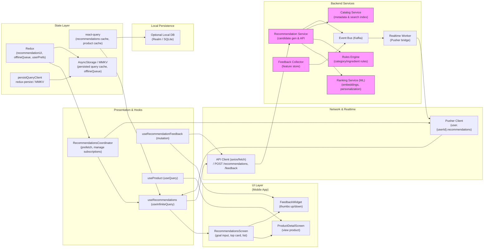

# Product Recommendations — Goal-based Suggestions UI & Architecture

## 1) Requirements

- Functional
    - Allow user to enter a goal or select a health intent (free-form or guided).
    - Produce a ranked list of recommended products for the goal with:
        - Confidence score (percentage)
        - Match method (rules, keywords, ML/hybrid)
        - Matched keywords highlighted and shown as chips
        - CTA to add to cart or view product details
    - Provide explanation & provenance: why a product was recommended (matched terms, method)
    - Allow user feedback (thumbs up / down) to refine recommendations and collect training signals.
    - Persist user-selected "goal" and allow re-running recommendations / saving favorite recommendations.
    - Support pagination / infinite scroll for larger candidate sets.
- Non-functional
    - Low latency for perceived recommendations (combine small client-side rules + server-side model).
    - Scalable ranking and candidate generation (many reads).
    - Explainability: show matched keywords & match method to build trust.
    - Privacy: handle health-related goals securely; server-side access control and encryption in transit/at-rest.
    - Observability: track recommendation latencies, hit rates, and feedback metrics.

---

## 2) Caching, offline & sync strategy

- Hybrid (client + server) approach to get instant UX and authoritative results:
    - Client-side lightweight rules: apply simple category/ingredient filters to cached catalog for instant preview.
    - Server-side authoritative ranking:
        - Candidate generation (search/facets + rules) on server.
        - ML ranking model scores candidates (embedding similarity, personalization).
        - Return top N candidates and match metadata (keywords, match method, score).
- React Query usage:
    - useQuery(['recommendations', goal, filters]) for the canonical recommendation request.
    - Keep staleTime short (e.g., 30s) to show cached results immediately while a background refresh validates freshness.
    - Persist react-query cache with persistQueryClient (MMKV/AsyncStorage) to show last results offline.
- Pagination:
    - useInfiniteQuery to fetch more recommendations; prefetch next page when the user scrolls near the end.
- Offline behavior:
    - Show cached recommendations when offline with an "offline" badge; keep "Add to cart" working by persisting cart locally (offlineQueue).
    - Queue feedback events (thumb up/down) and replay when online.
- Cache invalidation:
    - Invalidate when product catalog updates or user triggers explicit refresh; re-run recommendation call on goal change.

---

## 3) Data models (shared types)

```ts
interface RecommendationRequest {
  userId?: string;
  goal: string;           // free-text goal or normalized intent id
  filters?: Record<string, any>; // e.g., priceRange, brands, allergens
  pageCursor?: string | null;
}

interface Recommendation {
  productId: string;
  title: string;
  subtitle?: string;
  thumbnailUrl?: string;
  matchedKeywords?: string[];    // extracted matched terms
  matchMethod: 'rules'|'keywords'|'ml'|'hybrid';
  confidenceScore: number;       // 0..1 or 0..100
  explanation?: string;          // short human readable reason
}

interface RecommendationPage {
  items: Recommendation[];
  nextCursor?: string | null;
  total?: number;
}
```

---

## 4) REST endpoints (mapping from the UI)

- POST /recommendations
    - body: RecommendationRequest
    - response: RecommendationPage (items include matchedKeywords, matchMethod, confidenceScore)
- GET /products/{productId}
    - product detail for "View product"
- POST /feedback/recommendation
    - body: { userId, productId, goal, feedbackType: 'helpful'|'not_helpful', reason? }
    - used to collect signals for model retraining
- GET /recommendations/explain?productId=&goal=
    - optional: expanded explanation & provenance for audit/UX
- GET /catalog/search?query=&filters..
    - used for fast client-side candidate filtering/preview
- POST /analytics/recommendation-event
    - log events (view, add-to-cart, feedback) for ranking & monitoring

Realtime (optional)
- user.{userId}.recommendations -> events: recommendations.updated (useful if background refresh or server-side personalization updates must push new suggestions)

---

## 5) High‑level architecture (narrative — ordered for required mermaid)

- UI Layer (first)
    - RecommendationsScreen: goal input, top recommended product card (prominent), list of secondary cards, matched keyword chips, confidence bar, CTA (Add to cart, View product).
    - ProductDetailScreen: if user wishes to inspect a product (calls GET /products/{id}).
    - FeedbackWidget: thumbs up/down attached to each recommendation card.

- Presentation & Hooks
    - useRecommendations (useQuery / useInfiniteQuery) keyed by goal and filters.
    - useRecommendationFeedback (mutation) to send feedback immediately (optimistic UI).
    - useProduct (useQuery) for product details.
    - RecommendationsCoordinator: coordinates prefetch, cache persistence, optimistic cart adds, and Pusher subscription (if used).

- Network & Realtime
    - ApiClient (axios/fetch) to call /recommendations and other endpoints.
    - Optional Pusher/WebSocket channel user.{userId}.recommendations to push refreshed or personalized recommendations.
    - Analytics collector endpoint /analytics/recommendation-event for logging.

- State Layer
    - react-query: server-synced recommendations cache, product detail cache.
    - redux: UI state (goal text, open card id), offlineQueue for cart & feedback, user preferences.
    - persistQueryClient + redux-persist: persist caches & offline queue.

- Local Persistence
    - MMKV / AsyncStorage: persist react-query cache and offlineQueue for offline reading and replay.
    - Optional local DB (SQLite/Realm) if heavy personalization or offline compute needed.

- Backend Services
    - Recommendation Service (API): orchestrates candidate generation (rules + search), calls Ranking Service, returns results with match metadata.
    - Ranking Service (ML): embedding-based similarity or personalized model that returns scores & top candidates.
    - Rules Engine: fast deterministic filters (category, ingredient, dosage) to generate candidates or pre-filter.
    - Catalog Service: product metadata & search index (Elasticsearch/OpenSearch).
    - Feedback Collector: consumes feedback events into feature store / retraining pipeline.
    - Event Bus: Kafka for async processing, retraining triggers, and notifications.
    - Realtime Bridge: Pusher worker to broadcast per-user updates if necessary.

---

## 6) React‑Query, Redux & Pusher integration (implementation notes)

- React Query
    - useInfiniteQuery(['recommendations', goal, filters], fetchRecommendations)
    - on goal change: refetch and write to persisted cache
    - optimistic update for "Add to cart" UI: update cart query cache locally and enqueue server call if offline
- Redux
    - recommendationUI slice: goal text, selectedCardId, UI toggles
    - offlineQueue slice: queued actions (addToCart, feedback) persisted and retried on reconnect
- Pusher (optional)
    - Subscribe to user.{userId}.recommendations; on recommendations.updated update react-query cache for ['recommendations', currentGoal, currentFilters]
    - Use Pusher events to notify user of better recommendations or special offers for favorites
- Feedback & retraining signals
    - On feedback mutation, enqueue analytics event and send to /feedback/recommendation endpoint; if offline, enqueue for replay

---

## 7) Mermaid diagram (UI Layer first, presentation & hooks, Network & realtime, state layer, local persistence, Backend services)

Paste the block below into a Mermaid renderer to visualize the architecture.



---

## 8) Example code snippets

Below are concise snippets to map the UI to client hooks and API calls (React Native + TypeScript style).

### src/api/recommendationsApi.ts
```ts
import axios from 'axios';
const api = axios.create({ baseURL: 'https://api.example.com', timeout: 10000 });

export async function fetchRecommendations({ goal, filters, cursor }: any) {
  const { data } = await api.post('/recommendations', { goal, filters, pageCursor: cursor });
  return data; // { items: Recommendation[], nextCursor }
}

export async function sendRecommendationFeedback(payload: any) {
  const { data } = await api.post('/feedback/recommendation', payload);
  return data;
}
```

### src/hooks/useRecommendations.ts
```ts
import { useInfiniteQuery } from '@tanstack/react-query';
import { fetchRecommendations } from '../api/recommendationsApi';

export function useRecommendations(goal: string, filters = {}) {
  return useInfiniteQuery(
    ['recommendations', goal, filters],
    ({ pageParam }) => fetchRecommendations({ goal, filters, cursor: pageParam }),
    {
      getNextPageParam: (last) => last.nextCursor,
      staleTime: 30 * 1000,
      keepPreviousData: true,
    }
  );
}
```

### src/hooks/useRecommendationFeedback.ts
```ts
import { useMutation, useQueryClient } from '@tanstack/react-query';
import { sendRecommendationFeedback } from '../api/recommendationsApi';

export function useRecommendationFeedback() {
  const qc = useQueryClient();
  return useMutation(sendRecommendationFeedback, {
    onMutate: async (payload) => {
      // optimistic UI: perhaps increment a local helpful counter or mark card as reviewed
      await qc.cancelQueries(['recommendations', payload.goal]);
      // store previous state and update cache if desired...
      return {};
    },
    onError: (err, payload) => {
      // enqueue offline if offline
      if (typeof navigator !== 'undefined' && !navigator.onLine) {
        // dispatch enqueue offline action
      }
    },
    onSettled: () => {
      qc.invalidateQueries(['recommendations']);
    }
  });
}
```

---

## 9) UX & accessibility notes

- Explainability
    - Show matched keywords as chips and a short explanation line (Match method: Hybrid / Keyword overlap).
    - Show confidence visually with a bar and numeric %; ensure color and label are accessible.

- Interaction
    - Goal input: support free-text + suggested intents to help users craft better goals.
    - Allow quick feedback (thumbs up / down) on each card and a short optional reason input.
    - "Add to cart" should use optimistic UI and fall back to offlineQueue when necessary.

- Accessibility
    - Labels for each chip and progress bar; announce score and reason to screen readers.
    - Ensure buttons have sufficient hit area and contrast.

---

## 10) Offline replay & conflict handling

- Offline queue
    - Persist add-to-cart and feedback actions in offlineQueue; replay in FIFO order when online.
- Reconciliation
    - When replaying feedback events, deduplicate by client-generated idempotency keys.
    - On catalog changes (product removed or changed), mark recommendation stale and surface a notice to the user that product metadata changed — fetch fresh recommendations.

---

## 11) Performance & ops notes

- Scale ranking service separately from API gateway; use caching for top-K responses per normalized goal.
- Maintain incremental model updates: use feedback events to periodically refresh embeddings and re-train ranking models.
- Monitor metrics: recommendation latency, add-to-cart conversion, feedback rates, offline replay failures.
- Protect endpoints with rate limiting and quotas for abusive or automated goal submissions.

---

## 12) Sequence flows (brief)

- User enters goal -> UI debounces and calls useRecommendations -> show cached results instantly then replace with server response -> user taps Add to cart -> optimistic cart update + server add-to-cart (or enqueue) -> user gives feedback -> sendFeedback mutation (optimistic + analytics).
- Background personalization refresh -> server pushes recommendations.updated via Pusher -> client patches react-query cache, shows in-app notification for updated recommendations.

---
