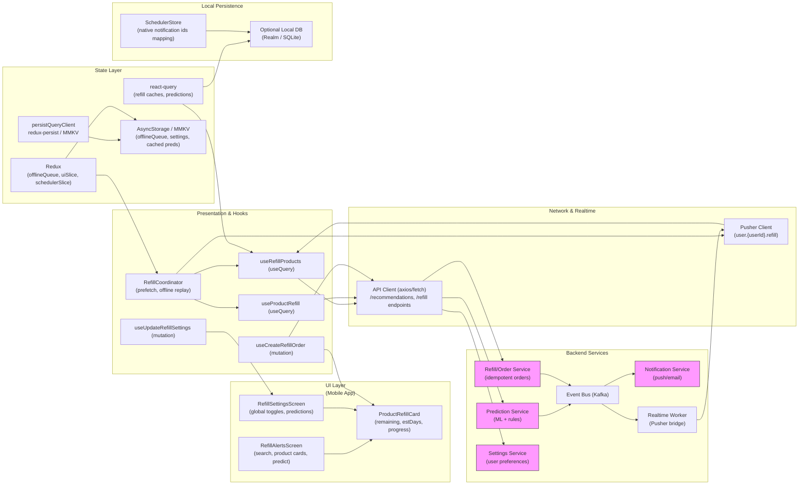

# Refill Alerts & Refill Settings — Design for react-query, redux & Pusher


## 1) Requirements

- Functional
    - Show predicted depletion for each product (remaining servings, estimated days).
    - Filter / search products by low/due soon.
    - Allow immediate refill (open checkout / create refill order) and enable auto-refill per product or globally.
    - Reorder threshold: notify user when estimated servings remaining ≤ threshold (global and per-product override).
    - Notifications: configure lead-time (1/3/7 days), delivery channel (local push, email), and per-product opt-ins.
    - Persist settings server-side (sync across devices) and schedule local reminders (for local delivery).
    - Allow users to view predicted depletion list and act (Refill now) or disable auto-refill and notifications.
    - Allow manual "Predict usage" recalculation and "Send reminders".
    - Collect telemetry & feedback for prediction quality (user corrections).
- Non-functional
    - Low-latency UI with optimistic updates and local persistence.
    - Accurate, scalable prediction pipeline (server-side model + deterministic rules).
    - Robust offline behavior with queued actions, idempotency and reconciliation.
    - Secure handling of orders & user preferences (authentication + encryption).
    - Observability for prediction accuracy, notification delivery and refill conversion.

---

## 2) Caching, offline & sync strategy

- Hybrid prediction & UI caching
    - Predictions run server-side (heavy ML) and return top-level fields: remainingServings, estDays, confidence.
    - For instant UX, keep a client-side fast estimator: remaining = servings_per_container - consumed_count (client cache), used to show immediate progress while server result is fetched.
- React Query strategy
    - useQuery(['refill', 'products', userId]) — fetch product list with prediction metadata.
    - useQuery(['refill', 'product', productId]) — product-level detail and thresholds.
    - useMutation for setting thresholds, toggling auto-refill, and creating refill orders. Mutations use optimistic updates and idempotency keys.
    - useInfiniteQuery if product list is large and paginated.
    - Persist react-query cache via persistQueryClient (MMKV / AsyncStorage) so last-predictions show offline.
- Offline queue & replay
    - Redux offlineQueue holds actions (toggleAutoRefill, setThreshold, createOrder) with idempotencyKey and payload; persisted to MMKV/AsyncStorage.
    - On reconnect, background worker replays queue FIFO, handling retries/backoff.
- Local notifications
    - If user enables local delivery, schedule OS notifications immediately (local-first) and reconcile with server after settings persisted.
- Real-time sync
    - Subscribe via Pusher to user.{userId}.refill events (order.created, prediction.updated) to reflect server-side changes quickly.
- Invalidation & freshness
    - Predictions have short TTL (e.g., 1–6 hours depending on data freshness); allow manual "Predict now".

---

## 3) Data models (shared types)

```ts
interface ProductRefillView {
  productId: string;
  title: string;
  thumbnailUrl?: string;
  servingsPerContainer: number;
  recordedUsageRatePerDay?: number; // computed from usage logs
  remainingServings?: number; // server or local estimate
  estDays?: number; // estimated days until empty
  confidence?: number; // 0..1
  autoRefillEnabled?: boolean;
  reorderThreshold?: number; // servings left threshold
  notifications?: { push?: boolean; email?: boolean; local?: boolean; daysBefore?: number };
  inStock?: boolean; // last known
  lastPredictedAt?: string;
}

interface RefillOrder {
  orderId?: string;
  productId: string;
  qtyContainers: number;
  createdAt?: string;
  status?: 'created'|'processing'|'placed'|'failed'|'cancelled';
  idempotencyKey?: string;
}

interface RefillSettings {
  userId: string;
  autoRefillGlobal?: boolean;
  reorderThresholdGlobal?: number;
  notifyDaysOptions?: number[]; // e.g., [1,3,7]
  deliveryChannels?: { push: boolean; email: boolean; local: boolean };
  perProductOverrides?: Record<string, { reorderThreshold?: number; autoRefill?: boolean; deliveryChannels?: any }>;
}
```

---

## 4) REST endpoints (mapping from the UI)

- GET /users/{userId}/refill/products?filter=low|due_soon&limit=&cursor=
    - Returns ProductRefillView[] with prediction metadata.
- GET /products/{productId}/refill
    - Detailed refill view & per-product settings.
- POST /users/{userId}/refill/orders
    - Create refill order: { idempotencyKey, productId, qtyContainers }
    - Response: RefillOrder
- PATCH /users/{userId}/refill/settings
    - Update RefillSettings (global/per-product)
- POST /predictions/refresh
    - Trigger re-run of predictions for user (async job) or for a product; returns job id or immediate result.
- GET /predictions/{jobId} (optional)
    - Poll job result if predictions run async.
- POST /notifications/send (server) or server triggers push
    - Send notification when threshold crossed.
- Webhooks:
    - Order status changes, provider fulfillment events.
- Realtime:
    - Pusher channels:
        - user.{userId}.refill -> events: order.created, prediction.updated, threshold.alert

---

## 5) High‑level architecture (narrative)

- UI Layer (first)
    - RefillAlertsScreen: search/filter, product cards, "Refill now" and action badges, predictions block, "Predict usage" button.
    - RefillSettingsScreen: global auto-refill toggle, reorder threshold slider, notification presets, predicted depletion list, per-product override links.
    - Small components: ProductRefillCard, ThresholdSlider, NotificationPreset, PredictionConfidenceBar.

- Presentation & Hooks
    - useRefillProducts (useQuery / useInfiniteQuery) — list with prediction metadata.
    - useProductRefill (useQuery) — per-product detail & overrides.
    - useCreateRefillOrder (useMutation) — POST order with idempotency.
    - useUpdateRefillSettings (useMutation) — PATCH settings with optimistic update.
    - RefillCoordinator: orchestrates prefetch, local scheduling, pusher subscriptions and offline queue replay.

- Network & Realtime
    - ApiClient (axios) for REST endpoints (products, settings, orders, predictions).
    - Pusher client for real-time user events (user.{userId}.refill).
    - Notification worker on server to manage pushes/emails and trigger events.

- State Layer
    - react-query: predictions & product lists (server canonical).
    - redux: offlineQueue, uiSlice (editing), local scheduling flags, lastPredictJob.
    - Persistors: persistQueryClient + redux-persist to MMKV / AsyncStorage.

- Local Persistence
    - AsyncStorage / MMKV: persist offlineQueue, cached predictions, user settings for offline display and scheduling.
    - Optional local DB (Realm/SQLite) if product/usage history large.
    - Native scheduler mapping: local notification IDs persisted for cancel/reschedule.

- Backend Services
    - Prediction Service: batch and online model to estimate depletion & confidence.
    - Refill Service (Orders): create & manage refill orders, idempotent handling, integration with fulfillment.
    - Settings Service: user-level settings and per-product overrides.
    - Notification Service: push/email workflow.
    - Event Bus (Kafka): emit prediction_updated/order events for workers and realtime bridge.
    - Realtime Worker: forwards events to Pusher.

---

## 6) React‑Query, Redux & Pusher integration (implementation)

- React Query
    - Queries:
        - useQuery(['refill', 'products', userId, filters]) with keepPreviousData & prefetch for pagination.
        - useQuery(['refill', 'product', productId]) for product-level detail & override data.
    - Mutations:
        - useMutation(createRefillOrder, { onMutate, onError, onSettled }) — optimistic UI: mark product as "order pending"; create idempotencyKey; enqueue offline if offline.
        - useMutation(updateSettings) — optimistic set and persist locally.
- Redux responsibilities
    - offlineSlice: queue of pending actions (order create, settings updates), with meta fields idempotencyKey, retries.
    - uiSlice: editing states, lastPredictJobId, pendingPredictions.
    - schedulerSlice: local notifications mapping for reorder reminders (if local option enabled).
- Pusher responsibilities
    - Subscribe to `user.{userId}.refill` on app login or when Refill screens are active.
    - Events:
        - prediction.updated -> patch react-query cache for corresponding product(s).
        - order.created/order.updated -> patch order state and possibly show toast.
    - On event, use queryClient.setQueryData to update caches without refetch when possible.
- Offline & idempotency
    - All mutating operations include idempotencyKey (uuid). Server must idempotently accept duplicates.
    - Offline queue worker picks entries, calls API, and on success removes entries; on permanent error surfaces to user.

---

## 7) Mermaid diagram (UI Layer first, presentation & hooks, Network & realtime, state layer, local persistence, Backend services)



---

## 8) Example code snippets

Below are concise client-side snippets (TypeScript) illustrating API, hooks, redux offline queue and pusher wiring.

### src/api/refillApi.ts
```ts
import axios from 'axios';
const api = axios.create({ baseURL: 'https://api.example.com', timeout: 10000 });

export async function fetchRefillProducts(userId: string, params: any = {}) {
  const { data } = await api.get(`/users/${userId}/refill/products`, { params });
  return data; // { items: ProductRefillView[], nextCursor?: string }
}

export async function createRefillOrder(userId: string, payload: { idempotencyKey: string; productId: string; qtyContainers: number }) {
  const { data } = await api.post(`/users/${userId}/refill/orders`, payload);
  return data;
}

export async function updateRefillSettings(userId: string, payload: any) {
  const { data } = await api.patch(`/users/${userId}/refill/settings`, payload);
  return data;
}

export async function triggerPredict(userId: string, productId?: string) {
  const { data } = await api.post('/predictions/refresh', { userId, productId });
  return data; // job id or immediate result
}

export default api;
```

### src/hooks/useRefillProducts.ts
```ts
import { useInfiniteQuery } from '@tanstack/react-query';
import { fetchRefillProducts } from '../api/refillApi';

export function useRefillProducts(userId: string, filters = {}) {
  return useInfiniteQuery(
    ['refill', 'products', userId, filters],
    ({ pageParam }) => fetchRefillProducts(userId, { ...filters, cursor: pageParam }),
    {
      getNextPageParam: last => last.nextCursor,
      staleTime: 30 * 60 * 1000, // predictions are relatively stable
      cacheTime: 2 * 60 * 60 * 1000,
      keepPreviousData: true,
    }
  );
}
```

### src/hooks/useCreateRefillOrder.ts
```ts
import { useMutation, useQueryClient } from '@tanstack/react-query';
import { createRefillOrder } from '../api/refillApi';
import { v4 as uuidv4 } from 'uuid';
import { store } from '../store';

export function useCreateRefillOrder(userId: string) {
  const qc = useQueryClient();

  return useMutation((payload: { productId: string; qtyContainers: number }) => {
    const idempotencyKey = uuidv4();
    return createRefillOrder(userId, { idempotencyKey, ...payload });
  }, {
    onMutate: async (variables) => {
      await qc.cancelQueries(['refill', 'products', userId]);
      const previous = qc.getQueryData(['refill', 'products', userId]);
      // optimistic: mark product as orderPending
      qc.setQueryData(['refill', 'products', userId], (old: any) => {
        if (!old) return old;
        const items = old.items.map((p: any) => p.productId === variables.productId ? { ...p, orderPending: true } : p);
        return { ...old, items };
      });
      // if offline, enqueue
      if (typeof navigator !== 'undefined' && !navigator.onLine) {
        store.dispatch({ type: 'offline/enqueue', payload: { id: idempotencyKey, type: 'createOrder', payload: { productId: variables.productId, qtyContainers: variables.qtyContainers } }});
      }
      return { previous };
    },
    onError: (err, vars, context) => {
      qc.setQueryData(['refill', 'products', userId], context.previous);
    },
    onSettled: () => {
      qc.invalidateQueries(['refill', 'products', userId]);
    }
  });
}
```

### src/store/offlineSlice.ts
```ts
import { createSlice } from '@reduxjs/toolkit';

const initialState = {
  queue: [], // OfflineAction[]
  lastProcessedAt: null,
};

const slice = createSlice({
  name: 'offline',
  initialState,
  reducers: {
    enqueue(state, action) {
      state.queue.push(action.payload);
    },
    dequeue(state) {
      state.queue.shift();
    },
    setLastProcessedAt(state, action) {
      state.lastProcessedAt = action.payload;
    },
    clearQueue(state) {
      state.queue = [];
    }
  }
});

export const { enqueue, dequeue, setLastProcessedAt, clearQueue } = slice.actions;
export default slice.reducer;
```

### src/services/pusher.ts
```ts
import Pusher from 'pusher-js/react-native';
import { queryClient } from '../reactQueryClient';

let pusher: Pusher | null = null;

export function initPusher(key: string, cluster = 'mt1') {
  if (pusher) return pusher;
  pusher = new Pusher(key, { cluster, forceTLS: true });
  pusher.connection.bind('connected', () => console.log('Pusher connected'));
  return pusher;
}

export function subscribeRefill(userId: string) {
  if (!pusher) throw new Error('Pusher not initialized');
  const channel = pusher.subscribe(`user.${userId}.refill`);
  channel.bind('prediction.updated', (payload: any) => {
    // payload: { productId, remainingServings, estDays, confidence }
    const key = ['refill', 'products', userId];
    queryClient.setQueryData(key, (old: any) => {
      if (!old) return old;
      const items = old.items.map((p: any) => p.productId === payload.productId ? { ...p, ...payload } : p);
      return { ...old, items };
    });
  });

  channel.bind('order.updated', (payload: any) => {
    // patch product orderPending or add order record
    queryClient.invalidateQueries(['refill', 'products', userId]);
  });

  return () => pusher.unsubscribe(`user.${userId}.refill`);
}
```

---

## 9) UX & accessibility notes

- Visual cues & text
    - Use clear badges: LOW / IN STOCK / NOTIFY to show status.
    - Provide numeric "Remaining: X servings • Est: N days" and a confidence bar with tooltips "Model confidence: 78%".
- Interactions
    - "Refill now" should open reorder flow; if autoRefill enabled, show "Auto-refill: On" with an option to cancel order before fulfillment.
    - Per-product threshold override from ProductRefillCard should open product-level settings.
- Accessibility
    - Announce predicted depletion date and action buttons for screen readers.
    - Ensure slider for threshold has accessible labels and textual value "Notify me when servings ≤ X".
- Safety & transparency
    - Show estimation explanation and example in Predictions block; allow user to provide corrections (e.g., usage rate wrong) to improve predictions.

---

## 10) Offline replay & conflict handling

- Replay & idempotency
    - When reconnecting, offline worker replays queue using idempotencyKeys; on success remove from queue.
    - If server reports conflict (e.g., product discontinued or settings changed), server returns canonical state and conflict reason; show a conflict UI to user: "Order couldn't be placed: product unavailable — choose alternative or cancel".
- Backoff & retry
    - Apply exponential backoff for transient failures; stop and notify user after N retries.
- Merge strategy
    - For settings (thresholds), use last-writer-wins by timestamp unless server marks a protected server-side policy; surface merge UI if necessary.

---

## 11) Performance & ops notes

- Prediction scaling
    - Batch predictions per user and cache top-K results; schedule offline recompute or incremental updates when usage logs change.
- Rate limiting & quotas
    - Rate-limit prediction refresh and order creation endpoints to avoid abuse.
- Observability
    - Track prediction accuracy metrics (estDays vs actual depletion), notification delivery rate, order conversion and offlineQueue lengths.
- Fulfillment integration
    - Expose webhook endpoints for fulfillment updates and propagate to Pusher to update UI in real-time.

---

## 12) Sequence flows (brief)

- View Refill Alerts
    - App loads cached ['refill','products',userId] then fetches server list -> show predictions & progress bars -> user taps "Refill now" -> useCreateRefillOrder mutation creates order with idempotency key (optimistic UI sets orderPending) -> server persists order -> emits order.created -> Pusher -> client updates canonical order state.
- Set global threshold / toggle auto-refill
    - User toggles global autoRefill -> useUpdateRefillSettings.onMutate optimistic update -> if offline enqueue settings update -> when server confirms reconcile caches.
- Prediction refresh
    - User taps "Predict usage" -> triggerPredict POST /predictions/refresh -> server runs job and emits prediction.updated events -> Pusher → client patches updated predictions and refreshes UI.

---
