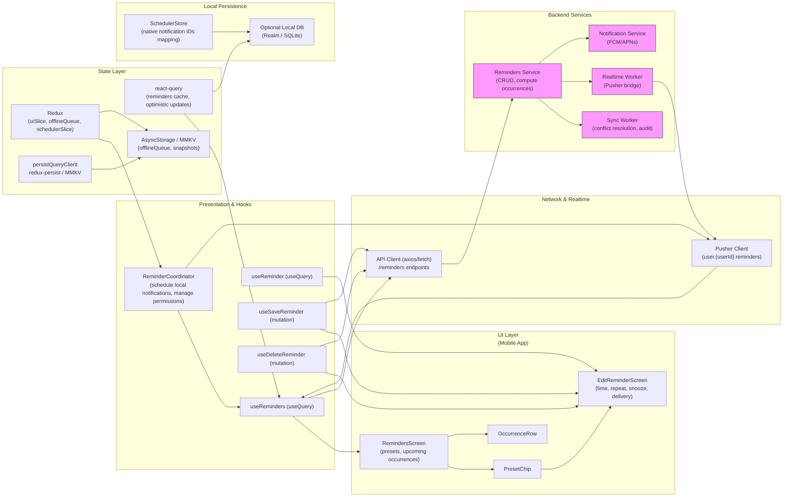

# Mobile Reminders — Schedule & Edit Medication Reminders


## 1) Requirements

- Functional
    - Create reminders for products or stacks with presets (AM_WITH_FOOD, WITH_BREAKFAST, LUNCH, BEDTIME, CUSTOM).
    - Edit a reminder rule: time, repeat (daily / weekdays / custom), snooze length, delivery channel (local device notifications, optional push).
    - Apply reminder to single item or whole stack.
    - Show upcoming occurrences (next N times) and allow enabling/disabling a specific reminder or occurrence.
    - Persist reminder rules server-side (for sync) and schedule local OS notifications on-device.
    - Provide "Save reminders" workflow with preview and feedback.
    - Delete a reminder or a single occurrence.
    - Allow offline editing and reconcile on reconnect.
    - Provide quick-tap presets and an explicit edit screen for advanced control.
- Non-functional
    - Local notifications scheduled reliably (use native APIs: iOS UNUserNotificationCenter, Android AlarmManager/WorkManager).
    - Fast perceived UX: immediate local scheduling and optimistic UI while server persists settings.
    - Sync & consistency: server authoritative for reminder rules; reconcile local OS schedules with server state on sync.
    - Privacy & permissions: request notification permission with clear rationale; secure user data in transit and at rest.
    - Observability: track delivery failures, permission declines, and sync conflicts.

---

## 2) Caching, offline & sync strategy (react-query, redux & pusher)

- Local-first interplay
    - Persist reminder rules locally (MMKV / AsyncStorage) immediately on change to allow instant UI and offline resume.
    - Schedule local OS notifications immediately after local save so user sees immediate results.

- React Query for server sync
    - Use react-query for fetching and syncing reminder rules:
        - useQuery(['reminders', userId]) to fetch user reminder rules from server.
        - Mutations: create/update/delete reminder rules; onMutate perform optimistic update to cache.
    - On mutation success, reconcile local DB and reschedule OS notifications if server returned canonical rule (IDs/timestamps).

- Redux for UI & durable local queue
    - Redux stores transient UI state (editing reminder, modal visibility), and an offlineQueue slice of pending server mutations that must be retried.
    - Persist the offlineQueue (redux-persist + MMKV) so queued operations survive app restarts.

- Conflict handling & reconciliation
    - Use last-write-wins with idempotency keys for server writes; if server detects conflict (concurrent edit from another device), server responds with diff and suggested resolution.
    - Show conflict modal when detected and offer "Keep local", "Accept server", or "Merge" options (e.g., merge times, choose which to apply to whole stack).

- Realtime sync
    - Use Pusher to receive user.{userId}.reminders events when another device updates reminders.
    - On event, patch react-query cache and reschedule local OS notifications as needed.

- Scheduling reliability
    - Always persist canonical rules server-side and keep local scheduler as a reflection.
    - On app startup and after sync, reconcile local scheduled notifications with server-side rules: cancel stale local notifications and schedule new ones.

---

## 3) Data models (shared types)

```ts
// Reminder rule (server-side representation)
interface ReminderRule {
  id: string;                // server id
  userId: string;
  productId?: string;        // or stackId
  appliesTo: 'item'|'stack';
  preset?: 'AM_WITH_FOOD'|'WITH_BREAKFAST'|'LUNCH'|'BEDTIME'|'CUSTOM';
  label?: string;            // human readable label
  time: string;              // "08:30" local time
  timezone?: string;         // IANA tz of creation or user's preference
  repeat: 'daily'|'weekdays'|'custom';
  repeatOn?: number[];       // [1..7] Mon..Sun for custom/repeat
  snoozeMinutes?: number;
  delivery: 'local'|'push'|'both';
  enabled: boolean;
  nextOccurrences?: string[]; // optional preview ISO timestamps (computed server-side)
  createdAt?: string;
  updatedAt?: string;
  // For optimistic offline: client-side temp id
  clientId?: string;
}

// Occurrence - a single scheduled notification (computed)
interface Occurrence {
  id: string;            // server or client id
  ruleId: string;
  start: string;         // ISO timestamp
  status: 'scheduled'|'sent'|'missed'|'cancelled';
}
```

---

## 4) REST endpoints (mapping from the UI)

- GET /users/{userId}/reminders
    - returns array of ReminderRule
- GET /reminders/{reminderId}
    - get single rule + nextOccurrences preview
- POST /reminders
    - create a reminder rule
    - body: ReminderRule (clientId optional)
    - response: saved rule with server id
- PATCH /reminders/{reminderId}
    - update rule (supports applyTo occurrence vs rule for single occurrence)
- DELETE /reminders/{reminderId}
    - remove rule
- POST /reminders/occurrences/{occurrenceId}/snooze
    - snooze a particular occurrence
- POST /sync/reminders
    - bulk sync endpoint: accept list of client changes and return server canonical set (useful on reconnect)
- Webhooks / Notification Worker:
    - POST /webhooks/notify to trigger server-side push notifications or SMS if delivery=push (optional)
- Realtime:
    - user.{userId}.reminders events:
        - reminder.created | reminder.updated | reminder.deleted -> payload: rule id + details

---

## 5) High‑level architecture (narrative — specific ordering)

- UI Layer (first)
    - RemindersScreen: product card, presets row, list of upcoming occurrences, toggles for presets and "Save reminders".
    - EditReminderScreen: time picker, repeat controls, weekday chips, snooze, delivery, next occurrences preview, Save/Delete and Apply-to (this item / whole stack).
    - Small components: PresetChip, WeekdayChip, OccurrenceRow, ToggleSwitch.

- Presentation & Hooks
    - useReminders (react-query) — fetch reminders list and keep cache in sync.
    - useReminder (useQuery) — fetch single rule and preview.
    - useSaveReminder (useMutation) — create/update with optimistic update.
    - useDeleteReminder (useMutation) — delete with optimistic removal.
    - ReminderCoordinator — orchestrates scheduling local OS notifications, starting/stopping timers, requesting permissions, and subscribing to Pusher.

- Network & Realtime
    - ApiClient (axios/fetch) communicates with REST endpoints for persistent storage.
    - Pusher subscribes to user.{userId}.reminders to receive cross-device events.
    - Notification Worker (server) triggers push notifications if delivery=push (or instructs device to schedule local notification when delivery=local).

- State Layer
    - React Query: query cache for reminders and rules (server-synced).
    - Redux: uiSlice (editing state), schedulerSlice (local scheduling tokens), offlineQueue (pending server mutations), permissionSlice (notification permission state).

- Local Persistence
    - AsyncStorage / MMKV: persist offlineQueue, last synced reminders snapshot, and user preferences.
    - Local DB (optional): Realm/SQLite if the app needs advanced queries or history (useful for many reminders).
    - Native OS notification registry: local notification IDs persisted so they can be canceled/updated reliably.

- Backend Services
    - Reminders Service: CRUD for ReminderRule, computes nextOccurrences, exposes sync endpoint.
    - Notification Service: pushes notifications (FCM/APNs) or triggers downstream messages.
    - Realtime Bridge: emits events to Pusher when a user's reminders change.
    - Sync Worker: handles bulk sync and resolves conflicts, writes audit logs.

---

## 6) React‑Query, Redux & Pusher integration (implementation notes)

- react-query responsibilities
    - fetch and cache reminders: key ['reminders', userId]
    - optimistic updates: onMutate update cache immediately with clientId and local scheduling
    - onSettled: invalidate ['reminders', userId] to ensure canonical server state
    - prefetch reminder detail when user taps a preset or occurrence

- redux responsibilities
    - booking-like schedulerSlice: hold scheduled notification IDs, reservation-like tokens for temporary holds if necessary (e.g., when editing an occurrence)
    - offlineQueue slice: queue of { op: 'create'|'update'|'delete', payload, clientId, timestamp } — persisted
    - uiSlice: modal visibility, editingReminderId, permissionStatus

- pusher responsibilities
    - subscribe to user.{userId}.reminders
    - on reminder.* events:
        - patch react-query cache: update/insert/delete rule
        - if changed rule is enabled and local device has permission: reschedule local OS notifications accordingly
    - on push-triggered events (e.g., send push for remote device): show in-app banners if app is foreground

- local scheduling flow
    - on local create/update:
        - schedule OS notification(s) immediately and keep list of native notification IDs tied to rule.id or clientId
        - persist native IDs in schedulerSlice / local DB
    - after server confirms (mutation success):
        - update mapping with server id and reschedule if server adjusted time/timezone
    - on server event indicating cancellation or modification:
        - cancel matching native notifications and schedule new ones per rule

---

## 7) Mermaid diagram (UI Layer first, presentation/hooks, Network & realtime, state layer, local persistence, Backend services)

Paste the block below into a Mermaid renderer to visualize the architecture.



---

## 8) Example code snippets

Below are compact, practical snippets you can adapt for React Native + TypeScript using react-query, redux, and pusher.

### src/api/remindersApi.ts
```ts
import axios from 'axios';
const api = axios.create({ baseURL: 'https://api.example.com', timeout: 10000 });

export function fetchReminders(userId: string) {
  return api.get(`/users/${userId}/reminders`).then(r => r.data);
}

export function createReminder(payload: any) {
  return api.post('/reminders', payload).then(r => r.data);
}

export function updateReminder(reminderId: string, payload: any) {
  return api.patch(`/reminders/${reminderId}`, payload).then(r => r.data);
}

export function deleteReminder(reminderId: string) {
  return api.delete(`/reminders/${reminderId}`).then(r => r.data);
}
```

### src/hooks/useReminders.ts
```ts
import { useQuery } from '@tanstack/react-query';
import { fetchReminders } from '../api/remindersApi';

export function useReminders(userId: string) {
  return useQuery(['reminders', userId], () => fetchReminders(userId), {
    staleTime: 30 * 1000,
    cacheTime: 5 * 60 * 1000,
    refetchOnReconnect: true,
  });
}
```

### src/hooks/useSaveReminder.ts
```ts
import { useMutation, useQueryClient } from '@tanstack/react-query';
import { createReminder, updateReminder } from '../api/remindersApi';
import { v4 as uuidv4 } from 'uuid';
import { store } from '../store';

export function useSaveReminder() {
  const qc = useQueryClient();

  return useMutation(async (payload: any) => {
    // create vs update
    if (payload.id) return updateReminder(payload.id, payload);
    return createReminder(payload);
  }, {
    onMutate: async (payload) => {
      await qc.cancelQueries(['reminders', payload.userId]);
      const previous = qc.getQueryData(['reminders', payload.userId]);

      // optimistic: insert or update locally with clientId if creating
      const clientId = payload.id || `tmp-${uuidv4()}`;
      const optimistic = { ...payload, id: payload.id || clientId };
      qc.setQueryData(['reminders', payload.userId], (old: any) => {
        const items = old?.items ? [...old.items] : [];
        const idx = items.findIndex((r: any) => r.id === optimistic.id);
        if (idx >= 0) items[idx] = optimistic;
        else items.unshift(optimistic);
        return { ...(old || {}), items };
      });

      // schedule local OS notifications immediately (ReminderCoordinator handles this)
      store.dispatch({ type: 'scheduler/scheduleLocal', payload: optimistic });

      // enqueue for offline retry if navigator.offline
      if (typeof navigator !== 'undefined' && !navigator.onLine) {
        store.dispatch({ type: 'offline/enqueue', payload: { op: payload.id ? 'update' : 'create', data: optimistic }});
      }

      return { previous };
    },
    onError: (err, payload, context) => {
      qc.setQueryData(['reminders', payload.userId], context.previous);
    },
    onSettled: (data, err, payload) => {
      qc.invalidateQueries(['reminders', payload.userId]);
    }
  });
}
```

### src/store/slices/schedulerSlice.ts
```ts
import { createSlice } from '@reduxjs/toolkit';

const initialState = {
  scheduledMap: {}, // ruleId or clientId -> array of nativeNotificationIds
  countdownByRule: {}, // optional UI countdowns
};

const slice = createSlice({
  name: 'scheduler',
  initialState,
  reducers: {
    setScheduled(state, action) {
      const { key, nativeIds } = action.payload;
      state.scheduledMap[key] = nativeIds;
    },
    clearScheduled(state, action) {
      const key = action.payload;
      delete state.scheduledMap[key];
    },
    setCountdown(state, action) {
      const { ruleId, expiresAt } = action.payload;
      state.countdownByRule[ruleId] = expiresAt;
    },
    clearCountdown(state, action) {
      delete state.countdownByRule[action.payload];
    }
  }
});

export const { setScheduled, clearScheduled, setCountdown, clearCountdown } = slice.actions;
export default slice.reducer;
```

### src/services/pusher.ts
```ts
import Pusher from 'pusher-js/react-native';
import { queryClient } from '../reactQueryClient';
let pusher: Pusher | null = null;

export function initPusher(key: string) {
  if (pusher) return pusher;
  pusher = new Pusher(key, { cluster: 'mt1', forceTLS: true });
  pusher.connection.bind('connected', () => console.log('Pusher connected'));
  return pusher;
}

export function subscribeUserReminders(userId: string) {
  if (!pusher) throw new Error('initPusher first');
  const channel = pusher.subscribe(`user.${userId}.reminders`);
  channel.bind('reminder.created', (payload: any) => {
    queryClient.setQueryData(['reminders', userId], (old: any) => {
      const items = old?.items ? [...old.items] : [];
      if (!items.some((r: any) => r.id === payload.id)) items.unshift(payload);
      return { ...(old || {}), items };
    });
  });
  channel.bind('reminder.updated', (payload: any) => {
    queryClient.setQueryData(['reminders', userId], (old: any) => {
      if (!old) return old;
      const items = old.items.map((r: any) => r.id === payload.id ? { ...r, ...payload } : r);
      return { ...old, items };
    });
  });
  channel.bind('reminder.deleted', (payload: any) => {
    queryClient.setQueryData(['reminders', userId], (old: any) => {
      if (!old) return old;
      return { ...old, items: old.items.filter((r: any) => r.id !== payload.id) };
    });
  });
  return () => pusher.unsubscribe(`user.${userId}.reminders`);
}
```

### Native-scheduling sketch (pseudo)
```ts
// iOS: UNUserNotificationCenter.addNotificationRequest(...)
// Android: use react-native-push-notification or native AlarmManager/WorkManager
// Map rule id -> native notification ids in SchedulerStore for cancel/update
```

---

## 9) UX & accessibility notes

- Permissions
    - Ask for notification permission with context: "We need permission to remind you to take your supplements".
    - Provide fallback when denied: show in-app reminders and soft reminders.

- Immediate feedback
    - On Save: show "Saved — scheduled X occurrences" toast and display upcoming occurrences list.
    - On offline: notify user that changes are saved locally and will sync when online.

- Accessibility
    - Weekday chips should have accessible labels and state announcements (e.g., "Wednesday selected").
    - Provide sufficient contrast for chips and buttons; ensure voiceover reads next occurrences.

- Edge cases
    - Timezone changes: detect device timezone changes and prompt user to keep times in local time or convert.
    - DST: compute occurrences with timezone-aware library (luxon / date-fns-tz).

---

## 10) Offline replay & conflict handling

- Queue all server mutations in offlineQueue with idempotency (clientId + timestamp).
- On reconnect:
    - Call POST /sync/reminders with local pending changes; server returns merged state and conflicts.
    - For conflicts, surface a merge UI: "Server changed time to 09:00, you changed to 08:30 — which do you want?"
- If user loses permission to schedule notifications (revoked), show a clear banner and provide steps to re-enable.

---

## 11) Performance & ops notes

- Server:
    - Compute nextOccurrences on demand and cache them (short TTL) to avoid heavy recomputation in list views.
    - Rate-limit sync endpoints to guard against excessive client retries.
    - Audit and log reminder creation/update/delete for compliance and troubleshooting.

- Client:
    - Debounce rapid edits in the Edit screen; only persist when user taps Save.
    - Pre-schedule only next N occurrences (e.g., next 30) rather than infinite schedules, update as needed.
    - Use MMKV for fast persisted reads/writes.

---

## 12) Sequence flows (brief)

- Create via preset:
    - User taps AM_WITH_FOOD -> UI builds rule with preset defaults -> schedule local notifications -> optimistic add to react-query cache -> POST /reminders -> on success reconcile IDs and update scheduler mapping; on failure enqueue offline mutation and inform user.

- Edit rule (apply to item or stack):
    - User opens EditReminderScreen -> changes time/repeat -> taps Save -> useSaveReminder mutation runs optimistic update and scheduler reschedules local notifications -> server confirms -> reconcile; if server conflict occurs, show conflict modal and options.

- Delete rule:
    - User taps Delete -> optimistic remove from cache and cancel local notifications -> call DELETE /reminders/{id} -> on failure re-add to cache and show error / enqueue delete.

- Cross-device modification:
    - Device A creates/edits rule -> server emits user.{userId}.reminders.* -> Device B receives via Pusher -> patches react-query cache and adjusts local notifications (cancel/reschedule) accordingly.

---

