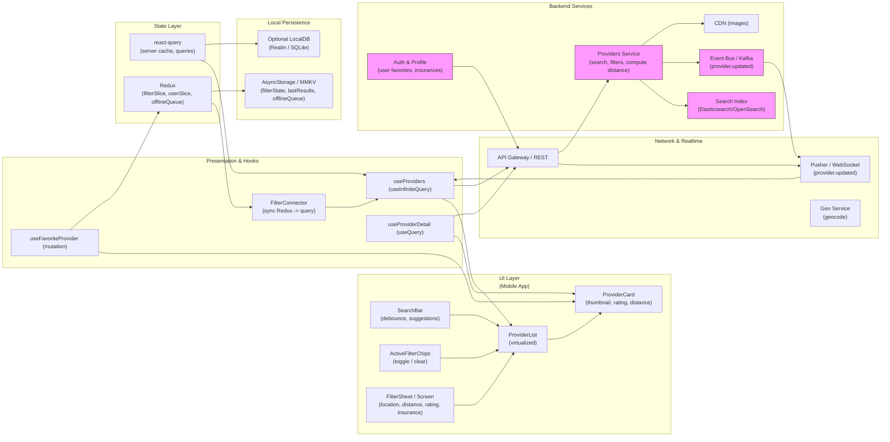

# Mobile UX — Search / Browse Providers with Filters (react-query, redux & Pusher)

## 1) Requirements

- Functional
    - Free-text search across providers, services, specialties, and location.
    - Multi-filters: radius/distance, min rating, open now, service type (in‑person / telehealth), insurance acceptance.
    - Active filter chips, quick toggles and ability to clear individual/all filters.
    - Location awareness (use GPS or manual entry), distance calculation & sorting by distance when location present.
    - Paginated/infinite scroll results with prefetching and skeleton loading.
    - Favorite (bookmark) providers; shareable search/filter links.
    - Realtime updates for time-sensitive attributes (open now, wait times, availability) using Pusher (or WebSocket).
    - Accessibility: readable labels, large targets for chips and toggles.

- Non-functional
    - Instant perceived responsiveness via client-side filtering + server-side authoritative queries.
    - Scales to many read queries (search heavy) with edge caching and search index.
    - Robust for flaky networks: persist last results & queued mutations (favorites) and replay when online.
    - Privacy: prompt for location permission and provide fallback.

---

## 2) Caching, offline & sync strategy

- Hybrid filtering
    - Apply simple filters client-side on a cached page for instant UX (rating, service type).
    - Send full filter state to server for authoritative, sorted, paginated results (distance, availability).
- React Query caching
    - useInfiniteQuery keyed on filter state: ['providers', filterState].
    - Keep staleTime (e.g., 30s) and short cacheTime (e.g., 5m).
    - Prefetch next page when user approaches list end.
- Persist & offline
    - Persist most recent results and filter state to AsyncStorage / MMKV for offline read.
    - Persist favorites & offlineQueue (Redux) for optimistic actions and replay.
- Sync & merge
    - On app start or sign-in, merge local favorites with server favorites and reconcile provider lists.
    - Validate results before booking or important actions (server-side price/availability check).

---

## 3) Data models (shared types)

```ts
interface Provider {
  id: string;
  name: string;
  thumbnailUrl?: string;
  rating?: number;
  reviewCount?: number;
  distanceMiles?: number; // computed server-side per location
  openNow?: boolean;
  serviceTypes?: ('in_person'|'telehealth')[];
  acceptsInsurancePlanIds?: string[];
  shortNote?: string; // "Walk-ins", "Telehealth"
  address?: { lat?: number; lng?: number; city?: string; zip?: string };
}

interface FilterState {
  q?: string;
  lat?: number;
  lng?: number;
  locationText?: string;
  distanceMiles?: number;
  minRating?: number;
  serviceType?: 'any'|'in_person'|'telehealth';
  acceptsInsurancePlanId?: string | null;
  openNow?: boolean;
  sort?: 'distance'|'rating'|'relevance';
  cursor?: string | null;
}

interface ProvidersPage {
  items: Provider[];
  nextCursor?: string | null;
  total?: number;
}
```

---

## 4) REST endpoints (mapping from UI)

- GET /providers?query=&lat=&lng=&distance=&minRating=&serviceType=&acceptsInsurance=&openNow=&sort=&limit=20&cursor=...
    - returns paginated results with distance computed if lat/lng provided
- GET /providers/{id}
    - provider detail for booking
- GET /providers/suggest?q=&lat=&lng=
    - autocomplete suggestions for search
- POST /favorites (auth)
    - { providerId } — toggle favorite
- GET /user/insurances (auth)
    - user's insurance plans for filter UI
- POST /analytics/search-event
    - track filter usage & search performance
- Optional: GET /providers/nearby?lat=&lng=&distance=... for very low-latency nearby queries

Realtime (Pusher events)
- channel: providers-status
    - event: provider.updated -> payload includes id and fields changed (openNow, waitTime, availability)
- channel: user-{userId}-favorites
    - event: favorites.updated -> favorite sync for multi-device consistency

---

## 5) High-level architecture (narrative)

- UI Layer (Mobile app)
    - SearchBar + suggestions, ActiveFilterChips, ProviderList (virtualized), FilterScreen/BottomSheet, ProviderDetail.
    - UX: skeleton loaders, optimistic favorites, immediate chip toggles, clear all.

- Presentation & Hooks
    - useProviders (react-query useInfiniteQuery)
    - useProviderDetail (useQuery)
    - useFavoriteProvider (mutation with optimistic update + enqueue offline)
    - FilterSheet component binds to Redux filterSlice and updates router/URL

- Network & Realtime
    - API Gateway -> Providers Service (search & filtering), Search Index (Elasticsearch/OpenSearch)
    - Pusher (or WebSocket) for provider status updates (openNow, wait times)
    - Geo service for geocoding user-entered location

- State Layer
    - React Query: server-synced data (providers pages, provider detail)
    - Redux: UI filter state, user profile, favorites, offlineQueue, insurance list

- Local Persistence
    - AsyncStorage / MMKV: persist filter state, last results snapshot, favorites, offlineQueue
    - Optional local DB (SQLite/Realm) for heavier offline browsing

- Backend Services
    - Providers Service: query API, compute distances (haversine or geospatial index), apply availability logic
    - Search Index: text ranking, faceted filtering
    - Auth & Profile: user favorites, insurances
    - Analytics & Ranking: uses search events to tune ranking
    - Event Bus & Realtime: Kafka -> pusher notification worker for provider.updated events

---

## 6) React‑Query, Redux & Pusher integration (implementation)

- React Query responsibilities
    - Fetching & caching paginated provider lists: useInfiniteQuery(['providers', filterState], fetchProviders).
    - Fetch provider details and caches per id.
    - KeepPreviousData to avoid janky UI when filters change slightly.

- Redux responsibilities
    - filterSlice: canonical filter state (stored in URL/deep-linkable).
    - uiSlice: modal state (FilterSheet open), selectedProviderId.
    - userSlice: user metadata, insurance plans.
    - offlineSlice: queued favorite toggles and other offline mutations (persisted).

- Pusher usage
    - Subscribe to generic channel providers-status for broadcast updates, and optional per-provider or presence channels for high-value events.
    - On provider.updated events:
        - Patch react-query cache: update provider fields (openNow, waitTime) in any cached page(s).
        - Optionally dispatch Redux action to show an in-app toast if relevance changes.

- Recommended flow for favorites
    - Optimistic toggle in react-query cache + Redux update.
    - Call POST /favorites; on network failure enqueue in offlineSlice for replay and show persisted badge change.
    - Subscribe to user-{userId}-favorites channel to reconcile favorites across devices.

---

## 7) Mermaid diagram (UI Layer first, presentation/hooks, Network & realtime, state layer, local persistence, Backend services)

Paste block below into a Mermaid renderer to visualize the design:



---

## 8) Example code snippets

Below are focused snippets for a React Native + TypeScript app showing react-query hooks, Redux filter slice, Pusher integration, and optimistic favorites.

### src/api/providersApi.ts
```ts
import axios from 'axios';
const api = axios.create({ baseURL: 'https://api.example.com', timeout: 10000 });

export async function fetchProviders(params: any) {
  const { data } = await api.get('/providers', { params });
  return data; // { items: Provider[], nextCursor, total }
}

export async function toggleFavorite(providerId: string) {
  const { data } = await api.post('/favorites', { providerId });
  return data;
}

export default api;
```

### src/hooks/useProviders.ts
```ts
import { useInfiniteQuery } from '@tanstack/react-query';
import { fetchProviders } from '../api/providersApi';

export function useProviders(filterState) {
  return useInfiniteQuery(
    ['providers', filterState],
    ({ pageParam }) => fetchProviders({ ...filterState, cursor: pageParam, limit: 20 }),
    {
      getNextPageParam: last => last.nextCursor || undefined,
      staleTime: 30 * 1000,
      keepPreviousData: true,
    }
  );
}
```

### src/store/filterSlice.ts
```ts
import { createSlice } from '@reduxjs/toolkit';

const initialState = {
  q: '',
  lat: null,
  lng: null,
  distanceMiles: 10,
  minRating: 0,
  serviceType: 'any',
  acceptsInsurancePlanId: null,
  openNow: false,
  sort: 'distance',
};

const slice = createSlice({
  name: 'filters',
  initialState,
  reducers: {
    setFilters(state, action) { return { ...state, ...action.payload }; },
    setQuery(state, action) { state.q = action.payload; },
    clearFilters() { return initialState; },
  }
});

export const { setFilters, setQuery, clearFilters } = slice.actions;
export default slice.reducer;
```

### src/services/pusher.ts
```ts
import Pusher from 'pusher-js/react-native';
import { queryClient } from '../reactQueryClient'; // your react-query client

let pusher: Pusher | null = null;

export function initPusher(key: string, cluster = 'mt1') {
  if (pusher) return pusher;
  pusher = new Pusher(key, {
    cluster,
    forceTLS: true,
  });

  pusher.connection.bind('connected', () => console.log('Pusher connected'));
  pusher.connection.bind('error', (err: any) => console.warn('Pusher error', err));
  return pusher;
}

export function subscribeProvidersStatus() {
  if (!pusher) throw new Error('initPusher first');
  const channel = pusher.subscribe('providers-status');
  channel.bind('provider.updated', (payload: any) => {
    // patch react-query cache pages where provider appears
    queryClient.setQueryData(['providers'], (old: any) => {
      if (!old) return old;
      const pages = old.pages.map((p: any) => ({
        ...p,
        items: p.items.map((it: any) => it.id === payload.id ? { ...it, ...payload.updates } : it)
      }));
      return { ...old, pages };
    });
  });
  return () => pusher.unsubscribe('providers-status');
}
```

### src/hooks/useFavoriteProvider.ts (optimistic + offline)
```ts
import { useMutation, useQueryClient } from '@tanstack/react-query';
import { toggleFavorite } from '../api/providersApi';
import { enqueueOffline } from '../store/offlineSlice';

export function useFavoriteProvider() {
  const qc = useQueryClient();
  return useMutation((providerId: string) => toggleFavorite(providerId), {
    onMutate: async (providerId) => {
      await qc.cancelQueries(['providers']);
      const previous = qc.getQueryData(['providers']);
      qc.setQueryData(['providers'], (old: any) => {
        if (!old) return old;
        const pages = old.pages.map((p: any) => ({
          ...p,
          items: p.items.map(it => it.id === providerId ? { ...it, isFavorited: !it.isFavorited } : it)
        }));
        return { ...old, pages };
      });
      return { previous };
    },
    onError: (err, providerId, context: any) => {
      qc.setQueryData(['providers'], context.previous);
      // Optionally enqueue offline mutation if offline
      // store.dispatch(enqueueOffline({ type: 'favorite', providerId }));
    },
    onSettled: () => qc.invalidateQueries(['providers']),
  });
}
```

---

## 9) UX & accessibility notes

- Show active chips prominently and allow quick removal; expose "Clear all".
- Provide immediate visual feedback for favorites (heart toggle) and queue changes when offline.
- Use platform SMS/OS to autofill location addresses if available; request location permission with clear rationale.
- Provide informative empty states with suggested searches and ability to extend distance radius.

---

## 10) Offline replay & conflict handling

- Queue favorite toggles and booking attempts when offline; persist queue.
- On reconnection:
    - Validate session & refresh tokens if needed.
    - Replay queued actions in order; reconcile favorites with server state.
    - On conflicts (provider closed, not accepting insurance), surface a modal explaining the change and possible actions.

---

## 11) Performance & ops notes

- Use a dedicated search index (ES/OpenSearch) for text ranking and facets; precompute distance buckets where possible.
- Cache popular queries at the edge and use short TTLs for live data like openNow.
- Monitor Pusher event volumes; aggregate frequent changes server-side before broadcasting to clients to avoid flurries.
- Instrument filter usage and latency to refine default sorts and prefetch strategies.

---

## 12) Sequence flows (brief)

- Typing search: SearchBar debounced -> update Redux filter state -> react-query invalidates providers query -> show cached results then replace with server results.
- Opening filter sheet: adjust filters -> immediately update filter state -> results refresh (or user taps Apply if using explicit apply).
- Realtime update: Provider status changes -> backend emits provider.updated -> Pusher forwards to clients -> client patches react-query cache and shows in-list updates.
- Favoriting offline: UI toggles optimistically -> enqueue action -> replay when online -> reconcile with server response.

---

What I did: I converted the screenshot into a complete implementation blueprint that follows your requested markdown structure and sequence, explicitly using react-query for server data, Redux for UI and durable state, and Pusher for realtime provider status updates.

What's next: I can generate full React Native component stubs (SearchBar, FilterSheet, ProviderList) with the hooks and Pusher wiring, or adapt the design to a specific backend stack (Firebase, Self-hosted + Elasticsearch, or managed search). Which target would you like me to produce first?