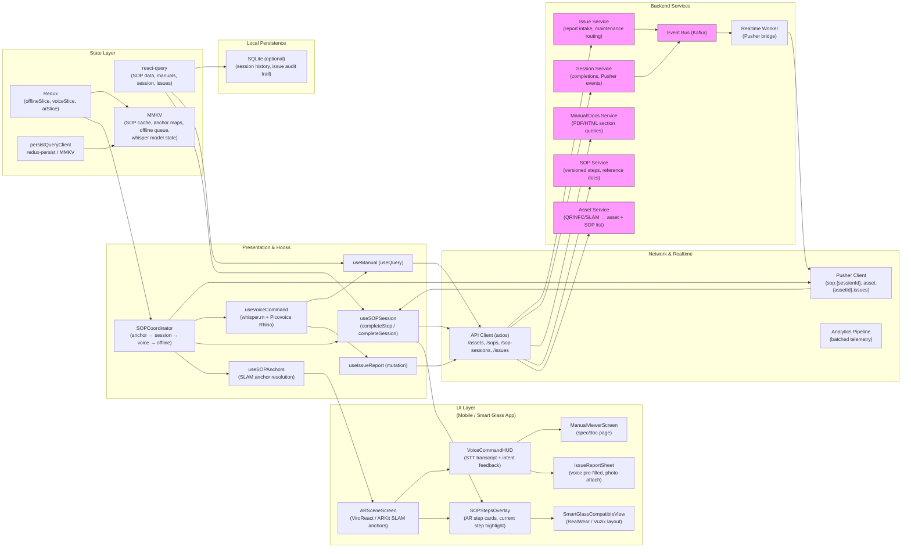

# Hands-Free Workflow (SOP) — AR-Anchored Guided Troubleshooting with Voice Commands (ViroReact, whisper.rn & Picovoice Rhino)


## 1) Requirements

- Functional
    - **AR-Anchored SOPs:** Scan or tap a physical asset (machine, valve, panel) to display step-by-step Standard Operating Procedures anchored in 3D space using Spatial SLAM.
    - **Guided Troubleshooting:** Walk technicians through numbered steps with visual AR overlays; mark each step complete via voice or tap.
    - **Voice-Activated Lookup:** Hands-free retrieval of manuals, torque specs, and wiring diagrams using natural voice commands (e.g., "Visor, show me the torque specs").
    - **Intent Recognition:** Picovoice Rhino interprets domain-specific industrial intents (show_specs, report_issue, next_step, repeat_step, complete_step).
    - **Offline Speech-to-Text:** whisper.rn processes audio entirely on-device; no audio leaves the device.
    - **Issue Reporting:** Technicians report defects or anomalies hands-free ("Visor, report issue — coolant leak at valve 3") which are queued and synced when connectivity returns.
    - **Smart Glass Compatibility:** UI adapts to head-mounted AR displays (RealWear HMT-1, Vuzix Blade) via Expo Config Plugins managing custom native drivers and Android smart glass manifests.
    - **Session Tracking:** Record which SOP steps are completed, by whom, and when; sync completion state across devices and supervisors.
    - **Offline-first:** Full SOP guidance, voice commands, and issue queuing work without network connectivity.
- Non-functional
    - Low-latency AR anchor resolution (<200 ms from scan to overlay).
    - On-device STT (whisper.rn) to meet industrial privacy requirements; no raw audio transmitted.
    - Graceful degradation on non-AR devices: show step-by-step list UI instead of AR overlays.
    - Smart glass manifest and driver management handled declaratively through Expo Config Plugins.
    - Idempotent issue submissions to prevent duplicate reports on reconnect.
    - Battery-aware: suspend SLAM and microphone polling when device is idle.

---

## 2) Caching, offline & sync strategy

- Offline-first SOP delivery
    - On launch (or when network is available), prefetch all SOPs relevant to the user's assigned assets and persist them to MMKV / SQLite.
    - `useQuery(['sop', sopId])` returns staleTime: Infinity for cached SOPs; background refetch on reconnect.
    - AR anchor maps (SLAM data) are stored locally per asset ID so anchors survive app restarts.
- React Query usage
    - `useQuery(['sops', assetId])` to fetch the SOP list for a scanned asset; `initialData` from local MMKV cache.
    - `useQuery(['sop', sopId])` for full step detail; persisted via `persistQueryClient`.
    - `useQuery(['manuals', assetId])` for document lookup; LRU-evicted after 7 days.
    - `useMutation` for step completion and issue reporting with optimistic updates.
- Offline queue & replay
    - Step completions, issue reports, and session events are enqueued in Redux `offlineSlice` when offline.
    - Replay FIFO with idempotency keys on reconnect; server deduplicates by `idempotencyKey`.
- Voice session state
    - Picovoice Rhino context (intent grammar binary) is bundled at build time; no runtime download required.
    - whisper.rn model (e.g., `whisper-tiny.en`) is downloaded once and stored in the app's document directory.
- Realtime collaboration
    - Pusher channel `sop.{sessionId}` broadcasts step completions to supervisors and co-workers in real time.

---

## 3) Data models (shared types)

```ts
interface SOPAnchor {
  id: string;
  assetId: string;           // physical asset identifier (scanned QR/NFC or SLAM-matched)
  anchorTransform: number[]; // 4x4 transform matrix from SLAM
  createdAt: string;         // ISO
}

interface SOPStep {
  id: string;
  sopId: string;
  order: number;
  title: string;
  instruction: string;
  warningNote?: string;
  referenceDocUrl?: string;  // manual page deep-link
  torqueSpec?: string;       // e.g., "45 Nm ± 5%"
  imageUrl?: string;
  estimatedDurationSec?: number;
}

interface SOP {
  id: string;
  assetId: string;
  title: string;
  version: string;
  steps: SOPStep[];
  updatedAt: string;
}

interface SOPSession {
  id: string;
  idempotencyKey: string;
  sopId: string;
  assetId: string;
  technicianId: string;
  startedAt: string;
  completedAt?: string;
  completedSteps: StepCompletion[];
  status: 'in_progress' | 'completed' | 'abandoned';
}

interface StepCompletion {
  stepId: string;
  completedAt: string;         // ISO
  method: 'voice' | 'tap';
  idempotencyKey: string;
}

interface VoiceIntent {
  intent: 'show_specs' | 'report_issue' | 'next_step' | 'repeat_step' | 'complete_step' | 'lookup_manual' | 'unknown';
  slots: Record<string, string>; // e.g., { component: 'valve_3', spec: 'torque' }
  rawTranscript: string;
  confidence: number;
}

interface IssueReport {
  id?: string;
  idempotencyKey: string;
  assetId: string;
  sopSessionId?: string;
  stepId?: string;
  description: string;         // from voice transcript
  severity: 'low' | 'medium' | 'high' | 'critical';
  reportedAt: string;          // ISO
  technicianId: string;
  status: 'pending' | 'submitted' | 'acknowledged' | 'resolved';
  imageUrl?: string;
}
```

---

## 4) REST endpoints (mapping from the UI)

- GET /assets/{assetId}/sops
    - returns list of SOPs available for a scanned asset (title, version, step count)
- GET /sops/{sopId}
    - returns full SOP with all SOPStep details, reference doc URLs, and torque specs
- GET /manuals/{assetId}?section=torque_specs
    - returns manual section; `section` is derived from Picovoice Rhino slot values
- POST /sop-sessions
    - start a new session: `{ idempotencyKey, sopId, assetId, technicianId }`; returns SOPSession
- PATCH /sop-sessions/{sessionId}/steps/{stepId}/complete
    - mark step as complete: `{ idempotencyKey, method, completedAt }`
- PATCH /sop-sessions/{sessionId}/complete
    - mark entire session as complete
- POST /issues
    - report an issue: `{ idempotencyKey, assetId, sopSessionId?, stepId?, description, severity, imageUrl? }`
- GET /issues?assetId=&status=
    - list open issues for an asset (for supervisor dashboard)
- POST /analytics/event
    - log voice command usage, step durations, anchor resolution latency

Realtime (Pusher):
- `sop.{sessionId}` → `step.completed` | `session.completed` (cross-device supervisor visibility)
- `asset.{assetId}.issues` → `issue.created` | `issue.resolved` (live issue board)

---

## 5) High‑level architecture (narrative — ordered for mermaid)

- UI Layer
    - **ARSceneScreen**: ViroReact (or react-native-arkit) scene hosting SLAM-tracked anchor nodes; renders SOPStepCard overlays attached to physical asset anchors.
    - **SOPStepsOverlay**: floating AR panel listing numbered steps; current step highlighted; tap or voice to complete.
    - **VoiceCommandHUD**: heads-up display showing STT transcript in real time and recognized intent feedback ("Showing torque specs…").
    - **SmartGlassCompatibleView**: adaptive layout that collapses to a single-column, large-text, voice-only UI for RealWear/Vuzix displays.
    - **IssueReportSheet**: bottom sheet pre-filled from voice slots; allows photo attachment before submission.
    - **ManualViewerScreen**: rendered manual / spec page from `referenceDocUrl`, opened by voice or tap.

- Presentation & Hooks
    - **useSOPAnchors** — resolves SLAM anchor for the scanned asset and triggers SOP fetch.
    - **useSOPSession** — creates and tracks the current session; exposes `completeStep(stepId)` and `completeSession()` mutations.
    - **useVoiceCommand** — orchestrates whisper.rn recording and Picovoice Rhino inference; returns `VoiceIntent`.
    - **useIssueReport** — mutation for POST /issues with optimistic enqueue when offline.
    - **useManual** — `useQuery(['manuals', assetId, section])` for on-demand doc lookup.
    - **SOPCoordinator** — ties together anchor resolution, session lifecycle, voice events, and offline queue dispatch.

- Network & Realtime
    - **ApiClient** (axios) — calls /assets, /sops, /sop-sessions, /issues endpoints with auth headers.
    - **Pusher client** — subscribes to `sop.{sessionId}` and `asset.{assetId}.issues` channels for live sync.
    - **Analytics pipeline** — batched telemetry for voice command accuracy, step durations, anchor resolution latency.

- State Layer
    - **react-query**: SOP data, manual sections, issue lists, session state.
    - **redux**:
        - `offlineSlice`: queued step completions, issue reports, and session events.
        - `voiceSlice`: recording state, last transcript, current intent, wake-word active flag.
        - `arSlice`: current anchor ID, SLAM tracking state, device capability (AR/non-AR/smart-glass).
    - **persistQueryClient** + **redux-persist** backed by MMKV.

- Local Persistence
    - **MMKV**: cached SOP JSON, anchor transform maps, offline action queue, whisper model download state.
    - **SQLite (optional)**: longer-term session history and issue audit trail.

- Backend Services
    - **Asset Service**: resolves asset ID from QR/NFC/SLAM fingerprint to asset metadata and linked SOPs.
    - **SOP Service**: versioned SOP storage; serves step content and reference doc links.
    - **Manual/Docs Service**: stores PDF/HTML manuals; serves section-level queries.
    - **Session Service**: persists SOPSessions and StepCompletions; emits Pusher events on state change.
    - **Issue Service**: receives issue reports, routes to maintenance queues, manages lifecycle.
    - **Event Bus (Kafka)**: decouples services; drives Realtime Worker → Pusher bridge.
    - **Analytics Service**: ingests telemetry for voice accuracy dashboards and SOP completion metrics.

---

## 6) React‑Query, Redux & Pusher integration (implementation notes)

- React Query
    - `useQuery(['sop', sopId])` with `staleTime: Infinity` for pre-fetched offline SOPs; set `networkMode: 'offlineFirst'`.
    - `useMutation` for step completion and issue reporting; `onMutate` performs optimistic update to `['session', sessionId]` cache; `onError` rolls back.
    - `queryClient.prefetchQuery(['sop', sopId])` triggered as soon as SLAM anchor is resolved to eliminate wait time.
- Redux
    - `offlineSlice.enqueue({ id, type: 'completeStep' | 'reportIssue', payload, idempotencyKey })` on any mutation when offline.
    - `voiceSlice` drives the recording lifecycle; components observe `voiceSlice.intent` to trigger navigation (open manual, open issue sheet).
    - `arSlice.trackingState` gates AR rendering; UI degrades to list view when SLAM tracking is `'limited'` or `'unavailable'`.
- Pusher
    - Subscribe to `sop.{sessionId}` on session start; bind `step.completed` to patch `['session', sessionId]` in react-query cache for supervisor visibility.
    - Subscribe to `asset.{assetId}.issues` on asset selection; bind `issue.created` to invalidate `['issues', assetId]`.

---

## 7) Mermaid diagram (UI Layer first, presentation & hooks, Network & realtime, state layer, local persistence, Backend services)



---

## 8) Example code snippets

### src/api/sopApi.ts
```ts
import axios from 'axios';
const api = axios.create({ baseURL: 'https://api.example.com', timeout: 10000 });

export async function fetchSOPsForAsset(assetId: string) {
  const { data } = await api.get(`/assets/${assetId}/sops`);
  return data as SOP[];
}

export async function fetchSOP(sopId: string) {
  const { data } = await api.get(`/sops/${sopId}`);
  return data as SOP;
}

export async function startSOPSession(payload: {
  idempotencyKey: string;
  sopId: string;
  assetId: string;
  technicianId: string;
}) {
  const { data } = await api.post('/sop-sessions', payload);
  return data as SOPSession;
}

export async function completeStep(
  sessionId: string,
  stepId: string,
  payload: { idempotencyKey: string; method: 'voice' | 'tap'; completedAt: string }
) {
  const { data } = await api.patch(`/sop-sessions/${sessionId}/steps/${stepId}/complete`, payload);
  return data;
}

export async function reportIssue(payload: IssueReport) {
  const { data } = await api.post('/issues', payload);
  return data;
}
```

### src/hooks/useSOPSession.ts
```ts
import { useQuery, useMutation, useQueryClient } from '@tanstack/react-query';
import NetInfo from '@react-native-community/netinfo';
import { startSOPSession, completeStep } from '../api/sopApi';
import { store } from '../store';
import { v4 as uuidv4 } from 'uuid';

export function useSOPSession(sopId: string, assetId: string, technicianId: string) {
  const qc = useQueryClient();

  const startSession = useMutation(
    () => startSOPSession({ idempotencyKey: uuidv4(), sopId, assetId, technicianId }),
    {
      onSuccess: (session) => {
        qc.setQueryData(['session', session.id], session);
      },
    }
  );

  function completeStepFn(sessionId: string, stepId: string, method: 'voice' | 'tap') {
    const idempotencyKey = uuidv4();
    const completedAt = new Date().toISOString();

    // optimistic update
    qc.setQueryData(['session', sessionId], (old: SOPSession | undefined) => {
      if (!old) return old;
      return {
        ...old,
        completedSteps: [
          ...old.completedSteps,
          { stepId, completedAt, method, idempotencyKey },
        ],
      };
    });

    const netState = await NetInfo.fetch();
    if (netState.isConnected) {
      completeStep(sessionId, stepId, { idempotencyKey, method, completedAt }).catch(() => {
        // rollback handled by onError in useMutation; enqueue for retry
        store.dispatch({
          type: 'offline/enqueue',
          payload: { id: idempotencyKey, type: 'completeStep', payload: { sessionId, stepId, idempotencyKey, method, completedAt } },
        });
      });
    } else {
      store.dispatch({
        type: 'offline/enqueue',
        payload: { id: idempotencyKey, type: 'completeStep', payload: { sessionId, stepId, idempotencyKey, method, completedAt } },
      });
    }
  }

  return { startSession, completeStepFn };
}
```

### src/hooks/useVoiceCommand.ts
```ts
import { useEffect, useRef, useState, useCallback } from 'react';
import { initWhisper, transcribeRealtime } from 'whisper.rn';
import { RhinoManager } from '@picovoice/rhino-react-native';

const RHINO_CONTEXT_PATH = require('../../assets/visor_industrial_en.rhn'); // bundled context

export function useVoiceCommand(onIntent: (intent: VoiceIntent) => void) {
  const rhinoRef = useRef<RhinoManager | null>(null);
  const [transcript, setTranscript] = useState('');
  const [isListening, setIsListening] = useState(false);
  const stableOnIntent = useCallback(onIntent, [onIntent]);

  useEffect(() => {
    let cleanup: (() => void) | undefined;

    async function init() {
      const accessKey = process.env.PICOVOICE_ACCESS_KEY;
      if (!accessKey) {
        console.error('[useVoiceCommand] PICOVOICE_ACCESS_KEY is not set. Voice commands will be unavailable.');
        return;
      }

      // Initialize Picovoice Rhino for intent recognition
      rhinoRef.current = await RhinoManager.create(
        accessKey,
        RHINO_CONTEXT_PATH,
        (inference) => {
          if (inference.isUnderstood) {
            stableOnIntent({
              intent: inference.intent as VoiceIntent['intent'],
              slots: inference.slots ?? {},
              rawTranscript: transcript,
              confidence: 1.0,
            });
          } else {
            stableOnIntent({ intent: 'unknown', slots: {}, rawTranscript: transcript, confidence: 0 });
          }
        }
      );

      // Optionally overlay whisper.rn for richer transcription display
      const whisperCtx = await initWhisper({ filePath: 'whisper-tiny.en.bin' });
      const { stop, subscribe } = await transcribeRealtime(whisperCtx, {
        onTranscribe: (result) => setTranscript(result.result),
      });
      setIsListening(true);
      cleanup = stop;
    }

    init();
    return () => {
      cleanup?.();
      rhinoRef.current?.delete();
    };
  }, [stableOnIntent]);

  return { transcript, isListening };
}
```

### src/services/pusher.ts (SOP session sync)
```ts
import Pusher from 'pusher-js/react-native';
import { queryClient } from '../reactQueryClient';

let pusher: Pusher | null = null;

export function initPusher(key: string, cluster = 'mt1') {
  if (pusher) return pusher;
  pusher = new Pusher(key, { cluster, forceTLS: true });
  return pusher;
}

export function subscribeSOPSession(sessionId: string, technicianId: string) {
  if (!pusher) throw new Error('Pusher not initialized');

  const ch = pusher.subscribe(`sop.${sessionId}`);

  ch.bind('step.completed', (payload: { stepId: string; completedAt: string; method: string; technicianId: string }) => {
    if (payload.technicianId === technicianId) return; // ignore own events echoed back
    queryClient.setQueryData(['session', sessionId], (old: SOPSession | undefined) => {
      if (!old) return old;
      const alreadyDone = old.completedSteps.some((s) => s.stepId === payload.stepId);
      if (alreadyDone) return old;
      return {
        ...old,
        completedSteps: [
          ...old.completedSteps,
          { stepId: payload.stepId, completedAt: payload.completedAt, method: payload.method as 'voice' | 'tap', idempotencyKey: '' },
        ],
      };
    });
  });

  ch.bind('session.completed', () => {
    queryClient.invalidateQueries(['session', sessionId]);
  });

  return () => pusher!.unsubscribe(`sop.${sessionId}`);
}
```

### src/components/ARSceneScreen.tsx (ViroReact sketch)
```tsx
import React from 'react';
import { ViroARScene, ViroARSceneNavigator, ViroText, ViroNode } from '@viro-community/react-viro';
import { useSOPAnchors } from '../hooks/useSOPAnchors';
import { useSOPSession } from '../hooks/useSOPSession';

/** Extracts the translation [x, y, z] from a column-major 4x4 transform matrix. */
function extractPosition(transform: number[]): [number, number, number] {
  return [transform[12], transform[13], transform[14]];
}

function SOPARScene() {
  const { anchor, sopSteps, currentStepIndex } = useSOPAnchors();
  const { completeStepFn } = useSOPSession(anchor?.sopId ?? '', anchor?.assetId ?? '', 'tech-001');

  if (!anchor) return null;

  return (
    <ViroARScene>
      <ViroNode position={extractPosition(anchor.anchorTransform)}>
        {sopSteps.map((step, idx) => (
          <ViroText
            key={step.id}
            text={`${step.order}. ${step.title}`}
            position={[0, -idx * 0.12, -0.5]}
            style={{
              fontFamily: 'Arial',
              fontSize: 14,
              color: idx === currentStepIndex ? '#00FF00' : '#FFFFFF',
            }}
            onClick={() => completeStepFn(anchor.sessionId, step.id, 'tap')}
          />
        ))}
      </ViroNode>
    </ViroARScene>
  );
}

export function ARSceneScreen() {
  return (
    <ViroARSceneNavigator
      autofocus
      initialScene={{ scene: SOPARScene }}
      style={{ flex: 1 }}
    />
  );
}
```

### app.config.js (Expo Config Plugin for Smart Glass)
```js
// Expo Config Plugin snippet — adds RealWear / Vuzix manifest requirements
const { withAndroidManifest } = require('@expo/config-plugins');

const withSmartGlass = (config) => {
  // Add custom Android permissions and features for head-mounted displays
  config.android = config.android ?? {};
  config.android.permissions = [
    ...(config.android.permissions ?? []),
    'android.permission.RECORD_AUDIO',
    'android.permission.CAMERA',
  ];

  // Inject smart glass intent filter and display type into AndroidManifest
  config = withAndroidManifest(config, (androidConfig) => {
    const mainApplication = androidConfig.modResults.manifest.application[0];
    mainApplication['uses-feature'] = [
      ...(mainApplication['uses-feature'] ?? []),
      { $: { 'android:name': 'android.hardware.microphone', 'android:required': 'false' } },
      { $: { 'android:name': 'android.hardware.camera.ar', 'android:required': 'false' } },
    ];
    return androidConfig;
  });

  return config;
};

module.exports = ({ config }) => withSmartGlass(config);
```

---

## 9) UX & accessibility notes

- AR overlay design
    - Keep AR text minimal: step number + one-line title to avoid visual overload; tap card to expand full instruction.
    - Use high-contrast colours (white text on translucent dark panels) for outdoor/bright-light industrial environments.
    - Haptic feedback on step completion; audio chime for voice-confirmed actions.

- Voice command UX
    - Wake phrase ("Visor") activates Picovoice Rhino; idle state shows a mic icon with listening state indicator.
    - Display live STT transcript from whisper.rn as a subtitle so technicians can verify recognition.
    - If intent is `unknown`, prompt: "I didn't understand. Say 'Visor help' for available commands."

- Smart glass adaptations
    - On RealWear/Vuzix, replace gesture navigation with voice-only navigation; remove swipe affordances.
    - Increase font sizes to 18+ sp for visor legibility; single-column layout.
    - Disable AR depth rendering on devices that don't support ARCore (fall back to overlay list on camera feed).

- Offline state indicators
    - Show a banner when offline: "Offline mode — steps will sync when connected."
    - Issue report badge shows pending count; tapping shows the queue.

---

## 10) Offline replay & conflict handling

- Step completions enqueued offline are replayed FIFO on reconnect; `idempotencyKey` prevents double-counting.
- If a step was completed by another technician while offline, server-side timestamps determine canonical first completion; both are preserved in audit trail.
- Issue reports carry `idempotencyKey` + `reportedAt` timestamp; server deduplicates by key and returns the existing report ID on replay.
- SLAM anchor maps cached locally allow the AR overlay to render without connectivity; only SOP content requires a network fetch on first use.

---

## 11) Performance & ops notes

- Prefetch all SOPs for the user's assigned asset list on app foreground to minimise AR wait time.
- whisper.rn model (`tiny.en`, ~75 MB) is downloaded once on first launch and stored in the document directory; skip download if file exists.
- Picovoice Rhino context binary (~50 KB) is bundled at build time via Expo asset system — no runtime download.
- SLAM processing is CPU/GPU intensive: gate `ViroARScene` mount behind a capability check (`ARKit`/`ARCore` availability); idle the SLAM engine when the screen is backgrounded.
- Batch analytics events (step durations, voice accuracy) and flush every 30 seconds or on app background to reduce network chattiness.
- For Pusher: unsubscribe from `sop.{sessionId}` on session completion to free channel slots.

---

## 12) Sequence flows (brief)

- Scan asset → AR overlay
    - Technician taps asset QR / NFC tag → `useSOPAnchors` fetches `GET /assets/{assetId}/sops` (local cache first) → SLAM engine resolves anchor transform → `ViroARScene` renders SOPStepsOverlay at anchor position → `useSOPSession` calls `POST /sop-sessions` to start tracking → supervisor sees live session via Pusher `sop.{sessionId}`.

- Voice command → show torque specs
    - Technician says "Visor, show me the torque specs" → Picovoice Rhino infers `intent: show_specs, slots: { spec: torque }` → `useVoiceCommand` fires `onIntent` → `SOPCoordinator` navigates to `ManualViewerScreen` with `useManual(['manuals', assetId, 'torque_specs'])` → spec page renders (from cache if available).

- Complete step by voice
    - Technician says "Visor, complete step" → Rhino infers `intent: complete_step` → `useSOPSession.completeStepFn` called with `method: 'voice'` → optimistic update marks step green in overlay → `PATCH /sop-sessions/{id}/steps/{stepId}/complete` sent (or enqueued if offline) → Pusher broadcasts `step.completed` to supervisor dashboard.

- Report issue hands-free
    - Technician says "Visor, report issue — coolant leak at valve 3" → Rhino extracts description from slots → `IssueReportSheet` opens pre-filled → technician says "confirm" or taps confirm → `useIssueReport` mutation fires `POST /issues` (or enqueued offline) → supervisor's `asset.{assetId}.issues` Pusher channel fires `issue.created`.

---
