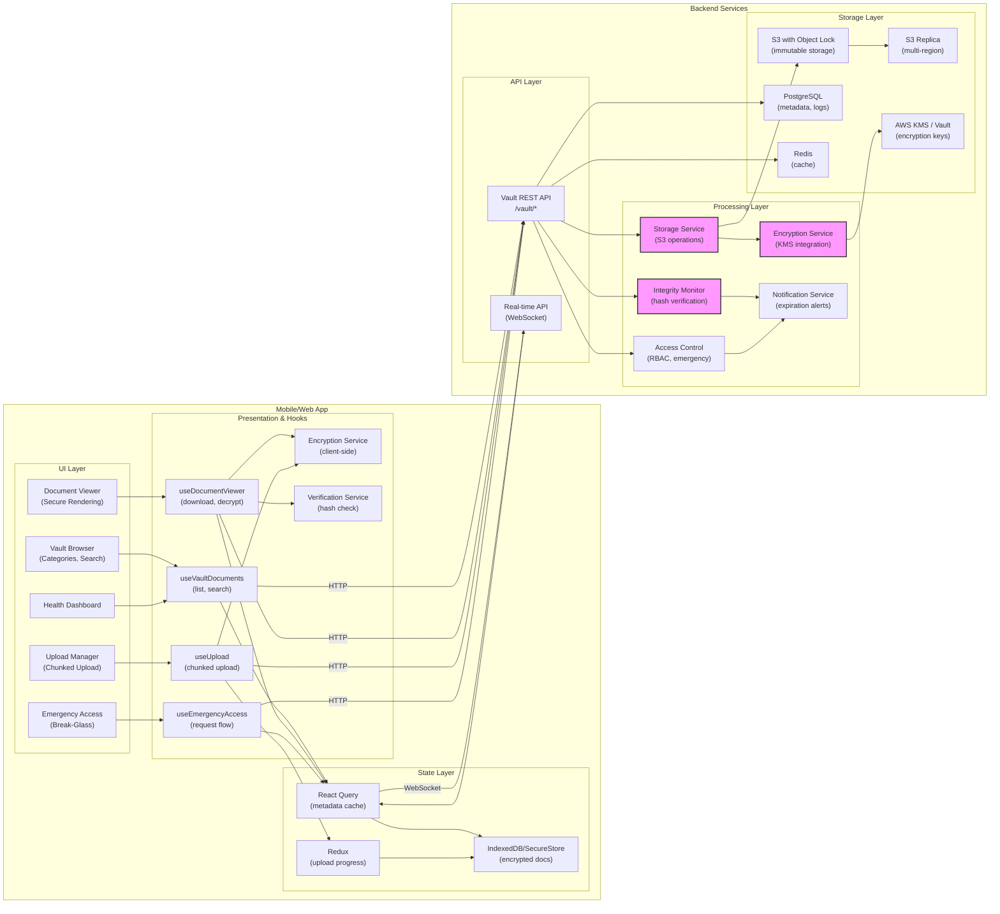

# Mobile System Design — Secure File Storage (Break-Glass Vault)


## 1) Requirements

- Functional requirements
    - Immutable vault for critical "break-glass" documents
    - Store Cyber Insurance Policy, Incident Response Plan, Legal Templates, PR Templates
    - Access documents when primary systems are down (ransomware, network failure)
    - Multi-factor authentication for vault access
    - Document versioning with change history
    - File encryption at rest and in transit
    - Emergency access protocols (break-glass procedure)
    - Document expiration and renewal reminders
    - Search and categorization of vault documents
    - Mobile and offline access to cached critical documents
    - Audit trail of all document access and modifications
    - Role-based permissions for document categories

- Non-functional:
    - 99.999% availability (five nines)
    - Access possible even when corporate network is down
    - Sub-second document retrieval
    - Immutable storage (cannot be encrypted by ransomware)
    - Geographic redundancy across multiple regions
    - Zero-trust security model
    - Compliance with SOC 2, ISO 27001, GDPR
    - Disaster recovery with <5 minute RTO

---

## 2) Caching, offline & sync strategy

- Client caching:
    - Pre-cache critical documents on mobile devices
    - Encrypted local storage using device keychain
    - Periodic background sync for document updates
    - Cache document metadata for fast search
    - Offline-first architecture with eventual consistency

- Document versioning:
    - Store all versions in immutable storage
    - Version history never deleted
    - Client caches latest version by default
    - Can retrieve historical versions on-demand

- Sync strategy:
    - Delta sync for document changes
    - Conflict-free: server version always authoritative
    - Background sync every 24 hours
    - Force sync on app launch if last sync > 7 days
    - Push notifications for critical document updates

- Immutability:
    - Write-once storage backend (S3 with versioning, object lock)
    - No delete operations, only soft delete with retention
    - Append-only audit logs
    - Cryptographic verification of document integrity

---

## 3) Data models (shared types)

```ts
// Vault document
interface VaultDocument {
  id: string;
  name: string;
  description?: string;
  category: 'insurance' | 'incident_response' | 'legal' | 'pr' | 'compliance' | 'contacts' | 'other';
  fileType: 'pdf' | 'docx' | 'xlsx' | 'txt' | 'json';
  fileSizeBytes: number;
  url: string; // encrypted storage URL
  thumbnailUrl?: string;
  version: number;
  versionHistory: DocumentVersion[];
  createdAt: string;
  createdBy: string;
  updatedAt: string;
  updatedBy: string;
  expiresAt?: string; // for policies with expiration
  isExpired: boolean;
  tags: string[];
  accessLevel: 'public' | 'restricted' | 'break_glass_only';
  requiredRoles?: string[];
  cryptographicHash: string; // SHA-256
  encryptionKeyId: string;
}

// Document version
interface DocumentVersion {
  version: number;
  url: string;
  createdAt: string;
  createdBy: string;
  changeNote?: string;
  fileSizeBytes: number;
  cryptographicHash: string;
}

// Document category
interface DocumentCategory {
  id: string;
  name: string;
  description: string;
  icon?: string;
  documentCount: number;
  requiredDocuments?: string[]; // e.g., "Cyber Insurance Policy"
  missingDocuments?: string[];
}

// Access log
interface AccessLog {
  id: string;
  documentId: string;
  documentName: string;
  userId: string;
  userName: string;
  action: 'viewed' | 'downloaded' | 'uploaded' | 'deleted' | 'shared' | 'emergency_access';
  timestamp: string;
  ipAddress?: string;
  userAgent?: string;
  accessMethod: 'web' | 'mobile' | 'api' | 'emergency';
  justification?: string; // for break-glass access
}

// Emergency access request
interface EmergencyAccessRequest {
  id: string;
  userId: string;
  documentId: string;
  reason: string;
  requestedAt: string;
  approvedBy?: string;
  approvedAt?: string;
  status: 'pending' | 'approved' | 'denied' | 'expired';
  expiresAt: string;
}

// Vault health check
interface VaultHealth {
  status: 'healthy' | 'degraded' | 'critical';
  lastCheckAt: string;
  issues: HealthIssue[];
  storageUsedGB: number;
  documentCount: number;
  expiringSoonCount: number;
  missingCriticalDocs: string[];
}

// Health issue
interface HealthIssue {
  severity: 'critical' | 'warning' | 'info';
  type: 'expired_document' | 'missing_document' | 'access_failure' | 'integrity_check_failed';
  message: string;
  documentId?: string;
  detectedAt: string;
}
```

---

## 4) REST endpoints (mapping from UI)

- GET /vault/documents
    - query params: category, tags, search, limit, cursor
    - response: { documents: VaultDocument[], nextCursor?: string }

- GET /vault/documents/{documentId}
    - response: VaultDocument

- POST /vault/documents/upload
    - body: multipart/form-data with file and metadata
    - response: { document: VaultDocument, uploadUrl: string }

- GET /vault/documents/{documentId}/download
    - response: presigned download URL or direct file stream

- POST /vault/documents/{documentId}/version
    - body: file update
    - response: { document: VaultDocument }

- DELETE /vault/documents/{documentId}
    - soft delete only
    - response: { success: boolean }

- GET /vault/documents/{documentId}/versions
    - response: { versions: DocumentVersion[] }

- GET /vault/documents/{documentId}/download/{version}
    - response: presigned URL for specific version

- GET /vault/categories
    - response: { categories: DocumentCategory[] }

- POST /vault/emergency-access/request
    - body: { documentId, reason }
    - response: { request: EmergencyAccessRequest }

- POST /vault/emergency-access/{requestId}/approve
    - body: { approvedBy }
    - response: { request: EmergencyAccessRequest, accessToken: string }

- GET /vault/access-logs
    - query params: documentId, userId, startDate, endDate, action
    - response: { logs: AccessLog[] }

- GET /vault/health
    - response: VaultHealth

- POST /vault/documents/{documentId}/verify
    - body: { hash: string }
    - response: { isValid: boolean, storedHash: string }

- GET /vault/export
    - response: downloadable backup archive

Real-time events (WebSocket / Pusher):
- private-vault:document_uploaded
- private-vault:document_updated
- private-vault:document_expiring
- private-vault:emergency_access_requested
- private-vault:health_alert

---

## 4) High‑level architecture (narrative)

- Mobile/Web Client:
    - Vault Browser: category-based navigation and search
    - Document Viewer: secure PDF/document rendering
    - Upload Manager: chunked uploads with progress
    - Emergency Access UI: break-glass request flow
    - Offline Documents: cached critical files
    - Health Dashboard: vault status monitoring

- Presentation / Hooks / Services:
    - React hooks: useVaultDocuments, useDocumentViewer, useEmergencyAccess
    - Encryption Service: client-side encryption/decryption
    - Sync Service: background document synchronization
    - Verification Service: hash checking and integrity validation

- State Management:
    - React Query for document metadata
    - Redux for upload progress and UI state
    - IndexedDB for offline document storage
    - Secure enclave for encryption keys

- Backend Services:
    - Vault API: document management endpoints
    - Storage Service: immutable object storage (S3 with versioning)
    - Encryption Service: key management and encryption operations
    - Access Control Service: RBAC and emergency access workflows
    - Integrity Monitor: periodic hash verification
    - Notification Service: expiration alerts and security notifications
    - Backup Service: cross-region replication

- Storage & Persistence:
    - S3 with Object Lock: immutable document storage
    - Multi-region replication
    - PostgreSQL: metadata, access logs, permissions
    - Redis: cache for frequently accessed metadata
    - AWS KMS / HashiCorp Vault: encryption key management

- Security:
    - End-to-end encryption (AES-256)
    - Zero-knowledge architecture option
    - Multi-factor authentication
    - Hardware security modules (HSM)
    - Regular security audits

---

## 5) Mermaid diagram (high level design)



---

## 6) Example code snippets

### src/api/vaultApi.ts
```typescript
import axios from 'axios';

const api = axios.create({
  baseURL: 'https://api.shadowhq.com',
  timeout: 30000, // longer timeout for file operations
});

export async function fetchVaultDocuments(params: {
  category?: string;
  search?: string;
  tags?: string[];
  limit?: number;
  cursor?: string;
}) {
  const { data } = await api.get('/vault/documents', { params });
  return data;
}

export async function fetchDocument(documentId: string) {
  const { data } = await api.get(`/vault/documents/${documentId}`);
  return data;
}

export async function uploadDocument(file: File, metadata: {
  name: string;
  description?: string;
  category: string;
  tags?: string[];
  expiresAt?: string;
}) {
  // Get presigned upload URL
  const { data: uploadInfo } = await api.post('/vault/documents/upload', {
    fileName: file.name,
    fileType: file.type,
    fileSizeBytes: file.size,
    ...metadata,
  });

  // Upload file to S3
  await axios.put(uploadInfo.uploadUrl, file, {
    headers: { 'Content-Type': file.type },
    onUploadProgress: (progressEvent) => {
      const percentCompleted = Math.round((progressEvent.loaded * 100) / progressEvent.total!);
      // Emit progress event
      window.dispatchEvent(new CustomEvent('upload-progress', {
        detail: { documentId: uploadInfo.document.id, progress: percentCompleted }
      }));
    },
  });

  return uploadInfo.document;
}

export async function downloadDocument(documentId: string, version?: number) {
  const url = version
    ? `/vault/documents/${documentId}/download/${version}`
    : `/vault/documents/${documentId}/download`;
  
  const { data } = await api.get(url);
  return data; // presigned URL
}

export async function requestEmergencyAccess(documentId: string, reason: string) {
  const { data } = await api.post('/vault/emergency-access/request', {
    documentId,
    reason,
  });
  return data.request;
}

export async function approveEmergencyAccess(requestId: string) {
  const { data } = await api.post(`/vault/emergency-access/${requestId}/approve`, {
    approvedBy: 'current-user-id', // should come from auth context
  });
  return data;
}

export async function verifyDocumentIntegrity(documentId: string, hash: string) {
  const { data } = await api.post(`/vault/documents/${documentId}/verify`, { hash });
  return data;
}

export async function fetchVaultHealth() {
  const { data } = await api.get('/vault/health');
  return data;
}

export async function fetchAccessLogs(params: {
  documentId?: string;
  userId?: string;
  startDate?: string;
  endDate?: string;
  action?: string;
}) {
  const { data } = await api.get('/vault/access-logs', { params });
  return data;
}
```

### src/services/encryption.ts
```typescript
import CryptoJS from 'crypto-js';

export class EncryptionService {
  // Generate encryption key (in production, use KMS)
  static async generateKey(): Promise<string> {
    const array = new Uint8Array(32);
    crypto.getRandomValues(array);
    return Array.from(array, byte => byte.toString(16).padStart(2, '0')).join('');
  }

  // Encrypt file before upload
  static async encryptFile(file: File, key: string): Promise<Blob> {
    const fileBuffer = await file.arrayBuffer();
    const wordArray = CryptoJS.lib.WordArray.create(fileBuffer);
    const encrypted = CryptoJS.AES.encrypt(wordArray, key);
    
    return new Blob([encrypted.toString()], { type: 'application/octet-stream' });
  }

  // Decrypt file after download
  static async decryptFile(
    encryptedBlob: Blob,
    key: string,
    originalType: string
  ): Promise<Blob> {
    const encryptedText = await encryptedBlob.text();
    const decrypted = CryptoJS.AES.decrypt(encryptedText, key);
    const arrayBuffer = this.wordArrayToArrayBuffer(decrypted);
    
    return new Blob([arrayBuffer], { type: originalType });
  }

  // Calculate SHA-256 hash of file
  static async hashFile(file: File | Blob): Promise<string> {
    const buffer = await file.arrayBuffer();
    const hashBuffer = await crypto.subtle.digest('SHA-256', buffer);
    const hashArray = Array.from(new Uint8Array(hashBuffer));
    return hashArray.map(b => b.toString(16).padStart(2, '0')).join('');
  }

  private static wordArrayToArrayBuffer(wordArray: any): ArrayBuffer {
    const words = wordArray.words;
    const sigBytes = wordArray.sigBytes;
    const u8 = new Uint8Array(sigBytes);
    
    for (let i = 0; i < sigBytes; i++) {
      u8[i] = (words[i >>> 2] >>> (24 - (i % 4) * 8)) & 0xff;
    }
    
    return u8.buffer;
  }
}
```

### src/hooks/useVaultDocuments.ts
```typescript
import { useQuery, useMutation, useQueryClient } from '@tanstack/react-query';
import { fetchVaultDocuments, uploadDocument, downloadDocument } from '../api/vaultApi';
import { EncryptionService } from '../services/encryption';

export function useVaultDocuments(params: {
  category?: string;
  search?: string;
  tags?: string[];
}) {
  return useQuery(
    ['vault-documents', params],
    () => fetchVaultDocuments(params),
    {
      staleTime: 60000, // 1 minute
      refetchOnWindowFocus: true,
    }
  );
}

export function useUploadDocument() {
  const queryClient = useQueryClient();

  return useMutation(
    async ({ file, metadata, encrypt }: any) => {
      let fileToUpload = file;
      let encryptionKey: string | undefined;

      if (encrypt) {
        encryptionKey = await EncryptionService.generateKey();
        fileToUpload = await EncryptionService.encryptFile(file, encryptionKey);
      }

      // Calculate hash
      const hash = await EncryptionService.hashFile(file);

      const document = await uploadDocument(fileToUpload, {
        ...metadata,
        cryptographicHash: hash,
      });

      // Store encryption key securely (in production, use secure storage)
      if (encryptionKey) {
        sessionStorage.setItem(`vault-key-${document.id}`, encryptionKey);
      }

      return document;
    },
    {
      onSuccess: () => {
        queryClient.invalidateQueries(['vault-documents']);
        queryClient.invalidateQueries(['vault-health']);
      },
    }
  );
}

export function useDownloadDocument() {
  return useMutation(async ({ documentId, version, encrypted, fileType }: any) => {
    const downloadUrl = await downloadDocument(documentId, version);

    // Fetch the file
    const response = await fetch(downloadUrl);
    const blob = await response.blob();

    if (encrypted) {
      // Retrieve encryption key
      const key = sessionStorage.getItem(`vault-key-${documentId}`);
      if (!key) throw new Error('Encryption key not found');

      const decryptedBlob = await EncryptionService.decryptFile(blob, key, fileType);
      return decryptedBlob;
    }

    return blob;
  });
}
```

---

## 7) Immutability & disaster recovery

- Write-once storage:
    - S3 Object Lock in compliance mode
    - Cannot be deleted or modified, even by root
    - Ransomware cannot encrypt vault documents

- Version control:
    - All versions preserved indefinitely
    - Can roll back to any previous version
    - Version history is immutable

- Geographic redundancy:
    - Multi-region replication (e.g., US-East, US-West, EU)
    - Automatic failover to healthy region
    - RTO < 5 minutes, RPO < 1 minute

- Backup strategy:
    - Daily snapshots to separate backup account
    - Cross-account replication for additional protection
    - Offline cold storage for critical documents

---

## 8) Emergency access (break-glass)

- Break-glass procedure:
    - User requests emergency access with justification
    - Automated approval for critical roles (CISO, CEO)
    - Manual approval required for lower-privilege users
    - Time-limited access (e.g., 24 hours)

- Audit trail:
    - All emergency access logged immutably
    - Includes: who, what, when, why
    - Alerts sent to security team
    - Post-incident review required

- Use cases:
    - Ransomware attack → need cyber insurance policy
    - Data breach → need incident response plan
    - Legal emergency → need contract templates
    - Network outage → need contact list

---

## 9) Document lifecycle management

- Expiration tracking:
    - Documents can have expiration dates (e.g., insurance policies)
    - Automated reminders 90, 60, 30 days before expiration
    - Dashboard alerts for expired documents

- Required documents:
    - System tracks which critical docs are missing
    - Health check identifies gaps
    - Onboarding checklist for new organizations

- Document refresh:
    - Periodic review reminders
    - Update workflows for new versions
    - Approval processes for sensitive documents

---

## 10) Performance & UX notes

- Fast access:
    - CDN for frequently accessed documents
    - Pre-signed URLs for direct S3 access
    - Progressive download for large files
    - Thumbnail generation for PDFs

- Offline access:
    - Critical documents cached on device
    - Encrypted local storage
    - Background sync when online
    - Offline indicator in UI

- Mobile optimizations:
    - Optimized PDF viewer for mobile
    - Chunked uploads for large files
    - Resume capability for interrupted uploads
    - Low-bandwidth mode

---

## 11) Sequence flows (brief)

- Upload document:
    - User selects file and category
    - (Optional) Client-side encryption
    - Hash calculation for integrity
    - Request presigned upload URL
    - Upload to S3 with progress tracking
    - Metadata saved to database
    - Document appears in vault

- Emergency access:
    - Network down, need insurance policy
    - User requests emergency access with reason
    - System auto-approves based on role
    - Time-limited access token issued
    - User downloads document
    - Access logged for audit

- Verify integrity:
    - User downloads document
    - Client calculates hash
    - Compares with stored hash
    - Alerts if mismatch (tampering detected)

---

## 12) Security & compliance notes

- Encryption:
    - AES-256 encryption at rest
    - TLS 1.3 in transit
    - Optional client-side encryption (zero-knowledge)
    - Key rotation every 90 days

- Access control:
    - Role-based access (RBAC)
    - Document-level permissions
    - Multi-factor authentication required
    - Session timeout after inactivity

- Compliance:
    - SOC 2 Type II certified
    - ISO 27001 compliant
    - GDPR compliant (data residency, right to deletion)
    - HIPAA compliant option for healthcare

- Monitoring:
    - Real-time integrity monitoring
    - Anomaly detection for unusual access
    - Security alerts for suspicious activity
    - Regular penetration testing
