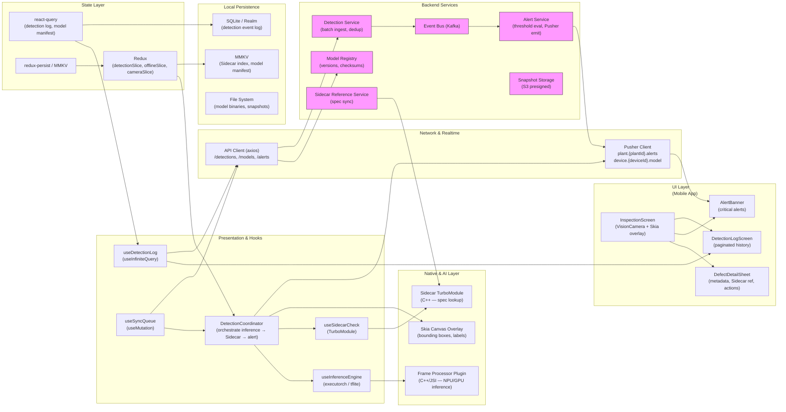

# Industrial Vision — Real-Time Defect Detection, On-Device AI & Domain Fact-Checking

## 1) Vision & Industrial Reasoning

* **Real-Time Defect Detection:** Analyzing camera frames to identify anomalies (cracks, misalignments) at 60 FPS.
* **Tech:** `react-native-vision-camera` (v4+) for high-speed frame access and `@shopify/react-native-skia` for low-latency visual overlays.

* **On-Device Multimodal Analysis:** Local AI that "understands" the physical environment without cloud latency.
* **Tech:** `react-native-executorch` or `react-native-fast-tflite` to run domain-specific models (like Llama-3-Vision or custom MobileNet) directly on the NPU/GPU.

* **Domain-Aligned Fact Checking:** Cross-referencing visual inputs against technical manuals via the **Sidecar** safety layer.
* **Tech:** `Sidecar SDK` (AutoAlign's proprietary bridge) integrated via **TurboModules** for direct C++ communication.

---

## 2) Requirements

- Functional
    - Camera-based frame capture at up to 60 FPS for real-time defect scanning (cracks, misalignments, surface anomalies).
    - On-screen Skia overlays that draw bounding boxes, severity heatmaps, and defect labels directly on live frames with sub-frame latency.
    - On-device AI inference via NPU/GPU — run MobileNet or Llama-3-Vision models locally, no cloud round-trip for primary detection.
    - Sidecar fact-checking layer: cross-reference detected anomaly against technical manuals / reference specs loaded from local storage or the Sidecar SDK.
    - Defect log: record each detection event (timestamp, frame snapshot, defect type, confidence, manual reference, severity).
    - Alert & escalation: push real-time alerts to operators when defect severity exceeds threshold; escalate to remote review queue when confidence is low.
    - Manual override: technician can mark a detection as false-positive, confirm it, or reassign severity.
    - Sync detection log and manual corrections to backend asynchronously; queue when offline.
    - Support multi-camera sources (built-in rear, USB-C external, IP camera via RTSP bridge).
- Non-functional
    - End-to-end detection latency ≤ 33 ms per frame (60 FPS budget) for overlay rendering.
    - Model inference ≤ 20 ms per frame on modern NPU; graceful degradation to GPU/CPU with reduced FPS.
    - Sidecar fact-check lookup ≤ 5 ms (native C++ bridge, no JS thread crossing).
    - Privacy-first: no raw frames leave the device unless explicitly escalated; only metadata and anonymised snapshots synced.
    - Resilient offline operation: full detection capability with local models and cached reference specs even without connectivity.
    - Battery & thermal aware: throttle frame-processing rate under thermal pressure; surface a warning to the operator.

---

## 3) Caching, offline & sync strategy

- On-device model & reference data
    - AI models (`.ptl` / `.tflite`) and Sidecar reference specs (compressed SQLite / flatbuffer) are bundled or downloaded once at startup and cached to the device file system.
    - Background update check: on app launch, compare model version from `GET /models/latest` against local manifest; download delta if newer.
    - Sidecar SDK pre-indexes reference specs on first load; index is stored in MMKV for instant lookups.
- Detection log persistence
    - Each detection event is immediately appended to a local SQLite/Realm store (offline-first, no server dependency).
    - react-query `useMutation` syncs batches of log entries to `POST /detections/batch` when online; entries are removed from the pending queue only after server acknowledgement.
    - Idempotency keys prevent duplicate log entries on retry.
- Frame snapshots
    - Only snapshots flagged for escalation are retained in device storage; raw frames are discarded after inference.
    - Snapshots are uploaded via `POST /detections/{id}/snapshot` with presigned-URL flow; queued offline.
- Operator corrections (manual overrides)
    - Stored immediately in local Redux slice; synced to `PATCH /detections/{id}` when online.
    - Conflict resolution: last-writer-wins on the `confirmedAt` timestamp (corrections are append-only by design).
- Realtime alert delivery
    - High-severity detections are emitted over Pusher channel `plant.{plantId}.alerts` so other connected devices and dashboard are notified instantly.

---

## 4) Data models (shared types)

```ts
// A single defect detection event
interface DetectionEvent {
  id: string;               // server-assigned after sync
  clientId: string;         // optimistic / offline key
  frameTimestamp: number;   // epoch ms of the captured frame
  deviceId: string;
  plantId: string;
  cameraSource: 'rear' | 'external' | 'rtsp';
  defectType: string;       // e.g. 'crack', 'misalignment', 'surface_anomaly'
  confidence: number;       // 0–1 from model output
  severity: 'low' | 'medium' | 'high' | 'critical';
  boundingBox: { x: number; y: number; width: number; height: number };
  sidecarRef?: string;      // matched reference spec ID from Sidecar lookup
  sidecarPassedFactCheck: boolean;
  sidecarTolerance?: { min: number; max: number; unit: string }; // snapshot of tolerance at detection time
  snapshotUrl?: string;     // uploaded if escalated
  operatorNote?: string;
  status: 'pending' | 'confirmed' | 'false_positive' | 'escalated';
  createdAt: string;        // ISO
  syncedAt?: string;
}

// Sidecar fact-check result (returned from native TurboModule)
interface SidecarCheckResult {
  refSpecId: string;
  title: string;
  tolerance: { min: number; max: number; unit: string };
  passed: boolean;
  deviation?: number;
  details?: string;
}

// DetectionEvent captures the Sidecar tolerance snapshot at detection time for audit trails
// (tolerance values are copied from SidecarCheckResult so the record is self-contained)

// Model manifest for OTA updates
interface ModelManifest {
  modelId: string;
  version: string;
  checksum: string;
  downloadUrl: string;
  framework: 'executorch' | 'tflite';
  targetDevice: 'npu' | 'gpu' | 'cpu';
}

// Offline action queue entry
interface OfflineAction {
  id: string;
  type: 'syncDetection' | 'uploadSnapshot' | 'patchDetection';
  payload: any;
  createdAt: string;
  retries: number;
}
```

---

## 5) REST endpoints (mapping from the UI)

- `GET /models/latest`
    - returns `ModelManifest` for each active model; app compares against local version
- `GET /models/{modelId}/download`
    - presigned URL or direct stream for model binary
- `POST /detections/batch`
    - sync a batch of `DetectionEvent[]` from offline queue
- `GET /detections?plantId=&deviceId=&since=&limit=`
    - retrieve recent detection log for a plant / device (pagination)
- `PATCH /detections/{id}`
    - operator correction: `{ status, operatorNote, confirmedAt }`
- `POST /detections/{id}/snapshot`
    - initiate upload: returns presigned S3 URL; client uploads directly
- `POST /alerts`
    - create escalation alert (high-severity detections, low-confidence escalations)
- `GET /sidecar/specs?defectType=`
    - fallback HTTP lookup for reference specs if Sidecar SDK is unavailable offline

Realtime (Pusher):
- `plant.{plantId}.alerts` → `detection.critical` | `detection.escalated`
- `device.{deviceId}.model` → `model.update_available`

---

## 6) High-level architecture (narrative — ordered for mermaid)

- UI Layer
    - `InspectionScreen`: live camera preview (react-native-vision-camera v4 `useCameraDevice` + `useFrameProcessor`), Skia canvas overlay, severity legend, FPS counter, thermal / battery status badge.
    - `DefectDetailSheet`: bottom sheet showing detection metadata, Sidecar reference spec, snapshot preview, operator action buttons (Confirm / False Positive / Escalate).
    - `DetectionLogScreen`: paginated list of past detections; filterable by severity, date, defect type.
    - `AlertBanner`: persistent top-bar alert for critical detections.

- Presentation & Hooks
    - `useFrameProcessor` (VisionCamera plugin) — worklet running on the Frame Processor JS thread; calls native inference plugin.
    - `useInferenceEngine` — wraps `react-native-executorch` / `react-native-fast-tflite`; returns bounding boxes + confidence per frame.
    - `useSidecarCheck` — calls native TurboModule `SidecarSDK.check(defectType, boundingBox)` synchronously on the JS thread.
    - `useDetectionLog` (`useInfiniteQuery`) — paginated server log.
    - `useSyncQueue` (`useMutation`) — drains offline queue to `POST /detections/batch`.
    - `DetectionCoordinator` — orchestrates inference output → Sidecar check → severity threshold → Redux dispatch → alert trigger → offline enqueue.

- Native & AI Layer
    - **Frame Processor Plugin** (C++/JSI) — receives `Frame` object, runs `ExecuTorch` / `TFLite` inference on NPU/GPU, returns `DetectionResult[]` back to JS worklet.
    - **Sidecar TurboModule** (C++) — `SidecarSDK` bridge; performs synchronous reference-spec lookup against pre-indexed local database, returns `SidecarCheckResult`.
    - **Skia Frame Overlay** — `@shopify/react-native-skia` draws bounding boxes and labels on a transparent canvas that sits above the camera preview; driven by React state updated from the coordinator.

- Network & Realtime
    - `ApiClient` (axios) — handles model manifest polling, batch detection sync, operator corrections.
    - `Pusher Client` — subscribes to `plant.{plantId}.alerts` for cross-device critical alerts; `device.{deviceId}.model` for model update push.

- State Layer
    - `react-query`: detection log (infinite scroll), model manifest, escalation alerts.
    - `redux`:
        - `detectionSlice`: current frame detections, overlay state.
        - `offlineSlice`: queued sync actions.
        - `cameraSlice`: FPS, thermal state, selected camera source.
    - `redux-persist` + MMKV for offline log and queue durability.

- Local Persistence
    - MMKV: Sidecar index cache, model version manifest.
    - SQLite / Realm: detection event log (append-only, queryable).
    - File system: model binaries (`.ptl` / `.tflite`), escalated frame snapshots.

- Backend Services
    - **Model Registry**: stores model versions, checksums, download URLs.
    - **Detection Service**: ingests batched detection logs, deduplicates via `clientId`.
    - **Alert Service**: evaluates severity thresholds, emits Pusher events.
    - **Snapshot Storage**: S3 with presigned uploads.
    - **Event Bus (Kafka)**: fan-out from Detection Service to Alert Service and analytics.
    - **Sidecar Reference Service**: authoritative spec store; syncs to device SDK on schedule.

---

## 7) React-Query, Redux & integration notes

- React Query
    - `useInfiniteQuery(['detections', plantId], fetchDetections)` with cursor-based pagination for the log screen.
    - `useMutation(syncDetectionBatch)` driven by `DetectionCoordinator`; on success, clear synced entries from `offlineSlice`.
    - `useQuery(['modelManifest'], fetchModelManifest, { staleTime: 60 * 60 * 1000 })` — hourly check for model updates.
- Redux
    - `detectionSlice.setCurrentDetections(results)` called from the Frame Processor worklet via `runOnJS` — kept minimal (only overlay state) to stay off the main thread as much as possible.
    - `offlineSlice.enqueue(action)` when network unavailable; replayed FIFO by `useSyncQueue` on reconnect.
    - `cameraSlice` tracks thermal pressure state; `DetectionCoordinator` reads it to throttle inference rate.
- Pusher
    - On `detection.critical` event: call `queryClient.invalidateQueries(['detections'])` and show `AlertBanner`.
    - On `model.update_available` event: prompt operator with in-app banner to update model in background.
- Frame Processor / Worklet integration
    - Inference runs inside a JSI worklet on the Camera Frame Processor thread (not the JS main thread).
    - Results are passed back to React via `runOnJS(onDetectionResult)(results)` to update Redux and trigger Skia re-render.
    - `useSidecarCheck` is called inside `runOnJS` callback (synchronous native TurboModule call on JS thread).

---

## 8) Mermaid diagram



---

## 9) Example code snippets

### src/native/SidecarTurboModule.ts
```ts
import { TurboModuleRegistry, TurboModule } from 'react-native';

export interface SidecarCheckResult {
  refSpecId: string;
  title: string;
  passed: boolean;
  deviation?: number;
  details?: string;
}

export interface Spec extends TurboModule {
  check(defectType: string, boundingBox: { x: number; y: number; width: number; height: number }): SidecarCheckResult;
  /** Returns true on success; throws a native error with a descriptive message on failure. */
  loadSpecs(specsPath: string): boolean;
}

export default TurboModuleRegistry.getEnforcing<Spec>('SidecarSDK');
```

### src/hooks/useInferenceEngine.ts
```ts
import { useEffect, useRef } from 'react';
import { ETModule } from 'react-native-executorch'; // or TFLiteModel from react-native-fast-tflite

export interface DetectionResult {
  defectType: string;
  confidence: number;
  boundingBox: { x: number; y: number; width: number; height: number };
}

export function useInferenceEngine(modelPath: string) {
  const modelRef = useRef<ETModule | null>(null);

  useEffect(() => {
    ETModule.load(modelPath).then(m => { modelRef.current = m; });
    return () => { modelRef.current?.dispose(); };
  }, [modelPath]);

  async function infer(frameData: ArrayBuffer): Promise<DetectionResult[]> {
    if (!modelRef.current) return [];
    const output = await modelRef.current.forward(frameData);
    // post-process output tensor → DetectionResult[]
    return parseModelOutput(output);
  }

  return { infer };
}

function parseModelOutput(output: unknown): DetectionResult[] {
  if (
    output === null ||
    typeof output !== 'object' ||
    !('detections' in output) ||
    !Array.isArray((output as any).detections)
  ) {
    return [];
  }
  // cast after structural validation
  return (output as { detections: DetectionResult[] }).detections;
}
```

### src/hooks/useDetectionCoordinator.ts
```ts
import { useCallback, useRef } from 'react';
import { useFrameProcessor } from 'react-native-vision-camera';
import { runOnJS } from 'react-native-reanimated';
import { useInferenceEngine } from './useInferenceEngine';
import SidecarSDK from '../native/SidecarTurboModule';
import { useDispatch } from 'react-redux';
import { setCurrentDetections } from '../store/detectionSlice';
import { enqueue } from '../store/offlineSlice';
import { v4 as uuidv4 } from 'uuid';

const SEVERITY_THRESHOLD = 0.75;

export function useDetectionCoordinator(plantId: string, modelPath: string) {
  const { infer } = useInferenceEngine(modelPath);
  const dispatch = useDispatch();
  const lastFrameTs = useRef(0);

  const onDetectionResult = useCallback((results: any[], frameTs: number) => {
    // Run on JS thread — safe for TurboModule calls and Redux dispatch
    const enriched = results.map(r => {
      const sidecar = SidecarSDK.check(r.defectType, r.boundingBox);
      return {
        ...r,
        sidecarRef: sidecar.refSpecId,
        sidecarPassedFactCheck: sidecar.passed,
        sidecarTolerance: sidecar.tolerance,
      };
    });

    dispatch(setCurrentDetections(enriched));

    enriched
      .filter(r => r.confidence >= SEVERITY_THRESHOLD)
      .forEach(r => {
        const event = {
          clientId: uuidv4(),
          frameTimestamp: frameTs,
          plantId,
          ...r,
          status: 'pending' as const,
          createdAt: new Date().toISOString(),
        };
        dispatch(enqueue({ id: event.clientId, type: 'syncDetection', payload: event, createdAt: event.createdAt, retries: 0 }));
      });
  }, [dispatch, plantId]);

  const pendingInference = useRef(false);

  // Called on the JS thread (not in a worklet); safe for async inference and TurboModule calls.
  const processFrame = useCallback(async (frameBuffer: ArrayBuffer, frameTs: number) => {
    const results = await infer(frameBuffer);
    onDetectionResult(results, frameTs);
  }, [infer, onDetectionResult]);

  // runOnJS bridges only synchronous functions; wrap processFrame so the worklet
  // hands off the frame buffer and timestamp synchronously, then JS handles async work.
  const scheduleProcessFrame = useCallback((frameBuffer: ArrayBuffer, frameTs: number) => {
    processFrame(frameBuffer, frameTs).finally(() => { pendingInference.current = false; });
  }, [processFrame]);

  const frameProcessor = useFrameProcessor(frame => {
    'worklet';
    const now = Date.now();
    if (now - lastFrameTs.current < 16) return; // cap at ~60 FPS
    if (pendingInference.current) return;        // skip frame if previous inference is still running
    lastFrameTs.current = now;
    pendingInference.current = true;

    // runOnJS accepts a synchronous function; async work happens inside scheduleProcessFrame on the JS thread.
    runOnJS(scheduleProcessFrame)(frame.toArrayBuffer(), now);
  }, [scheduleProcessFrame]);

  return { frameProcessor };
}
```

### src/screens/InspectionScreen.tsx (sketch)
```tsx
import React from 'react';
import { StyleSheet, View } from 'react-native';
import { Camera, useCameraDevice } from 'react-native-vision-camera';
import { Canvas, Rect, Text as SkText, useFont } from '@shopify/react-native-skia';
import { useSelector } from 'react-redux';
import { useDetectionCoordinator } from '../hooks/useDetectionCoordinator';

export function InspectionScreen({ plantId, modelPath }: { plantId: string; modelPath: string }) {
  const device = useCameraDevice('back');
  const { frameProcessor } = useDetectionCoordinator(plantId, modelPath);
  const detections = useSelector((s: any) => s.detection.current);
  const font = useFont(require('../assets/fonts/Roboto.ttf'), 14);

  if (!device) return null;

  return (
    <View style={styles.container}>
      <Camera
        style={StyleSheet.absoluteFill}
        device={device}
        isActive
        frameProcessor={frameProcessor}
        fps={60}
      />
      {/* Skia overlay for bounding boxes */}
      <Canvas style={StyleSheet.absoluteFill}>
        {detections.map((d: any, i: number) => (
          <React.Fragment key={i}>
            <Rect
              x={d.boundingBox.x}
              y={d.boundingBox.y}
              width={d.boundingBox.width}
              height={d.boundingBox.height}
              color={d.severity === 'critical' ? 'red' : 'orange'}
              style="stroke"
              strokeWidth={2}
            />
            {font && (
              <SkText
                x={d.boundingBox.x + 4}
                y={d.boundingBox.y - 6}
                text={`${d.defectType} ${(d.confidence * 100).toFixed(0)}%`}
                font={font}
                color="white"
              />
            )}
          </React.Fragment>
        ))}
      </Canvas>
    </View>
  );
}

const styles = StyleSheet.create({ container: { flex: 1, backgroundColor: '#000' } });
```

### src/hooks/useSyncQueue.ts
```ts
import { useMutation, useQueryClient } from '@tanstack/react-query';
import { useDispatch, useSelector } from 'react-redux';
import { clearSynced } from '../store/offlineSlice';
import axios from 'axios';

export function useSyncQueue() {
  const dispatch = useDispatch();
  const qc = useQueryClient();
  const queue = useSelector((s: any) => s.offline.queue as any[]);

  const { mutate } = useMutation(
    async (batch: any[]) => {
      const { data } = await axios.post('/detections/batch', batch);
      return data;
    },
    {
      onSuccess: (_, batch) => {
        const ids = batch.map(b => b.clientId);
        dispatch(clearSynced(ids));
        qc.invalidateQueries(['detections']);
      },
    }
  );

  function drainQueue() {
    const syncItems = queue.filter(q => q.type === 'syncDetection').map(q => q.payload);
    if (syncItems.length > 0) mutate(syncItems);
  }

  return { drainQueue, pendingCount: queue.length };
}
```

---

## 10) UX & accessibility notes

- Camera & overlay UX
    - Show a crisp camera viewfinder with a subtle grid guide; Skia overlays are rendered on GPU so they never drop the camera FPS.
    - Color-code bounding boxes by severity (green → yellow → orange → red) with a legend bar at the bottom.
    - Flash/torch toggle and camera-source selector accessible from the toolbar.
    - Show a live FPS counter and a thermal/battery pressure badge; auto-dim overlay complexity under thermal pressure.
    - Haptic feedback (`react-native-haptic-feedback`) on each critical detection.

- Defect detail UX
    - Bottom sheet slides up on tap of a bounding box; shows defect type, confidence %, Sidecar-matched reference spec title, tolerance range, and whether the fact-check passed.
    - Three operator actions: **Confirm** (add note), **Mark False Positive**, **Escalate** (capture snapshot and send to review queue).

- Accessibility
    - VoiceOver / TalkBack announcement: "Critical defect detected — crack, 91% confidence, Sidecar check failed".
    - Ensure bounding-box tap targets meet the 44×44 pt minimum.
    - Provide a text-mode view (no camera) that lists recent detections for screen-reader users.

---

## 11) Offline replay & conflict handling

- The local SQLite log is the source of truth during offline operation; the backend is updated asynchronously.
- On reconnect, `useSyncQueue.drainQueue()` replays all queued `syncDetection` entries in FIFO order with idempotency keys (`clientId`) to prevent duplicate server records.
- Snapshot uploads are retried independently; if an upload fails after 3 attempts, the entry is marked `snapshotUploadFailed` and the operator is notified to retry manually.
- Operator corrections (`PATCH /detections/{id}`) use optimistic updates in Redux; if the server returns a conflict (e.g., the record was already escalated), the UI shows a conflict banner and refreshes from server state.
- Sidecar reference spec updates are applied atomically: new spec file is downloaded to a staging path, validated (checksum), then swapped into the active path; the old file is deleted only after a successful swap.

---

## 12) Performance & ops notes

- Frame budget management: the Frame Processor worklet skips frames if the previous inference has not completed; a sliding-window counter tracks effective inference FPS and surfaces it to the operator.
- Model selection at runtime: `useInferenceEngine` accepts a `modelPath` that can be swapped via OTA update without an app store release; model binaries are stored outside the app bundle in the documents directory.
- NPU preference: `react-native-executorch` targets the Apple Neural Engine (iOS) or Hexagon DSP (Android) by default; `react-native-fast-tflite` uses the GPU delegate as a fallback.
- Sidecar TurboModule is loaded once at app startup and kept resident; spec index is pre-built in C++ at SDK init so per-frame lookups are O(1) hash map reads.
- Thermal throttling: monitor `RCTDeviceEventEmitter` for `thermalStateDidChange` (iOS) or battery `isLowPower` events; when triggered, reduce camera FPS to 30 and disable non-critical overlays.
- Analytics: emit sampled detection telemetry (1-in-10 frames) to `POST /analytics/event` for model performance monitoring and accuracy drift detection.

---

## 13) Sequence flows (brief)

- **Normal detection (high confidence, online)**
    - VisionCamera frame → Frame Processor worklet → ExecuTorch/TFLite inference on NPU → `runOnJS` → `SidecarSDK.check()` via TurboModule → `DetectionCoordinator` dispatches to Redux → Skia overlay re-renders bounding boxes → event queued → `useSyncQueue` POSTs to `/detections/batch` → server confirms → Pusher emits to plant dashboard.

- **Critical defect escalation**
    - High-confidence detection above `SEVERITY_THRESHOLD` → `AlertBanner` shown → operator taps "Escalate" in `DefectDetailSheet` → frame snapshot captured → presigned URL fetched from `POST /detections/{id}/snapshot` → image uploaded directly to S3 → `Alert Service` notified → Pusher broadcasts `detection.escalated` to all devices on `plant.{plantId}.alerts` channel.

- **Offline operation → reconnect sync**
    - No network: detections written to local SQLite and Redux `offlineSlice` only → Skia overlays and local log remain fully functional → reconnect detected → `useSyncQueue.drainQueue()` replays queued entries with idempotency keys → server acknowledges → `offlineSlice` entries cleared → `react-query` cache invalidated to reflect synced state.

- **Model OTA update**
    - App launch: `useQuery(['modelManifest'])` fetches `/models/latest` → compares versions → if newer, background download to staging path → checksum validated → `useInferenceEngine` hot-swaps to new model path → old binary deleted → Pusher `model.update_available` event confirms update across devices.

---
