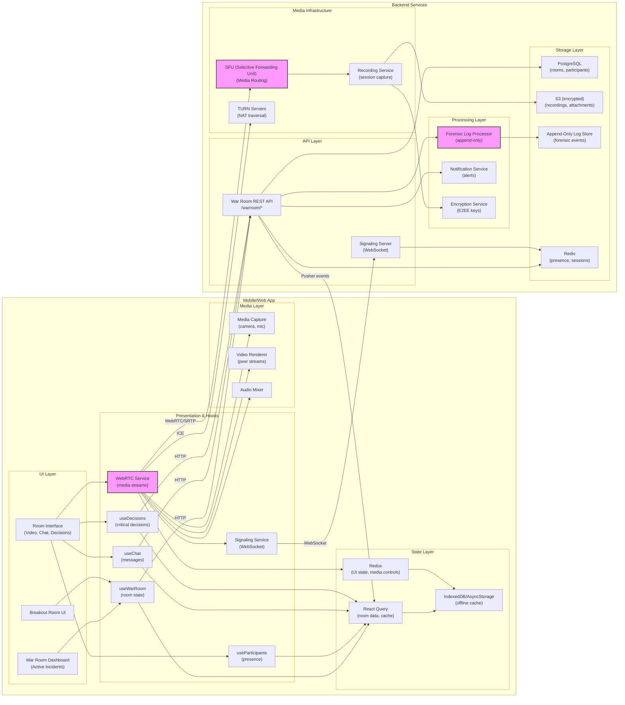

# Mobile System Design — War Room (Virtual Bunker)


## 1) Requirements

- Functional requirements
    - Browser-based encrypted command center for crisis management
    - Integrated video/voice communication (no external Zoom/Teams links needed)
    - Breakout rooms for specialized tracks (Legal, Tech Triage, Executive)
    - Real-time participant management and role assignment
    - Screen sharing and collaborative whiteboarding
    - Encrypted end-to-end communications
    - Forensic logging of all interactions (chat, decisions, attendance)
    - Session recording with tamper-proof timestamps
    - Emergency alert broadcasts to all participants
    - Mobile and desktop cross-platform support
    - Offline mode with sync when connection restored

- Non-functional:
    - Low latency video/audio (<150ms perceived delay)
    - High availability (99.99% uptime during crisis)
    - End-to-end encryption for all communications
    - Immutable audit logs for legal compliance
    - Scalable to 100+ concurrent participants per room
    - Resilient to network disruptions
    - GDPR and SOC2 compliant
    - Tamper-proof forensic evidence chain

---

## 2) Caching, offline & sync strategy

- Client caching:
    - Use IndexedDB / AsyncStorage for session metadata and participant lists
    - Cache room configurations and user roles for fast reconnection
    - Store encrypted chat history locally with automatic cleanup after 30 days
    - Persist user preferences and UI state across sessions

- Media handling:
    - Use WebRTC with STUN/TURN servers for peer-to-peer connections
    - Implement adaptive bitrate streaming based on network conditions
    - Cache participant video thumbnails and profile images
    - Use SFU (Selective Forwarding Unit) for multi-party video optimization

- Offline resilience:
    - Queue outgoing messages and decisions when disconnected
    - Show offline indicators and last-known participant status
    - Auto-reconnect with exponential backoff
    - Sync missed messages and state changes upon reconnection

- Forensic logging:
    - Write all events to append-only log with cryptographic hashing
    - Batch upload logs to immutable storage (S3 with versioning)
    - Generate signed timestamps using trusted time servers
    - Replicate logs across multiple geographic regions

- Real-time sync:
    - WebSocket connections for chat, presence, and state updates
    - Use operational transformation (OT) for collaborative features
    - Pusher or Socket.io for presence channels and typing indicators
    - Conflict-free replicated data types (CRDTs) for shared state

---

## 3) Data models (shared types)

```ts
// War Room session
interface WarRoom {
  id: string;
  name: string;
  incidentType: 'ransomware' | 'data_breach' | 'ddos' | 'insider_threat' | 'other';
  severity: 'critical' | 'high' | 'medium' | 'low';
  status: 'active' | 'standby' | 'closed';
  createdAt: string;
  createdBy: string;
  participants: Participant[];
  breakoutRooms: BreakoutRoom[];
  chatMessages: ChatMessage[];
  decisions: Decision[];
  recordings: Recording[];
}

// Participant
interface Participant {
  userId: string;
  name: string;
  email: string;
  role: 'incident_commander' | 'legal' | 'tech_ops' | 'exec' | 'observer';
  avatarUrl?: string;
  status: 'online' | 'offline' | 'away';
  joinedAt: string;
  lastSeenAt: string;
  permissions: Permission[];
}

// Permission levels
interface Permission {
  canModerate: boolean;
  canRecord: boolean;
  canCreateBreakouts: boolean;
  canMuteOthers: boolean;
  canViewForensicLogs: boolean;
}

// Breakout room
interface BreakoutRoom {
  id: string;
  name: string;
  purpose: string; // "Legal Privileged", "Tech Triage", etc.
  parentRoomId: string;
  participants: string[]; // user IDs
  createdAt: string;
  closedAt?: string;
  isPrivate: boolean;
}

// Chat message
interface ChatMessage {
  id: string;
  roomId: string;
  userId: string;
  text: string;
  attachments?: Attachment[];
  timestamp: string;
  editedAt?: string;
  threadId?: string; // for replies
  reactions?: Reaction[];
  isCriticalDecision: boolean;
}

// Attachment
interface Attachment {
  id: string;
  type: 'image' | 'pdf' | 'document' | 'video';
  url: string;
  fileName: string;
  sizeBytes: number;
  encryptionKey?: string;
}

// Decision record
interface Decision {
  id: string;
  roomId: string;
  description: string;
  madeBy: string; // userId
  authorizedBy?: string[]; // approving user IDs
  timestamp: string;
  context: string; // surrounding discussion
  impact: 'high' | 'medium' | 'low';
  category: 'containment' | 'communication' | 'legal' | 'technical';
}

// Recording
interface Recording {
  id: string;
  roomId: string;
  startTime: string;
  endTime?: string;
  url: string;
  sizeBytes: number;
  participants: string[];
  cryptographicHash: string;
  timestampProof: string; // RFC3161 timestamp token
}

// Forensic log entry
interface ForensicLogEntry {
  id: string;
  timestamp: string;
  eventType: 'join' | 'leave' | 'message' | 'decision' | 'breakout_created' | 'recording_started';
  userId?: string;
  roomId: string;
  payload: any;
  previousHash: string; // for blockchain-like integrity
  hash: string;
}
```

---

## 4) REST endpoints (mapping from UI)

- POST /warroom/create
    - body: { name, incidentType, severity }
    - response: { room: WarRoom, joinToken: string }

- GET /warroom/{roomId}
    - response: WarRoom details

- POST /warroom/{roomId}/join
    - body: { userId, role }
    - response: { participant: Participant, webrtcConfig: any }

- POST /warroom/{roomId}/leave
    - body: { userId }
    - response: { success: boolean }

- POST /warroom/{roomId}/breakout/create
    - body: { name, purpose, participantIds, isPrivate }
    - response: { breakoutRoom: BreakoutRoom }

- GET /warroom/{roomId}/messages?limit=50&before=timestamp
    - response: { messages: ChatMessage[], nextCursor?: string }

- POST /warroom/{roomId}/message
    - body: { text, attachments, isCriticalDecision }
    - response: { message: ChatMessage }

- POST /warroom/{roomId}/decision
    - body: { description, category, impact, authorizedBy }
    - response: { decision: Decision }

- POST /warroom/{roomId}/recording/start
    - response: { recording: Recording }

- POST /warroom/{roomId}/recording/stop
    - body: { recordingId }
    - response: { recording: Recording }

- GET /warroom/{roomId}/forensics?startTime=&endTime=
    - response: { logs: ForensicLogEntry[] }
    - (restricted to authorized users)

- GET /warroom/{roomId}/export
    - response: downloadable audit report (PDF/JSON)

WebRTC Signaling (WebSocket):
- ws://server/warroom/{roomId}/signal
    - offer, answer, ice-candidate exchange
    - peer discovery and connection setup

Real-time events (WebSocket / Pusher):
- private-warroom-{roomId}:participant_joined
- private-warroom-{roomId}:participant_left
- private-warroom-{roomId}:message_created
- private-warroom-{roomId}:decision_made
- private-warroom-{roomId}:breakout_created
- private-warroom-{roomId}:recording_started
- private-warroom-{roomId}:presence_update

---

## 5) High‑level architecture (narrative)

- Mobile/Web Client:
    - War Room Dashboard: overview of active incidents and rooms
    - Room Interface: main video grid, chat panel, participant list, decision log
    - Breakout Room UI: seamless transition between main and breakout rooms
    - WebRTC Media Engine: handles video, audio capture and rendering
    - Chat & Decision Logger: timestamped message display with critical decision highlighting

- Presentation / Hooks / Services:
    - React hooks: useWarRoom, useParticipants, useChat, useDecisions
    - WebRTC Service: peer connection management, media stream handling
    - Signaling Service: WebSocket client for WebRTC negotiation
    - Pusher/Socket.io: real-time events for chat, presence, decisions
    - Forensic Logger: client-side event batching before server upload

- State Management:
    - React Query / Redux for room state, participants, messages
    - Local state for media streams and peer connections
    - Persisted cache for offline access and session recovery

- Backend Services:
    - War Room API: REST endpoints for room lifecycle and metadata
    - Signaling Server: WebSocket server for WebRTC signaling
    - SFU (Selective Forwarding Unit): media routing for multi-party video
    - Forensic Log Processor: append-only logging with cryptographic integrity
    - Recording Service: captures and encrypts session recordings
    - Notification Service: emergency broadcasts and alerts

- Storage & Persistence:
    - PostgreSQL: room metadata, participants, decisions
    - S3: encrypted recordings and attachments
    - Append-only Log Store: forensic events with versioning
    - Redis: presence data, session state, real-time caching

- Security:
    - End-to-end encryption for media (DTLS-SRTP)
    - Encrypted chat messages (AES-256)
    - TLS 1.3 for all API communications
    - Role-based access control (RBAC) with JWT tokens
    - Cryptographic timestamping for audit trail

---

## 6) Mermaid diagram (high level design)



---

## 7) Example code snippets

### src/api/warRoomApi.ts
```typescript
import axios from 'axios';

const api = axios.create({
  baseURL: 'https://api.shadowhq.com',
  timeout: 15000,
});

export function setAuthToken(token?: string) {
  if (token) api.defaults.headers.common.Authorization = `Bearer ${token}`;
  else delete api.defaults.headers.common.Authorization;
}

export async function createWarRoom(data: {
  name: string;
  incidentType: string;
  severity: string;
}) {
  const { data: room } = await api.post('/warroom/create', data);
  return room;
}

export async function joinWarRoom(roomId: string, role: string) {
  const { data } = await api.post(`/warroom/${roomId}/join`, { role });
  return data;
}

export async function fetchWarRoomMessages(roomId: string, limit = 50, before?: string) {
  const { data } = await api.get(`/warroom/${roomId}/messages`, {
    params: { limit, before },
  });
  return data;
}

export async function sendMessage(roomId: string, payload: {
  text: string;
  attachments?: any[];
  isCriticalDecision?: boolean;
}) {
  const { data } = await api.post(`/warroom/${roomId}/message`, payload);
  return data;
}

export async function recordDecision(roomId: string, decision: {
  description: string;
  category: string;
  impact: string;
  authorizedBy?: string[];
}) {
  const { data } = await api.post(`/warroom/${roomId}/decision`, decision);
  return data;
}

export async function createBreakoutRoom(roomId: string, breakout: {
  name: string;
  purpose: string;
  participantIds: string[];
  isPrivate: boolean;
}) {
  const { data } = await api.post(`/warroom/${roomId}/breakout/create`, breakout);
  return data;
}

export async function exportForensicLogs(roomId: string, startTime?: string, endTime?: string) {
  const { data } = await api.get(`/warroom/${roomId}/export`, {
    params: { startTime, endTime },
    responseType: 'blob',
  });
  return data;
}
```

### src/services/webrtc.ts
```typescript
import { io, Socket } from 'socket.io-client';

export class WebRTCService {
  private peerConnections: Map<string, RTCPeerConnection> = new Map();
  private localStream: MediaStream | null = null;
  private signalingSocket: Socket | null = null;
  private roomId: string | null = null;

  async initializeLocalMedia(constraints = { video: true, audio: true }) {
    try {
      this.localStream = await navigator.mediaDevices.getUserMedia(constraints);
      return this.localStream;
    } catch (error) {
      console.error('Failed to get local media:', error);
      throw error;
    }
  }

  connectSignaling(roomId: string, token: string) {
    this.roomId = roomId;
    this.signalingSocket = io(`wss://signal.shadowhq.com/warroom/${roomId}`, {
      auth: { token },
      transports: ['websocket'],
    });

    this.signalingSocket.on('peer-joined', this.handlePeerJoined.bind(this));
    this.signalingSocket.on('offer', this.handleOffer.bind(this));
    this.signalingSocket.on('answer', this.handleAnswer.bind(this));
    this.signalingSocket.on('ice-candidate', this.handleIceCandidate.bind(this));
    this.signalingSocket.on('peer-left', this.handlePeerLeft.bind(this));
  }

  private async handlePeerJoined(peerId: string) {
    const pc = this.createPeerConnection(peerId);
    
    // Add local stream tracks
    if (this.localStream) {
      this.localStream.getTracks().forEach(track => {
        pc.addTrack(track, this.localStream!);
      });
    }

    // Create and send offer
    const offer = await pc.createOffer();
    await pc.setLocalDescription(offer);
    this.signalingSocket?.emit('offer', { peerId, offer });
  }

  private createPeerConnection(peerId: string): RTCPeerConnection {
    const config: RTCConfiguration = {
      iceServers: [
        { urls: 'stun:stun.l.google.com:19302' },
        { urls: 'turn:turn.shadowhq.com:3478', username: 'user', credential: 'pass' },
      ],
    };

    const pc = new RTCPeerConnection(config);
    this.peerConnections.set(peerId, pc);

    pc.onicecandidate = (event) => {
      if (event.candidate) {
        this.signalingSocket?.emit('ice-candidate', { peerId, candidate: event.candidate });
      }
    };

    pc.ontrack = (event) => {
      // Emit event for UI to handle remote stream
      window.dispatchEvent(new CustomEvent('remote-stream', {
        detail: { peerId, stream: event.streams[0] }
      }));
    };

    return pc;
  }

  private async handleOffer(data: { peerId: string; offer: RTCSessionDescriptionInit }) {
    const pc = this.createPeerConnection(data.peerId);
    
    if (this.localStream) {
      this.localStream.getTracks().forEach(track => {
        pc.addTrack(track, this.localStream!);
      });
    }

    await pc.setRemoteDescription(new RTCSessionDescription(data.offer));
    const answer = await pc.createAnswer();
    await pc.setLocalDescription(answer);
    this.signalingSocket?.emit('answer', { peerId: data.peerId, answer });
  }

  private async handleAnswer(data: { peerId: string; answer: RTCSessionDescriptionInit }) {
    const pc = this.peerConnections.get(data.peerId);
    if (pc) {
      await pc.setRemoteDescription(new RTCSessionDescription(data.answer));
    }
  }

  private async handleIceCandidate(data: { peerId: string; candidate: RTCIceCandidateInit }) {
    const pc = this.peerConnections.get(data.peerId);
    if (pc) {
      await pc.addIceCandidate(new RTCIceCandidate(data.candidate));
    }
  }

  private handlePeerLeft(peerId: string) {
    const pc = this.peerConnections.get(peerId);
    if (pc) {
      pc.close();
      this.peerConnections.delete(peerId);
    }
  }

  disconnect() {
    this.peerConnections.forEach(pc => pc.close());
    this.peerConnections.clear();
    this.localStream?.getTracks().forEach(track => track.stop());
    this.signalingSocket?.disconnect();
  }
}
```

### src/hooks/useWarRoom.ts
```typescript
import { useQuery, useMutation, useQueryClient } from '@tanstack/react-query';
import { createWarRoom, joinWarRoom, fetchWarRoomMessages } from '../api/warRoomApi';
import { useEffect } from 'react';
import { io } from 'socket.io-client';

export function useWarRoom(roomId: string | null) {
  const queryClient = useQueryClient();

  const roomQuery = useQuery(
    ['warroom', roomId],
    () => fetchWarRoomDetails(roomId!),
    { enabled: !!roomId, staleTime: 30000 }
  );

  // Subscribe to real-time updates
  useEffect(() => {
    if (!roomId) return;

    const socket = io(`wss://api.shadowhq.com/warroom/${roomId}`, {
      auth: { token: localStorage.getItem('auth_token') },
    });

    socket.on('participant_joined', (participant) => {
      queryClient.invalidateQueries(['warroom', roomId]);
    });

    socket.on('message_created', (message) => {
      queryClient.setQueryData(['warroom-messages', roomId], (old: any) => {
        if (!old) return { messages: [message] };
        return { ...old, messages: [message, ...old.messages] };
      });
    });

    socket.on('decision_made', (decision) => {
      queryClient.invalidateQueries(['warroom-decisions', roomId]);
    });

    return () => {
      socket.disconnect();
    };
  }, [roomId, queryClient]);

  return roomQuery;
}

export function useCreateWarRoom() {
  return useMutation(createWarRoom);
}

export function useJoinWarRoom() {
  return useMutation(({ roomId, role }: { roomId: string; role: string }) =>
    joinWarRoom(roomId, role)
  );
}
```

---

## 8) WebRTC & media optimization

- Peer connection setup:
    - Use SFU architecture for scalability (each client sends once, SFU routes)
    - Implement simulcast for adaptive quality
    - Use VP8/VP9 for video, Opus for audio

- Network resilience:
    - Automatic bitrate adaptation based on packet loss
    - Graceful degradation: disable video if bandwidth insufficient
    - ICE restart on connection failures

- Mobile optimizations:
    - Lower resolution for mobile participants (360p default)
    - Background mode: audio-only when app backgrounded
    - Battery optimization: reduce frame rate on low battery

---

## 9) Forensic logging & compliance

- Log integrity:
    - Each log entry hashes previous entry (blockchain-style)
    - Server validates hash chain before accepting new entries
    - Periodic checkpoints with trusted timestamp service

- What gets logged:
    - All participant joins/leaves with timestamps
    - Every chat message and file share
    - All critical decisions with context
    - Recording start/stop events
    - Permission changes and role assignments

- Legal compliance:
    - Logs are immutable (append-only)
    - Geographic replication for disaster recovery
    - Encrypted at rest and in transit
    - Retention policies (e.g., 7 years for financial incidents)

---

## 10) Breakout room mechanics

- Creation flow:
    - Incident commander creates breakout room
    - Assigns specific participants or allows self-join
    - Set privacy level (private vs. discoverable)

- Technical implementation:
    - Breakout rooms are separate WebRTC sessions
    - Participants maintain connection to main room (audio muted)
    - Can return to main room instantly
    - Chat history is isolated per breakout

- Use cases:
    - Legal Privileged: lawyers only, attorney-client privilege
    - Tech Triage: engineers diagnosing technical issues
    - PR Strategy: communications team drafting statements

---

## 11) Performance & UX notes

- Low latency priorities:
    - < 150ms audio/video delay for natural conversation
    - < 50ms chat message delivery
    - Instant breakout room switching

- Bandwidth optimization:
    - Adaptive bitrate based on available bandwidth
    - Thumbnail video for non-active speakers
    - Lazy loading of chat history

- Mobile UX:
    - Responsive grid layout for different screen sizes
    - Touch-optimized controls
    - Picture-in-picture mode for multitasking
    - Haptic feedback for critical actions

---

## 12) Sequence flows (brief)

- Start war room:
    - Incident detected → Dashboard → Create War Room → Select incident type/severity
    - System auto-invites relevant stakeholders based on incident type
    - Participants receive emergency push notifications
    - Join room → Media permissions → Connect to video/audio

- Make critical decision:
    - Discussion in chat or verbally
    - Commander marks message as "Critical Decision"
    - System prompts for authorization (multi-sig)
    - Decision logged with full context and timestamps
    - Notification sent to audit trail subscribers

- Create breakout room:
    - Commander selects "Create Breakout"
    - Names room (e.g., "Legal Privileged")
    - Selects participants → Room created
    - Participants transition seamlessly
    - Main room remains available

---

## 13) Security & ops notes

- Authentication:
    - Multi-factor authentication required for access
    - Session tokens expire after inactivity
    - IP whitelist for sensitive organizations

- Encryption:
    - E2EE for media using DTLS-SRTP
    - AES-256 for chat and file storage
    - Forward secrecy with ephemeral keys

- Monitoring:
    - Real-time dashboards for connection quality
    - Alert on unusual access patterns
    - Track forensic log integrity continuously

- Disaster recovery:
    - Multi-region redundancy for all services
    - Automatic failover within 30 seconds
    - Regular backup verification and restore tests
